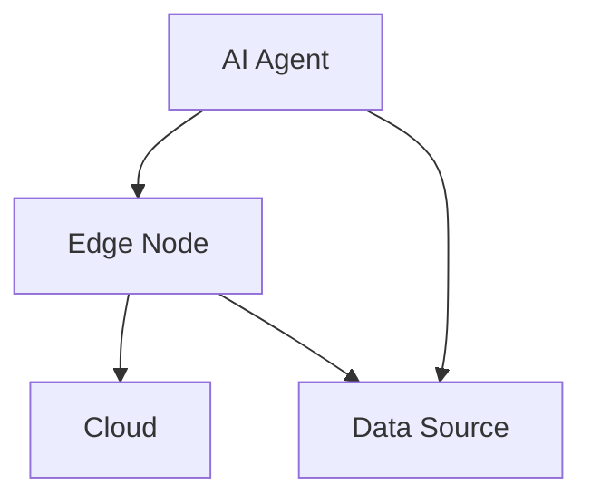
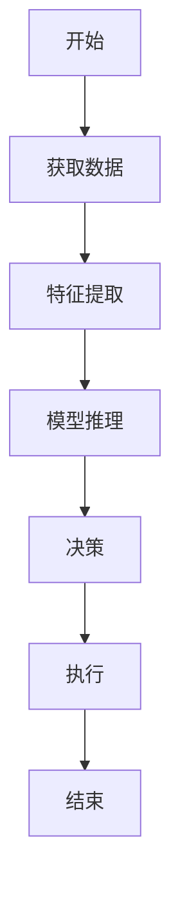
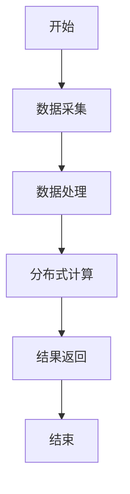
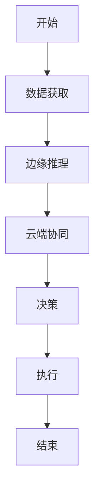
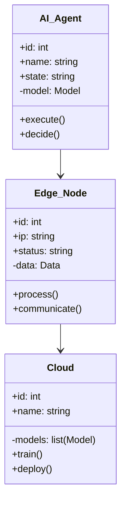
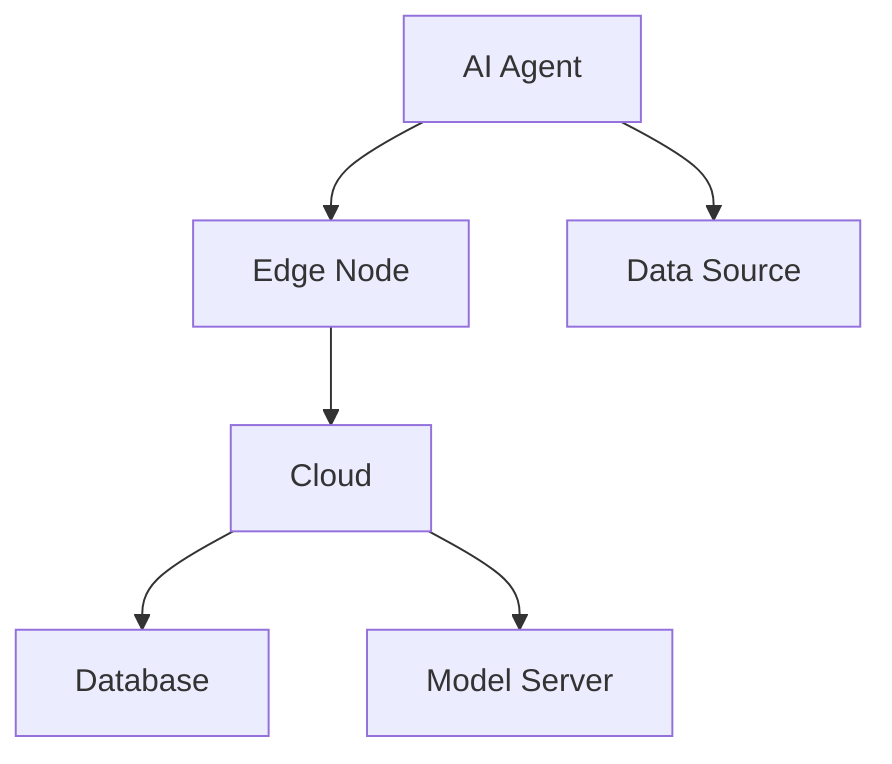
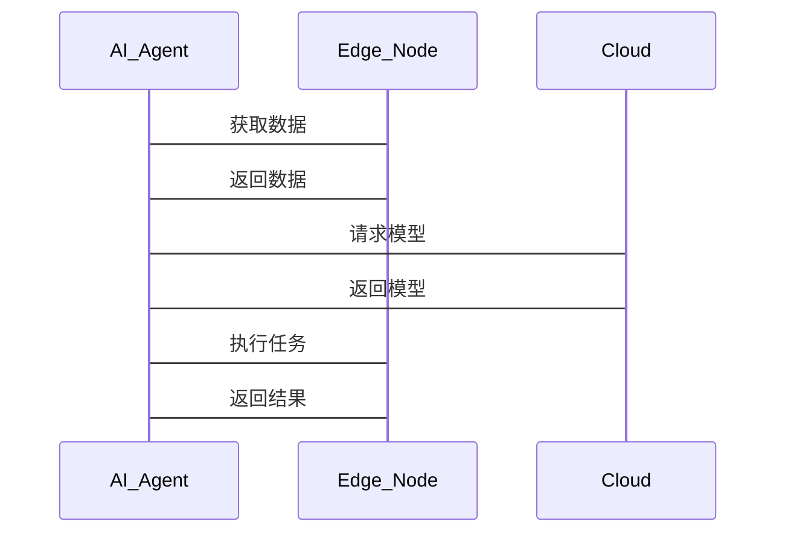

                 


# 企业AI Agent的边缘计算策略

> 关键词：AI Agent, 边缘计算, 企业智能化, 系统架构, 项目实战

> 摘要：本文深入探讨了AI Agent在企业中的应用及其与边缘计算的结合策略，分析了核心概念、算法原理、系统架构，并通过实际案例展示了如何在企业中实施这些策略。

---

## 第一部分: 企业AI Agent的边缘计算策略基础

### 第1章: 企业AI Agent与边缘计算的背景介绍

#### 1.1 问题背景与描述

**1.1.1 企业智能化转型的挑战**

企业正面临智能化转型的压力，传统的集中式计算模式在数据量激增、实时性要求提高的情况下，难以满足需求。边缘计算作为一种分布式计算模式，提供了更低延迟、更高效率的解决方案。AI Agent作为智能化的核心，能够有效处理边缘数据，为企业带来新的竞争优势。

**1.1.2 边缘计算的兴起与需求**

边缘计算的兴起源于物联网（IoT）和实时处理的需求。通过在数据源附近处理数据，边缘计算减少了延迟和带宽消耗，提高了数据处理效率。AI Agent在边缘计算中的应用，使得企业能够实时做出决策，提升响应速度和用户体验。

**1.1.3 AI Agent在企业中的角色与价值**

AI Agent是一种智能实体，能够感知环境、自主决策并执行任务。在企业中，AI Agent可以优化流程、提高效率、降低成本，并增强客户体验。结合边缘计算，AI Agent能够实时处理数据，提供更精准的决策支持，推动企业智能化转型。

#### 1.2 问题解决与边界

**1.2.1 AI Agent如何解决边缘计算问题**

AI Agent通过实时数据处理、智能决策和自主执行，解决了边缘计算中的延迟问题和数据传输成本。AI Agent能够在边缘节点处理数据，减少对云端的依赖，提高响应速度和效率。

**1.2.2 边缘计算的边界与外延**

边缘计算的边界包括边缘设备、边缘节点和边缘云。外延则涉及从边缘到中心的协同计算、数据管理与安全。AI Agent作为边缘计算的核心，需要与云端和其他系统协同工作，确保数据的高效流动和处理。

**1.2.3 AI Agent与边缘计算的结合方式**

AI Agent与边缘计算的结合方式包括数据处理、决策优化和任务执行。AI Agent可以在边缘节点处理数据，利用边缘计算的资源进行推理和决策，同时与云端协同工作，实现全局优化。

#### 1.3 核心概念结构与要素

**1.3.1 AI Agent的核心要素**

- **感知能力**：通过传感器或API获取环境数据。
- **决策能力**：基于数据进行推理和决策。
- **执行能力**：通过API或设备执行决策。
- **学习能力**：通过机器学习模型不断优化。

**1.3.2 边缘计算的关键组件**

- **边缘设备**：传感器、摄像头等数据采集设备。
- **边缘节点**：边缘服务器、网关等数据处理节点。
- **边缘云**：提供计算资源和存储的边缘平台。
- **边缘应用**：运行在边缘节点上的应用程序。

**1.3.3 两者的结合与协同**

AI Agent与边缘计算的结合主要体现在数据处理、计算资源和决策优化方面。AI Agent利用边缘计算的资源进行实时处理，同时通过边缘计算的低延迟优势，提升决策的实时性和准确性。

## 第二部分: 核心概念与联系

### 第2章: AI Agent与边缘计算的核心概念

#### 2.1 核心概念原理

**2.1.1 AI Agent的基本原理**

AI Agent通过感知环境、获取数据、进行推理和决策，并通过执行器或API与环境交互。其核心是智能决策和自主执行能力。

**2.1.2 边缘计算的基本原理**

边缘计算通过在数据源附近进行数据处理和分析，减少延迟和带宽消耗。其核心是分布式计算和边缘设备的协同工作。

**2.1.3 两者的协同机制**

AI Agent在边缘节点获取数据，利用边缘计算的资源进行处理和决策，并通过边缘节点与云端或其他系统协同工作，实现全局优化。

#### 2.2 核心概念对比与联系

**2.2.1 AI Agent与边缘计算的属性对比**

| 属性            | AI Agent                  | 边缘计算                |
|-----------------|---------------------------|-------------------------|
| 核心功能         | 智能决策和自主执行         | 数据处理和分布式计算     |
| 应用场景         | 智能助手、自动化系统       | 物联网、实时处理         |
| 依赖             | 数据源、计算资源           | 边缘设备、网络           |

**2.2.2 通过Mermaid图展示实体关系**



图中展示了AI Agent与边缘节点、云端和数据源之间的关系。AI Agent从数据源获取数据，通过边缘节点进行处理，并与云端协同工作。

## 第三部分: 算法原理讲解

### 第3章: AI Agent与边缘计算的算法原理

#### 3.1 算法原理概述

**3.1.1 AI Agent的核心算法**

AI Agent的核心算法包括感知算法、决策算法和执行算法。感知算法用于数据获取和特征提取，决策算法基于机器学习模型进行推理，执行算法用于任务执行。

**3.1.2 边缘计算的关键算法**

边缘计算的关键算法包括数据压缩算法、分布式计算算法和低功耗优化算法。数据压缩算法减少数据传输量，分布式计算算法优化资源分配，低功耗优化算法延长设备续航。

**3.1.3 两者的结合算法**

结合算法包括边缘AI推理算法和协同优化算法。边缘AI推理算法在边缘节点进行模型推理，协同优化算法实现边缘与云端的协同决策。

#### 3.2 算法流程图

**3.2.1 AI Agent算法流程图**



流程图展示了AI Agent从数据获取到执行的完整流程。

**3.2.2 边缘计算算法流程图**



流程图展示了边缘计算从数据采集到结果返回的完整流程。

**3.2.3 结合算法流程图**



流程图展示了AI Agent与边缘计算结合的算法流程。

#### 3.3 数学模型与公式

**3.3.1 AI Agent的数学模型**

AI Agent的决策模型可以表示为：

$$
决策 = f(输入数据, 状态, 目标)
$$

其中，$f$ 是决策函数，$输入数据$ 是感知到的数据，$状态$ 是当前状态，$目标$ 是决策目标。

**3.3.2 边缘计算的数学模型**

边缘计算的资源分配模型可以表示为：

$$
资源分配 = \argmin_{x} (延迟 + 成本)
$$

其中，$x$ 是资源分配变量，目标是最小化延迟和成本。

**3.3.3 结合算法的数学公式**

结合算法的协同优化模型可以表示为：

$$
优化目标 = \min_{x} (边缘延迟 + 云端资源)
$$

其中，$x$ 是优化变量，目标是平衡边缘延迟和云端资源消耗。

#### 3.4 示例与解释

**3.4.1 AI Agent算法示例**

```python
def ai_agent_algorithm(data):
    features = extract_features(data)
    prediction = model.predict(features)
    action = decide_action(prediction)
    return action
```

该算法展示了AI Agent从数据获取到执行的完整流程，包括特征提取、模型推理和决策执行。

**3.4.2 边缘计算算法示例**

```python
def edge_computing_algorithm(data):
    compressed_data = compress(data)
    result = distributed_compute(compressed_data)
    return decompress(result)
```

该算法展示了边缘计算中的数据压缩、分布式计算和解压过程。

## 第四部分: 系统分析与架构设计方案

### 第4章: 企业AI Agent边缘计算系统架构

#### 4.1 系统功能设计

**4.1.1 领域模型设计**

领域模型展示了系统中的主要实体及其关系。以下是领域模型的Mermaid图：



图中展示了AI Agent、边缘节点和云端之间的关系。AI Agent通过边缘节点与云端协同工作，实现数据处理和模型训练。

**4.1.2 系统架构设计**

系统架构设计包括边缘层、网络层和云端。以下是系统架构的Mermaid图：



图中展示了AI Agent通过边缘节点与云端的数据库和模型服务器交互，实现数据处理和模型部署。

**4.1.3 接口与交互设计**

系统交互设计包括数据采集、处理、决策和执行。以下是交互序列图：



该序列图展示了AI Agent与边缘节点和云端之间的交互流程。

## 第五部分: 项目实战

### 第5章: 企业AI Agent边缘计算项目实战

#### 5.1 环境安装与配置

**5.1.1 环境需求**

- 操作系统：Linux或Windows
- Python版本：3.6以上
- 依赖库：numpy、pandas、scikit-learn、flask

**5.1.2 安装依赖**

```bash
pip install numpy pandas scikit-learn flask
```

#### 5.2 系统核心实现

**5.2.1 AI Agent核心代码**

```python
class AI_Agent:
    def __init__(self, model):
        self.model = model
        self.state = 'idle'
    
    def execute(self, data):
        features = extract_features(data)
        prediction = self.model.predict(features)
        return execute_action(prediction)
    
    def decide(self, options):
        return self.model.decide(options)
```

**5.2.2 边缘计算核心代码**

```python
class Edge_Node:
    def __init__(self, ip):
        self.ip = ip
        self.data = None
    
    def process(self, data):
        self.data = process_data(data)
        return self.data
    
    def communicate(self, message):
        return send_message(message)
```

**5.2.3 协同优化代码**

```python
def协同优化():
    min_cost = infinity
    best_resource_allocation = None
    for allocation in possible_allocations:
        current_cost = calculate_cost(allocation)
        if current_cost < min_cost:
            min_cost = current_cost
            best_resource_allocation = allocation
    return best_resource_allocation
```

#### 5.3 项目小结

通过实际项目，我们可以看到AI Agent与边缘计算的结合能够显著提升企业的智能化水平。AI Agent在边缘节点的实时处理能力，结合云端的协同优化，为企业提供了高效、低延迟的解决方案。

---

## 第六部分: 最佳实践与注意事项

### 第6章: 企业AI Agent边缘计算的注意事项

#### 6.1 最佳实践

- **资源分配**：合理分配计算资源，避免瓶颈。
- **数据隐私**：确保数据在边缘和云端的安全传输和存储。
- **模型优化**：持续优化AI Agent的模型，提升决策准确性和效率。

#### 6.2 小结

企业AI Agent的边缘计算策略通过实时数据处理和智能决策，为企业提供了高效、低延迟的解决方案。结合边缘计算的资源优化和AI Agent的智能决策，企业能够更好地应对智能化转型的挑战。

#### 6.3 注意事项

- **延迟优化**：确保边缘计算的低延迟特性得到充分利用。
- **安全性**：加强数据传输和存储的安全性，防止数据泄露。
- **可扩展性**：设计可扩展的架构，应对未来的业务增长。

#### 6.4 扩展阅读

- 《边缘计算入门》
- 《AI Agent的设计与实现》
- 《分布式系统架构设计》

---

## 作者

作者：AI天才研究院/AI Genius Institute & 禅与计算机程序设计艺术 /Zen And The Art of Computer Programming

---

以上是《企业AI Agent的边缘计算策略》的技术博客文章。文章从背景介绍、核心概念、算法原理、系统架构到项目实战和最佳实践，全面详细地阐述了企业AI Agent与边缘计算结合的应用策略。通过实际案例和图表分析，帮助读者理解如何在企业中有效实施这些策略，推动智能化转型。

