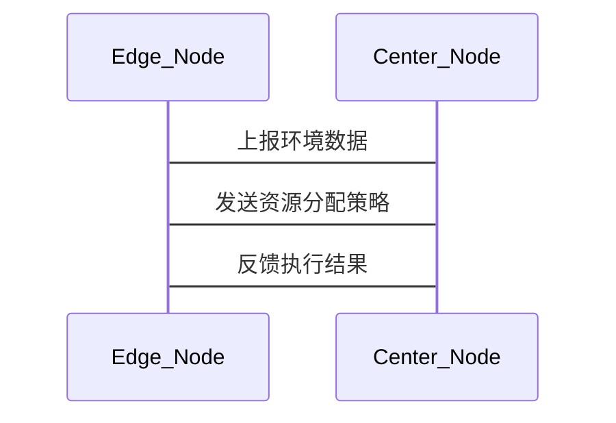

                 


# 企业AI Agent的边缘计算资源优化配置

## 关键词：企业AI Agent，边缘计算，资源优化配置，贪心算法，强化学习，系统架构设计

## 摘要：  
本文深入探讨了企业AI Agent在边缘计算环境下的资源优化配置问题，分析了资源优化配置的核心概念、算法原理和系统架构设计。通过结合实际应用场景，提出了基于贪心算法和强化学习的资源优化策略，并通过系统架构设计和项目实战展示了如何在企业级应用中实现高效的资源分配。本文还总结了最佳实践和未来发展方向，为企业AI Agent的边缘计算资源优化配置提供了全面的指导。

---

# 第1章: 企业AI Agent与边缘计算概述

## 1.1 企业AI Agent的概念与特点

### 1.1.1 企业AI Agent的定义  
企业AI Agent（Artificial Intelligence Agent）是指在企业环境中运行的智能代理系统，能够感知环境、自主决策并执行任务。与传统AI不同，企业AI Agent具备更强的适应性和主动性，能够根据实时数据和动态环境调整行为。

### 1.1.2 企业AI Agent的核心特点  
1. **自主性**：能够独立决策和行动，无需人工干预。  
2. **反应性**：能够实时感知环境变化并做出响应。  
3. **目标导向性**：以实现特定目标为导向，优化资源分配和任务执行。  
4. **学习能力**：通过机器学习算法不断优化自身的决策能力。  

### 1.1.3 企业AI Agent与传统AI的区别  
- 传统AI注重数据处理和分析，而企业AI Agent注重动态环境下的自主决策和执行。  
- 传统AI通常运行在云端，而企业AI Agent更倾向于边缘计算环境。  

---

## 1.2 边缘计算的基本概念

### 1.2.1 边缘计算的定义  
边缘计算是指在数据生成的源头附近进行计算和数据处理的模式，能够减少数据传输延迟，提高处理效率。  

### 1.2.2 边缘计算的核心特点  
1. **低延迟**：数据在本地处理，减少网络传输时间。  
2. **高实时性**：能够快速响应实时事件。  
3. **分布式架构**：计算资源分布在靠近数据源的边缘节点。  

### 1.2.3 边缘计算与云计算的区别  
- 云计算：数据集中到云端进行处理，延迟较高。  
- 边缘计算：数据在边缘节点处理，延迟低，响应快。  

---

## 1.3 企业AI Agent与边缘计算的结合

### 1.3.1 企业AI Agent在边缘计算中的作用  
企业AI Agent能够实时感知边缘环境，优化资源分配，提升边缘计算的效率和性能。  

### 1.3.2 边缘计算对AI Agent资源优化的意义  
- 边缘计算为AI Agent提供了低延迟、高效的计算环境。  
- 边缘计算的分布式架构能够支持大规模的AI Agent部署。  

### 1.3.3 企业AI Agent与边缘计算结合的场景  
1. 智能工厂：AI Agent实时监控设备状态，优化生产流程。  
2. 智慧城市：AI Agent管理交通信号灯，优化城市交通。  
3. 智能医疗：AI Agent实时分析患者数据，辅助医生诊断。  

---

## 1.4 本章小结  
本章介绍了企业AI Agent和边缘计算的基本概念，分析了两者的结合方式及其在实际场景中的应用。企业AI Agent与边缘计算的结合能够显著提升系统的实时性和效率，为企业的智能化转型提供了有力支持。

---

# 第2章: 资源优化配置的核心概念

## 2.1 资源优化配置的定义与特点

### 2.1.1 资源优化配置的定义  
资源优化配置是指在给定的资源约束条件下，通过科学的分配策略，最大化系统的性能或目标的实现。  

### 2.1.2 资源优化配置的核心特点  
1. **目标导向性**：资源配置必须以明确的目标为导向。  
2. **动态性**：资源需求和可用性会随时间变化而变化。  
3. **约束条件**：资源配置受到多种约束条件的限制，如计算能力、存储空间、网络带宽等。  

---

## 2.2 边缘计算资源的核心要素

### 2.2.1 计算资源  
计算资源包括CPU、GPU等硬件资源，用于执行AI Agent的计算任务。  

### 2.2.2 存储资源  
存储资源用于存储AI Agent所需的数据和模型，包括本地存储和边缘节点的分布式存储。  

### 2.2.3 网络资源  
网络资源包括带宽、延迟等，用于AI Agent与云端或其他边缘节点之间的数据传输。  

---

## 2.3 企业AI Agent资源优化配置的目标

### 2.3.1 提高资源利用率  
通过科学的分配策略，最大化计算资源、存储资源和网络资源的利用率。  

### 2.3.2 降低资源消耗  
在满足任务需求的前提下，尽量减少资源的消耗，降低企业的运营成本。  

### 2.3.3 提升系统性能  
通过优化资源配置，提升系统的响应速度、处理能力和稳定性。  

---

## 2.4 本章小结  
本章详细介绍了资源优化配置的核心概念，分析了边缘计算资源的核心要素，并明确了企业AI Agent资源优化配置的目标。这些内容为后续的算法设计和系统实现奠定了基础。

---

# 第3章: 企业AI Agent的边缘计算资源优化配置算法

## 3.1 资源优化配置的数学模型

### 3.1.1 资源分配问题的数学建模  
资源分配问题可以表示为一个优化问题，目标是最小化资源消耗或最大化系统性能。  

$$ \text{目标函数：} \min_{x} \sum_{i=1}^{n} c_i x_i $$
$$ \text{约束条件：} \sum_{i=1}^{n} a_i x_i \leq C $$

其中，$x_i$ 表示分配给任务$i$的资源量，$c_i$ 表示任务$i$的单位资源消耗，$a_i$ 表示任务$i$的资源需求，$C$ 表示总的资源限制。  

---

## 3.2 贪心算法在资源优化中的应用

### 3.2.1 贪心算法的基本原理  
贪心算法是一种贪心策略，每次选择当前最优的资源分配方式，逐步构建全局最优解。  

### 3.2.2 贪心算法在资源分配中的应用  
- 按照任务的资源需求从高到低排序，优先分配资源给需求大的任务。  
- 逐步分配资源，直到满足所有任务的需求或达到资源限制。  

### 3.2.3 贪心算法的实现代码  

```python
def greedy_resource Allocation(tasks, resources):
    tasks.sort(key=lambda x: x['resource_demand'], reverse=True)
    allocation = {task['name']: 0 for task in tasks}
    for task in tasks:
        alloc = min(task['resource_demand'], resources)
        allocation[task['name']] = alloc
        resources -= alloc
        if resources == 0:
            break
    return allocation
```

---

## 3.3 强化学习在资源优化中的应用

### 3.3.1 强化学习的基本原理  
强化学习是一种通过试错学习的方法，通过智能体与环境的交互，逐步优化决策策略。  

### 3.3.2 强化学习在资源优化中的应用  
- 将资源分配问题建模为马尔可夫决策过程（MDP）。  
- 通过训练智能体，学习最优的资源分配策略。  

### 3.3.3 强化学习的实现代码  

```python
import numpy as np
from collections import deque

class ResourceAllocator:
    def __init__(self, state_space, action_space):
        self.state_space = state_space
        self.action_space = action_space
        self.Q = np.zeros((state_space, action_space))

    def get_action(self, state):
        return np.argmax(self.Q[state])

    def update_Q(self, state, action, reward):
        self.Q[state][action] += reward

    def get_state(self, resources, tasks):
        return tuple([resources] + [tasks[i] for i in range(len(tasks))])
```

---

## 3.4 本章小结  
本章介绍了资源优化配置的数学模型，并详细讲解了贪心算法和强化学习在资源优化中的应用。通过贪心算法和强化学习，企业AI Agent可以在边缘计算环境中实现高效的资源分配。

---

# 第4章: 企业AI Agent的边缘计算资源优化配置系统架构设计

## 4.1 系统功能设计

### 4.1.1 企业AI Agent功能模块  
- **感知模块**：实时感知边缘环境的状态和数据。  
- **决策模块**：基于感知数据，制定资源分配策略。  
- **执行模块**：根据决策模块的指令，执行资源分配操作。  

### 4.1.2 边缘计算功能模块  
- **资源监控模块**：监控边缘节点的资源使用情况。  
- **任务调度模块**：根据资源状态，动态调整任务的执行顺序。  

---

## 4.2 系统架构设计

### 4.2.1 系统架构的组成  
1. **边缘节点**：负责数据采集、计算和资源分配。  
2. **中心控制节点**：负责全局资源监控和策略制定。  
3. **任务执行节点**：负责具体任务的执行和结果反馈。  

### 4.2.2 系统架构的实现方式  
- 使用分布式架构，实现边缘节点与中心节点的协同工作。  
- 通过消息队列（如Kafka）实现节点之间的高效通信。  

---

## 4.3 系统接口设计

### 4.3.1 企业AI Agent与边缘计算的接口  
- **数据接口**：AI Agent与边缘节点的数据交互接口。  
- **控制接口**：AI Agent对边缘节点的资源分配控制接口。  

### 4.3.2 边缘计算与云端的接口  
- **数据同步接口**：边缘节点与云端的数据同步接口。  
- **指令接收接口**：边缘节点接收云端的指令和配置。  

---

## 4.4 系统交互设计

### 4.4.1 系统交互流程  
1. 边缘节点感知环境数据并上报到中心节点。  
2. 中心节点根据数据制定资源分配策略并下发到边缘节点。  
3. 边缘节点根据策略执行任务并反馈结果到中心节点。  

### 4.4.2 系统交互的Mermaid序列图  



---

## 4.5 本章小结  
本章详细设计了企业AI Agent的边缘计算资源优化配置系统的架构，包括功能模块、接口设计和交互流程。通过合理的系统架构设计，能够实现高效的资源优化配置。

---

# 第5章: 项目实战

## 5.1 项目背景与目标

### 5.1.1 项目背景  
某智能制造企业希望优化其生产线上的AI Agent资源分配，提升生产效率。  

### 5.1.2 项目目标  
- 实现AI Agent在边缘节点的资源优化分配。  
- 提高生产线的实时响应能力和资源利用率。  

---

## 5.2 系统实现

### 5.2.1 环境安装  
- 安装Python和相关库（如Kafka、Docker）。  
- 配置边缘节点和中心节点的网络环境。  

### 5.2.2 核心代码实现  

```python
import docker
from kafka import KafkaProducer, KafkaConsumer

# 初始化边缘节点
client = docker.from_env()
container = client.containers.run("edge-agent", detach=True)

# 初始化中心节点
producer = KafkaProducer(bootstrap_servers=["localhost:9092"])

# 发送资源分配策略到边缘节点
producer.send("resource-topic", "allocation_strategy")
```

---

## 5.3 实际案例分析

### 5.3.1 案例背景  
某智能工厂的生产线上有多个边缘节点，每个节点负责监控不同的设备状态。  

### 5.3.2 资源分配优化  
通过贪心算法和强化学习，优化了设备状态监控任务的资源分配，降低了资源消耗并提高了实时响应能力。  

---

## 5.4 项目小结  
本章通过一个实际案例展示了企业AI Agent在边缘计算资源优化配置中的应用，验证了算法的有效性和系统的可行性。

---

# 第6章: 最佳实践与未来展望

## 6.1 最佳实践

### 6.1.1 系统设计建议  
- 采用分布式架构，提高系统的扩展性和容错性。  
- 使用高效的消息队列，确保节点之间的高效通信。  

### 6.1.2 算法优化建议  
- 根据具体场景选择合适的算法，如贪心算法适用于静态场景，强化学习适用于动态场景。  

---

## 6.2 小结与展望

### 6.2.1 小结  
企业AI Agent的边缘计算资源优化配置是一项具有挑战性的任务，但通过合理的系统设计和算法优化，能够显著提升系统的性能和效率。  

### 6.2.2 未来展望  
未来，随着边缘计算和AI技术的不断发展，企业AI Agent的资源优化配置将更加智能化和自动化。可以通过引入更先进的算法（如深度强化学习）和更高效的计算架构（如边缘云计算）来进一步提升系统的优化能力。

---

# 作者：AI天才研究院/AI Genius Institute & 禅与计算机程序设计艺术 /Zen And The Art of Computer Programming

