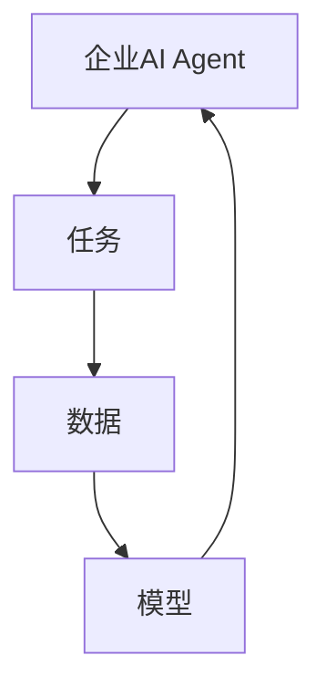
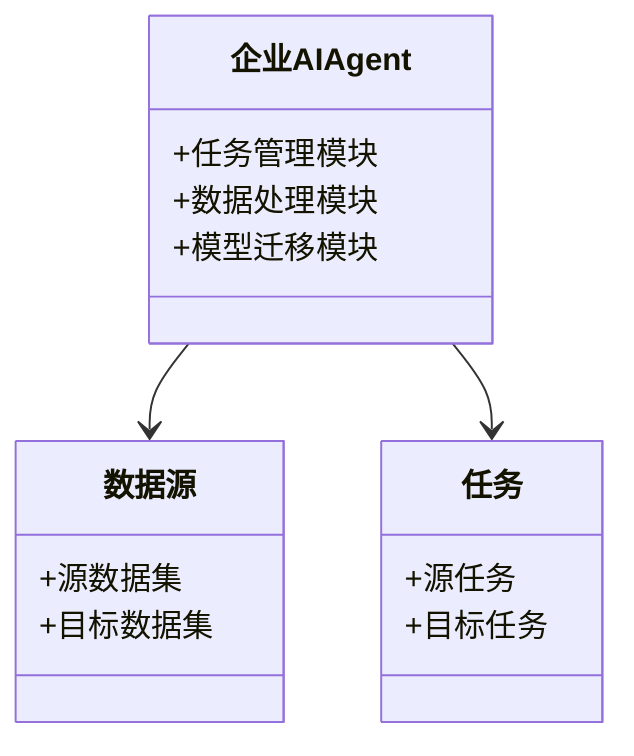
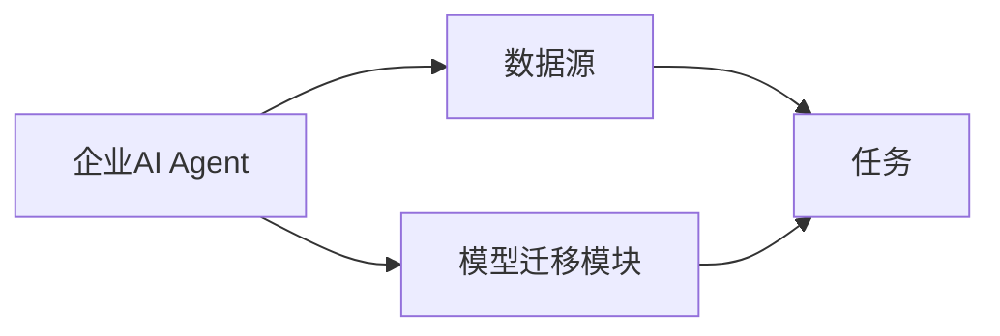

                 


# 企业AI Agent的迁移学习在跨行业知识迁移中的实践

> 关键词：企业AI Agent，迁移学习，跨行业知识迁移，机器学习，人工智能

> 摘要：本文深入探讨了企业AI Agent在迁移学习中的应用，特别是在跨行业知识迁移中的实践。通过分析迁移学习的核心概念、算法原理、系统架构以及实际项目案例，本文为读者提供了从理论到实践的全面指导。

---

## 第一部分：企业AI Agent的迁移学习基础

### 第1章：企业AI Agent与迁移学习概述

#### 1.1 企业AI Agent的定义与特点

企业AI Agent是一种智能代理，用于在企业环境中执行特定任务，如数据分析、决策支持和自动化操作。其特点包括智能化、自动化、适应性和高效性。

- **智能化**：通过机器学习和自然语言处理技术，能够理解并处理复杂任务。
- **自动化**：能够在无需人工干预的情况下完成任务。
- **适应性**：能够根据环境变化调整策略。
- **高效性**：通过优化算法提高处理效率。

#### 1.2 迁移学习的定义与特点

迁移学习是一种机器学习技术，旨在将从一个任务或数据集中学到的知识应用到另一个相关任务或数据集。其特点包括：

- **数据高效性**：利用已有数据减少新任务的数据需求。
- **领域适应性**：适用于不同但相关的领域。
- **灵活性**：能够适应多种任务类型。

#### 1.3 跨行业知识迁移的挑战与机遇

跨行业知识迁移涉及将一个行业的知识应用到另一个行业，面临数据差异、领域差异和知识结构差异等挑战。然而，这也带来了知识复用和成本降低的机遇。

---

### 第2章：迁移学习的核心概念与联系

#### 2.1 迁移学习的原理

迁移学习通过共享特征或模型参数，将源任务的知识迁移到目标任务。其核心在于找到源任务和目标任务之间的共同特征。

- **数据、模型与任务的关系**：数据驱动模型，模型影响任务执行。
- **数学模型**：表示为$f: X \rightarrow Y$，其中$X$是输入，$Y$是输出。

#### 2.2 迁移学习方法对比

| 方法类型       | 参数化 | 非参数化 |
|----------------|--------|----------|
| 基于特征       | 是     | 否       |
| 基于模型       | 是     | 否       |
| 基于表示       | 否     | 是       |

#### 2.3 ER实体关系图



---

## 第3章：迁移学习的算法原理

### 3.1 参数化迁移学习算法

- **基于特征的迁移学习**：提取特征并进行迁移。
- **基于模型的迁移学习**：共享模型参数。
- **基于度量的迁移学习**：使用距离度量。

### 3.2 非参数化迁移学习算法

- **核方法**：使用核函数进行特征变换。
- **流形学习**：学习数据的几何结构。
- **图结构学习**：基于图的结构进行迁移。

### 3.3 迁移学习的数学模型

数学模型如下：

$$ L_{\text{total}} = \lambda L_{\text{source}} + (1-\lambda) L_{\text{target}} $$

其中，$\lambda$是调节参数，$L_{\text{source}}$和$L_{\text{target}}$分别是源任务和目标任务的损失函数。

---

## 第4章：企业AI Agent的迁移学习系统架构

### 4.1 系统功能设计

- **领域模型类图**：



- **系统架构图**：



---

## 第5章：跨行业知识迁移的项目实战

### 5.1 环境安装与配置

安装必要的库：

```bash
pip install numpy scikit-learn tensorflow
```

### 5.2 核心代码实现

```python
import tensorflow as tf
from tensorflow.keras import layers

def create_model(input_shape):
    model = tf.keras.Sequential()
    model.add(layers.Dense(64, activation='relu', input_shape=input_shape))
    model.add(layers.Dense(1, activation='sigmoid'))
    return model

# 源任务模型
source_model = create_model((10,))

# 迁移到目标任务
source_model.trainable = False
target_model = create_model((10,))
target_model.layers[0].set_weights(source_model.layers[0].get_weights())
```

### 5.3 案例分析

以跨行业客服咨询系统为例，源任务是处理电子产品咨询，目标任务是处理金融服务咨询。通过迁移学习，系统能够快速适应新领域。

---

## 第6章：迁移学习的最佳实践与未来展望

### 6.1 注意事项

- 数据预处理：确保数据质量和一致性。
- 模型选择：根据任务选择合适的迁移学习方法。
- 调参：合理设置调节参数以优化性能。

### 6.2 未来展望

随着深度学习和强化学习的进步，迁移学习将在企业AI Agent中发挥更大作用，特别是在多领域应用和实时适应方面。

---

## 总结

企业AI Agent的迁移学习在跨行业知识迁移中具有重要意义，通过理论与实践的结合，企业可以更高效地应用AI技术。未来，迁移学习将继续推动企业智能化发展。

---

作者：AI天才研究院

