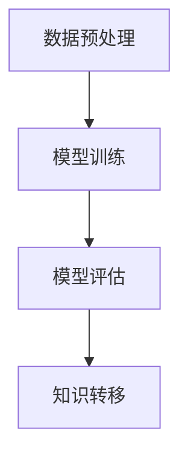

                 


# 企业AI Agent的迁移学习应用：跨领域知识转移

## 关键词
- 迁移学习
- 企业AI Agent
- 跨领域知识转移
- 机器学习
- 人工智能

## 摘要
本文深入探讨了企业AI Agent在迁移学习中的应用，重点分析了跨领域知识转移的核心概念、算法原理、系统架构以及实际案例。通过理论与实践相结合的方式，详细讲解了迁移学习在企业中的具体应用，帮助读者理解如何通过迁移学习实现跨领域知识的有效转移和应用。

---

# 第1章: 迁移学习的基本概念与企业AI Agent的背景

## 1.1 迁移学习的定义与核心概念

### 1.1.1 迁移学习的定义
迁移学习是一种机器学习技术，旨在将从一个领域（源域）学到的知识应用到另一个领域（目标域）。与传统机器学习不同，迁移学习的核心在于处理数据分布差异的问题，从而提高模型在目标域上的性能。

### 1.1.2 迁移学习的核心要素
| 核心要素 | 描述 |
|----------|------|
| 源域（Source Domain） | 学习任务的原始数据分布，通常是已知且有标签的数据。 |
| 目标域（Target Domain） | 需要应用学习结果的数据分布，通常与源域有部分重叠或差异。 |
| 数据分布差异 | 源域和目标域之间的数据分布差异是迁移学习的核心挑战。 |

### 1.1.3 迁移学习与传统机器学习的区别
| 特性             | 迁移学习                          | 传统机器学习                        |
|------------------|-----------------------------------|-------------------------------------|
| 数据分布         | 源域和目标域可能不同               | 数据分布一致                        |
| 数据量           | 目标域数据量可能有限               | 数据量通常充足                      |
| 性能表现         | 受数据分布差异影响较大            | 数据分布一致，性能更稳定            |

## 1.2 企业AI Agent的定义与特点

### 1.2.1 企业AI Agent的概念
企业AI Agent是指在企业环境中，通过人工智能技术实现特定任务的智能体。它可以理解企业的业务流程、数据和需求，并通过学习和推理为用户提供自动化、智能化的服务。

### 1.2.2 企业AI Agent的核心功能
| 功能模块         | 描述                             |
|------------------|----------------------------------|
| 数据理解         | 理解企业数据的结构和语义           |
| 任务执行         | 根据需求执行特定任务               |
| 自我优化         | 通过反馈不断优化自身性能           |
| 知识转移         | 将源领域的知识迁移到目标领域       |

### 1.2.3 企业AI Agent与个人AI Agent的区别
| 特性             | 企业AI Agent                     | 个人AI Agent                       |
|------------------|----------------------------------|------------------------------------|
| 数据规模         | 数据量大，复杂性高               | 数据量小，个性化强                 |
| 任务目标         | 优化企业流程，提升效率           | 提供个性化服务，满足个人需求       |
| 安全性           | 高度关注数据隐私和安全性         | 更注重用户体验和便利性             |

## 1.3 跨领域知识转移的背景与需求

### 1.3.1 跨领域知识转移的定义
跨领域知识转移是指将源领域的知识迁移到目标领域，从而在目标领域中实现类似或更好的性能。这种技术在企业中尤为重要，因为企业通常需要处理多个领域的数据，如销售、供应链、客户支持等。

### 1.3.2 企业中跨领域知识转移的挑战
| 挑战             | 描述                             |
|------------------|----------------------------------|
| 数据分布差异     | 源域和目标域的数据分布可能差异很大。 |
| 数据量不足       | 目标域可能缺乏足够的标注数据。     |
| 知识表示         | 不同领域的知识表示方式可能不同。   |

### 1.3.3 跨领域知识转移的必要性
| 必要性           | 描述                             |
|------------------|----------------------------------|
| 提高效率         | 通过知识转移减少重复劳动，提高效率。 |
| 降低成本         | 减少目标域从头训练模型的成本。     |
| 快速适应         | 快速将源领域的知识应用到目标领域，适应业务变化。 |

---

# 第2章: 迁移学习的核心概念与算法原理

## 2.1 迁移学习的核心概念

### 2.1.1 迁移学习的三要素
| 要素             | 描述                             |
|------------------|----------------------------------|
| 源域和目标域     | 数据分布可能不同，但具有一定的相似性。 |
| 知识表示         | 知识通过特征或模型表示。           |
| 知识转移         | 通过算法实现知识从源域到目标域的迁移。 |

### 2.1.2 知识表示的理论基础
知识表示是迁移学习的核心，常见的表示方法包括特征向量、概率分布和知识图谱。特征向量是最常用的表示方法，它将数据映射到一个低维空间中，便于模型理解和处理。

### 2.1.3 知识转移的实现方法
| 方法             | 描述                             |
|------------------|----------------------------------|
| 特征适应         | 对目标域的特征进行调整，使其与源域的特征对齐。 |
| 样本重加权       | 根据目标域的样本重要性进行加权，优化模型性能。 |
| 对抗训练         | 通过对抗网络消除源域和目标域的分布差异。 |

## 2.2 跨领域知识转移的算法选择

### 2.2.1 基于特征的迁移学习算法
| 算法             | 描述                             |
|------------------|----------------------------------|
| 统一特征抽取     | 通过提取公共特征实现知识转移。     |
| 领域适配         | 对目标域的特征进行适配，使其与源域对齐。 |

### 2.2.2 基于模型的迁移学习算法
| 算法             | 描述                             |
|------------------|----------------------------------|
| 知识蒸馏         | 将复杂模型的知识迁移到简单模型中。 |
| 参数适应         | 调整模型参数，使其在目标域上表现更好。 |

### 2.2.3 基于分布的迁移学习算法
| 算法             | 描述                             |
|------------------|----------------------------------|
| 分布匹配         | 通过优化源域和目标域的分布差异，实现知识转移。 |
| 最小化最大分布差异 | 使用最大分布差异作为优化目标。 |

## 2.3 迁移学习算法的实现步骤

### 2.3.1 数据预处理
数据预处理是迁移学习的关键步骤，包括数据清洗、特征提取和数据增强。特征提取是将原始数据转换为高维或低维的特征表示，常用的方法包括主成分分析（PCA）和t-分布邻域嵌入（t-SNE）。

### 2.3.2 模型训练
模型训练分为源域训练和目标域微调。源域训练是使用源域数据训练一个基础模型，目标域微调是将模型在目标域数据上进行微调，以适应目标域的分布。

### 2.3.3 模型评估
模型评估包括源域评估和目标域评估。源域评估是验证模型在源域上的泛化能力，目标域评估是验证模型在目标域上的表现。常用的评估指标包括准确率、精确率、召回率和F1值。

---

# 第3章: 迁移学习的算法原理与数学模型

## 3.1 迁移学习的主要算法

### 3.1.1 基于特征的迁移学习算法
| 算法             | 描述                             |
|------------------|----------------------------------|
| 统一特征抽取     | 通过提取公共特征实现知识转移。     |
| 领域适配         | 对目标域的特征进行适配，使其与源域对齐。 |

### 3.1.2 基于模型的迁移学习算法
| 算法             | 描述                             |
|------------------|----------------------------------|
| 知识蒸馏         | 将复杂模型的知识迁移到简单模型中。 |
| 参数适应         | 调整模型参数，使其在目标域上表现更好。 |

### 3.1.3 基于分布的迁移学习算法
| 算法             | 描述                             |
|------------------|----------------------------------|
| 分布匹配         | 通过优化源域和目标域的分布差异，实现知识转移。 |
| 最小化最大分布差异 | 使用最大分布差异作为优化目标。 |

## 3.2 跨领域知识转移的数学模型

### 3.2.1 迁移学习的数学模型
| 模型             | 描述                             |
|------------------|----------------------------------|
| 源域模型         | 在源域数据上训练的基础模型。       |
| 目标域模型       | 在目标域数据上微调后的模型。       |

### 3.2.2 知识转移的数学公式
$$ L_{transfer} = \lambda L_{source} + (1-\lambda)L_{target} $$

其中，$\lambda$ 是源域损失的权重，$L_{source}$ 是源域的损失函数，$L_{target}$ 是目标域的损失函数。

---

# 第4章: 迁移学习的系统架构与实际应用

## 4.1 迁移学习的系统架构设计

### 4.1.1 系统功能设计
| 功能模块         | 描述                             |
|------------------|----------------------------------|
| 数据预处理       | 对源域和目标域数据进行清洗和特征提取。 |
| 模型训练         | 在源域数据上训练基础模型，并在目标域数据上进行微调。 |
| 模型评估         | 评估模型在源域和目标域上的性能。   |
| 知识转移         | 实现知识从源域到目标域的迁移。     |

### 4.1.2 系统架构图


## 4.2 实际案例分析

### 4.2.1 案例背景
某企业希望将销售领域的客户行为预测模型迁移到供应链管理领域，以提高供应链的预测准确性。

### 4.2.2 数据准备
| 数据集         | 描述                             |
|----------------|----------------------------------|
| 销售数据集     | 包含客户的购买记录、偏好等信息。   |
| 供应链数据集   | 包含供应商的交货时间、库存信息等。 |

### 4.2.3 模型实现
```python
# 数据预处理
from sklearn.decomposition import PCA

source_data = ...  # 源域数据
target_data = ...  # 目标域数据

# 特征提取
source_features = PCA(n_components=10).fit_transform(source_data)
target_features = PCA(n_components=10).fit_transform(target_data)

# 模型训练
from sklearn.svm import SVC

source_model = SVC().fit(source_features, source_labels)
```

### 4.2.4 模型评估
$$ accuracy = \frac{correct\_predictions}{total\_predictions} $$

### 4.2.5 知识转移
通过对抗训练消除源域和目标域的分布差异，实现知识转移。

---

# 5章: 迁移学习的挑战与未来展望

## 5.1 迁移学习的挑战

### 5.1.1 数据分布差异
源域和目标域的数据分布差异可能导致迁移学习效果不佳。

### 5.1.2 数据量不足
目标域数据量不足时，迁移学习的效果可能受到限制。

### 5.1.3 知识表示
不同领域的知识表示方式可能不同，导致知识转移的难度增加。

## 5.2 迁移学习的未来展望

### 5.2.1 知识图谱的结合
未来，迁移学习将与知识图谱结合，实现跨领域的知识表示和转移。

### 5.2.2 联邦学习
联邦学习是一种新兴的技术，可以在保护数据隐私的前提下，实现跨领域的知识转移。

### 5.2.3 自适应迁移学习
自适应迁移学习可以根据目标域的特征动态调整迁移学习策略。

---

# 作者：AI天才研究院/AI Genius Institute & 禅与计算机程序设计艺术 /Zen And The Art of Computer Programming

---

本文通过理论与实践相结合的方式，深入探讨了企业AI Agent在迁移学习中的应用，重点分析了跨领域知识转移的核心概念、算法原理、系统架构以及实际案例。通过本文的学习，读者可以全面理解迁移学习在企业中的具体应用，掌握跨领域知识转移的核心技术，并能够将这些技术应用到实际的企业场景中。

