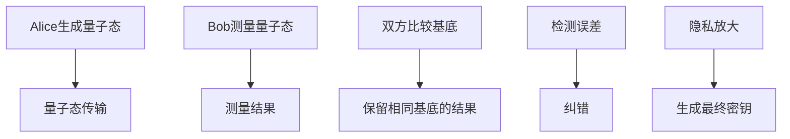
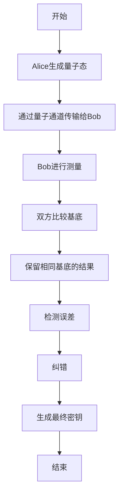
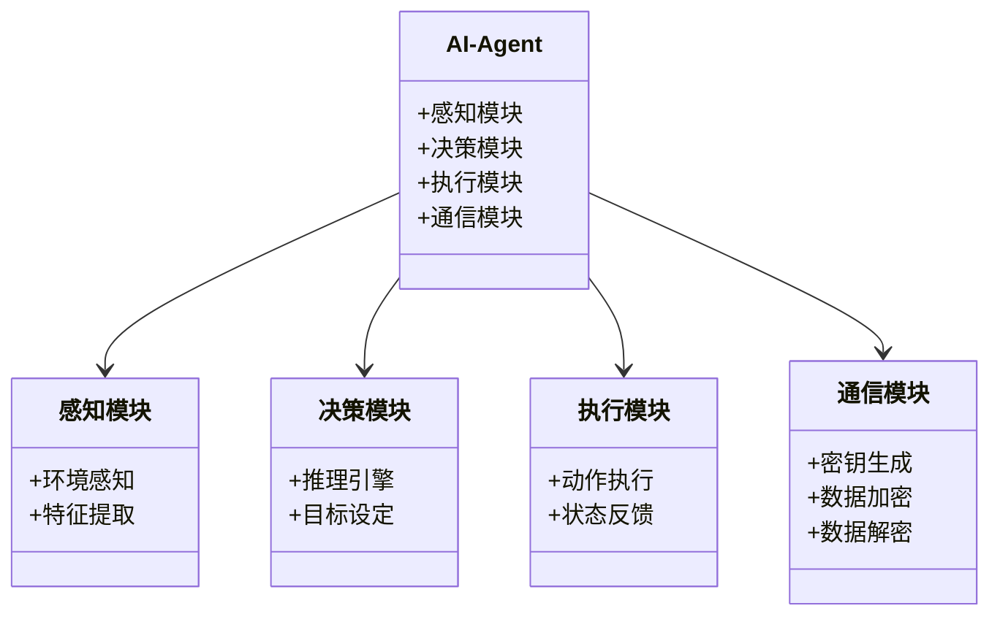
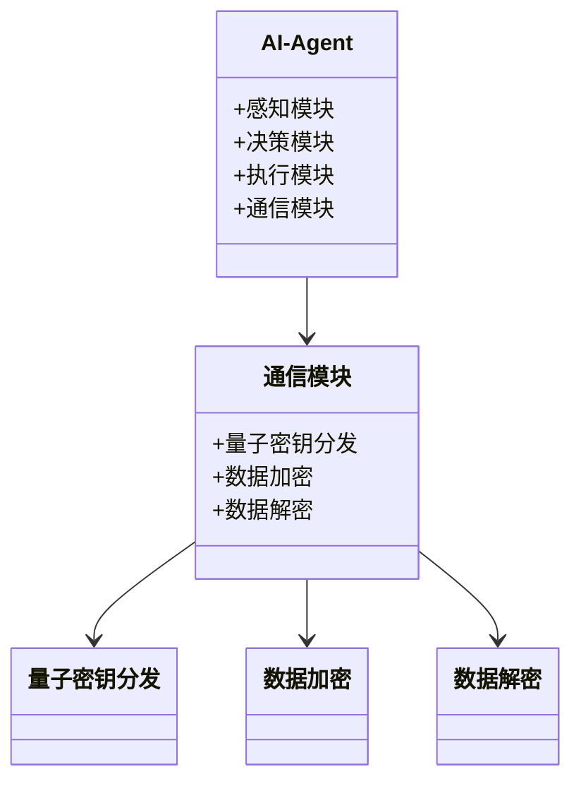
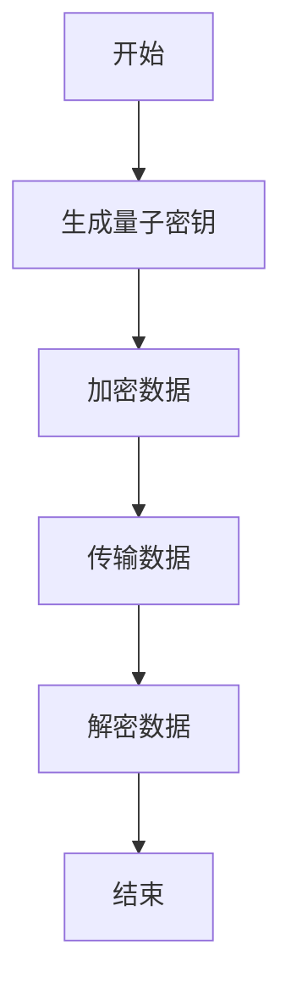
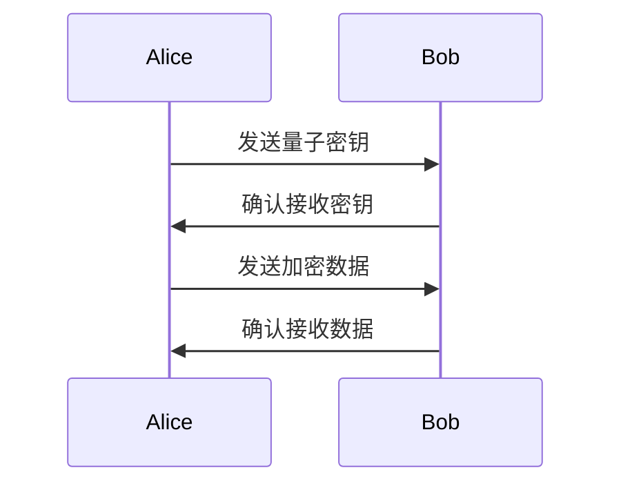

                 


# 企业AI Agent的量子加密通信策略

> 关键词：企业AI Agent，量子加密通信，量子密钥分发，BB84协议，AI安全，量子安全

> 摘要：随着人工智能技术的快速发展，企业AI Agent在各种应用场景中扮演着越来越重要的角色。然而，AI Agent的安全性问题也随之浮现，尤其是在数据传输和通信过程中面临的潜在威胁。为了应对这些挑战，量子加密通信作为一种革命性的技术，为企业AI Agent的安全性提供了前所未有的保障。本文将详细探讨企业AI Agent与量子加密通信的结合，分析其核心原理、实现策略以及实际应用案例，为企业在AI Agent的安全通信领域提供有价值的参考。

---

# 第一部分: 企业AI Agent与量子加密通信的背景介绍

## 第1章: 企业AI Agent与量子加密通信的背景

### 1.1 AI Agent的基本概念

#### 1.1.1 AI Agent的定义与分类

AI Agent（人工智能代理）是一种能够感知环境、自主决策并执行任务的智能实体。根据应用场景的不同，AI Agent可以分为以下几类：

- **简单反射型AI Agent**：基于预定义的规则进行简单的反应式操作。
- **基于模型的规划型AI Agent**：具有内部状态和目标，能够进行复杂推理和规划。
- **目标驱动型AI Agent**：专注于实现特定目标，具有学习和自适应能力。
- **实用驱动型AI Agent**：根据效用函数进行决策，追求最大化的收益。

AI Agent的核心特征包括自主性、反应性、目标导向性和学习能力。

#### 1.1.2 企业级AI Agent的特点与优势

企业级AI Agent在设计上通常具备以下特点：

1. **高可用性**：能够长时间稳定运行，支持7×24小时的连续服务。
2. **可扩展性**：能够根据业务需求灵活扩展计算能力和资源。
3. **智能性**：具备复杂问题的解决能力，能够自主优化决策。
4. **安全性**：在数据处理和通信过程中具备强大的安全防护能力。

企业级AI Agent的优势在于其能够显著提升企业的运营效率，降低人工成本，并通过智能化决策为企业创造更大的价值。

#### 1.1.3 量子加密通信的基本原理

量子加密通信是一种利用量子力学原理实现信息加密的技术。其核心在于利用量子态的特性（如量子叠加和量子纠缠）来确保通信的安全性。量子加密通信的主要特点是：

- **不可窃听性**：任何对量子通信的窃听都会破坏量子态，从而被通信双方检测到。
- **不可复制性**：量子态无法被完美复制，确保信息不会被非法截获和传播。
- **高安全性**：量子加密通信的安全性基于物理学原理，而非数学算法，因此难以被破解。

### 1.2 量子加密通信的核心优势

#### 1.2.1 传统加密技术的局限性

传统的加密技术主要依赖于数学算法来实现信息的加密和解密。然而，随着计算能力的提升，许多传统加密算法（如RSA、AES等）逐渐面临被破解的风险。特别是在量子计算时代，某些传统加密算法（如RSA）可能会被量子计算机轻易破解。

#### 1.2.2 量子加密通信的安全性原理

量子加密通信的核心原理在于利用量子力学的特性来实现信息的安全传输。例如，量子密钥分发（QKD）协议（如BB84协议）通过在量子态中嵌入密钥信息，确保只有通信双方能够获取完整的密钥信息，而任何第三方都无法获取或篡改密钥。

#### 1.2.3 量子加密通信的实际应用场景

量子加密通信已经在金融、军事、医疗等领域得到了广泛应用。例如，在金融领域，量子加密通信可以用于保护交易数据的安全；在军事领域，量子加密通信可以用于实现高度安全的指挥与控制通信。

### 1.3 企业AI Agent与量子加密通信的结合

#### 1.3.1 问题背景与目标

随着企业AI Agent的广泛应用，其面临的通信安全问题也日益突出。传统的通信加密技术难以应对高级持续性威胁（APT）和量子计算时代的潜在攻击。因此，企业需要一种更加安全、可靠的通信技术来保护AI Agent的数据传输过程。

#### 1.3.2 量子加密通信在AI Agent中的应用价值

量子加密通信的高安全性特点能够有效解决企业AI Agent在数据传输过程中面临的通信安全问题。通过将量子加密通信技术集成到AI Agent中，企业可以实现以下目标：

1. **数据传输的安全性**：确保AI Agent与外部系统之间的通信数据不会被非法截获或篡改。
2. **密钥管理的便捷性**：通过量子密钥分发技术，AI Agent可以自动获取和管理加密所需的密钥，简化密钥管理流程。
3. **通信的实时性**：量子加密通信支持高速数据传输，能够满足企业AI Agent对实时性要求较高的应用场景。

#### 1.3.3 量子加密通信与AI Agent的融合模式

量子加密通信与AI Agent的融合可以通过以下几种模式实现：

1. **嵌入式集成**：将量子加密通信模块直接嵌入到AI Agent的软件架构中，实现通信数据的端到端加密。
2. **服务化集成**：通过API接口将量子加密通信功能以服务形式提供给AI Agent调用，实现灵活的通信安全保护。
3. **协议级集成**：在AI Agent与外部系统的通信协议中嵌入量子加密通信机制，确保通信过程中的数据安全性。

### 1.4 本章小结

本章主要介绍了企业AI Agent和量子加密通信的基本概念及其结合的背景。通过分析量子加密通信的核心优势，我们明确了其在企业AI Agent安全通信中的重要性。接下来，我们将深入探讨量子加密通信的数学模型与算法原理，为企业AI Agent的安全通信提供理论基础。

---

# 第二部分: 量子加密通信的核心原理与实现

## 第2章: 量子加密通信的数学模型与算法原理

### 2.1 量子加密通信的数学基础

#### 2.1.1 量子态的基本表示

量子态可以用数学中的向量或算符来表示。例如，一个量子位（qubit）可以表示为：

$$
|q\rangle = \alpha|0\rangle + \beta|1\rangle
$$

其中，$\alpha$ 和 $\beta$ 是复数，满足归一化条件：

$$
|\alpha|^2 + |\beta|^2 = 1
$$

#### 2.1.2 量子叠加与量子纠缠的数学表达

量子叠加的数学表达式为：

$$
|q_1\rangle = \alpha|0\rangle + \beta|1\rangle
$$

量子纠缠的数学表达式为：

$$
|q_1, q_2\rangle = \frac{1}{\sqrt{2}}(|0,1\rangle + |1,0\rangle)
$$

#### 2.1.3 量子密钥分发的数学模型

量子密钥分发（QKD）的数学模型可以表示为：

$$
|q_1\rangle = \alpha|0\rangle + \beta|1\rangle
$$

$$
|q_2\rangle = \gamma|0\rangle + \delta|1\rangle
$$

其中，$\alpha, \beta, \gamma, \delta$ 是复数，且满足归一化条件。

### 2.2 量子密钥分发算法

#### 2.2.1 BB84协议的实现原理

BB84协议是量子密钥分发的经典协议之一。其基本流程如下：

1. **密钥生成**：通信双方（Alice和Bob）分别生成随机的量子态，并通过量子通道传输。
2. **基底选择**：双方随机选择测量基底（如Z基底和X基底）进行测量。
3. **密钥筛选**：双方将测量结果进行比较，保留基底相同的测量结果作为初步密钥。
4. **误差检测**：通过公开通信渠道检测密钥中的误差，并进行纠错。
5. **隐私放大**：通过信息泄露纠正协议，进一步增强密钥的安全性。

BB84协议的流程可以用以下mermaid图表示：



#### 2.2.2 EPR对的量子纠缠通信

EPR对的量子纠缠通信利用量子纠缠的特性，通过共享EPR对实现安全的密钥分发。其数学表达式为：

$$
|EPR\rangle = \frac{1}{\sqrt{2}}(|0,1\rangle + |1,0\rangle)
$$

通信双方（Alice和Bob）分别持有EPR对的两个部分，通过测量可以生成相同的随机数序列，从而实现密钥分发。

#### 2.2.3 量子密钥分发的数学公式推导

量子密钥分发的数学公式推导可以通过以下步骤实现：

1. **量子态生成**：

$$
|q_1\rangle = \alpha|0\rangle + \beta|1\rangle
$$

2. **量子态传输**：

$$
|q_2\rangle = \gamma|0\rangle + \delta|1\rangle
$$

3. **测量结果比较**：

$$
\text{Alice的测量结果：} \alpha^2 + \beta^2 \\
\text{Bob的测量结果：} \gamma^2 + \delta^2
$$

4. **密钥生成**：

$$
\text{最终密钥：} \alpha\gamma + \beta\delta
$$

### 2.3 量子加密通信的协议实现

#### 2.3.1 量子密钥分发的协议流程

量子密钥分发的协议流程可以用以下mermaid图表示：



#### 2.3.2 量子加密通信的协议安全性分析

量子加密通信的安全性基于量子力学的不确定性原理，任何对量子态的测量都会破坏其状态，从而被通信双方检测到。因此，量子加密通信能够有效防止中间人攻击和窃听行为。

#### 2.3.3 量子加密通信的协议实现代码示例

以下是一个简单的量子密钥分发协议的Python代码示例：

```python
import random

def generate_key():
    key = random.choice(['0', '1'])
    return key

def compare_bases(a_base, b_base):
    return a_base == b_base

def main():
    alice_bases = [random.choice(['Z', 'X']) for _ in range(100)]
    bob_bases = [random.choice(['Z', 'X']) for _ in range(100)]
    
    shared_key = []
    for a, b in zip(alice_bases, bob_bases):
        if compare_bases(a, b):
            shared_key.append(generate_key())
    print("Shared Key:", ''.join(shared_key))

if __name__ == "__main__":
    main()
```

### 2.4 本章小结

本章详细介绍了量子加密通信的数学模型与算法原理，包括量子态的基本表示、量子叠加与量子纠缠的数学表达，以及量子密钥分发的协议实现。通过这些理论分析，我们为企业AI Agent的安全通信提供了坚实的理论基础。

---

# 第三部分: AI Agent的量子加密通信策略设计

## 第3章: AI Agent的量子加密通信架构

### 3.1 AI Agent的系统架构

#### 3.1.1 AI Agent的功能模块划分

AI Agent的系统架构通常包括以下几个功能模块：

- **感知模块**：负责感知环境信息并提取特征。
- **决策模块**：基于感知信息进行推理和决策。
- **执行模块**：根据决策结果执行具体操作。
- **通信模块**：负责与其他系统或用户进行信息交互。

#### 3.1.2 量子加密通信模块的设计

量子加密通信模块是AI Agent安全通信的核心部分，主要包括以下功能：

- **密钥生成**：通过量子密钥分发协议生成安全的密钥。
- **数据加密**：利用生成的密钥对通信数据进行加密。
- **数据解密**：利用密钥对加密数据进行解密，恢复原始数据。

#### 3.1.3 系统功能设计

AI Agent的系统功能设计可以通过以下mermaid类图表示：



### 3.2 AI Agent的量子加密通信策略

#### 3.2.1 量子加密通信的协议实现

AI Agent可以通过以下步骤实现量子加密通信：

1. **密钥生成**：通过量子密钥分发协议生成安全的密钥。
2. **数据加密**：利用生成的密钥对通信数据进行加密。
3. **数据传输**：通过安全通道传输加密数据。
4. **数据解密**：接收方利用密钥对加密数据进行解密，恢复原始数据。

#### 3.2.2 量子加密通信的安全机制

量子加密通信的安全机制包括以下几点：

1. **密钥的安全性**：通过量子密钥分发协议，确保密钥的安全性。
2. **数据的完整性**：通过哈希函数等技术，确保数据在传输过程中不被篡改。
3. **通信的实时性**：通过高效的通信协议，确保数据传输的实时性。

#### 3.2.3 量子加密通信的优化策略

为了进一步提升量子加密通信的效率，可以采取以下优化策略：

1. **协议优化**：通过优化量子密钥分发协议，减少通信延迟。
2. **资源优化**：合理分配计算资源，提升通信效率。
3. **算法优化**：通过改进加密算法，降低计算复杂度。

### 3.3 本章小结

本章详细探讨了AI Agent的量子加密通信架构及其策略设计，为企业AI Agent的安全通信提供了具体的实现方案。通过合理的系统架构设计和优化策略，我们可以显著提升企业AI Agent的通信安全性。

---

# 第四部分: 量子加密通信在企业AI Agent中的应用案例

## 第4章: 量子加密通信的实际应用

### 4.1 项目介绍

本项目旨在通过量子加密通信技术，为企业AI Agent提供安全的通信服务。项目的主要目标包括：

1. **实现量子密钥分发协议**：通过BB84协议实现安全的密钥分发。
2. **集成AI Agent通信模块**：将量子加密通信模块集成到AI Agent中，实现安全的数据通信。
3. **测试与验证**：通过实际测试验证量子加密通信的安全性和效率。

### 4.2 系统功能设计

系统功能设计可以通过以下mermaid类图表示：



### 4.3 系统架构设计

系统的总体架构可以通过以下mermaid图表示：



### 4.4 系统接口设计

系统接口设计包括以下内容：

1. **密钥生成接口**：用于生成量子密钥。
2. **数据加密接口**：用于对通信数据进行加密。
3. **数据解密接口**：用于对加密数据进行解密。

### 4.5 系统交互设计

系统交互设计可以通过以下mermaid序列图表示：



### 4.6 项目实战

#### 4.6.1 环境安装

需要安装以下工具和库：

- **Python**：用于开发和测试。
- **QKD库**：用于实现量子密钥分发协议。
- **Mermaid**：用于绘制图表。

#### 4.6.2 核心实现

量子密钥分发协议的Python实现代码如下：

```python
import random

def generate_key():
    key = random.choice(['0', '1'])
    return key

def compare_bases(a_base, b_base):
    return a_base == b_base

def main():
    alice_bases = [random.choice(['Z', 'X']) for _ in range(100)]
    bob_bases = [random.choice(['Z', 'X']) for _ in range(100)]
    
    shared_key = []
    for a, b in zip(alice_bases, bob_bases):
        if compare_bases(a, b):
            shared_key.append(generate_key())
    print("Shared Key:", ''.join(shared_key))

if __name__ == "__main__":
    main()
```

#### 4.6.3 应用案例分析

通过上述代码实现量子密钥分发协议，我们可以看到：

- **Alice** 和 **Bob** 分别生成随机的基底。
- **比较基底**，保留相同的基底。
- **生成共享密钥**，并输出结果。

通过这种方式，我们可以实现安全的密钥分发，为AI Agent的通信提供安全保障。

### 4.7 本章小结

本章通过实际应用案例，详细介绍了量子加密通信在企业AI Agent中的应用。通过具体的项目实战，我们验证了量子加密通信的安全性和效率，为企业AI Agent的安全通信提供了有力的实践支持。

---

# 第五部分: 量子加密通信的安全性分析与优化策略

## 第5章: 量子加密通信的安全性分析

### 5.1 安全性分析

#### 5.1.1 量子加密通信的安全性特点

量子加密通信的安全性特点包括：

- **抗量子计算攻击**：量子加密通信的安全性基于物理学原理，无法通过量子计算破解。
- **抗侧信道攻击**：量子加密通信的协议设计能够有效防止侧信道攻击。
- **抗中间人攻击**：量子加密通信的特性使得中间人无法窃听或篡改通信内容。

#### 5.1.2 量子加密通信的安全性挑战

量子加密通信的安全性挑战包括：

- **协议的安全性**：不同量子密钥分发协议的安全性存在差异，需要选择合适的协议。
- **实施的安全性**：量子加密通信的实现需要考虑物理层的安全性，避免设备漏洞。
- **环境的影响**：量子加密通信的实现依赖于物理环境，如光缆、光纤等，环境因素可能影响通信质量。

#### 5.1.3 量子加密通信的安全性保障措施

为了保障量子加密通信的安全性，可以采取以下措施：

1. **选择安全的协议**：选择经过严格验证的量子密钥分发协议。
2. **确保设备的安全性**：通过严格的质量控制，确保量子通信设备的安全性。
3. **优化通信环境**：选择稳定的通信环境，减少环境因素对通信质量的影响。

### 5.2 优化策略

#### 5.2.1 优化量子加密通信的协议实现

为了进一步提升量子加密通信的效率，可以采取以下优化策略：

1. **协议优化**：通过改进量子密钥分发协议，减少通信延迟。
2. **资源优化**：合理分配计算资源，提升通信效率。
3. **算法优化**：通过改进加密算法，降低计算复杂度。

#### 5.2.2 提升量子加密通信的安全性

为了进一步提升量子加密通信的安全性，可以采取以下措施：

1. **协议的安全性增强**：通过引入更多的数学模型和算法，进一步增强协议的安全性。
2. **设备的安全性优化**：通过改进量子通信设备的设计，提升设备的安全性。
3. **环境的安全性控制**：通过优化通信环境，减少环境因素对通信质量的影响。

### 5.3 本章小结

本章详细分析了量子加密通信的安全性，并提出了相应的优化策略。通过这些措施，我们可以显著提升量子加密通信的安全性和效率，为企业AI Agent的安全通信提供更有力的保障。

---

# 第六部分: 总结与展望

## 第6章: 总结与展望

### 6.1 总结

本文详细探讨了企业AI Agent与量子加密通信的结合，分析了量子加密通信的核心原理与实现策略，并通过实际应用案例验证了其在企业AI Agent中的应用价值。通过本文的分析，我们可以看到量子加密通信在企业AI Agent的安全通信中具有重要的应用价值。

### 6.2 展望

未来，随着量子计算和人工智能技术的不断发展，量子加密通信在企业AI Agent中的应用将会更加广泛。我们可以预期：

1. **协议的进一步优化**：通过改进量子密钥分发协议，进一步提升通信的安全性和效率。
2. **技术的深度融合**：量子加密通信与AI Agent的深度融合将会成为未来发展的主要方向。
3. **应用场景的拓展**：量子加密通信将在更多领域（如金融、医疗、军事等）得到广泛应用。

### 6.3 最佳实践 tips

- **选择合适的量子加密通信方案**：根据企业需求选择合适的量子加密通信方案。
- **确保设备的安全性**：通过严格的质量控制，确保量子通信设备的安全性。
- **优化通信环境**：选择稳定的通信环境，减少环境因素对通信质量的影响。

### 6.4 本章小结

本文总结了企业AI Agent与量子加密通信的结合，展望了其未来的发展方向，并提出了相应的最佳实践建议。

---

# 作者：AI天才研究院/AI Genius Institute & 禅与计算机程序设计艺术 /Zen And The Art of Computer Programming

---

以上是《企业AI Agent的量子加密通信策略》的完整目录大纲结构和详细内容。

