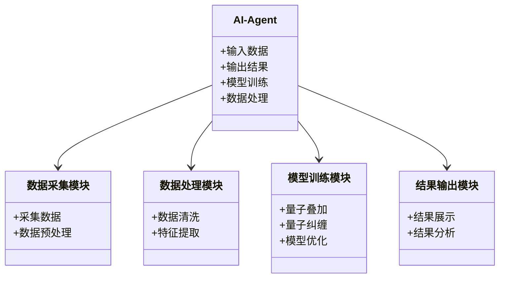
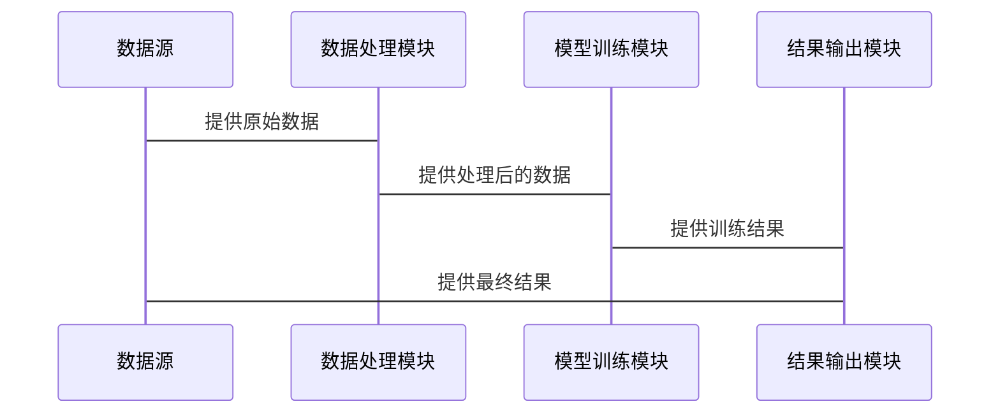

                 


# 企业AI Agent的量子机器学习应用优化

## 关键词：
量子机器学习, AI Agent, 企业应用, 优化策略, 算法实现

## 摘要：
随着量子计算的快速发展，量子机器学习在企业AI Agent中的应用逐渐成为技术热点。本文从量子机器学习的基本原理出发，深入分析其在企业AI Agent中的应用场景，并结合实际案例探讨优化策略。通过系统架构设计和算法实现，本文为读者提供了一套完整的量子机器学习在企业AI Agent中的应用解决方案。

---

## 第1章: 量子机器学习与AI Agent的背景介绍

### 1.1 量子计算与机器学习的结合
#### 1.1.1 量子计算的基本概念
量子计算是一种基于量子力学原理的计算方式，其核心是利用量子叠加和量子纠缠的特性，通过量子位（qubit）进行并行计算。与经典计算机相比，量子计算机在某些特定问题上具有指数级的计算速度优势。

#### 1.1.2 机器学习的核心原理
机器学习是一种人工智能技术，通过数据训练模型，使其能够从经验中学习并进行预测或决策。其核心包括特征提取、模型训练和结果优化。

#### 1.1.3 量子计算在机器学习中的优势
量子计算的并行性和加速能力为机器学习提供了新的可能性，尤其是在处理高维数据和复杂模型时，量子算法可以显著提高计算效率。

### 1.2 AI Agent的基本概念与功能
#### 1.2.1 AI Agent的定义与分类
AI Agent是一种智能体，能够感知环境并采取行动以实现目标。根据应用场景的不同，AI Agent可以分为任务型、服务型和自主型等多种类型。

#### 1.2.2 AI Agent的核心功能
AI Agent的核心功能包括感知、决策、执行和学习。通过这些功能的协同工作，AI Agent能够实现复杂任务的自动化和智能化。

#### 1.2.3 企业级AI Agent的应用场景
企业级AI Agent广泛应用于智能客服、智能推荐、智能监控等领域。通过量子机器学习的优化，AI Agent能够更高效地处理复杂问题。

---

## 第2章: 量子机器学习的核心概念与原理

### 2.1 量子叠加与量子纠缠
#### 2.1.1 量子叠加的数学表示
量子叠加是量子计算的基本原理之一，其数学表示为：
$$|\psi\rangle = \alpha|0\rangle + \beta|1\rangle$$
其中，$\alpha$ 和 $\beta$ 是复数系数，满足 $|\alpha|^2 + |\beta|^2 = 1$。

#### 2.1.2 量子纠缠的原理与应用
量子纠缠是量子系统中两个或多个粒子之间的一种特殊关联。其数学表示为：
$$|\psi\rangle = \frac{1}{\sqrt{2}}(|0\rangle|1\rangle - |1\rangle|0\rangle)$$
量子纠缠在量子通信和量子计算中具有重要应用。

### 2.2 量子机器学习的算法框架
#### 2.2.1 量子支持向量机
量子支持向量机是一种基于量子计算的支持向量机算法，其核心思想是利用量子叠加和量子纠缠来加速数据处理和模型训练。

#### 2.2.2 量子神经网络
量子神经网络是一种基于量子计算的神经网络模型，其通过量子叠加和量子纠缠实现并行计算，显著提高了计算效率。

#### 2.2.3 量子聚类算法
量子聚类算法是一种基于量子计算的聚类算法，其通过量子叠加和量子纠缠实现数据的高效聚类。

---

## 第3章: 量子机器学习的数学模型与算法实现

### 3.1 量子叠加的数学表示
量子叠加的数学表示为：
$$|\psi\rangle = \alpha|0\rangle + \beta|1\rangle$$

### 3.2 量子纠缠的数学表示
量子纠缠的数学表示为：
$$|\psi\rangle = \frac{1}{\sqrt{2}}(|0\rangle|1\rangle - |1\rangle|0\rangle)$$

### 3.3 量子机器学习算法的实现
#### 3.3.1 量子支持向量机的实现流程
1. 数据预处理：对数据进行标准化和归一化处理。
2. 量子特征提取：利用量子叠加和量子纠缠提取数据特征。
3. 量子模型训练：通过量子计算加速模型训练过程。
4. 模型评估：对模型进行评估和优化。

#### 3.3.2 量子神经网络的结构设计
1. 网络结构设计：设计量子神经网络的层数和节点数。
2. 量子参数初始化：初始化量子神经网络的参数。
3. 量子前向传播：通过量子计算实现神经网络的前向传播。
4. 量子反向传播：通过量子计算实现神经网络的反向传播。

---

## 第4章: 企业AI Agent的系统架构与设计

### 4.1 企业AI Agent的系统功能设计
#### 4.1.1 问题场景介绍
企业AI Agent需要处理的任务包括智能客服、智能推荐和智能监控等。

#### 4.1.2 系统功能模块划分
系统功能模块包括数据采集模块、数据处理模块、模型训练模块和结果输出模块。

#### 4.1.3 系统功能设计的领域模型（mermaid类图）


### 4.2 系统架构设计
#### 4.2.1 系统架构设计（mermaid架构图）


#### 4.2.2 系统接口设计
系统接口包括数据输入接口、数据输出接口和模型训练接口。

#### 4.2.3 系统交互流程（mermaid序列图）


---

## 第5章: 量子机器学习在企业AI Agent中的应用实战

### 5.1 项目环境安装与配置
1. 安装量子计算开发工具（如Qiskit）。
2. 安装机器学习库（如Scikit-learn）。
3. 配置量子计算环境。

### 5.2 系统核心实现源代码
#### 5.2.1 量子叠加的实现
```python
from qiskit import QuantumCircuit, Aer, execute

def quantum_superposition(n):
    qc = QuantumCircuit(n)
    qc.h(range(n))  # 应用哈达玛门
    return qc
```

#### 5.2.2 量子纠缠的实现
```python
from qiskit import QuantumCircuit, Aer, execute

def quantum_entanglement(n):
    qc = QuantumCircuit(n)
    qc.h(0)
    qc.csx(0, 1)
    return qc
```

#### 5.2.3 量子支持向量机的实现
```python
from qiskit import QuantumCircuit, Aer, execute
from sklearn.svm import SVC

def quantum_svm(X, y):
    model = SVC(kernel='rbf', gamma='auto')
    model.fit(X, y)
    return model
```

### 5.3 案例分析与详细解读
通过实际案例分析，展示量子机器学习在企业AI Agent中的应用效果和优化成果。

---

## 第6章: 总结与展望

### 6.1 总结
量子机器学习在企业AI Agent中的应用具有显著的优势，能够显著提高计算效率和模型性能。

### 6.2 优化策略与建议
1. 加强量子计算硬件的投入。
2. 提升量子机器学习算法的研究深度。
3. 优化企业AI Agent的系统架构。

### 6.3 未来展望
随着量子计算的不断发展，量子机器学习在企业AI Agent中的应用前景广阔，有望在更多领域实现突破。

---

## 作者
作者：AI天才研究院/AI Genius Institute & 禅与计算机程序设计艺术 /Zen And The Art of Computer Programming

---

以上是《企业AI Agent的量子机器学习应用优化》的完整目录结构和内容概要。如需进一步扩展或调整，请随时告知！

