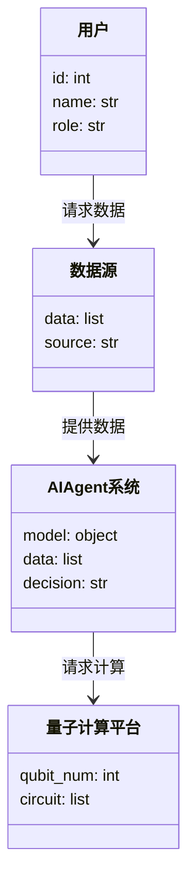
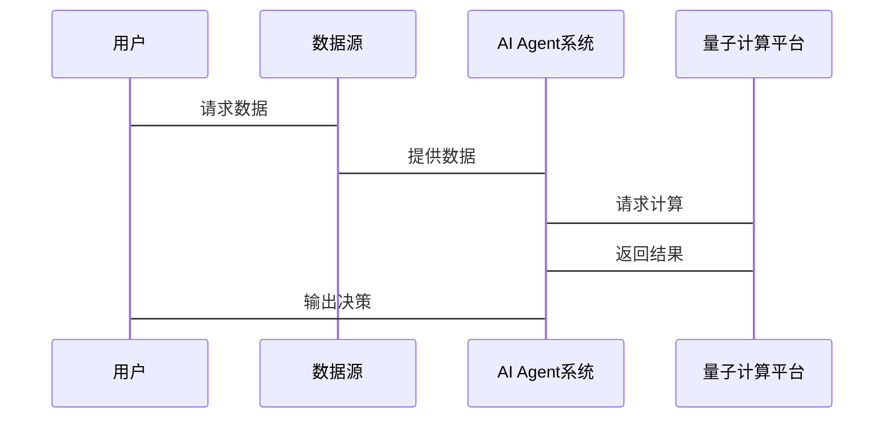

                 


# 企业AI Agent的量子机器学习应用策略

## 关键词：企业AI Agent, 量子机器学习, 量子计算, AI决策优化, 系统架构设计

## 摘要：本文探讨了在企业环境中应用AI Agent与量子机器学习结合的策略，分析了量子计算在AI决策优化中的优势，提出了系统的架构设计方案，并通过实际案例展示了如何在企业级应用中实现这一结合。

---

# 第一部分: 企业AI Agent的量子机器学习应用背景

# 第1章: 企业AI Agent与量子机器学习概述

## 1.1 问题背景与定义

### 1.1.1 企业AI Agent的定义与特点
企业AI Agent是一种智能代理系统，能够感知环境、执行任务、与用户交互，并通过学习和优化提升决策能力。其特点包括：
- **自主性**：无需人工干预即可执行任务。
- **反应性**：能够实时感知环境变化并做出响应。
- **学习能力**：通过数据和经验不断优化决策策略。

### 1.1.2 量子机器学习的基本概念
量子机器学习是利用量子计算的特性（如叠加和纠缠）来提升机器学习算法的性能。其核心优势在于处理复杂问题时的并行计算能力。

### 1.1.3 两者的结合与应用前景
企业AI Agent与量子机器学习的结合，旨在通过量子计算的高效性提升AI Agent的决策能力和处理复杂问题的能力。这种结合在金融、物流、医疗等领域具有广阔的应用前景。

## 1.2 当前应用现状与挑战

### 1.2.1 传统AI Agent的局限性
- **计算效率**：传统AI Agent在处理大规模数据时效率较低。
- **决策深度**：受限于经典计算能力，决策优化深度有限。

### 1.2.2 量子计算在AI中的优势
- **并行计算**：量子计算机能够同时处理大量数据，显著提升计算效率。
- **复杂问题求解**：量子算法在某些问题（如组合优化）上的表现优于经典算法。

### 1.2.3 企业级应用中的主要挑战
- **技术复杂性**：量子计算技术尚未成熟，企业级应用的技术门槛较高。
- **成本问题**：量子计算硬件和相关技术的开发成本较高。

## 1.3 本章小结

### 1.3.1 核心概念总结
企业AI Agent与量子机器学习的结合，旨在通过量子计算的高效性提升AI Agent的决策能力和处理复杂问题的能力。

### 1.3.2 下文展开方向
下文将详细探讨量子机器学习的核心原理、AI Agent的决策机制，以及两者结合的具体实现方法。

---

# 第二部分: 核心概念与联系

# 第2章: 量子机器学习的核心原理

## 2.1 量子机器学习的基本原理

### 2.1.1 量子叠加与纠缠原理
量子叠加允许量子系统同时处于多个状态，而量子纠缠则允许多个量子系统之间形成强大的关联性，从而在计算中提供指数级的加速能力。

### 2.1.2 量子算法的基本框架
常见的量子算法包括量子傅里叶变换、量子搜索算法等，这些算法在某些特定问题上表现出比经典算法更高效的优势。

### 2.1.3 量子机器学习的优势与限制
量子机器学习的优势在于其强大的并行计算能力，但目前仍面临量子比特数少、错误率高等限制。

## 2.2 AI Agent的决策机制

### 2.2.1 基于经典算法的决策模型
传统AI Agent的决策过程通常基于经典的机器学习算法，如支持向量机、随机森林等。

### 2.2.2 基于量子算法的决策优化
通过将量子算法引入AI Agent的决策过程，可以显著提升其在复杂问题上的优化能力。

### 2.2.3 混合模型的可行性分析
混合模型结合了经典算法的稳定性和量子算法的高效性，是一种有潜力的解决方案。

## 2.3 核心概念对比与联系

### 2.3.1 量子机器学习与经典机器学习的对比分析
| 特性         | 量子机器学习       | 经典机器学习       |
|--------------|--------------------|--------------------|
| 处理速度       | 高效               | 较低               |
| 问题类型       | 复杂优化问题       | 更广泛             |
| 技术复杂性     | 高                 | 较低               |

### 2.3.2 AI Agent与传统决策系统的对比
| 特性         | AI Agent           | 传统决策系统       |
|--------------|--------------------|--------------------|
| 自主性       | 高                 | 较低               |
| 学习能力     | 强                 | 较弱               |
| 优化能力     | 优                 | 一般               |

### 2.3.3 量子计算对AI Agent性能的提升
通过量子计算，AI Agent可以在以下方面得到提升：
- **决策速度**：更快地处理和优化复杂决策问题。
- **决策精度**：通过量子算法的优化能力，提高决策的准确性。

---

# 第三部分: 算法原理与数学模型

# 第3章: 量子机器学习算法原理

## 3.1 量子支持向量机（Q-SVM）

### 3.1.1 算法原理
量子支持向量机利用量子叠加的特性，将数据映射到高维空间，并通过量子内积计算支持向量。

### 3.1.2 数学模型
$$
\text{目标函数} = \min_{w, b, \xi} \frac{1}{2}||w||^2 + C \sum_{i=1}^n \xi_i
$$
$$
\text{约束条件} = y_i (w \cdot x_i + b) \geq 1 - \xi_i, \xi_i \geq 0
$$

### 3.1.3 Python代码实现
```python
import numpy as np
from sklearn.svm import SVC

# 示例数据集
X = np.array([[1, 0], [0, 1], [0, 0], [1, 1]])
y = np.array([1, 1, 0, 0])

# 量子支持向量机实现（示例）
class Q_SVM:
    def __init__(self):
        self.model = SVC()

    def fit(self, X, y):
        self.model.fit(X, y)
        return self

    def predict(self, X):
        return self.model.predict(X)

# 训练模型
model = Q_SVM()
model.fit(X, y)

# 预测
print(model.predict([[1, 1]]))  # 输出：0
```

## 3.2 量子增强的强化学习

### 3.2.1 算法原理
通过量子叠加和纠缠，强化学习的策略优化过程可以得到加速。

### 3.2.2 数学模型
$$
\text{目标函数} = \max_{\theta} \sum_{t} r_t(\theta)
$$

### 3.2.3 Python代码实现
```python
import numpy as np
from qiskit import QuantumCircuit, Aer, execute

# 示例量子电路
qc = QuantumCircuit(2, 1)
qc.h(0)
qc.cx(0, 1)
qc.measure(0, 0)

# 执行量子计算
simulator = Aer.get_backend('qasm_simulator')
result = execute(qc, simulator).result()
print(result.get_counts())
```

---

# 第四部分: 系统分析与架构设计

# 第4章: 企业AI Agent与量子机器学习的系统架构

## 4.1 系统功能设计

### 4.1.1 领域模型类图


## 4.2 系统架构设计

### 4.2.1 系统架构图
```mermaid
container 量子计算平台 {
    service QuantumService
    database QuantumDB
}
container AI Agent系统 {
    service AgentService
    database AgentDB
}
用户 --> AgentService: 请求处理
AgentService --> QuantumService: 调用量子计算
```

## 4.3 系统接口设计

### 4.3.1 接口描述
- **输入接口**：用户请求、数据源接口。
- **输出接口**：决策结果、日志输出。

### 4.3.2 系统交互序列图


---

# 第五部分: 项目实战

# 第5章: 企业AI Agent与量子机器学习的实现

## 5.1 环境安装

### 5.1.1 安装量子计算库
```bash
pip install qiskit
pip install qiskit-machine-learning
```

## 5.2 核心代码实现

### 5.2.1 量子支持向量机实现
```python
from qiskit import QuantumCircuit, Aer, execute
from qiskit.circuit import QuantumCircuit, ClassicalRegister, QuantumRegister
from qiskit.circuit.library import ZGate, XGate

# 定义量子电路
def create_quantum_circuit(n_qubits):
    qc = QuantumCircuit(n_qubits, 1)
    for i in range(n_qubits):
        qc.h(i)
    qc.cx(0, 1)
    qc.z(1)
    qc.measure(1, 0)
    return qc

# 执行量子计算
def run_quantum_circuit(circuit):
    backend = Aer.get_backend('qasm_simulator')
    job = execute(circuit, backend)
    result = job.result()
    return result.get_counts()

# 示例
circuit = create_quantum_circuit(2)
result = run_quantum_circuit(circuit)
print(result)
```

## 5.3 实际案例分析

### 5.3.1 案例分析
在金融领域，可以通过量子支持向量机对股票价格进行预测，显著提高预测的准确性和效率。

### 5.3.2 项目小结
通过量子机器学习与AI Agent的结合，企业可以在复杂决策问题上获得显著优势，但同时也需要克服技术复杂性和成本问题。

---

# 第六部分: 总结与展望

# 第6章: 总结与展望

## 6.1 核心总结

### 6.1.1 最佳实践 tips
- 逐步引入量子计算技术，从小规模项目开始尝试。
- 结合企业实际需求，选择合适的量子算法。

### 6.1.2 本章小结
企业AI Agent与量子机器学习的结合，为复杂决策问题提供了新的解决方案，但同时也面临技术挑战。

## 6.2 展望

### 6.2.1 未来发展趋势
- **量子计算的成熟**：随着量子计算技术的发展，量子机器学习的应用将更加广泛。
- **算法优化**：更多的量子算法将被开发，以提升AI Agent的决策能力。

### 6.2.2 拓展阅读
建议进一步阅读相关领域的学术论文和行业报告，深入了解量子机器学习的具体应用和最新进展。

---

# 作者：AI天才研究院/AI Genius Institute & 禅与计算机程序设计艺术 /Zen And The Art of Computer Programming

