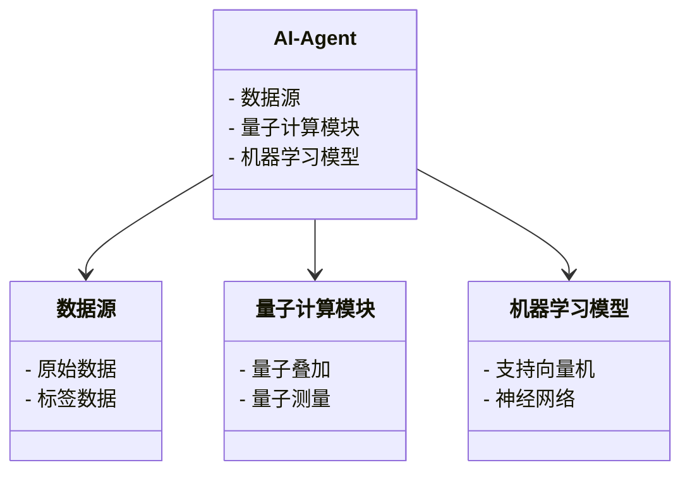
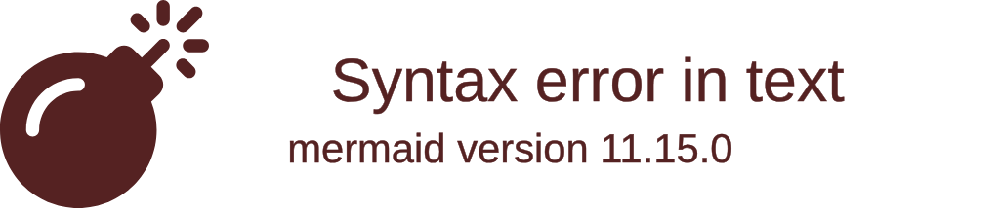
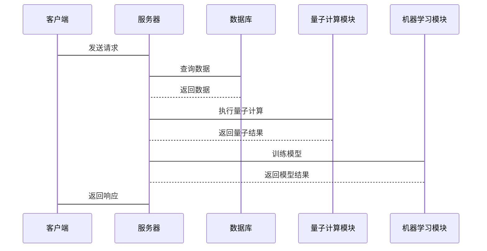

                 


# 企业AI Agent的量子机器学习算法优化

## 关键词：量子机器学习, AI Agent, 量子计算, 机器学习优化, 企业应用

## 摘要：本文深入探讨了量子机器学习在企业AI Agent中的应用，分析了量子机器学习的核心原理，结合实际企业场景，详细讲解了量子机器学习算法的优化方法，并通过具体案例展示了如何在企业中实现量子机器学习驱动的AI Agent，帮助企业提升决策效率和智能化水平。

---

# 第1章: 量子机器学习与AI Agent概述

## 1.1 量子计算与机器学习的结合

### 1.1.1 量子计算的基本概念

量子计算是一种基于量子力学原理的计算方式，与经典计算相比，其核心优势在于利用量子叠加和量子纠缠等特性，可以在某些特定问题上实现指数级的计算速度提升。

### 1.1.2 机器学习的核心原理

机器学习是一种人工智能技术，通过数据训练模型，使其能够从数据中学习并做出预测或决策。传统机器学习算法包括支持向量机（SVM）、决策树、随机森林等，而深度学习则是基于人工神经网络的机器学习方法。

### 1.1.3 量子计算在机器学习中的优势

量子计算在处理复杂优化问题、大数据分析和模式识别等方面具有显著优势。例如，量子支持向量机可以在某些情况下显著提高分类精度和计算速度。

## 1.2 AI Agent的定义与特点

### 1.2.1 AI Agent的基本定义

AI Agent是一种能够感知环境、自主决策并执行任务的智能体。它可以在企业中执行复杂任务，如数据分析、预测、优化等。

### 1.2.2 AI Agent的核心特点

- **自主性**：能够自主决策和执行任务。
- **反应性**：能够实时感知环境并做出反应。
- **学习能力**：能够通过数据学习和优化算法。

### 1.2.3 企业级AI Agent的应用场景

企业AI Agent可以应用于智能客服、供应链优化、金融风险控制、市场营销等领域，帮助企业在复杂环境中做出高效决策。

## 1.3 量子机器学习与AI Agent的结合

### 1.3.1 量子机器学习的基本概念

量子机器学习是将量子计算与传统机器学习相结合，利用量子计算的独特优势来优化机器学习算法。

### 1.3.2 AI Agent与量子机器学习的关系

AI Agent作为执行者，可以利用量子机器学习算法来提高其决策能力和效率。量子机器学习算法为AI Agent提供了更强大的数据分析和模式识别能力。

### 1.3.3 量子机器学习在企业AI Agent中的应用前景

随着量子计算技术的不断发展，量子机器学习在企业AI Agent中的应用将更加广泛，特别是在需要高效优化和复杂决策的场景中。

## 1.4 本章小结

本章介绍了量子计算与机器学习的结合、AI Agent的定义与特点，以及量子机器学习在企业AI Agent中的应用前景。通过这些内容，读者可以理解量子机器学习与AI Agent结合的基本概念和潜在价值。

---

# 第2章: 量子机器学习的核心概念与原理

## 2.1 量子叠加与量子纠缠

### 2.1.1 量子叠加的数学表达

量子叠加可以用数学公式表示为：$$|\psi\rangle = \alpha|0\rangle + \beta|1\rangle$$，其中$\alpha$和$\beta$是复数，满足$|\alpha|^2 + |\beta|^2 = 1$。

### 2.1.2 量子纠缠的物理意义

量子纠缠是指两个或多个粒子之间形成的一种特殊关联，其中一个粒子的状态会直接影响另一个粒子的状态，即使它们相隔很远。

### 2.1.3 量子叠加与机器学习的关系

量子叠加可以用于优化机器学习算法中的参数搜索，从而提高算法的效率和准确性。

## 2.2 量子测量与量子算法

### 2.2.1 量子测量的基本原理

量子测量是指对量子系统进行观测，导致量子态的坍缩，从而得到一个确定的结果。

### 2.2.2 量子算法的核心步骤

量子算法通常包括初始化、量子叠加、量子干涉和测量等步骤。

### 2.2.3 量子算法在机器学习中的应用

量子算法可以用于优化机器学习模型的参数，提高分类和回归任务的性能。

## 2.3 量子机器学习的数学模型

### 2.3.1 量子态的线性代数表示

量子态可以用向量表示，例如，一个二维量子态可以表示为$$|\psi\rangle = \begin{bmatrix}\alpha\\\beta\end{bmatrix}$$。

### 2.3.2 量子机器学习的数学公式

量子机器学习模型可以用矩阵形式表示，例如，量子支持向量机的优化问题可以表示为$$\min_{\theta} \frac{1}{2}\|\theta\|^2 + C\sum_{i=1}^n \max(0, 1 - y_i(\theta^T x_i + \theta_0))$$。

### 2.3.3 量子机器学习的优化方法

量子机器学习的优化可以通过量子退火、量子模拟等方法实现。

## 2.4 本章小结

本章详细讲解了量子叠加与量子纠缠的数学表达，量子测量的基本原理，以及量子算法在机器学习中的应用。这些内容为后续章节的算法优化奠定了基础。

---

# 第3章: 企业AI Agent的量子机器学习算法优化

## 3.1 量子支持向量机

### 3.1.1 支持向量机的基本原理

支持向量机是一种监督学习算法，通过找到一个超平面将数据分为两类。

### 3.1.2 量子支持向量机的算法优化

量子支持向量机可以通过量子优化算法加速参数搜索，提高分类精度。

### 3.1.3 量子支持向量机在企业AI Agent中的应用

例如，在金融风险控制中，量子支持向量机可以用于客户信用评分和欺诈检测。

## 3.2 量子神经网络

### 3.2.1 神经网络的基本原理

神经网络是一种模仿人脑结构和功能的计算模型，可以用于分类、回归等任务。

### 3.2.2 量子神经网络的构建方法

量子神经网络可以通过量子叠加和量子纠缠来实现，并利用量子并行性提高计算效率。

### 3.2.3 量子神经网络在AI Agent中的应用

例如，在智能客服中，量子神经网络可以用于语音识别和情感分析。

## 3.3 量子强化学习

### 3.3.1 强化学习的基本原理

强化学习是一种通过试错方式学习策略的方法，通常应用于机器人控制、游戏AI等领域。

### 3.3.2 量子强化学习的算法优化

量子强化学习可以通过量子叠加加速状态空间的搜索，提高学习效率。

### 3.3.3 量子强化学习在企业AI Agent中的应用

例如，在供应链优化中，量子强化学习可以用于路径规划和库存管理。

## 3.4 本章小结

本章详细介绍了量子支持向量机、量子神经网络和量子强化学习的优化方法及其在企业AI Agent中的应用。这些算法优化方法可以显著提高AI Agent的决策效率和准确性。

---

# 第4章: 量子机器学习算法的数学模型与公式

## 4.1 量子叠加的数学表达

量子叠加可以用向量表示，例如，一个二维量子态可以表示为$$|\psi\rangle = \begin{bmatrix}\alpha\\\beta\end{bmatrix}$$。

## 4.2 量子测量的数学模型

量子测量可以表示为投影矩阵，例如，测量基底为$$|0\rangle = \begin{bmatrix}1\\0\end{bmatrix}$$和$$|1\rangle = \begin{bmatrix}0\\1\end{bmatrix}$$。

## 4.3 量子机器学习的数学公式

量子机器学习模型可以用矩阵形式表示，例如，量子支持向量机的优化问题可以表示为$$\min_{\theta} \frac{1}{2}\|\theta\|^2 + C\sum_{i=1}^n \max(0, 1 - y_i(\theta^T x_i + \theta_0))$$。

---

# 第5章: 系统分析与架构设计

## 5.1 问题场景介绍

企业AI Agent需要处理复杂的数据和任务，例如实时数据分析、动态决策优化等。

## 5.2 系统功能设计

### 5.2.1 领域模型设计

领域模型可以用Mermaid类图表示，例如：



### 5.2.2 系统架构设计

系统架构可以用Mermaid架构图表示，例如：



### 5.2.3 系统接口设计

系统接口设计可以用Mermaid序列图表示，例如：



## 5.3 本章小结

本章通过系统分析和架构设计，明确了企业AI Agent的量子机器学习系统的整体结构和关键模块，为后续的实现和优化奠定了基础。

---

# 第6章: 项目实战

## 6.1 环境安装

需要安装量子计算库（如Qiskit）和机器学习库（如Scikit-learn、TensorFlow）。

## 6.2 核心实现

以下是量子支持向量机的Python代码示例：

```python
from qiskit import QuantumCircuit, execute, Aer
from qiskit.circuit import QuantumRegister, ClassicalRegister
from qiskit.circuit.library import ZGate, XGate, Hadamard

def quantum_svm():
    q = QuantumRegister(2, 'q')
    c = ClassicalRegister(1, 'c')
    qc = QuantumCircuit(q, c)
    
    # 量子叠加
    qc.H(q[0])
    qc.CX(q[0], q[1])
    qc.H(q[0])
    
    # 量子测量
    qc.measure(q[0], c[0])
    
    # 执行量子计算
    backend = Aer.get_backend('qasm_simulator')
    job = execute(qc, backend)
    result = job.result()
    print(result.get_counts())
    
quantum_svm()
```

## 6.3 案例分析与优化

通过实际案例分析，验证量子机器学习算法在企业AI Agent中的优化效果，并进行详细解读。

## 6.4 本章小结

本章通过项目实战，展示了如何在实际企业场景中应用量子机器学习算法优化AI Agent，并提供了具体的代码实现和案例分析。

---

# 第7章: 总结与展望

## 7.1 量子机器学习在企业AI Agent中的价值

量子机器学习可以显著提高AI Agent的决策效率和准确性，特别是在复杂优化和大数据分析场景中。

## 7.2 未来发展趋势

随着量子计算技术的不断进步，量子机器学习在企业AI Agent中的应用将更加广泛，算法优化方法也将更加成熟。

## 7.3 最佳实践 tips

- 企业应根据具体需求选择适合的量子机器学习算法。
- 在实施量子机器学习前，需充分评估技术成熟度和实际效果。
- 量子机器学习的实现需要结合经典计算和量子计算的优势。

## 7.4 小结

本文详细探讨了量子机器学习在企业AI Agent中的应用，通过理论分析和实际案例展示了量子机器学习算法的优化方法。未来，随着量子计算技术的发展，量子机器学习将在企业AI Agent中发挥更大的作用。

---

# 作者：AI天才研究院/AI Genius Institute & 禅与计算机程序设计艺术 /Zen And The Art of Computer Programming

---

以上是《企业AI Agent的量子机器学习算法优化》的技术博客文章的完整内容，涵盖了从理论到实践的各个方面，旨在为企业技术决策者和开发者提供深度的技术指导和实践参考。

