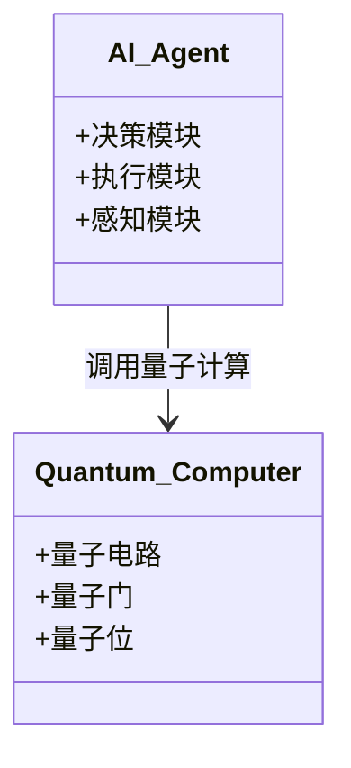
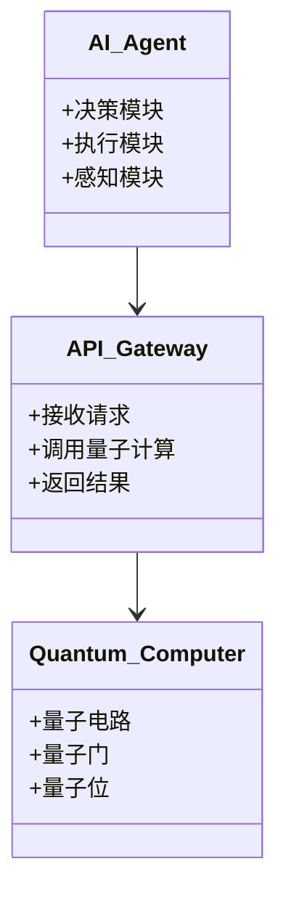
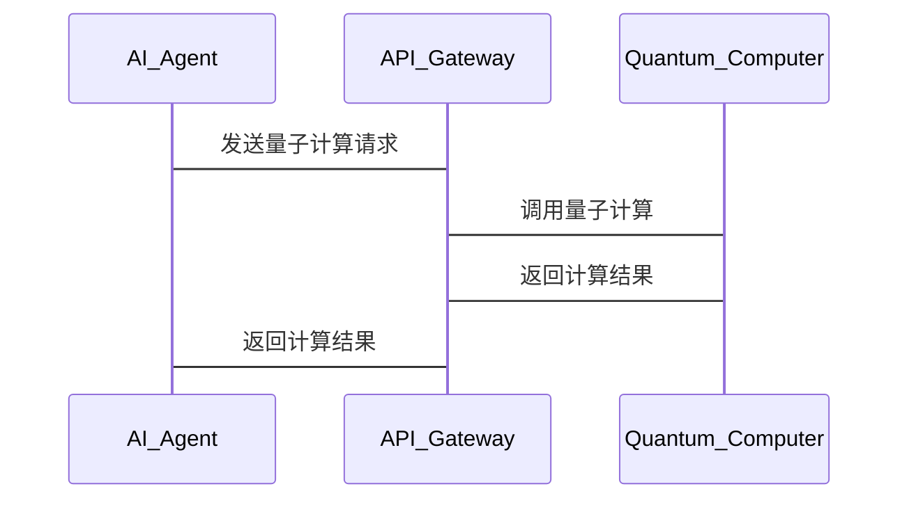

                 


# 企业AI Agent的量子计算应用

---

## 关键词
量子计算, AI Agent, 企业应用, 量子算法, 量子计算优化

---

## 摘要
本文探讨了企业AI Agent在量子计算领域的应用，从量子计算的基本原理到其在AI Agent中的具体应用，详细分析了量子计算如何提升AI Agent的性能和效率。文章内容涵盖量子计算的核心概念、AI Agent的基本功能、量子计算与AI Agent的协同工作流程，以及实际项目中的系统架构设计和代码实现。通过理论与实践相结合的方式，本文为读者提供了全面了解企业AI Agent量子计算应用的视角。

---

## 第1章: 企业AI Agent与量子计算的背景介绍

### 1.1 量子计算的基本概念

#### 1.1.1 量子计算的定义与特点
量子计算是一种基于量子力学原理的计算方式，与经典计算相比，其核心优势在于并行计算能力和处理复杂问题的效率。量子计算通过利用量子叠加和量子纠缠的特性，能够在某些特定问题上远超经典计算机的性能。

$$
\text{量子计算的核心特点包括：}
$$
- **量子叠加**: 状态可以同时存在于多个可能值的叠加态中。
- **量子纠缠**: 两个或多个量子位之间的强关联性，使得其中一个的状态能够直接影响另一个的状态。
- **并行计算能力**: 量子计算机可以在一次运算中处理大量可能性。

#### 1.1.2 量子计算的核心原理
量子计算的核心在于量子位（qubit）和量子门（quantum gate）。量子位是量子计算的基本单位，与经典计算机中的二进制位不同，量子位可以同时处于0和1的叠加态。量子门则是对量子位进行操作的基本单元，通过组合量子门可以构建复杂的量子电路。

$$
\text{常见的量子门包括：}
$$
- **H门（Hadamard门）**: 将量子位从基态叠加到左右两个状态。
- **X门（Pauli-X门）**: 将量子位翻转，0变为1，1变为0。
- **CNOT门（控制非门）**: 根据控制量子位的状态，对目标量子位进行操作。

#### 1.1.3 量子计算与经典计算的对比
经典计算机使用二进制位进行计算，每个位只能处于0或1的状态，而量子计算机则利用量子叠加和量子纠缠，能够在一次运算中处理大量状态。这种差异使得量子计算在某些特定问题上具有显著优势，例如大数分解、组合优化和密码破解等。

### 1.2 AI Agent的基本概念

#### 1.2.1 AI Agent的定义与类型
AI Agent（人工智能代理）是一种能够感知环境并采取行动以实现目标的智能体。根据功能和应用场景的不同，AI Agent可以分为多种类型，例如基于规则的AI Agent、基于模型的AI Agent和基于强化学习的AI Agent。

$$
\text{AI Agent的类型包括：}
$$
- **基于规则的AI Agent**: 通过预定义的规则和逻辑进行决策。
- **基于模型的AI Agent**: 使用环境模型进行规划和决策。
- **基于强化学习的AI Agent**: 通过与环境交互，学习最优策略以最大化奖励。

#### 1.2.2 AI Agent的核心功能与应用场景
AI Agent的核心功能包括感知环境、目标设定、决策制定和行动执行。其应用场景广泛，例如智能助手、推荐系统、自动驾驶和机器人控制等。

$$
\text{AI Agent的应用场景包括：}
$$
- **智能助手**: 如Siri、Alexa等，能够理解用户指令并执行相关操作。
- **推荐系统**: 基于用户行为和偏好，推荐个性化的内容或产品。
- **自动驾驶**: 通过感知环境和决策制定，实现自主驾驶。

#### 1.2.3 企业级AI Agent的特点
企业级AI Agent通常具有更高的复杂性和定制化需求，需要处理大量的数据和复杂的业务逻辑。与个人使用的AI Agent相比，企业级AI Agent更加注重安全性和可靠性，同时需要具备强大的计算能力和扩展性。

### 1.3 量子计算与AI Agent的结合

#### 1.3.1 量子计算在AI Agent中的潜在应用
量子计算在AI Agent中的潜在应用主要体现在以下几个方面：
- **优化算法**: 利用量子计算的优化能力，提高AI Agent的决策效率。
- **机器学习**: 量子计算可以加速某些机器学习算法的训练过程。
- **模式识别**: 利用量子计算的并行性，提高模式识别的准确性和效率。

#### 1.3.2 量子计算与AI Agent的协同工作原理
量子计算与AI Agent的协同工作原理可以简单地概括为：AI Agent利用量子计算的优化能力，提高其决策和执行效率；而量子计算则通过AI Agent的需求，找到最优解决方案。

$$
\text{量子计算与AI Agent的协同工作流程包括：}
$$
1. **需求分析**: AI Agent分析环境并确定需要量子计算解决的问题。
2. **量子计算处理**: 将问题转化为量子计算任务，并利用量子计算机进行计算。
3. **结果反馈**: 量子计算的结果返回给AI Agent，用于优化决策或执行操作。

#### 1.3.3 量子计算在企业AI Agent中的优势
量子计算在企业AI Agent中的优势主要体现在以下几个方面：
- **计算效率**: 量子计算在某些特定问题上的计算效率远高于经典计算。
- **决策优化**: 量子计算可以帮助AI Agent找到最优解决方案，提高决策质量。
- **扩展性**: 量子计算的并行性和扩展性使其能够处理更大规模和更复杂的问题。

### 1.4 本章小结
本章介绍了量子计算的基本概念和核心原理，分析了AI Agent的基本功能和应用场景，并探讨了量子计算在企业AI Agent中的潜在应用和协同工作原理。通过这些内容，读者可以初步了解量子计算与AI Agent结合的背景和基础。

---

## 第2章: 量子计算的核心原理与算法

### 2.1 量子位与量子门

#### 2.1.1 量子位的基本概念
量子位（qubit）是量子计算的基本单位，与经典计算机中的二进制位不同，量子位可以同时处于0和1的叠加态。量子位的状态可以用波函数表示，其形式为：

$$
\psi = \alpha|0\rangle + \beta|1\rangle
$$

其中，$\alpha$和$\beta$是概率幅，满足$|\alpha|^2 + |\beta|^2 = 1$。

#### 2.1.2 量子门的操作原理
量子门是量子计算的基本操作单元，通过作用于量子位可以实现对量子状态的变换。常见的量子门包括H门、X门和CNOT门。

#### 2.1.3 量子电路的构建与执行
量子电路由量子门和量子位组成，通过组合量子门可以构建复杂的量子算法。量子电路的执行过程可以通过量子计算机的硬件实现，例如超导电路或离子陷阱等。

### 2.2 量子算法的基本原理

#### 2.2.1 量子傅里叶变换
量子傅里叶变换（QFT）是一种在量子计算机上实现的快速傅里叶变换算法，能够在对数时间内完成傅里叶变换。QFT在量子算法中具有重要地位，例如在大数分解和模式识别中得到广泛应用。

#### 2.2.2 Grover算法
Grover算法是一种用于无序搜索问题的量子算法，能够在对数时间内找到无序列表中的目标项。与经典算法相比，Grover算法的效率显著提高。

#### 2.2.3 Shor算法
Shor算法是一种用于大数分解的量子算法，能够在多项式时间内分解大整数的质因数。Shor算法在密码学和数论中具有重要应用。

### 2.3 量子计算的数学模型

#### 2.3.1 量子态的数学表示
量子态可以用向量空间中的向量表示，例如二维量子态可以用一个二维列向量表示：

$$
|\psi\rangle = \begin{bmatrix} \alpha \\ \beta \end{bmatrix}
$$

其中，$\alpha$和$\beta$是量子态的幅度。

#### 2.3.2 量子门的矩阵表示
量子门可以通过矩阵表示，例如H门的矩阵表示为：

$$
H = \frac{1}{\sqrt{2}} \begin{bmatrix} 1 & 1 \\ 1 & -1 \end{bmatrix}
$$

#### 2.3.3 量子算法的数学推导
以Grover算法为例，其核心思想是利用量子叠加和量子干涉，将问题状态与非问题状态区分开来，从而在对数时间内找到目标项。

---

## 第3章: AI Agent的核心功能与量子计算的结合

### 3.1 AI Agent的定义与类型

#### 3.1.1 基于规则的AI Agent
基于规则的AI Agent通过预定义的规则和逻辑进行决策，适用于简单且确定性较高的任务。

#### 3.1.2 基于模型的AI Agent
基于模型的AI Agent通过构建环境模型进行规划和决策，适用于复杂且动态变化的任务。

#### 3.1.3 基于强化学习的AI Agent
基于强化学习的AI Agent通过与环境交互，学习最优策略以最大化奖励，适用于需要自主决策的任务。

### 3.2 量子计算在AI Agent中的应用

#### 3.2.1 量子计算在AI Agent决策过程中的应用
量子计算可以用于优化AI Agent的决策过程，例如在组合优化问题中，利用量子计算的优化能力提高决策效率。

#### 3.2.2 量子计算在AI Agent优化中的应用
量子计算可以用于优化AI Agent的性能，例如在参数调整和模型优化中，利用量子计算的并行性提高优化效率。

#### 3.2.3 量子计算在AI Agent学习中的应用
量子计算可以用于加速AI Agent的学习过程，例如在量子机器学习算法中，利用量子计算的并行性提高学习速度。

### 3.3 量子计算与AI Agent的协同工作流程

#### 3.3.1 数据输入与量子计算预处理
AI Agent将问题转化为量子计算任务，并将其输入量子计算机进行预处理。

#### 3.3.2 量子计算算法的执行
量子计算机执行预处理后的量子算法，返回结果。

#### 3.3.3 结果输出与AI Agent的响应
AI Agent根据量子计算的结果优化其决策或执行操作。

### 3.4 本章小结
本章详细介绍了AI Agent的基本功能和量子计算在AI Agent中的具体应用，分析了量子计算如何提升AI Agent的性能和效率。

---

## 第4章: 量子计算与AI Agent的协同优化

### 4.1 量子计算在AI Agent中的优化算法

#### 4.1.1 量子强化学习
量子强化学习是一种结合量子计算和强化学习的算法，通过量子叠加和量子纠缠提高强化学习的效率。

#### 4.1.2 量子模拟
量子模拟是一种利用量子计算模拟物理系统的方法，适用于复杂的模拟问题。

#### 4.1.3 量子优化
量子优化是一种利用量子计算优化组合问题的算法，适用于大规模优化问题。

### 4.2 量子计算与AI Agent的协同优化流程

#### 4.2.1 问题建模
将AI Agent的问题转化为量子计算任务，例如将优化问题转化为量子优化任务。

#### 4.2.2 量子算法设计
根据问题需求设计量子算法，例如设计量子强化学习算法。

#### 4.2.3 量子计算执行
量子计算机执行设计好的量子算法，返回结果。

#### 4.2.4 结果分析
AI Agent根据量子计算的结果进行分析和优化，例如调整策略或优化模型。

### 4.3 本章小结
本章分析了量子计算在AI Agent中的优化算法，探讨了量子计算与AI Agent的协同优化流程，为读者提供了量子计算在AI Agent中的具体应用方法。

---

## 第5章: 量子计算与AI Agent的系统架构设计

### 5.1 问题场景介绍
假设我们有一个企业级AI Agent，需要利用量子计算优化其决策过程。

### 5.2 系统功能设计

#### 5.2.1 领域模型
领域模型描述了AI Agent的业务领域和核心功能，例如决策优化、模式识别等。

$$
\text{领域模型的类图表示：}
$$


### 5.3 系统架构设计

#### 5.3.1 系统架构图


#### 5.3.2 系统接口设计
系统接口设计包括AI Agent与量子计算机之间的接口，例如API接口或消息队列。

#### 5.3.3 系统交互图


### 5.4 本章小结
本章通过实际案例分析了量子计算与AI Agent的系统架构设计，展示了如何将量子计算集成到企业级AI Agent中。

---

## 第6章: 量子计算与AI Agent的项目实战

### 6.1 项目环境安装

#### 6.1.1 量子计算框架安装
安装量子计算框架，例如Qiskit或Cirq。

#### 6.1.2 AI Agent框架安装
安装AI Agent框架，例如OpenAI或TensorFlow。

#### 6.1.3 系统依赖安装
安装系统运行所需的依赖项，例如Python库和量子计算库。

### 6.2 系统核心实现

#### 6.2.1 量子计算核心代码
实现量子计算的核心算法，例如Grover算法或Shor算法。

$$
\text{Grover算法的Python代码示例：}
$$

```python
from qiskit import QuantumCircuit, execute, Aer

def grover_algorithm():
    circuit = QuantumCircuit(2, 2)
    circuit.h(range(2))
    circuit.c古典r(0,1)
    circuit.s(1)
    circuit.c古典r(0,1)
    circuit.s(0)
    return circuit

circuit = grover_algorithm()
simulator = Aer.get_backend('qasm_simulator')
result = execute(circuit, simulator).result()
print(result.get_counts())
```

#### 6.2.2 AI Agent核心代码
实现AI Agent的核心功能，例如决策模块和执行模块。

$$
\text{AI Agent的Python代码示例：}
$$

```python
class AI_Agent:
    def __init__(self):
        self.decision_module = DecisionModule()
        self.execution_module = ExecutionModule()

    def perceive_environment(self):
        # 感知环境并获取输入
        pass

    def make_decision(self):
        # 调用决策模块进行决策
        pass

    def execute_action(self):
        # 调用执行模块执行操作
        pass
```

### 6.3 代码应用解读与分析
通过具体的代码示例，分析量子计算与AI Agent在项目中的实际应用，例如如何将量子计算结果整合到AI Agent的决策过程中。

### 6.4 实际案例分析
通过实际案例分析，展示量子计算与AI Agent在企业中的具体应用，例如在供应链优化中的应用。

### 6.5 项目小结
总结项目实现的过程和成果，分析量子计算在AI Agent中的实际应用效果。

---

## 第7章: 量子计算与AI Agent的总结与展望

### 7.1 本章总结
总结本文的主要内容，回顾量子计算与AI Agent的核心概念和协同工作原理。

### 7.2 未来展望
展望量子计算与AI Agent的未来发展，分析可能的研究方向和技术趋势。

### 7.3 最佳实践Tips
给出量子计算与AI Agent应用中的最佳实践建议，例如选择合适的量子计算框架和优化AI Agent的设计。

### 7.4 本章小结
本章总结了量子计算与AI Agent的主要内容，并展望了未来的研究方向和技术发展趋势。

---

## 作者信息

作者：AI天才研究院/AI Genius Institute & 禅与计算机程序设计艺术 /Zen And The Art of Computer Programming

---

通过以上章节的详细内容，读者可以全面了解企业AI Agent在量子计算中的应用，从理论到实践，从基础到高级，逐步掌握量子计算与AI Agent的核心概念和协同工作原理。

