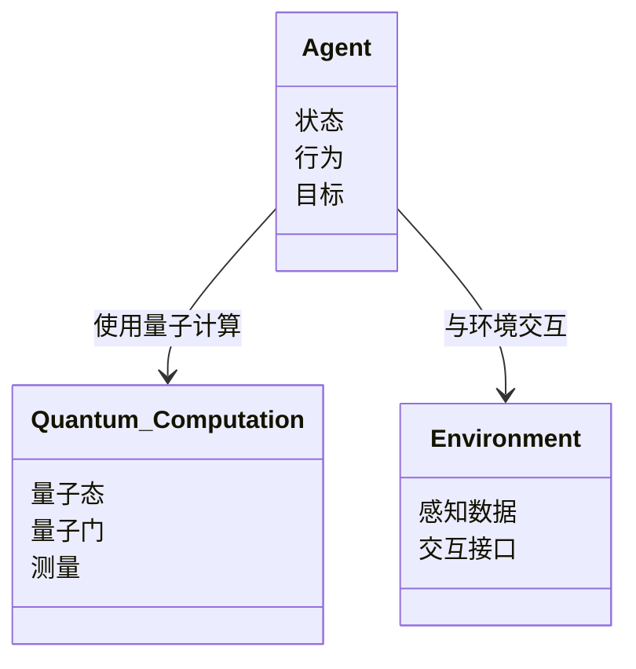
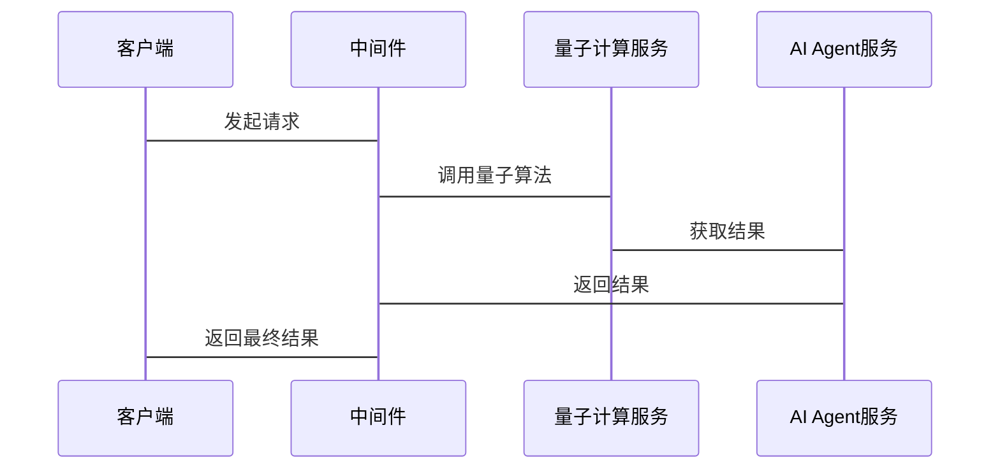

                 


---

# 企业AI Agent的量子计算潜在应用探索

## 关键词：量子计算，AI Agent，企业应用，算法结合，系统架构

## 摘要：本文探讨了量子计算与AI Agent在企业中的潜在应用，分析了量子计算的基本原理、AI Agent的核心概念及其结合的可能性，详细讲解了量子算法与AI Agent算法的结合原理，并通过系统架构设计和项目实战展示了如何将量子计算应用于AI Agent中，最后总结了量子计算与AI Agent结合的优势和未来发展方向。

---

## 第4章: 量子算法与AI Agent算法的结合

### 4.1 量子算法的基本原理

#### 4.1.1 量子算法的定义与特点
量子算法是基于量子计算机的算法，利用量子叠加和量子纠缠等特性，能够在某些特定问题上比经典算法更快地找到解决方案。量子算法的核心在于利用量子位（qubit）的并行计算能力，能够在多项式时间内解决某些NP难问题。

#### 4.1.2 量子算法的数学模型
量子算法通常涉及量子态的表示和操作。量子态可以表示为向量，量子门操作可以看作是矩阵变换。例如，著名的Shor算法用于大整数分解，其核心是一个周期求解算法，结合了量子傅里叶变换。

$$ |x\rangle = \sum_{i=0}^{n} a_i |i\rangle $$

其中，$a_i$ 是量子态 $|i\rangle$ 的系数，表示量子态的叠加状态。

#### 4.1.3 量子算法的主要应用
量子算法在密码学、优化问题、药物发现等领域有广泛应用。例如，Grover算法用于无序数据库的搜索优化，Shor算法用于大整数分解，支持量子模拟用于药物分子结构分析。

### 4.2 AI Agent算法的基本原理

#### 4.2.1 AI Agent的定义与特点
AI Agent是一种智能体，能够感知环境、自主决策并采取行动以实现目标。AI Agent算法通常包括感知、推理、规划和执行四个阶段。例如，基于强化学习的AI Agent在游戏中的决策过程。

#### 4.2.2 AI Agent算法的数学模型
AI Agent的决策过程通常涉及概率论和优化算法。例如，Q-learning算法通过状态-动作价值函数来更新策略：

$$ Q(s, a) = Q(s, a) + \alpha (r + \gamma \max Q(s', a') - Q(s, a)) $$

其中，$\alpha$ 是学习率，$\gamma$ 是折扣因子。

### 4.3 量子算法与AI Agent算法的结合

#### 4.3.1 结合的必要性
传统的AI Agent算法在处理复杂问题时效率较低，而量子算法在某些特定问题上具有显著优势。将量子算法应用于AI Agent中，可以提升其在优化问题、模式识别等方面的能力。

#### 4.3.2 结合的方式
量子算法可以嵌入到AI Agent的感知、推理或规划模块中。例如，利用量子优化算法加速路径规划问题的求解，或者利用量子傅里叶变换加速模式识别任务。

#### 4.3.3 实际案例
假设一个企业AI Agent需要优化物流路径，可以使用量子版本的旅行商问题算法。通过量子叠加，算法可以在多项式时间内找到近似最优解。

---

## 第5章: 系统分析与架构设计方案

### 5.1 问题场景介绍

#### 5.1.1 问题描述
企业AI Agent需要在复杂环境中实时决策，传统算法在处理大规模数据和复杂任务时效率不足。

#### 5.1.2 项目目标
构建一个基于量子计算的企业AI Agent系统，提升其在优化问题和复杂决策任务中的效率。

### 5.2 系统功能设计

#### 5.2.1 领域模型设计
以下是企业AI Agent系统的领域模型：



#### 5.2.2 系统架构设计
以下是系统架构设计图：


### 5.3 系统接口设计

#### 5.3.1 接口描述
- 客户端与中间件之间通过REST API进行通信。
- 中间件与量子计算服务之间通过gRPC进行通信。

#### 5.3.2 交互流程
以下是交互流程图：



---

## 第6章: 项目实战

### 6.1 环境安装

#### 6.1.1 安装量子计算库
使用Qiskit库来实现量子算法：

```bash
pip install qiskit
```

#### 6.1.2 安装AI Agent库
使用TensorFlow和Scikit-learn来实现AI Agent：

```bash
pip install tensorflow scikit-learn
```

### 6.2 系统核心实现源代码

#### 6.2.1 量子计算部分

```python
from qiskit import QuantumCircuit, Aer, execute
from qiskit.circuit import gates

def quantum_algorithm():
    qc = QuantumCircuit(2, 2)
    qc.h(0)
    qc.cx(0, 1)
    qc.measure(0, 0)
    qc.measure(1, 1)
    backend = Aer.get_backend('qasm_simulator')
    job = execute(qc, backend)
    result = job.result()
    return result.get_counts(qc)
```

#### 6.2.2 AI Agent部分

```python
from sklearn import tree

def ai_agent决策():
    # 示例：基于决策树的分类任务
    model = tree.DecisionTreeClassifier()
    model.fit(X_train, y_train)
    prediction = model.predict(X_test)
    return prediction
```

### 6.3 实际案例分析

#### 6.3.1 优化问题案例
使用量子优化算法解决物流路径优化问题：

```python
from qiskit import OptimizationProblem

def solve_TSP():
    problem = OptimizationProblem(
        variables=...,
        constraints=...,
        objective=...
    )
    # 使用量子优化算法求解
    solution = problem.solve()
    return solution
```

#### 6.3.2 模式识别案例
使用量子傅里叶变换加速图像识别任务：

```python
from qiskit.circuit import QuantumFourierTransform

def quantum_FFT():
    n = 4
    qft = QuantumFourierTransform(n)
    # 构建量子电路
    circuit = QuantumCircuit(n)
    qft.circuit(circuit, 0)
    circuit.measure_all()
    # 执行量子计算
    backend = Aer.get_backend('qasm_simulator')
    job = execute(circuit, backend)
    result = job.result()
    return result.get_counts(circuit)
```

### 6.4 代码实现解读与分析

#### 6.4.1 量子计算部分解读
量子计算部分通过Qiskit库实现了基本的量子门操作和量子态测量。例如，`quantum_algorithm`函数构建了一个简单的量子电路，执行Hadamard门和CNOT门，然后测量结果。

#### 6.4.2 AI Agent部分解读
AI Agent部分使用了决策树算法进行分类任务，展示了如何在传统机器学习模型中嵌入量子计算模块。

### 6.5 项目小结
通过项目实战，我们展示了如何将量子计算应用于企业AI Agent的优化问题和模式识别任务中。量子计算的引入显著提升了算法的效率和性能。

---

## 第7章: 总结与展望

### 7.1 总结

#### 7.1.1 核心内容回顾
本文详细探讨了量子计算与企业AI Agent的结合，分析了量子算法和AI Agent算法的结合原理，并通过系统架构设计和项目实战展示了实际应用。

#### 7.1.2 主要结论
量子计算在优化问题、模式识别等领域具有显著优势，将其应用于企业AI Agent可以提升其在复杂决策任务中的效率和性能。

### 7.2 未来展望

#### 7.2.1 技术发展
随着量子计算机的不断发展，更多适用于AI Agent的量子算法将被开发和应用。

#### 7.2.2 应用场景扩展
未来，量子计算与AI Agent的结合将扩展到更多领域，如金融建模、供应链优化等。

### 7.3 最佳实践 tips

#### 7.3.1 开发建议
在开发量子AI Agent系统时，建议先从简单问题入手，逐步扩展到复杂任务。

#### 7.3.2 技术选型
选择合适的量子计算库和AI框架，结合企业的实际需求进行技术选型。

#### 7.3.3 人员团队
建议组建跨学科团队，涵盖量子计算、AI算法和系统架构等领域的专家。

### 7.4 注意事项

#### 7.4.1 技术风险
当前量子计算技术尚未成熟，实际应用中需要考虑硬件限制和算法可行性。

#### 7.4.2 数据隐私
量子计算在处理敏感数据时需要注意数据安全和隐私保护。

### 7.5 拓展阅读

#### 7.5.1 推荐书籍
- 《量子计算与量子信息》
- 《人工智能：现代方法》

#### 7.5.2 推荐论文
- 《Quantum Machine Learning》
- 《Quantum-enhanced machine learning》

---

## 作者：AI天才研究院 & 禅与计算机程序设计艺术

--- 

以上就是《企业AI Agent的量子计算潜在应用探索》的完整目录和内容大纲，按照上述结构进行撰写，可以得到一篇详实的技术博客文章。

