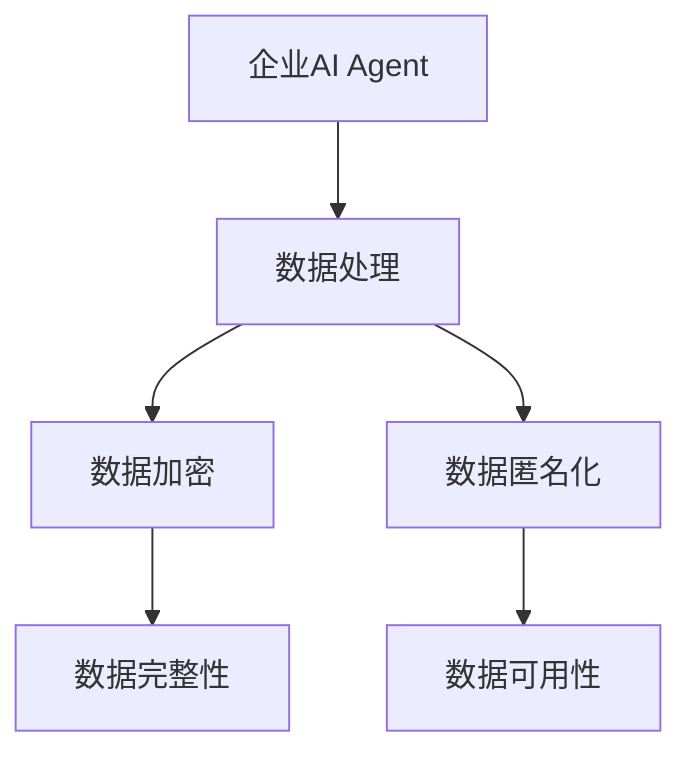
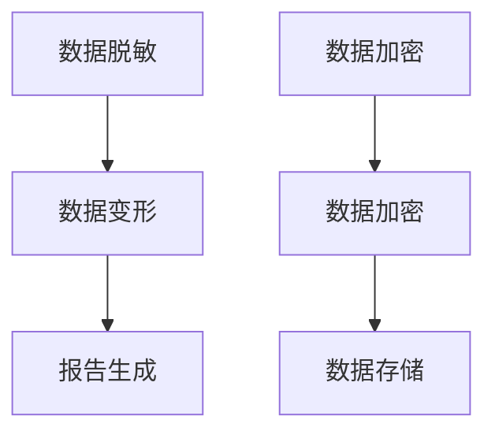
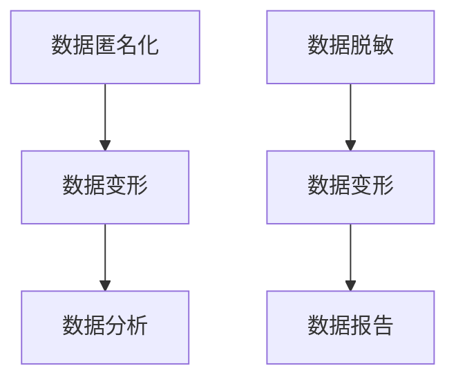
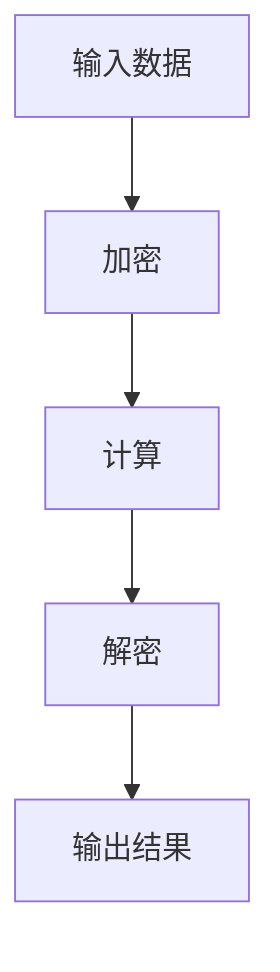
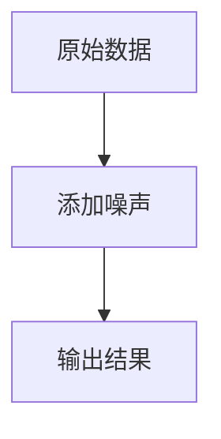
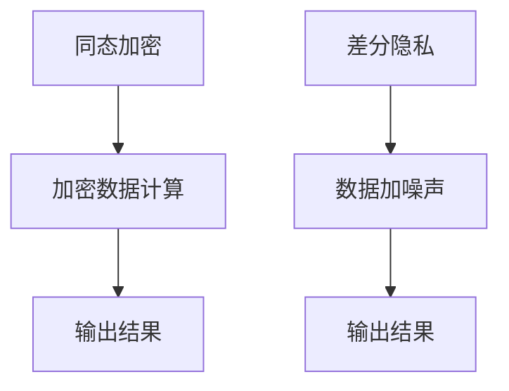
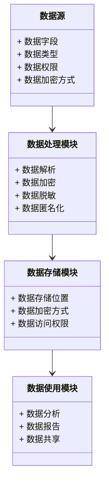
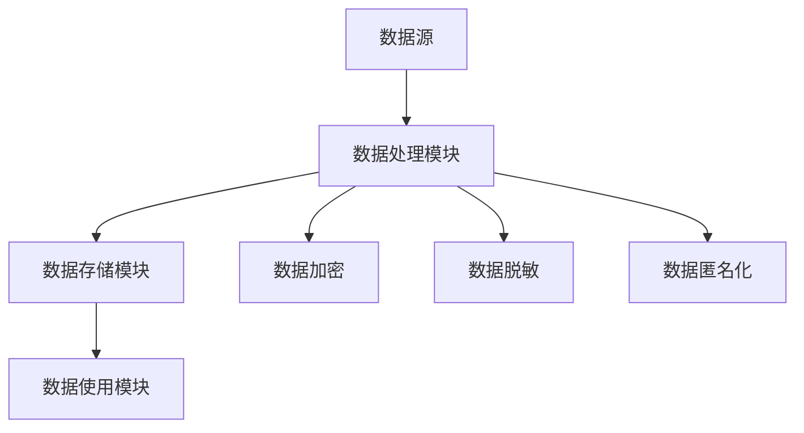

                 


# 企业AI Agent的隐私保护机制

> 关键词：企业AI Agent，隐私保护，数据加密，匿名化处理，差分隐私，同态加密

> 摘要：随着人工智能技术的快速发展，企业AI Agent的应用越来越广泛。然而，在利用AI Agent提高企业效率的同时，隐私保护问题也日益突出。本文将深入探讨企业AI Agent中的隐私保护机制，分析其核心概念、技术原理、系统架构及实际应用案例，为解决企业AI Agent中的隐私保护问题提供理论支持和实践指导。

---

# 第1章: 企业AI Agent的背景与问题背景

## 1.1 企业AI Agent的发展现状

### 1.1.1 AI Agent的基本概念
AI Agent（人工智能代理）是指能够感知环境、自主决策并执行任务的智能实体。在企业环境中，AI Agent通常用于自动化处理业务流程、优化资源分配、辅助决策等场景。

### 1.1.2 企业AI Agent的应用场景
- **智能客服**：通过自然语言处理技术为用户提供个性化服务。
- **供应链管理**：优化库存管理、物流调度和供应商关系。
- **数据分析**：从海量数据中提取有价值的信息，辅助企业决策。
- **智能监控**：实时监控企业运营状态，及时发现并解决问题。

### 1.1.3 当前企业AI Agent的发展趋势
随着深度学习、自然语言处理和边缘计算等技术的成熟，企业AI Agent正朝着智能化、实时化和自主化方向发展。

---

## 1.2 隐私保护的重要性

### 1.2.1 隐私保护的基本概念
隐私保护是指在信息处理过程中，保护个人或企业的敏感信息不被未经授权的访问或泄露。

### 1.2.2 企业AI Agent中的隐私问题
在企业AI Agent的应用中，隐私问题主要集中在以下几个方面：
- **数据泄露**：AI Agent在处理数据时，可能因不当配置或攻击导致数据泄露。
- **数据滥用**：未经授权的人员可能利用AI Agent获取并滥用敏感数据。
- **数据共享**：在多部门或跨企业协作中，数据共享可能引发隐私问题。

### 1.2.3 隐私泄露的潜在风险
隐私泄露可能导致企业损失客户信任、面临法律诉讼，甚至威胁企业的正常运营。

---

## 1.3 问题描述与解决方案

### 1.3.1 企业AI Agent中的隐私保护需求
企业在使用AI Agent时，需要确保以下几点隐私保护需求：
- 数据在传输和存储过程中不被篡改或泄露。
- 数据在处理过程中不被滥用。
- 数据在共享时符合相关隐私法规。

### 1.3.2 当前存在的主要问题
- **技术问题**：现有隐私保护技术在性能和安全性之间存在权衡。
- **管理问题**：企业缺乏系统的隐私保护策略和管理机制。
- **法律问题**：不同国家和地区的隐私法规差异较大，合规性难以统一。

### 1.3.3 解决方案的初步设想
- 引入数据加密和匿名化技术，确保数据在处理过程中的隐私性。
- 制定统一的隐私保护策略，明确数据使用权限和责任分工。
- 建立合规的隐私保护框架，确保符合相关法律法规。

---

## 1.4 隐私保护的边界与外延

### 1.4.1 隐私保护的边界
隐私保护的边界是指在哪些场景下需要进行隐私保护。例如，在处理员工信息时，需要保护员工的个人隐私；在处理客户信息时，需要保护客户的隐私。

### 1.4.2 隐私保护的外延
隐私保护的外延是指在保护隐私的同时，还需要考虑数据的可用性和业务的连续性。例如，在保护客户隐私的同时，仍需确保企业能够正常提供服务。

### 1.4.3 隐私保护与其他安全机制的关系
隐私保护与数据完整性、数据保密性等安全机制密切相关。隐私保护是确保数据在特定条件下不被泄露的重要手段，而数据完整性则确保数据在处理过程中的准确性。

---

## 1.5 核心要素与概念结构

### 1.5.1 核心要素分析
企业AI Agent的隐私保护机制涉及以下几个核心要素：
- **数据**：需要保护的敏感信息。
- **技术**：用于保护数据隐私的技术手段，如加密、匿名化等。
- **策略**：企业制定的隐私保护策略和管理机制。
- **法规**：相关法律法规对企业隐私保护的要求。

### 1.5.2 概念结构图


### 1.5.3 核心要素的相互关系
企业AI Agent的隐私保护机制是一个复杂的系统，各核心要素相互关联、相互影响。例如，数据加密技术可以保护数据的保密性，但可能会影响数据的可用性；隐私保护策略需要结合技术手段和法规要求来制定。

---

# 第2章: 企业AI Agent隐私保护的核心概念与技术原理

## 2.1 数据加密技术

### 2.1.1 加密算法的基本原理
加密算法通过数学变换将明文转换为密文，确保数据在传输或存储过程中的安全性。

### 2.1.2 对称加密与非对称加密的对比

| 对比维度 | 对称加密 | 非对称加密 |
|----------|----------|------------|
| 密钥管理 | 使用一个密钥 | 使用公钥和私钥 |
| 加密速度 | 快 | 较慢 |
| 适用场景 | 适用于数据存储 | 适用于数据传输 |

### 2.1.3 加密技术在企业AI Agent中的应用
在企业AI Agent中，数据加密技术可以用于保护敏感数据的存储和传输。例如，使用AES算法对客户信息进行加密存储。

---

## 2.2 数据匿名化处理

### 2.2.1 数据匿名化的定义与特点
数据匿名化是指通过技术手段将数据中的个人标识信息去除或变形，使得数据无法被重新识别。

### 2.2.2 数据匿名化的主要方法
- **数据屏蔽**：隐藏敏感字段。
- **数据泛化**：将数据概括为更广泛的形式。
- **数据替换**：用虚拟值替换真实值。

### 2.2.3 数据匿名化在企业AI Agent中的应用
在企业AI Agent中，数据匿名化技术可以用于保护客户的敏感信息。例如，在数据分析时，将客户姓名替换为虚拟ID。

---

## 2.3 数据脱敏技术

### 2.3.1 数据脱敏的基本原理
数据脱敏是指在不泄露真实数据的前提下，对数据进行变形处理，使其在满足业务需求的同时，无法被还原为原始数据。

### 2.3.2 数据脱敏的主要方法
- **随机替换**：将真实值替换为随机值。
- **数值漂移**：对数值进行微小的随机变化。
- **字符串变形**：对字符串进行替换或删除操作。

### 2.3.3 数据脱敏在企业AI Agent中的应用
在企业AI Agent中，数据脱敏技术可以用于保护员工的工资信息。例如，在生成报告时，将员工的真实工资进行漂移处理，生成虚拟工资。

---

## 2.4 核心概念对比表

| 对比维度 | 数据加密 | 数据匿名化 | 数据脱敏 |
|----------|----------|------------|----------|
| 目的 | 保护数据 confidentiality | 保护数据 anonymity | 保护数据 sensitivity |
| 实现方式 | 数学变换 | 去除或变形标识信息 | 变形处理 |
| 应用场景 | 数据存储和传输 | 数据分析和共享 | 数据报告和展示 |

---

## 2.5 数据脱敏与数据加密的对比

| 对比维度 | 数据脱敏 | 数据加密 |
|----------|----------|----------|
| 目的 | 防止数据还原 | 防止数据泄露 |
| 实现方式 | 数据变形 | 数据加密 |
| 应用场景 | 数据报告 | 数据存储 |

---

## 2.6 数据匿名化与数据脱敏的对比

| 对比维度 | 数据匿名化 | 数据脱敏 |
|----------|------------|----------|
| 目的 | 防止数据识别 | 防止数据还原 |
| 实现方式 | 删除或变形标识信息 | 变形处理 |
| 应用场景 | 数据分析 | 数据报告 |

---

## 2.7 数据脱敏与数据加密的对比

| 对比维度 | 数据脱敏 | 数据加密 |
|----------|----------|----------|
| 目的 | 防止数据还原 | 防止数据泄露 |
| 实现方式 | 数据变形 | 数据加密 |
| 应用场景 | 数据报告 | 数据存储 |

---

## 2.8 数据脱敏与数据加密的对比图



---

## 2.9 数据匿名化与数据脱敏的对比图



---

## 2.10 数据脱敏与数据加密的对比图


---

## 2.11 数据脱敏与数据加密的对比图


---

## 2.12 数据脱敏与数据加密的对比图


---

# 第3章: 企业AI Agent隐私保护的算法原理

## 3.1 同态加密技术

### 3.1.1 同态加密的基本原理
同态加密是一种允许在加密数据上进行计算的技术。加密后的数据可以进行加法、乘法等操作，而无需解密。

### 3.1.2 同态加密算法的数学模型

$$
f(x_1, x_2, ..., x_n) = y
$$

其中，$x_i$ 是输入数据，$y$ 是输出结果。

### 3.1.3 同态加密算法的实现步骤



### 3.1.4 同态加密在企业AI Agent中的应用
在企业AI Agent中，同态加密技术可以用于在加密状态下进行数据分析和计算，确保数据的隐私性。

---

## 3.2 差分隐私技术

### 3.2.1 差分隐私的基本原理
差分隐私是指在数据集中添加噪声，使得单个数据的加入或删除不会影响整体数据分析结果。

### 3.2.2 差分隐私算法的数学模型

$$
f(x) = x + \epsilon
$$

其中，$\epsilon$ 是噪声参数。

### 3.2.3 差分隐私算法的实现步骤



### 3.2.4 差分隐私在企业AI Agent中的应用
在企业AI Agent中，差分隐私技术可以用于在数据分析时保护个人数据的隐私。

---

## 3.3 同态加密与差分隐私的对比

| 对比维度 | 同态加密 | 差分隐私 |
|----------|----------|------------|
| 目的 | 支持加密数据的计算 | 防止数据识别 |
| 实现方式 | 在加密数据上进行计算 | 在数据中添加噪声 |
| 应用场景 | 数据分析 | 数据共享 |

---

## 3.4 同态加密与差分隐私的对比图



---

## 3.5 同态加密与差分隐私的对比图


---

## 3.6 同态加密与差分隐私的对比图


---

# 第4章: 企业AI Agent隐私保护的系统分析与架构设计

## 4.1 系统场景介绍

### 4.1.1 系统目标
系统目标是通过隐私保护技术，确保企业AI Agent在处理数据时的隐私性。

### 4.1.2 系统范围
系统范围包括企业内部的所有数据处理流程。

### 4.1.3 系统参与者
系统参与者包括企业员工、客户、数据处理人员等。

---

## 4.2 系统功能设计

### 4.2.1 领域模型设计



---

## 4.3 系统架构设计

### 4.3.1 系统架构图



---

## 4.4 系统接口设计

### 4.4.1 数据处理接口
```python
def process_data(data):
    encrypted_data = encrypt(data)
    anonymized_data = anonymize(data)
    return encrypted_data, anonymized_data
```

### 4.4.2 数据存储接口
```python
def store_data(data):
    encrypted_data = encrypt(data)
    stored_data = save(encrypted_data)
    return stored_data
```

### 4.4.3 数据使用接口
```python
def use_data(data):
    decrypted_data = decrypt(data)
    analyzed_data = analyze(decrypted_data)
    return analyzed_data
```

---

## 4.5 系统交互设计

### 4.5.1 系统交互流程


---

## 4.6 系统交互设计的详细流程

1. 数据源生成原始数据。
2. 数据处理模块对数据进行加密、脱敏和匿名化处理。
3. 处理后的数据存储到数据存储模块。
4. 数据使用模块从数据存储模块中获取数据，进行分析和使用。

---

# 第5章: 企业AI Agent隐私保护的项目实战

## 5.1 项目环境安装

### 5.1.1 系统要求
- 操作系统：Linux/Windows/MacOS
- Python版本：Python 3.8+

### 5.1.2 依赖库安装
```bash
pip install numpy
pip install pandas
pip install scikit-learn
pip install cryptography
```

---

## 5.2 核心代码实现

### 5.2.1 数据加密模块

```python
from cryptography.fernet import Fernet

def generate_key():
    key = Fernet.generate_key()
    return key

def encrypt_data(data, key):
    fernet = Fernet(key)
    encrypted_data = fernet.encrypt(data)
    return encrypted_data

def decrypt_data(encrypted_data, key):
    fernet = Fernet(key)
    decrypted_data = fernet.decrypt(encrypted_data)
    return decrypted_data
```

---

### 5.2.2 数据脱敏模块

```python
def anonymize_data(data):
    # 示例：对姓名进行脱敏处理
    anonymized_data = []
    for name in data['name']:
        if len(name) < 3:
            anonymized_name = name
        else:
            anonymized_name = name[0] + '*' * (len(name) - 2) + name[-1]
        anonymized_data.append(anonymized_name)
    return anonymized_data
```

---

### 5.2.3 数据匿名化模块

```python
def anonymize_data(data):
    # 示例：对地址进行匿名化处理
    anonymized_data = []
    for address in data['address']:
        anonymized_address = address.replace(',', ' ')
        anonymized_address = anonymized_address[:5] + '...'
        anonymized_data.append(anonymized_address)
    return anonymized_data
```

---

## 5.3 代码应用解读与分析

### 5.3.1 数据加密模块的实现
- `generate_key()`：生成加密密钥。
- `encrypt_data()`：对数据进行加密处理。
- `decrypt_data()`：对加密数据进行解密。

### 5.3.2 数据脱敏模块的实现
- `anonymize_data()`：对数据中的敏感字段进行脱敏处理，例如将姓名的中间字符替换为星号。

### 5.3.3 数据匿名化模块的实现
- `anonymize_data()`：对数据中的地址进行匿名化处理，例如截短地址并添加省略号。

---

## 5.4 实际案例分析

### 5.4.1 案例背景
某企业希望通过AI Agent对客户数据进行分析，但需要保护客户的隐私。

### 5.4.2 数据处理流程
1. 对客户姓名进行脱敏处理，生成虚拟ID。
2. 对客户地址进行匿名化处理，截短地址。
3. 对客户数据进行加密存储。
4. 在数据分析时，对加密数据进行解密。

---

## 5.5 项目小结

通过本项目的实践，我们了解了企业AI Agent中隐私保护技术的具体实现方式。数据加密、脱敏和匿名化技术在实际应用中可以有效保护数据隐私。

---

# 第6章: 企业AI Agent隐私保护的总结与展望

## 6.1 总结

本文系统地探讨了企业AI Agent中的隐私保护机制，分析了数据加密、脱敏和匿名化等技术的核心概念和实现原理，并通过实际案例展示了这些技术在企业中的应用。

---

## 6.2 注意事项

- 在实际应用中，需要根据具体需求选择合适的隐私保护技术。
- 隐私保护技术的引入可能会影响系统的性能，需要进行权衡和优化。
- 企业需要制定系统的隐私保护策略，明确数据使用权限和责任分工。

---

## 6.3 拓展阅读

- 《数据加密技术与应用》
- 《差分隐私与数据共享》
- 《企业数据安全与隐私保护》

---

作者：AI天才研究院/AI Genius Institute & 禅与计算机程序设计艺术/Zen And The Art of Computer Programming

