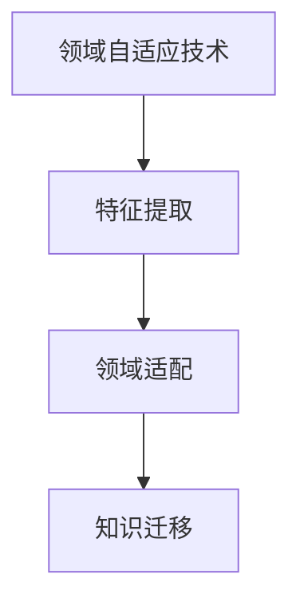
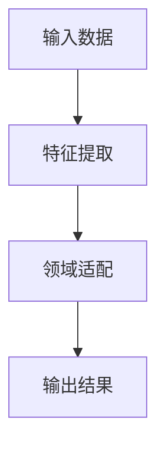
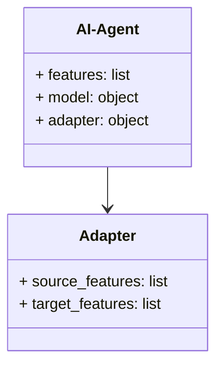
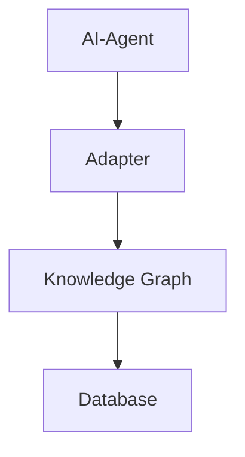

                 


# 企业AI Agent的领域自适应技术在跨行业知识迁移中的实践

> 关键词：企业AI Agent，领域自适应技术，跨行业知识迁移，机器学习，深度学习，知识图谱，数学模型

> 摘要：本文详细探讨了企业AI Agent在跨行业知识迁移中的领域自适应技术。通过分析跨行业知识迁移的挑战，介绍了领域自适应技术的核心概念与实现原理。结合具体的算法实现、系统架构设计和项目实战案例，深入剖析了领域自适应技术在不同行业中的应用实践。最后，总结了当前技术的优势与不足，并展望了未来的发展方向。

---

## 第1章：问题背景与核心概念

### 1.1 问题背景

#### 1.1.1 企业AI Agent的发展现状
企业AI Agent作为人工智能技术的重要应用形式，近年来得到了快速发展。随着企业智能化转型的推进，AI Agent在客服、供应链管理、智能推荐等领域展现出巨大的潜力。然而，AI Agent在跨行业应用中面临着知识迁移的难题。

#### 1.1.2 跨行业知识迁移的挑战
AI Agent的核心能力依赖于训练数据的质量和适用性。当AI Agent需要在不同行业间迁移时，由于各个行业的业务逻辑、数据格式和术语差异较大，传统的迁移学习方法往往难以有效适应新的领域。

#### 1.1.3 领域自适应技术的必要性
领域自适应技术通过调整模型参数或优化特征表示，使得AI Agent能够在不同领域间实现知识的有效迁移。这种技术是解决跨行业知识迁移问题的关键。

### 1.2 核心概念与问题描述

#### 1.2.1 领域自适应技术的定义
领域自适应技术是一种机器学习技术，旨在通过调整模型参数或优化特征表示，使得模型能够在目标领域中实现更好的性能。

#### 1.2.2 跨行业知识迁移的定义
跨行业知识迁移是指将一个领域的知识、模型或技术应用到另一个领域的过程中，通过调整和优化使其适应新领域需求的技术。

#### 1.2.3 问题解决的边界与外延
领域自适应技术的应用边界包括数据分布差异、领域特征差异等。外延则包括知识图谱构建、跨模态数据处理等。

#### 1.2.4 核心概念结构与组成要素
领域自适应技术的核心结构包括特征提取、领域适配和知识迁移三个部分。

---

## 第2章：领域自适应技术的核心概念与联系

### 2.1 核心概念原理

#### 2.1.1 领域自适应技术的基本原理
领域自适应技术通过优化模型在源领域和目标领域的表现，实现跨领域的知识迁移。

#### 2.1.2 跨行业知识迁移的实现机制
跨行业知识迁移的实现机制包括特征提取、领域适配和知识蒸馏等步骤。

### 2.2 概念属性特征对比表格

| 技术 | 特征提取 | 领域适配 | 知识蒸馏 |
|------|----------|----------|----------|
| 定义 | 从数据中提取有用的特征 | 调整模型参数以适应目标领域 | 通过教师模型向学生模型传递知识 |

### 2.3 ER实体关系图



---

## 第3章：算法原理与实现

### 3.1 算法原理

#### 3.1.1 对比学习算法
对比学习通过最大化源领域和目标领域的相似性，实现领域间的知识迁移。

#### 3.1.2 领域适配网络
领域适配网络通过引入领域适配层，调整模型参数以适应目标领域。

#### 3.1.3 知识蒸馏技术
知识蒸馏通过教师模型向学生模型传递知识，实现跨领域的知识迁移。

### 3.2 算法实现

#### 使用 Mermaid 绘制的算法流程图



#### 使用 Python 实现的核心代码示例

```python
def contrastive_learning(x1, x2, temperature=0.1):
    # 计算相似性
    similarity = (x1 @ x2.T) / temperature
    # 计算损失
    loss = -torch.mean(torch.log(torch.softmax(similarity, dim=-1)))
    return loss
```

---

## 第4章：数学模型与公式

### 4.1 对比学习的数学模型

$$L = \lambda_1 L_{cls} + \lambda_2 L_{dis}$$

其中，$L_{cls}$ 是分类损失，$L_{dis}$ 是对比损失，$\lambda_1$ 和 $\lambda_2$ 是超参数。

### 4.2 领域适配网络的公式

$$f(x) = \sigma(Wx + b)$$

其中，$\sigma$ 是sigmoid函数，$W$ 和 $b$ 是模型参数。

---

## 第5章：系统分析与架构设计

### 5.1 问题场景介绍

AI Agent需要在金融和医疗领域之间进行知识迁移，目标是将金融领域的客户行为分析模型迁移到医疗领域。

### 5.2 系统功能设计

#### 使用 Mermaid 绘制的领域模型类图



### 5.3 系统架构设计

#### 使用 Mermaid 绘制的系统架构图



---

## 第6章：项目实战

### 6.1 环境安装与配置

安装必要的Python库：

```bash
pip install numpy torch pandas
```

### 6.2 核心代码实现

#### 对比学习实现

```python
import torch

def contrastive_learning(x1, x2, temperature=0.1):
    similarity = (x1 @ x2.T) / temperature
    loss = -torch.mean(torch.log(torch.softmax(similarity, dim=-1)))
    return loss
```

#### 领域适配网络实现

```python
class Adapter(nn.Module):
    def __init__(self, input_dim, output_dim):
        super(Adapter, self).__init__()
        self.adapter_layer = nn.Linear(input_dim, output_dim)
    
    def forward(self, x):
        return self.adapter_layer(x)
```

---

## 第7章：总结与展望

### 7.1 总结

本文详细探讨了企业AI Agent的领域自适应技术在跨行业知识迁移中的实践。通过理论分析、算法实现和项目实战，展示了如何在不同行业间实现有效的知识迁移。

### 7.2 未来展望

未来，领域自适应技术将朝着更加通用化和自动化方向发展，同时在多模态数据处理和知识图谱构建方面有更大的潜力。

### 7.3 最佳实践 Tips

- 在实际应用中，建议先进行小规模测试，再逐步扩展到全规模应用。
- 注意保护数据隐私，确保数据安全。
- 定期更新模型参数，以应对领域变化。

---

作者：AI天才研究院/AI Genius Institute & 禅与计算机程序设计艺术 /Zen And The Art of Computer Programming

