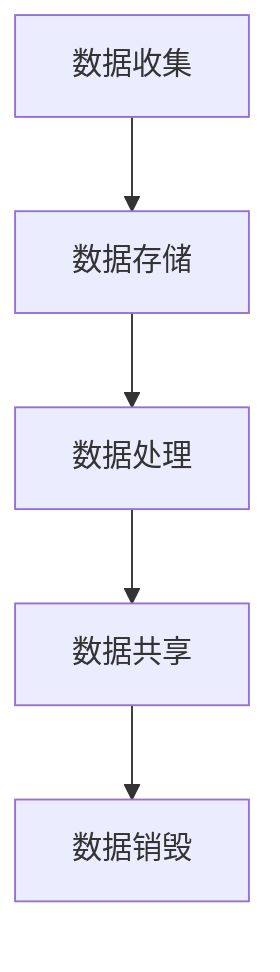
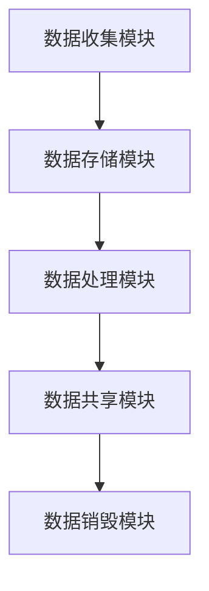
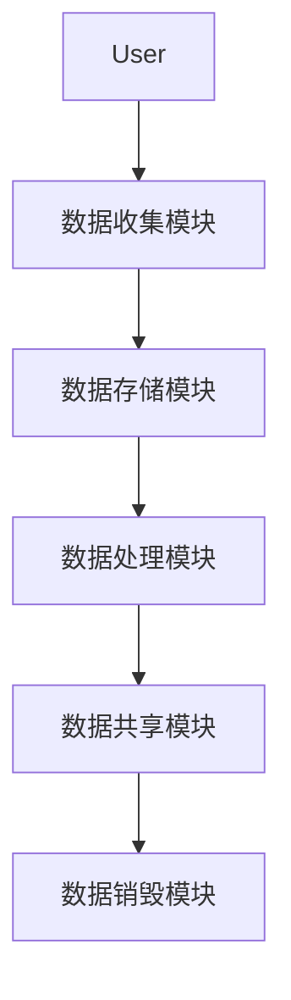

                 


# 企业AI数据安全：从收集到销毁的全生命周期管理

## 关键词：企业AI数据安全，数据全生命周期管理，数据收集，数据存储，数据销毁，安全算法，系统架构

## 摘要：本文详细探讨了企业在AI数据处理过程中，从数据收集到销毁的全生命周期安全管理。通过分析各阶段的安全要点，结合实际案例和系统架构设计，提出了有效的数据安全策略和管理方法。文章结构清晰，内容涵盖背景介绍、核心概念、算法原理、系统架构、项目实战及最佳实践，为企业的数据安全管理提供了全面的指导。

---

# 第1章: 企业AI数据安全概述

## 1.1 数据安全的重要性

### 1.1.1 数据在企业中的价值

数据是企业的核心资产，尤其是在AI驱动的时代，数据的质量和完整性直接影响企业的决策和竞争力。数据能够为企业提供洞察，优化业务流程，提升客户体验，甚至推动产品创新。例如，零售企业通过分析客户购买数据，可以精准推荐产品，提高销售转化率。

### 1.1.2 数据安全对企业的影响

数据的安全性直接关系到企业的声誉和法律责任。数据泄露可能导致客户信任的丧失、巨额罚款，甚至法律诉讼。特别是在AI应用中，数据的处理过程更为复杂，涉及大量敏感信息，如客户隐私、商业机密等。一旦这些数据被非法获取或篡改，将对企业造成不可估量的损失。

### 1.1.3 数据安全的法律与道德责任

随着《数据安全法》和《个人信息保护法》等法规的出台，企业对数据安全的合规性要求不断提高。企业不仅需要确保数据在处理过程中的安全性，还需要承担保护用户隐私的道德责任。数据泄露事件往往会导致公众信任度下降，对企业长期发展造成负面影响。

---

## 1.2 AI与数据安全的结合

### 1.2.1 AI技术对数据处理的影响

AI技术通过机器学习算法，能够从海量数据中提取有价值的信息，优化数据处理效率。例如，自然语言处理技术可以自动分类和分析文本数据，提高数据处理的智能化水平。然而，AI算法本身也可能成为数据泄露的潜在风险点，尤其是在训练数据时，如果不进行适当的隐私保护，可能会泄露敏感信息。

### 1.2.2 数据安全在AI应用中的特殊性

AI应用通常涉及大量数据的收集、存储和处理，这使得数据在各个阶段都面临不同的安全威胁。例如，在数据收集阶段，可能面临数据被篡改或未授权访问的风险；在数据处理阶段，算法可能被攻击者利用进行模型投毒攻击；在数据存储阶段，数据可能被黑客窃取。

### 1.2.3 AI驱动的数据安全解决方案

AI技术也可以用于数据安全的防护。例如，利用机器学习算法实时监测网络流量，识别异常行为，预防数据泄露。此外，AI还可以用于数据加密、数据脱敏等技术，保护数据在传输和存储过程中的安全性。

---

## 1.3 数据全生命周期管理的概念

### 1.3.1 数据生命周期的定义

数据生命周期是指从数据的产生、收集、存储、处理、共享到销毁的整个过程。数据在生命周期的不同阶段，面临的安全威胁和管理要求也不同。例如，数据在收集阶段需要确保来源合法，存储阶段需要防止数据被篡改，处理阶段需要保护算法的公正性，共享阶段需要遵守数据共享协议，销毁阶段需要彻底清除数据，防止数据恢复。

### 1.3.2 数据全生命周期管理的必要性

在企业AI应用中，数据的全生命周期管理至关重要。通过规范数据在各个阶段的处理流程，可以有效降低数据泄露的风险，确保数据的完整性和机密性。此外，全生命周期管理还可以帮助企业满足数据合规要求，避免因数据管理不当而引发的法律问题。

### 1.3.3 数据全生命周期管理的边界与外延

数据全生命周期管理的边界包括数据的生成、收集、存储、处理、共享和销毁。外延则涉及数据的安全策略、风险管理、技术工具和人员培训等方面。企业需要从战略层面规划数据的全生命周期管理，确保各个阶段的安全要求得到充分落实。

---

## 1.4 本章小结

本章从数据安全的重要性、AI与数据安全的结合以及数据全生命周期管理的概念三个方面进行了详细阐述。数据作为企业的核心资产，其安全性直接影响企业的声誉和合规性。AI技术的应用虽然提升了数据处理的效率，但也带来了新的安全挑战。数据全生命周期管理是确保数据安全的重要手段，企业需要从战略层面规划数据的全生命周期管理，确保数据在各个阶段的安全性。

---

# 第2章: 数据全生命周期管理的核心概念

## 2.1 数据生命周期各阶段的安全要点

### 2.1.1 数据收集阶段的安全要求

数据收集阶段需要确保数据来源合法、准确和完整。企业应制定明确的数据收集策略，明确收集的数据类型、范围和用途。同时，数据收集时需要采取加密传输和访问控制等措施，防止数据在收集过程中被篡改或未授权访问。例如，使用HTTPS协议传输数据，设置访问权限控制，确保只有授权人员可以访问数据。

### 2.1.2 数据存储阶段的安全措施

数据存储阶段需要确保数据的完整性和机密性。企业应选择安全的存储介质和存储环境，采用加密存储技术，如AES加密算法，保护数据不被未经授权的访问。此外，还需要定期备份数据，确保在数据丢失或损坏时能够快速恢复。例如，使用云存储服务时，应选择支持加密存储的服务提供商，并定期进行数据备份。

### 2.1.3 数据处理阶段的安全原则

数据处理阶段需要确保数据处理的合法性和透明性。企业在处理数据时，应遵循数据最小化原则，只处理必要的数据，并采取数据脱敏技术，保护敏感信息。例如，在处理客户个人信息时，可以使用哈希函数对数据进行脱敏处理，确保数据在处理过程中不会泄露原始信息。

### 2.1.4 数据共享阶段的安全保障

数据共享阶段需要确保数据共享的安全性和合规性。企业应制定数据共享策略，明确数据共享的范围、方式和授权。同时，还需要采取数据匿名化技术，保护数据在共享过程中的隐私。例如，在共享客户数据时，可以使用联邦学习技术，在不共享原始数据的情况下进行模型训练。

### 2.1.5 数据销毁阶段的安全规范

数据销毁阶段需要确保数据的彻底清除，防止数据被恢复或滥用。企业应制定数据销毁策略，明确销毁的数据范围和销毁方式。对于物理介质存储的数据，应进行物理销毁，如粉碎或消磁；对于电子数据，应使用加密擦除技术，确保数据无法被恢复。

---

## 2.2 数据生命周期与安全的关系

### 2.2.1 数据生命周期各阶段的安全风险分析

数据在生命周期的每个阶段都面临不同的安全风险。例如，在数据收集阶段，可能面临数据被篡改或未授权访问的风险；在数据存储阶段，可能面临数据被黑客攻击的风险；在数据处理阶段，可能面临算法被攻击的风险；在数据共享阶段，可能面临数据被滥用的风险；在数据销毁阶段，可能面临数据未彻底清除的风险。

### 2.2.2 数据生命周期与安全的相互作用

数据生命周期的每个阶段都需要与安全策略相结合，才能确保数据的安全性。例如，在数据收集阶段，需要采取加密传输和访问控制措施；在数据存储阶段，需要采用加密存储和定期备份措施；在数据处理阶段，需要采取数据脱敏和算法保护措施；在数据共享阶段，需要采取数据匿名化和访问控制措施；在数据销毁阶段，需要采取加密擦除和物理销毁措施。

### 2.2.3 数据生命周期

以下是数据生命周期的流程图：



---

## 2.3 数据生命周期管理的核心要素

### 2.3.1 数据生命周期管理的四个阶段

数据生命周期管理通常分为四个阶段：收集、存储、处理和销毁。

1. **收集阶段**：明确数据收集的范围和方式，确保数据来源合法。
2. **存储阶段**：采用安全的存储技术，保护数据的完整性和机密性。
3. **处理阶段**：遵循数据处理原则，确保数据处理的合法性和透明性。
4. **销毁阶段**：制定数据销毁策略，确保数据的彻底清除。

### 2.3.2 数据生命周期管理的实施步骤

1. **制定数据管理策略**：明确数据管理的目标、范围和责任分工。
2. **建立数据管理系统**：采用技术手段实现数据的全生命周期管理，如使用数据管理系统进行数据分类和标签化管理。
3. **实施数据安全措施**：在数据的每个阶段采取相应的安全措施，如加密、访问控制、数据脱敏等。
4. **监控与审计**：定期监控数据管理系统，记录数据操作日志，进行安全审计，及时发现和处理安全问题。

---

## 2.4 本章小结

本章详细探讨了数据生命周期各阶段的安全要点，分析了数据生命周期与安全的相互作用，并提出了数据生命周期管理的核心要素和实施步骤。数据的全生命周期管理是企业数据安全管理的重要手段，企业需要从战略层面规划数据的全生命周期管理，确保数据在每个阶段的安全性。

---

# 第3章: 数据全生命周期管理的核心技术

## 3.1 数据收集阶段的技术挑战

### 3.1.1 数据收集的合法合规性

在数据收集阶段，企业需要确保收集的数据符合相关法律法规的要求。例如，GDPR要求企业在收集个人数据时，必须获得数据主体的明确同意，并告知数据收集的目的和范围。此外，企业还需要制定数据收集策略，明确数据收集的范围、方式和用途，确保数据收集的合法性和透明性。

### 3.1.2 数据收集的安全措施

为了确保数据收集的安全性，企业可以采取以下措施：

1. **加密传输**：使用HTTPS协议传输数据，防止数据在传输过程中被篡改或窃取。
2. **访问控制**：设置访问权限，确保只有授权人员可以访问数据。
3. **数据脱敏**：在数据收集阶段，可以对敏感数据进行脱敏处理，例如使用哈希函数对密码进行哈希处理，防止数据在存储和处理过程中泄露原始信息。

---

## 3.2 数据存储阶段的技术挑战

### 3.2.1 数据存储的安全技术

在数据存储阶段，企业需要采取多种安全技术，确保数据的完整性和机密性。例如：

1. **加密存储**：使用AES加密算法对数据进行加密存储，防止数据被未经授权的访问。
2. **数据备份**：定期备份数据，确保在数据丢失或损坏时能够快速恢复。
3. **访问控制**：采用基于角色的访问控制（RBAC）技术，确保只有授权人员可以访问数据。

### 3.2.2 数据存储的合规性

企业需要确保数据存储符合相关法律法规的要求，例如GDPR要求企业在存储个人数据时，必须采取适当的技术措施，防止数据被未经授权的访问或泄露。此外，企业还需要记录数据存储的位置、访问权限和数据使用情况，确保数据存储的透明性和可追溯性。

---

## 3.3 数据处理阶段的技术挑战

### 3.3.1 数据处理的安全技术

在数据处理阶段，企业需要采取多种安全技术，确保数据处理的合法性和透明性。例如：

1. **数据脱敏**：对敏感数据进行脱敏处理，例如使用哈希函数对密码进行哈希处理，防止数据在处理过程中泄露原始信息。
2. **联邦学习**：在数据共享过程中，采用联邦学习技术，确保数据不离开原始存储位置，仅在本地进行模型训练，防止数据泄露。
3. **模型保护**：采用模型保护技术，防止模型被攻击者利用进行模型投毒攻击。

### 3.3.2 数据处理的合规性

企业需要确保数据处理符合相关法律法规的要求，例如GDPR要求企业在处理个人数据时，必须采取适当的技术措施，防止数据被滥用或泄露。此外，企业还需要记录数据处理的流程、目的和授权情况，确保数据处理的透明性和可追溯性。

---

## 3.4 数据销毁阶段的技术挑战

### 3.4.1 数据销毁的安全技术

在数据销毁阶段，企业需要采取多种安全技术，确保数据的彻底清除。例如：

1. **加密擦除**：对加密存储的数据进行加密擦除，防止数据被恢复。
2. **物理销毁**：对物理介质存储的数据进行物理销毁，例如使用碎纸机销毁纸质文件，或使用消磁设备销毁磁带。
3. **数据清空**：对电子设备中的数据进行清空操作，例如使用数据清除工具清空硬盘数据。

### 3.4.2 数据销毁的合规性

企业需要确保数据销毁符合相关法律法规的要求，例如GDPR要求企业在销毁个人数据时，必须采取适当的技术措施，确保数据无法被恢复或滥用。此外，企业还需要记录数据销毁的流程、日期和责任人，确保数据销毁的透明性和可追溯性。

---

## 3.5 数据生命周期管理的技术实施

### 3.5.1 数据生命周期管理的技术架构

以下是数据生命周期管理的技术架构图：


### 3.5.2 数据生命周期管理的关键技术

1. **加密技术**：用于数据的加密存储和传输，防止数据被未经授权的访问。
2. **访问控制**：用于数据的访问权限管理，确保只有授权人员可以访问数据。
3. **数据脱敏**：用于数据的隐私保护，防止敏感数据在处理过程中泄露原始信息。
4. **联邦学习**：用于数据共享过程中的隐私保护，确保数据不离开原始存储位置。
5. **模型保护**：用于防止模型被攻击者利用进行模型投毒攻击。

---

## 3.6 本章小结

本章详细探讨了数据全生命周期管理的核心技术，包括数据收集、存储、处理和销毁阶段的技术挑战和解决方案。企业需要采用多种安全技术，确保数据在每个阶段的安全性。同时，企业还需要遵守相关法律法规的要求，确保数据管理的合规性。

---

# 第4章: 数据全生命周期管理的系统架构设计

## 4.1 系统功能设计

### 4.1.1 数据收集功能

数据收集功能包括数据采集、数据验证和数据存储。数据采集模块负责从各种数据源（如数据库、API、文件等）采集数据；数据验证模块负责对采集的数据进行合法性验证，确保数据来源合法；数据存储模块负责将验证后的数据存储到数据库中。

### 4.1.2 数据存储功能

数据存储功能包括数据加密存储、数据备份和数据访问控制。数据加密存储模块负责对存储的数据进行加密，防止数据被未经授权的访问；数据备份模块负责定期备份数据，确保数据在丢失或损坏时能够快速恢复；数据访问控制模块负责管理数据的访问权限，确保只有授权人员可以访问数据。

### 4.1.3 数据处理功能

数据处理功能包括数据清洗、数据转换和数据分析。数据清洗模块负责对存储的数据进行清洗，去除重复数据和错误数据；数据转换模块负责将数据转换为适合分析的格式；数据分析模块负责对数据进行分析，生成分析结果。

### 4.1.4 数据共享功能

数据共享功能包括数据匿名化、数据加密共享和数据访问控制。数据匿名化模块负责对需要共享的数据进行匿名化处理，防止数据在共享过程中泄露敏感信息；数据加密共享模块负责对共享的数据进行加密传输，防止数据在传输过程中被篡改或窃取；数据访问控制模块负责管理数据的访问权限，确保只有授权人员可以访问数据。

### 4.1.5 数据销毁功能

数据销毁功能包括数据加密擦除和物理销毁。数据加密擦除模块负责对加密存储的数据进行擦除，防止数据被恢复；物理销毁模块负责对物理介质存储的数据进行销毁，例如使用碎纸机销毁纸质文件或使用消磁设备销毁磁带。

---

## 4.2 系统架构设计

### 4.2.1 系统架构设计图

以下是数据全生命周期管理系统的架构设计图：



### 4.2.2 系统组件设计

1. **数据收集模块**：负责从各种数据源采集数据，并对数据进行合法性验证。
2. **数据存储模块**：负责将验证后的数据存储到数据库中，并对数据进行加密存储和备份。
3. **数据处理模块**：负责对存储的数据进行清洗、转换和分析，生成分析结果。
4. **数据共享模块**：负责对分析结果进行匿名化处理，并通过加密传输的方式共享给授权用户。
5. **数据销毁模块**：负责对不再需要的数据进行加密擦除或物理销毁，确保数据无法被恢复。

---

## 4.3 系统接口设计

### 4.3.1 数据接口的设计

数据接口设计包括数据输入接口和数据输出接口。数据输入接口用于接收外部数据源的数据，例如数据库、API等；数据输出接口用于将处理后的数据输出给其他系统或用户。

### 4.3.2 接口协议设计

系统接口采用RESTful API设计，使用JSON格式进行数据传输。接口的安全性通过OAuth 2.0协议进行身份验证和权限管理，确保只有授权用户可以访问数据。

---

## 4.4 系统交互设计

### 4.4.1 系统交互流程图

以下是系统交互流程图：



### 4.4.2 交互设计说明

1. **数据收集阶段**：用户通过数据输入接口向数据收集模块提交数据，数据收集模块对数据进行合法性验证后，将数据存储到数据存储模块。
2. **数据存储阶段**：数据存储模块对数据进行加密存储和备份，确保数据的安全性和可靠性。
3. **数据处理阶段**：数据处理模块对存储的数据进行清洗、转换和分析，生成分析结果。
4. **数据共享阶段**：数据共享模块对分析结果进行匿名化处理，并通过加密传输的方式共享给授权用户。
5. **数据销毁阶段**：数据销毁模块对不再需要的数据进行加密擦除或物理销毁，确保数据无法被恢复。

---

## 4.5 本章小结

本章详细探讨了数据全生命周期管理的系统架构设计，包括系统功能设计、系统架构设计、系统接口设计和系统交互设计。企业需要根据自身的业务需求和技术能力，选择合适的系统架构和接口设计，确保数据在全生命周期中的安全性。

---

# 第5章: 数据全生命周期管理的项目实战

## 5.1 项目背景与目标

### 5.1.1 项目背景

某大型零售企业希望通过AI技术优化客户购买行为分析，提升客户满意度和销售额。然而，该企业面临数据泄露风险较高，数据处理流程不规范等问题。为了确保数据的安全性和合规性，该企业决定实施数据全生命周期管理系统。

### 5.1.2 项目目标

1. 实现数据的全生命周期管理，确保数据的安全性和合规性。
2. 提高数据处理效率，优化客户购买行为分析。
3. 建立数据安全文化，提升员工的数据安全意识。

---

## 5.2 项目实施环境

### 5.2.1 硬件环境

- 服务器：4台高性能服务器，用于存储和处理大量数据。
- 存储设备：采用分布式存储系统，确保数据的高可用性和容灾备份。
- 网络设备：采用企业级网络设备，确保数据传输的安全性和高效性。

### 5.2.2 软件环境

- 数据库：使用MySQL作为关系型数据库，存储结构化数据；使用Hadoop作为大数据平台，存储非结构化数据。
- 开发工具：采用PyCharm和Jupyter Notebook进行数据处理和分析。
- 人工智能框架：使用TensorFlow和Scikit-learn进行机器学习模型训练。

---

## 5.3 核心代码实现

### 5.3.1 数据收集模块

以下是数据收集模块的核心代码实现：

```python
import requests

def collect_data(url, params):
    try:
        response = requests.get(url, params=params)
        if response.status_code == 200:
            return response.json()
        else:
            raise Exception("数据收集失败，状态码：{}".format(response.status_code))
    except Exception as e:
        print("数据收集失败，错误：{}".format(str(e)))

# 示例调用
url = "https://api.example.com/data"
params = {"start_date": "2023-01-01", "end_date": "2023-12-31"}
data = collect_data(url, params)
print(data)
```

### 5.3.2 数据存储模块

以下是数据存储模块的核心代码实现：

```python
import sqlite3

def store_data(database, table, data):
    try:
        conn = sqlite3.connect(database)
        cursor = conn.cursor()
        columns = ", ".join(data.keys())
        values = ", ".join(["?" for _ in data.keys()])
        placeholders = ", ".join(["?" for _ in data.keys()])
        query = f"INSERT INTO {table} ({columns}) VALUES ({placeholders})"
        cursor.execute(query, data.values())
        conn.commit()
        return True
    except Exception as e:
        print("数据存储失败，错误：{}".format(str(e)))
        return False

# 示例调用
database = "data.db"
table = "customer_data"
data = {
    "id": 1,
    "name": "张三",
    "email": "zhangsan@example.com",
    "phone": "13812345678"
}
store_data(database, table, data)
print("数据存储成功")
```

---

## 5.4 数据处理模块

### 5.4.1 数据清洗与转换

以下是数据清洗与转换的代码实现：

```python
import pandas as pd

def clean_data(dataframe):
    # 删除重复数据
    dataframe.drop_duplicates(inplace=True)
    # 填补缺失值
    dataframe.fillna(method='ffill', inplace=True)
    return dataframe

# 示例调用
dataframe = pd.DataFrame({
    "id": [1, 2, 3, 4],
    "name": ["张三", "李四", "王五", "赵六"],
    "sales": [100, None, 200, 300]
})
clean_data(dataframe)
print(dataframe)
```

---

## 5.5 数据共享与销毁模块

### 5.5.1 数据共享模块

以下是数据共享模块的核心代码实现：

```python
import requests
from cryptography.hazmat.primitives import hashes
from cryptography.hazmat.primitives.asymmetric import padding

def share_data(recipient, data):
    try:
        # 数据匿名化处理
        public_key = get_public_key(recipient)
        encrypted_data = encrypt_data(data, public_key)
        # 数据加密传输
        response = requests.post("https://api.example.com/share", json={"data": encrypted_data})
        if response.status_code == 200:
            return True
        else:
            raise Exception("数据共享失败，状态码：{}".format(response.status_code))
    except Exception as e:
        print("数据共享失败，错误：{}".format(str(e)))
        return False

# 示例调用
recipient = "李四"
data = {"id": 1, "name": "张三", "sales": 100}
share_data(recipient, data)
print("数据共享成功")
```

### 5.5.2 数据销毁模块

以下是数据销毁模块的核心代码实现：

```python
import os

def destroy_data(file_path):
    try:
        os.remove(file_path)
        return True
    except Exception as e:
        print("数据销毁失败，错误：{}".format(str(e)))
        return False

# 示例调用
file_path = "data.csv"
destroy_data(file_path)
print("数据销毁成功")
```

---

## 5.6 项目总结

### 5.6.1 项目成果

通过实施数据全生命周期管理系统，该零售企业成功实现了数据的全生命周期管理，确保了数据的安全性和合规性。同时，数据处理效率显著提高，客户购买行为分析更加精准，客户满意度和销售额均有明显提升。

### 5.6.2 经验总结

1. **数据安全管理的重要性**：企业需要从战略层面规划数据的全生命周期管理，确保数据在每个阶段的安全性。
2. **技术工具的选择**：选择合适的技术工具和框架，能够有效提升数据处理效率和安全性。
3. **员工培训的重要性**：通过培训提高员工的数据安全意识，能够有效降低数据泄露的风险。

---

## 5.7 本章小结

本章通过一个实际的项目案例，详细探讨了数据全生命周期管理的实施过程，包括项目背景与目标、项目实施环境、核心代码实现和项目总结。通过本章的实践，读者可以更好地理解数据全生命周期管理在实际应用中的具体实施方法和注意事项。

---

# 第6章: 数据全生命周期管理的安全策略与最佳实践

## 6.1 数据安全策略

### 6.1.1 数据分类分级管理

企业应根据数据的重要性和敏感性，对数据进行分类分级管理。例如，将数据分为公开数据、内部数据和机密数据，分别制定不同的访问权限和安全措施。

### 6.1.2 数据访问控制

企业应采用基于角色的访问控制（RBAC）技术，确保只有授权人员可以访问特定的数据。例如，普通员工只能访问与其工作相关的数据，高级管理人员可以访问更多敏感数据。

### 6.1.3 数据加密与签名

企业应采用数据加密和数字签名技术，确保数据的完整性和真实性。例如，使用哈希函数对数据进行签名，确保数据在传输过程中未被篡改。

---

## 6.2 数据安全最佳实践

### 6.2.1 数据最小化原则

企业在处理数据时，应遵循数据最小化原则，只收集和处理必要的数据。例如，在客户注册页面，只收集必要的个人信息，如姓名、邮箱和电话，而不收集其他无关信息。

### 6.2.2 数据共享最小化原则

企业在共享数据时，应遵循数据共享最小化原则，仅共享必要的数据，并采用数据匿名化技术。例如，在共享客户购买数据时，可以使用联邦学习技术，在不共享原始数据的情况下进行模型训练。

### 6.2.3 定期安全审计

企业应定期进行安全审计，检查数据管理系统和安全措施的有效性，及时发现和处理安全漏洞。例如，每季度进行一次安全审计，确保数据管理系统符合相关法律法规的要求。

---

## 6.3 数据安全的注意事项

### 6.3.1 避免过度收集数据

企业在收集数据时，应避免过度收集数据，只收集必要的数据。例如，避免收集客户的生日、地址等非必要信息。

### 6.3.2 防止数据滥用

企业在处理数据时，应防止数据滥用，确保数据仅用于其预期的目的。例如，收集客户购买数据仅用于客户购买行为分析，而不用于其他目的。

### 6.3.3 加强数据安全培训

企业应加强员工的数据安全培训，提高员工的数据安全意识。例如，定期组织数据安全培训，确保员工了解数据安全的基本知识和操作规范。

---

## 6.4 本章小结

本章总结了数据全生命周期管理的安全策略和最佳实践，包括数据分类分级管理、数据访问控制、数据加密与签名等技术措施，以及数据最小化原则、数据共享最小化原则和定期安全审计等管理措施。企业需要结合自身的业务需求和技术能力，制定合适的数据安全策略，确保数据的全生命周期安全。

---

# 第7章: 数据全生命周期管理的未来趋势与挑战

## 7.1 数据全生命周期管理的未来趋势

### 7.1.1 数据安全技术的创新发展

随着技术的不断发展，数据安全技术将更加智能化和自动化。例如，人工智能和区块链技术将被广泛应用于数据安全领域，提高数据的安全性和可信度。

### 7.1.2 数据隐私保护的加强

随着法律法规的不断完善，数据隐私保护将更加严格。企业需要更加注重数据的隐私保护，采用更加先进的技术手段，确保数据在全生命周期中的隐私安全。

### 7.1.3 数据安全文化的建设

企业需要建立良好的数据安全文化，提高员工的数据安全意识。例如，通过定期的安全培训和模拟演练，增强员工的安全意识和应急处理能力。

---

## 7.2 数据全生命周期管理的挑战

### 7.2.1 数据安全技术的复杂性

数据安全技术的复杂性将增加企业的管理成本和技术难度。例如，采用区块链技术进行数据管理，需要企业具备较高的技术能力和资金投入。

### 7.2.2 数据隐私与商业利益的平衡

在数据隐私保护与商业利益之间找到平衡点是一个重要的挑战。企业需要在保护数据隐私的同时，最大化数据的商业价值。例如，通过数据脱敏和联邦学习技术，在保护数据隐私的前提下，进行数据共享和分析。

### 7.2.3 数据安全的全球化管理

随着全球化的发展，企业需要应对不同国家和地区的数据安全法规。例如，跨国企业需要遵守GDPR、CCPA等不同地区的数据保护法规，增加了数据管理的复杂性。

---

## 7.3 应对挑战的策略

### 7.3.1 加强技术创新

企业需要不断加强技术创新，采用先进的数据安全技术，提高数据的安全性和隐私保护能力。例如，采用AI和区块链技术进行数据安全防护，提高数据的安全性和可信度。

### 7.3.2 加强合规管理

企业需要加强合规管理，确保数据管理符合相关法律法规的要求。例如，制定数据管理策略，明确数据管理的目标、范围和责任分工，确保数据管理的合规性。

### 7.3.3 加强国际合作

企业需要加强国际合作，积极参与全球数据安全标准的制定和完善。例如，加入国际数据安全组织，与其他企业分享数据安全经验，共同应对数据安全挑战。

---

## 7.4 本章小结

本章探讨了数据全生命周期管理的未来趋势和挑战，包括数据安全技术的创新发展、数据隐私保护的加强和数据安全文化的建设等。同时，还分析了企业在数据全生命周期管理中面临的挑战，并提出了应对挑战的策略。未来，随着技术的发展和法规的完善，数据全生命周期管理将更加重要，企业需要不断创新和优化，确保数据的安全性和合规性。

---

# 作者：AI天才研究院/AI Genius Institute & 禅与计算机程序设计艺术 /Zen And The Art of Computer Programming

---

感谢您的阅读！希望本文能为您提供有价值的信息和启发，帮助您更好地理解和实施企业AI数据安全的全生命周期管理。

