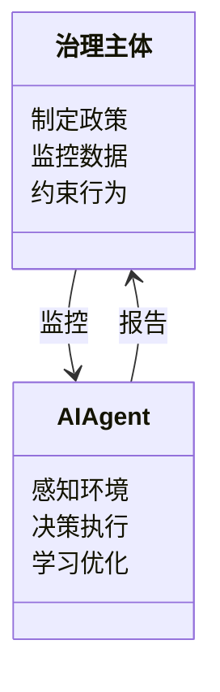
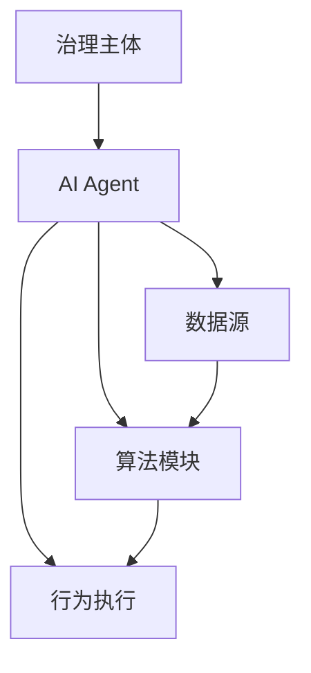
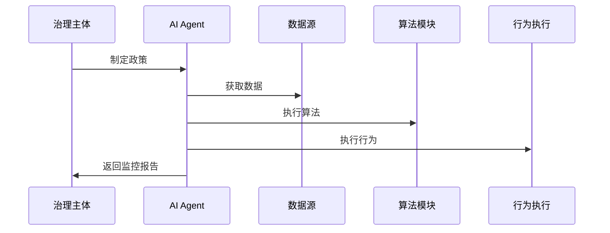

                 


# 企业AI治理框架：确保AI Agent的可控与合规

## 关键词：企业AI治理、AI Agent、可控合规、治理框架、人工智能技术

## 摘要：本文旨在探讨企业在AI Agent开发和应用过程中面临的治理挑战，提出一套系统化的治理框架，涵盖数据治理、算法治理和行为治理等核心领域，确保AI Agent的可控性和合规性。文章从概念、原理、系统架构到项目实战，全面解析企业AI治理的关键要素和实施策略，为企业在AI时代的可持续发展提供理论支持和实践指导。

---

## 第一章：企业AI治理框架的背景与目标

### 1.1 AI技术在企业中的应用背景

#### 1.1.1 人工智能技术的发展历程
人工智能技术自20世纪50年代以来，经历了从符号逻辑推理到机器学习、深度学习的演变，如今已广泛应用于各个行业，成为企业数字化转型的重要驱动力。

#### 1.1.2 AI在企业中的应用场景
AI技术在企业中的应用包括智能客服、精准营销、供应链优化、风险预测等领域，显著提升了企业的运营效率和决策能力。

#### 1.1.3 企业AI治理的必要性
随着AI技术的广泛应用，数据滥用、算法偏见、行为失控等问题频发，企业必须建立有效的治理机制，确保AI Agent的可控与合规。

### 1.2 企业AI治理的定义与目标

#### 1.2.1 什么是企业AI治理
企业AI治理是指企业在开发、部署和使用AI Agent的过程中，通过制定政策、监控行为和优化算法，确保AI技术的健康发展。

#### 1.2.2 企业AI治理的目标
企业AI治理的目标是实现AI Agent的可控性、合规性和透明性，避免潜在风险，提升企业的社会声誉和长期竞争力。

#### 1.2.3 治理与合规的关系
治理是合规的基础，合规是治理的保障。通过有效的治理框架，企业能够确保AI Agent的行为符合相关法律法规和伦理规范。

---

## 第二章：AI Agent的基本概念与核心要素

### 2.1 AI Agent的定义与分类

#### 2.1.1 AI Agent的定义
AI Agent是一种能够感知环境、自主决策并执行任务的智能实体，广泛应用于各个领域。

#### 2.1.2 基于任务的AI Agent分类
AI Agent可以根据任务类型分为分类任务型、回归任务型和生成任务型。

#### 2.1.3 基于智能水平的AI Agent分类
AI Agent可以分为基于规则的弱人工智能和基于深度学习的强人工智能。

### 2.2 AI Agent的核心要素

#### 2.2.1 数据驱动性
AI Agent的决策依赖于数据输入，数据的质量和多样性直接影响其性能。

#### 2.2.2 智能算法
AI Agent的核心在于算法，算法决定了其问题解决能力和决策水平。

#### 2.2.3 行为决策机制
AI Agent的行为决策机制是其区别于传统软件的关键，决定了其自主性和适应性。

---

## 第三章：企业AI治理框架的核心概念

### 3.1 治理框架的构成要素

#### 3.1.1 数据治理
数据治理是AI治理的基础，确保数据的合法性和合规性。

#### 3.1.2 算法治理
算法治理是AI治理的关键，确保算法的透明性和公平性。

#### 3.1.3 行为治理
行为治理是AI治理的重点，确保AI Agent的行为符合企业的价值观和法律法规。

### 3.2 治理框架的属性对比

#### 3.2.1 数据治理与算法治理的对比
| 属性       | 数据治理               | 算法治理               |
|------------|------------------------|------------------------|
| 目标       | 确保数据的合规性       | 确保算法的透明性       |
| 实施主体    | 数据管理部门           | 算法开发团队           |
| 方法论     | 数据清洗、加密技术     | 可解释性算法设计       |

#### 3.2.2 行为治理与数据治理的对比
| 属性       | 行为治理               | 数据治理               |
|------------|------------------------|------------------------|
| 目标       | 确保行为的可控性       | 确保数据的合规性       |
| 实施主体    | 行为监控团队           | 数据管理部门           |
| 方法论     | 监控日志、行为干预     | 数据清洗、访问控制     |

### 3.3 治理框架的ER实体关系图

```mermaid
er
  actor: 治理主体
  agent: AI Agent
  policy: 治理政策
  data: 数据
  action: 行为
  relation: 治理关系
  actor -[制定]-> policy
  policy -[约束]-> action
  actor -[监控]-> data
  data -[影响]-> agent
  agent -[执行]-> action
```

---

## 第四章：企业AI治理框架的算法原理

### 4.1 治理算法概述

#### 4.1.1 基于监督学习的治理算法
监督学习是一种常用的数据驱动治理方法，通过标注数据训练模型，预测AI Agent的行为是否合规。

#### 4.1.2 基于强化学习的治理算法
强化学习是一种通过奖励机制优化AI Agent行为的算法，适用于动态环境中的治理场景。

#### 4.1.3 基于无监督学习的治理算法
无监督学习是一种通过发现数据中的自然规律来实现治理的方法，适用于数据量大且复杂的场景。

### 4.2 算法原理的数学模型

#### 4.2.1 监督学习模型
$$ y = f(x) $$
其中，$x$ 是输入数据，$y$ 是输出结果，$f$ 是模型函数。

#### 4.2.2 强化学习模型
$$ Q(s, a) = r + \gamma \max_{a'} Q(s', a') $$
其中，$s$ 是状态，$a$ 是动作，$r$ 是奖励，$\gamma$ 是折扣因子。

---

## 第五章：企业AI治理框架的系统架构设计

### 5.1 项目场景介绍

#### 5.1.1 项目背景
企业希望通过AI Agent提升运营效率，但担心其行为失控，因此需要建立治理框架。

### 5.1.2 系统功能设计

#### 5.1.2.1 领域模型设计


#### 5.1.2.2 系统架构设计


#### 5.1.2.3 接口设计
| 接口名称   | 输入       | 输出       |
|------------|------------|------------|
| 制定政策   | 政策规则   | 政策生效   |
| 监控数据   | 数据流     | 监控报告   |
| 约束行为   | 行为日志   | 行为约束   |

#### 5.1.2.4 交互序列图


---

## 第六章：企业AI治理框架的项目实战

### 6.1 环境安装

#### 6.1.1 安装Python
```bash
python --version
pip install numpy scikit-learn
```

#### 6.1.2 安装依赖库
```bash
pip install mermaid-diagram
```

### 6.2 系统核心实现源代码

#### 6.2.1 数据治理代码
```python
def data_cleaning(data):
    # 数据清洗逻辑
    pass
```

#### 6.2.2 算法治理代码
```python
def algorithm_monitoring(model):
    # 算法监控逻辑
    pass
```

#### 6.2.3 行为治理代码
```python
def behavior_constraint(agent):
    # 行为约束逻辑
    pass
```

### 6.3 案例分析

#### 6.3.1 某电商平台的AI推荐系统
通过治理框架，确保推荐算法的透明性和推荐行为的合规性，提升用户体验和平台声誉。

---

## 第七章：总结与展望

### 7.1 本章小结
企业AI治理框架是确保AI Agent可控与合规的关键，涵盖数据、算法和行为三个核心领域，通过系统化的治理策略，实现企业的可持续发展。

### 7.2 最佳实践Tips

#### 7.2.1 数据治理
确保数据的合法性和合规性，建立数据安全和隐私保护机制。

#### 7.2.2 算法治理
采用可解释性算法，定期审查和优化算法模型。

#### 7.2.3 行为治理
建立行为监控机制，及时发现和纠正异常行为。

### 7.3 注意事项

#### 7.3.1 数据隐私
严格遵守数据隐私保护法规，避免数据泄露和滥用。

#### 7.3.2 算法偏见
定期检测和消除算法偏见，确保算法的公平性和透明性。

#### 7.3.3 行为失控
建立多层次的行为监控和干预机制，确保AI Agent的行为可控。

### 7.4 拓展阅读

#### 7.4.1 推荐书籍
《AI治理：从理论到实践》

#### 7.4.2 推荐博客
企业AI治理博客

---

## 作者：AI天才研究院/AI Genius Institute & 禅与计算机程序设计艺术 /Zen And The Art of Computer Programming

---

以上是《企业AI治理框架：确保AI Agent的可控与合规》的完整目录大纲和文章内容。文章从背景、概念、算法、系统架构到项目实战，全面解析了企业AI治理的关键要素和实施策略，为企业在AI时代的可持续发展提供了理论支持和实践指导。

