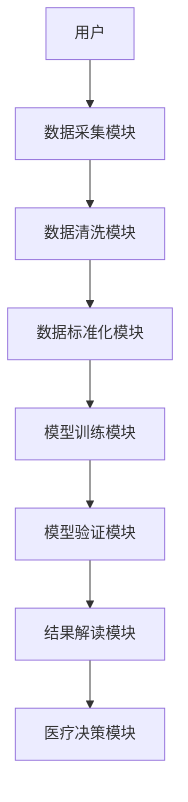
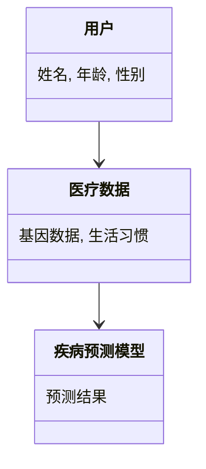
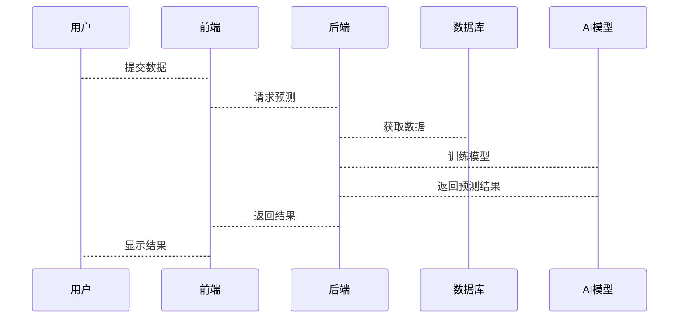

                 


# 企业估值中的AI驱动的个性化医疗平台评估

## 关键词
- 企业估值
- AI驱动
- 个性化医疗平台
- 数据驱动
- 机器学习
- 深度学习
- 医疗评估

## 摘要
随着人工智能技术的飞速发展，AI在医疗领域的应用越来越广泛，个性化医疗平台逐渐成为医疗评估的重要工具。本文将深入探讨AI驱动的个性化医疗平台在企业估值中的作用，分析其核心概念、算法原理和系统架构，并通过实际案例展示如何将这些技术应用于医疗评估。我们还将探讨系统设计、项目实战以及最佳实践，为企业估值中的AI驱动个性化医疗平台评估提供全面的解决方案。

---

# 第一部分: 个性化医疗平台评估背景与核心概念

## 第1章: 个性化医疗平台的定义与特点

### 1.1 个性化医疗的定义与核心要素

#### 1.1.1 个性化医疗的定义
个性化医疗是一种根据患者个体特征（如基因、生活方式、环境因素）提供定制化治疗方案的医疗模式。其核心在于通过精准的数据分析，为每位患者制定最优的治疗计划。

#### 1.1.2 个性化医疗的核心要素
个性化医疗的核心要素包括：
1. **患者数据**：包括基因数据、病史、生活习惯等。
2. **诊断工具**：如基因测序、影像识别等。
3. **治疗方案**：基于数据分析制定的个性化治疗计划。
4. **疗效预测**：通过模型预测治疗效果和风险。

#### 1.1.3 个性化医疗与传统医疗的区别
| 特性                | 个性化医疗                | 传统医疗                |
|---------------------|---------------------------|-------------------------|
| 数据依赖            | 高                        | 低                      |
| 治疗方案定制        | 高                        | 低                      |
| 诊断精准度          | 高                        | 一般                    |
| 成本                 | 较高                      | 较低                    |

---

### 1.2 AI驱动的医疗平台评估方法

#### 1.2.1 数据驱动的医疗评估模式
数据驱动的医疗评估模式通过收集和分析大量医疗数据，利用AI技术进行预测和决策。例如，通过机器学习模型预测患者的疾病风险。

#### 1.2.2 AI在医疗评估中的应用
1. **疾病预测**：利用AI算法预测患者的疾病风险。
2. **治疗方案推荐**：根据患者数据推荐个性化治疗方案。
3. **疗效预测**：预测治疗方案的疗效和副作用风险。

#### 1.2.3 个性化医疗平台的评估指标
个性化医疗平台的评估指标包括：
1. **准确性**：预测的准确率。
2. **召回率**：预测的召回率。
3. **F1分数**：综合准确率和召回率的指标。
4. **计算效率**：模型的运行效率。

---

## 第2章: 企业估值中的AI驱动个性化医疗平台

### 2.1 企业估值的基本概念

#### 2.1.1 企业估值的定义
企业估值是指对企业的整体价值进行评估，通常用于企业并购、融资等场景。

#### 2.1.2 企业估值的主要方法
1. **市场法**：基于市场可比企业的价值进行评估。
2. **收益法**：基于企业的未来收益进行评估。
3. **成本法**：基于企业的重置成本进行评估。

#### 2.1.3 企业估值的关键影响因素
1. **财务表现**：收入、利润、现金流等。
2. **市场地位**：市场份额、品牌影响力等。
3. **技术优势**：技术创新能力、专利数量等。
4. **管理团队**：管理团队的经验和能力。

---

### 2.2 AI驱动的个性化医疗平台对企业估值的影响

#### 2.2.1 个性化医疗平台的市场价值
个性化医疗平台可以通过提高治疗效果和患者满意度，增强企业的市场竞争力。

#### 2.2.2 个性化医疗平台的技术价值
个性化医疗平台的技术价值体现在其数据分析能力和AI算法的先进性。

#### 2.2.3 个性化医疗平台的竞争优势
个性化医疗平台可以通过提供定制化服务，形成差异化竞争优势。

---

### 2.3 个性化医疗平台的评估框架

#### 2.3.1 数据采集与处理
1. **数据采集**：收集患者的基因数据、病史、生活习惯等。
2. **数据清洗**：去除噪声数据，确保数据质量。
3. **数据标准化**：将数据标准化，以便模型处理。

#### 2.3.2 模型构建与验证
1. **模型选择**：选择合适的机器学习模型（如逻辑回归、随机森林）。
2. **模型训练**：利用训练数据训练模型。
3. **模型验证**：通过验证数据评估模型性能。

#### 2.3.3 评估结果的解读与应用
1. **结果解读**：根据模型输出结果，解读患者的疾病风险。
2. **结果应用**：根据预测结果制定个性化治疗方案。

---

# 第二部分: AI驱动个性化医疗平台评估的核心概念与联系

## 第3章: 核心概念与原理

### 3.1 AI驱动个性化医疗平台的原理

#### 3.1.1 数据驱动的医疗决策
数据驱动的医疗决策通过分析大量数据，帮助医生制定更精准的治疗方案。

#### 3.1.2 机器学习在医疗评估中的应用
机器学习在医疗评估中的应用包括疾病预测、治疗方案推荐等。

#### 3.1.3 深度学习在个性化医疗中的作用
深度学习通过处理非结构化数据（如图像、文本），提高医疗评估的准确性。

---

### 3.2 核心概念对比分析

#### 3.2.1 不同AI模型的特征对比
| 模型类型    | 优点                     | 缺点                     |
|-------------|--------------------------|--------------------------|
| 逻辑回归    | 简单、可解释性高          | 鲁棒性差                 |
| 随机森林    | 鲁棒性高、可解释性较好    | 对数据量要求较高          |
| 深度学习     | 高精度                   | 计算资源消耗大            |

#### 3.2.2 各种评估方法的优缺点
| 评估方法    | 优点                     | 缺点                     |
|-------------|--------------------------|--------------------------|
| 市场法       | 简单、快速                | 受市场波动影响较大        |
| 收益法       | 考虑未来收益              | 需要预测未来现金流          |
| 成本法       | 客观性高                  | 不考虑资产增值            |

#### 3.2.3 各种数据源的适用性分析
| 数据源       | 适用场景                 | 不适用场景               |
|--------------|--------------------------|--------------------------|
| 基因数据     | 疾病预测、个性化治疗       | 非遗传性疾病预测          |
| 病史数据     | 疾病预测、治疗方案推荐     | 数据不足时               |
| 生活习惯数据 | 疾病风险评估             | 数据准确性低时             |

---

### 3.3 实体关系图与流程图

#### 3.3.1 实体关系图（ER图）

```mermaid
erDiagram
    user {
        <属性> 姓名, 年龄, 性别, 病史
        <外键> 用户ID
    }
    医疗数据 {
        <属性> 基因数据, 生活习惯
        <外键> 用户ID
    }
    疾病预测模型 {
        <属性> 预测结果, 精确度
        <外键> 用户ID
    }
    用户关联到医疗数据
    医疗数据关联到疾病预测模型
```

---

#### 3.3.2 数据流图



---

## 第4章: 算法原理与实现

### 4.1 个性化医疗平台评估的算法选择

#### 4.1.1 机器学习算法的选择
根据数据类型和任务需求选择合适的机器学习算法，例如：
1. **分类任务**：逻辑回归、随机森林。
2. **回归任务**：线性回归、支持向量回归。

#### 4.1.2 深度学习算法的选择
深度学习算法适用于处理非结构化数据，例如：
1. **图像识别**：卷积神经网络（CNN）。
2. **文本处理**：循环神经网络（RNN）。

#### 4.1.3 算法性能评估指标
算法性能评估指标包括：
1. **准确率**：预测正确的比例。
2. **召回率**：预测出的正例占实际正例的比例。
3. **F1分数**：准确率和召回率的调和平均数。

---

### 4.2 算法实现与优化

#### 4.2.1 数据预处理

```python
import pandas as pd
import numpy as np

# 数据加载
data = pd.read_csv('medical_data.csv')

# 数据清洗
data.dropna()

# 数据标准化
from sklearn.preprocessing import StandardScaler
scaler = StandardScaler()
scaled_data = scaler.fit_transform(data[['age', 'weight', 'height']])
```

---

#### 4.2.2 模型训练与优化

```python
from sklearn.linear_model import LogisticRegression
from sklearn.metrics import accuracy_score

# 模型训练
model = LogisticRegression()
model.fit(X_train, y_train)

# 模型预测
y_pred = model.predict(X_test)

# 模型评估
print('准确率:', accuracy_score(y_test, y_pred))
```

---

#### 4.2.3 算法优化

```python
from sklearn.model_selection import GridSearchCV

# 参数搜索
param_grid = {'C': [0.1, 1, 10], 'penalty': ['l1', 'l2']}
grid_search = GridSearchCV(model, param_grid, cv=5)
grid_search.fit(X_train, y_train)

# 最佳参数
best_params = grid_search.best_params_
print('最佳参数:', best_params)
```

---

### 4.3 算法实现的数学模型与公式

#### 4.3.1 逻辑回归模型

$$ P(y=1|x) = \frac{1}{1 + e^{-(\beta_0 + \beta_1 x_1 + \beta_2 x_2 + \dots + \beta_n x_n)}} $$

---

#### 4.3.2 支持向量机模型

$$ \text{目标函数} = \sum_{i=1}^{n} \xi_i + \frac{1}{2} \sum_{i=1}^{n} \alpha_i y_i (\omega \cdot x_i + b) $$

---

## 第5章: 系统分析与架构设计

### 5.1 个性化医疗平台系统架构

#### 5.1.1 系统功能设计



---

#### 5.1.2 系统架构设计


---

### 5.2 系统接口设计

#### 5.2.1 接口设计
1. **数据接口**：负责数据的采集和传输。
2. **模型接口**：负责模型的训练和预测。
3. **结果接口**：负责结果的展示和解读。

---

#### 5.2.2 系统交互流程图



---

## 第6章: 项目实战

### 6.1 项目介绍

#### 6.1.1 项目背景
本项目旨在利用AI技术，开发一个个性化医疗平台，用于疾病预测和治疗方案推荐。

---

### 6.2 核心实现

#### 6.2.1 环境安装

```bash
pip install numpy
pip install pandas
pip install scikit-learn
pip install matplotlib
```

---

#### 6.2.2 核心代码实现

```python
from sklearn.model_selection import train_test_split
from sklearn.metrics import accuracy_score
from sklearn.linear_model import LogisticRegression

# 数据加载
data = pd.read_csv('medical_data.csv')

# 数据分割
X_train, X_test, y_train, y_test = train_test_split(data.drop('label', axis=1), data['label'], test_size=0.2)

# 模型训练
model = LogisticRegression()
model.fit(X_train, y_train)

# 模型预测
y_pred = model.predict(X_test)

# 模型评估
print('准确率:', accuracy_score(y_test, y_pred))
```

---

#### 6.2.3 代码解读与分析
1. **数据加载**：使用 `pandas` 加载医疗数据。
2. **数据分割**：将数据划分为训练集和测试集。
3. **模型训练**：使用逻辑回归模型进行训练。
4. **模型预测**：利用训练好的模型进行预测。
5. **模型评估**：计算准确率，评估模型性能。

---

### 6.3 实际案例分析

#### 6.3.1 病例分析
以糖尿病预测为例，利用个性化医疗平台进行预测和治疗方案推荐。

---

### 6.4 项目小结
通过本项目，我们展示了如何利用AI技术开发个性化医疗平台，并应用于疾病预测和治疗方案推荐。项目的成功实施证明了AI在医疗领域的巨大潜力。

---

# 第三部分: 最佳实践与小结

## 第7章: 最佳实践

### 7.1 数据隐私与安全
个性化医疗平台需要严格遵守数据隐私法规，确保患者数据的安全。

---

### 7.2 模型的可解释性
模型的可解释性对于医疗决策至关重要，应尽量选择可解释性较高的模型。

---

### 7.3 模型的泛化能力
模型的泛化能力决定了其在不同数据集上的表现，需通过交叉验证等方法进行评估。

---

## 第8章: 小结与展望

### 8.1 小结
本文深入探讨了AI驱动的个性化医疗平台在企业估值中的应用，从背景、核心概念、算法原理到系统架构和项目实战，全面阐述了相关内容。

---

### 8.2 未来展望
随着AI技术的不断进步，个性化医疗平台将更加智能化和精准化，为企业估值提供更强大的支持。

---

# 结语

个性化医疗平台的评估是AI技术在医疗领域的重要应用之一，通过本文的探讨，我们不仅了解了其核心概念和算法原理，还通过实际案例展示了其在企业估值中的巨大潜力。未来，随着技术的不断发展，个性化医疗平台将在医疗领域发挥更大的作用。

---

# 作者

作者：AI天才研究院/AI Genius Institute & 禅与计算机程序设计艺术 /Zen And The Art of Computer Programming

