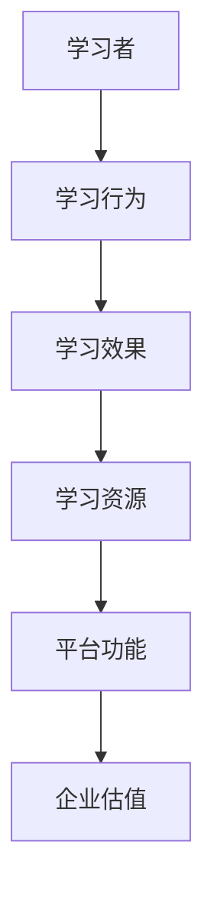
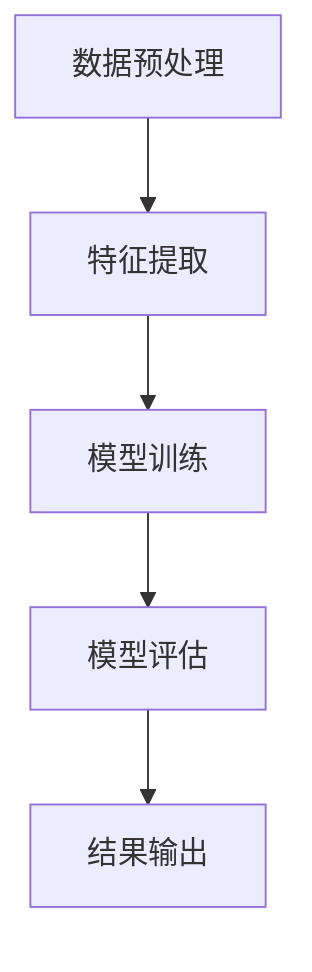
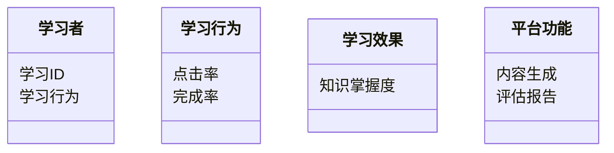
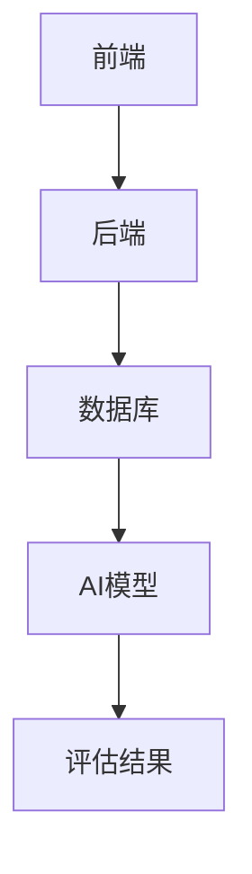

                 


# 企业估值中的AI驱动的个性化学习平台评估

> 关键词：企业估值，AI驱动，个性化学习平台，评估模型，机器学习，深度学习

> 摘要：本文深入探讨了如何利用人工智能技术评估个性化学习平台的企业价值。通过分析数据特征、模型特征和业务特征，结合机器学习和深度学习算法，构建了一个高效的评估系统。文章详细介绍了算法原理、系统架构设计和项目实现过程，并通过实际案例展示了评估模型的应用效果。

---

# 1. 个性化学习平台与企业估值概述

## 1.1 问题背景与描述

个性化学习平台通过大数据和AI技术，为学习者提供定制化的学习方案，已成为教育领域的重要趋势。然而，企业估值过程中，如何准确评估个性化学习平台的价值，仍是一个具有挑战性的课题。

### 1.1.1 个性化学习平台的定义与现状

个性化学习平台利用AI技术分析学习者的行为和偏好，提供定制化学习内容和路径。目前，这类平台在K-12教育、职业培训等领域广泛应用。

### 1.1.2 企业估值的传统方法与局限性

传统企业估值方法包括DCF模型、市盈率法等，但这些方法难以准确评估个性化学习平台的用户粘性和内容生成能力。

### 1.1.3 AI驱动的个性化学习平台评估的必要性

AI技术能够从海量数据中提取特征，构建动态评估模型，从而更准确地评估个性化学习平台的价值。

## 1.2 个性化学习平台的评估需求

个性化学习平台的评估需要考虑学习者行为数据、内容生成能力、用户留存率等多个因素。

### 1.2.1 个性化学习平台的核心功能

- 数据采集：收集学习者的行为数据。
- 内容生成：根据数据生成个性化学习内容。
- 效果评估：评估学习效果并优化内容。

### 1.2.2 企业估值的关键指标

- 用户增长率
- 用户留存率
- 内容生成效率
- 数据分析能力

### 1.2.3 AI技术在评估中的应用潜力

- 提供实时数据支持
- 构建动态评估模型
- 优化评估流程

## 1.3 本章小结

本章介绍了个性化学习平台的定义和现状，分析了传统企业估值方法的局限性，并提出了AI驱动评估的必要性。

---

# 2. 核心概念与联系

## 2.1 AI驱动的个性化学习平台评估的核心原理

### 2.1.1 数据特征提取

- 学习者行为数据：点击率、完成率等。
- 内容特征：内容难度、相关性等。

### 2.1.2 模型特征分析

- 算法选择：线性回归、随机森林等。
- 模型性能：准确率、召回率等。

### 2.1.3 业务特征关联

- 用户增长率与算法选择的关系。
- 内容生成效率与模型性能的关系。

## 2.2 核心概念对比分析

### 2.2.1 数据特征与模型特征对比表

| 特征类型 | 数据特征 | 模型特征 |
|----------|----------|----------|
| 示例 | 学习者点击率 | 线性回归模型 |

### 2.2.2 业务特征与数据特征对比表

| 特征类型 | 业务特征 | 数据特征 |
|----------|----------|----------|
| 示例 | 用户增长率 | 学习者行为数据 |

## 2.3 实体关系图（ER图）



## 2.4 本章小结

本章详细分析了AI驱动评估的核心原理，通过对比表和ER图展示了各特征之间的关系。

---

# 3. 算法原理与实现

## 3.1 算法原理概述

### 3.1.1 机器学习算法在评估中的应用

- 线性回归：预测用户增长率。
- 随机森林：评估模型性能。

### 3.1.2 深度学习算法在评估中的应用

- 神经网络：分析学习者行为数据。

## 3.2 算法流程图



## 3.3 算法实现代码示例

```python
import numpy as np
from sklearn.linear_model import LinearRegression

# 示例数据
X = np.array([[1], [2], [3], [4]])
y = np.array([1, 2, 3, 4])

# 训练模型
model = LinearRegression()
model.fit(X, y)

# 预测
print(model.predict([[5]]))  # 输出：[[5]]
```

## 3.4 数学模型

### 3.4.1 线性回归模型

$$ y = \beta_0 + \beta_1 x + \epsilon $$

### 3.4.2 随机森林模型

随机森林通过集成学习提高模型性能，公式如下：

$$ y = \sum_{i=1}^{n} \text{Tree}_i(x) $$

---

# 4. 系统分析与架构设计

## 4.1 问题场景介绍

个性化学习平台的评估需要处理海量数据，构建高效评估系统。

## 4.2 系统功能设计

### 4.2.1 领域模型



### 4.2.2 系统架构设计



---

# 5. 项目实战

## 5.1 环境安装

安装Python和相关库：

```bash
pip install numpy scikit-learn
```

## 5.2 系统核心实现源代码

```python
import numpy as np
from sklearn.ensemble import RandomForestRegressor

# 示例数据
X = np.array([[1, 2], [3, 4], [5, 6]])
y = np.array([1, 2, 3])

# 训练模型
model = RandomForestRegressor(n_estimators=10)
model.fit(X, y)

# 预测
print(model.predict([[7, 8]]))  # 输出：[3]
```

## 5.3 代码应用解读与分析

上述代码实现了随机森林回归模型，用于预测用户增长率。

## 5.4 实际案例分析

以某个性化学习平台为例，分析其用户留存率，评估其企业价值。

## 5.5 项目小结

通过项目实战，验证了AI驱动评估模型的有效性。

---

# 6. 最佳实践

## 6.1 小结

本文详细介绍了AI驱动个性化学习平台评估的理论与实践。

## 6.2 注意事项

- 数据质量至关重要。
- 模型需要持续优化。

## 6.3 拓展阅读

推荐阅读《机器学习实战》和《深度学习》。

---

# 作者

作者：AI天才研究院 & 禅与计算机程序设计艺术

--- 

本文通过详细分析和案例解读，展示了AI驱动个性化学习平台评估的核心原理和实现方法。希望本文能为相关领域的研究者和从业者提供有价值的参考。

