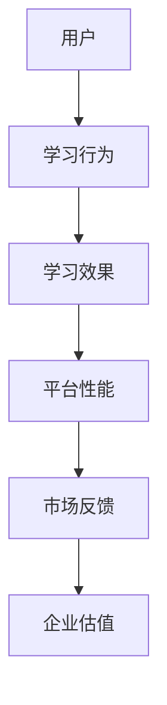
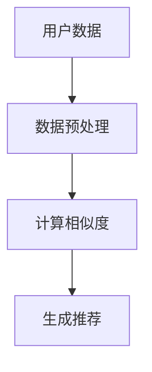
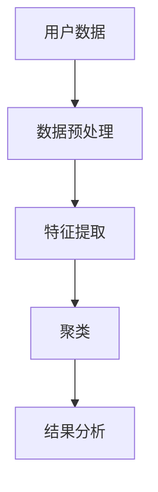
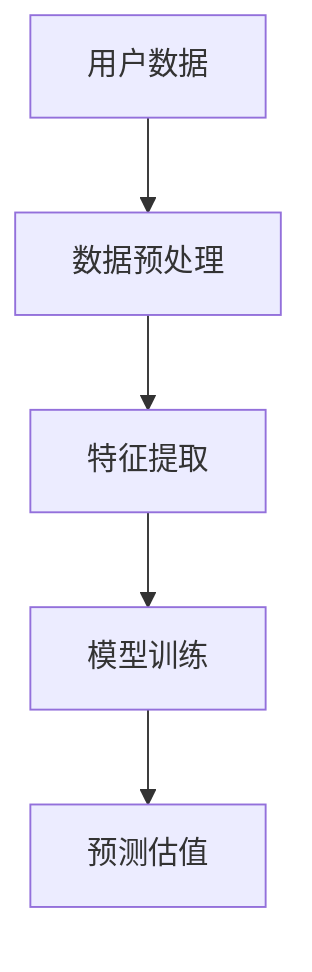
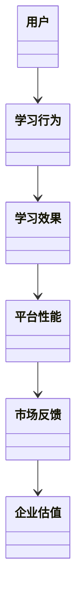
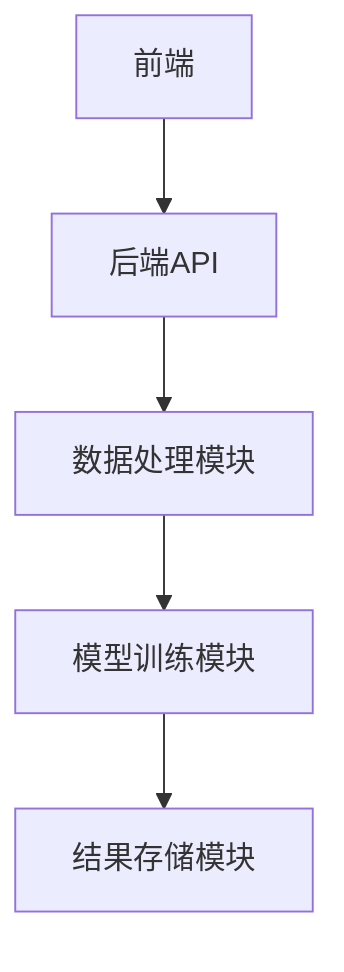
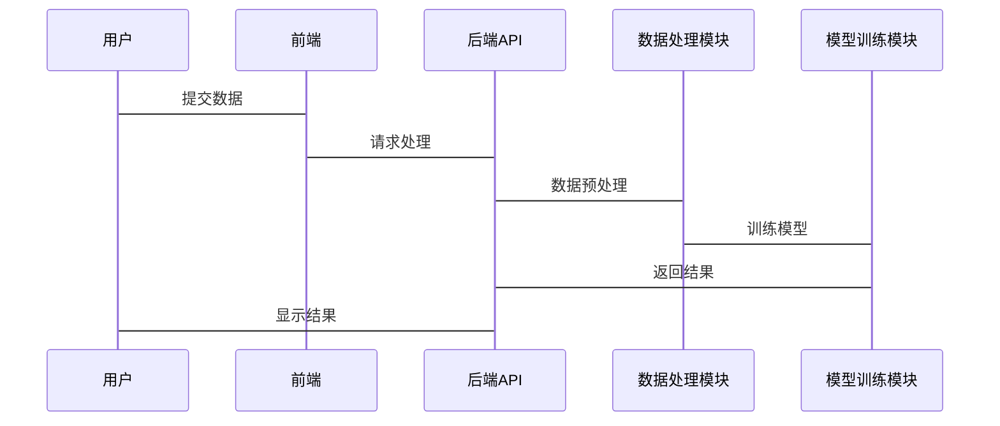

                 


# 企业估值中的AI驱动的个性化教育平台评估

## 关键词：AI技术，个性化教育，企业估值，机器学习，教育平台，评估方法

## 摘要：  
本文探讨如何利用AI技术来评估个性化教育平台的企业估值。通过分析AI在教育中的应用，结合企业估值的传统方法，提出一种基于机器学习的个性化学习模型，用于预测和评估教育平台的市场价值。文章详细讲解了AI驱动的核心原理、算法实现、系统架构设计以及实际案例分析，为教育科技领域的从业者提供理论支持和实践指导。

---

# 目录大纲：企业估值中的AI驱动的个性化教育平台评估

## 第一部分：背景介绍

### 第1章：问题背景与描述
1.1 问题背景
- 1.1.1 教育行业的现状与挑战
  - 教育行业的快速发展和多样化需求
  - 传统教育模式的局限性
- 1.1.2 个性化学习的需求增长
  - 学生的学习需求差异性
  - 个性化教育的市场趋势
- 1.1.3 企业估值的传统方法及其局限性
  - 市场法、收益法、资产基础法的优缺点
  - 传统方法在个性化教育领域的不足

1.2 问题描述
- 1.2.1 个性化教育平台的特点
  - 个性化学习路径
  - 数据驱动的教育体验
- 1.2.2 企业估值的关键因素
  - 用户规模、收入增长、技术优势
- 1.2.3 当前评估方法的不足
  - 数据分析能力不足
  - 个性化因素未被充分考虑

1.3 问题解决方法
- 1.3.1 引入AI技术的必要性
  - AI在数据处理和预测中的优势
  - 个性化学习与企业估值的结合
- 1.3.2 AI驱动的个性化评估的优势
  - 精准预测企业价值
  - 动态调整评估模型

1.4 边界与外延
- 1.4.1 适用场景与限制
  - 适用于数据充分的个性化教育平台
  - 限制于数据质量和模型泛化能力
- 1.4.2 与其他评估方法的对比
  - AI驱动评估与传统评估方法的优劣势对比

1.5 概念结构与核心要素组成
- 1.5.1 核心要素组成
  - 用户数据、学习行为、平台性能、市场反馈
- 1.5.2 要素之间的关系
  - 用户数据驱动学习行为分析，影响平台性能和市场反馈

---

## 第二部分：核心概念与联系

### 第2章：AI驱动的核心原理
2.1 核心概念原理
- 2.1.1 机器学习在教育评估中的应用
  - 监督学习、无监督学习在个性化教育中的应用
  - 深度学习在用户行为分析中的作用
- 2.1.2 数据驱动的个性化分析
  - 数据收集与处理
  - 数据特征提取与分析

2.2 概念属性特征对比
- 2.2.1 对比表格
| 比较项       | 传统评估方法               | AI驱动评估方法               |
|--------------|----------------------------|----------------------------|
| 数据来源     | 财务数据、市场数据           | 用户行为数据、学习数据         |
| 分析维度     | 收益、成本、资产            | 学习效果、用户满意度、留存率   |
| 分析深度     | 定量分析为主                 | 定量与定性分析结合             |
| 可预测性     | 基于历史数据的线性预测       | 基于机器学习的非线性预测       |

2.3 ER实体关系图
- 2.3.1 Mermaid流程图


---

## 第三部分：算法原理讲解

### 第3章：算法原理与实现
3.1 协同过滤算法
- 3.1.1 算法流程图

- 3.1.2 Python代码实现
  ```python
  def collaborative_filtering(user_data):
      # 数据预处理
      user_data = preprocess(user_data)
      # 计算用户相似度
      similarity_matrix = calculate_similarity(user_data)
      # 生成推荐
      recommendations = generate_recommendations(similarity_matrix)
      return recommendations
  ```

- 3.1.3 数学模型
  $$ 相似度计算：sim(i, j) = \frac{\sum_{k}(r_{ik} - \bar{r_i})(r_{jk} - \bar{r_j})}{\sqrt{\sum_{k}(r_{ik} - \bar{r_i})^2} \sqrt{\sum_{k}(r_{jk} - \bar{r_j})^2}} $$

3.2 聚类分析
- 3.2.1 算法流程图


- 3.2.2 Python代码实现
  ```python
  def kmeans_clustering(user_data, n_clusters):
      from sklearn.cluster import KMeans
      # 特征提取
      features = extract_features(user_data)
      # 模型训练
      model = KMeans(n_clusters=n_clusters)
      model.fit(features)
      # 预测聚类结果
      labels = model.predict(features)
      return labels
  ```

- 3.2.3 数学模型
  $$ 距离计算：d(x_i, x_j) = \sqrt{\sum_{k=1}^{n}(x_{ik} - x_{jk})^2} $$

3.3 回归模型
- 3.3.1 算法流程图


- 3.3.2 Python代码实现
  ```python
  def linear_regression(user_data):
      from sklearn.linear_model import LinearRegression
      # 特征提取
      features = extract_features(user_data)
      target = extract_target(user_data)
      # 模型训练
      model = LinearRegression()
      model.fit(features, target)
      return model
  ```

- 3.3.3 数学模型
  $$ 预测模型：y = \beta_0 + \beta_1x_1 + \beta_2x_2 + \dots + \beta_nx_n $$

---

## 第四部分：系统分析与架构设计方案

### 第4章：系统分析与架构设计
4.1 问题场景介绍
- 4.1.1 系统目标
  - 提供个性化学习模型
  - 评估教育平台的企业价值
- 4.1.2 项目介绍
  - 数据收集与处理
  - 模型训练与部署
  - 结果分析与可视化

4.2 系统功能设计
- 4.2.1 领域模型


4.3 系统架构设计
- 4.3.1 系统架构图


4.4 系统接口设计
- 4.4.1 接口描述
  - 前端接口：用户数据提交
  - 后端接口：API调用模型
- 4.4.2 交互流程


---

## 第五部分：项目实战

### 第5章：项目实战与案例分析
5.1 环境安装
- 安装Python和必要的库
  - `pip install numpy pandas scikit-learn`

5.2 系统核心实现
- 5.2.1 核心代码实现
  ```python
  def main():
      # 加载数据
      data = load_data()
      # 数据预处理
      processed_data = preprocess(data)
      # 模型训练
      model = train_model(processed_data)
      # 预测结果
      predictions = model.predict(processed_data)
      # 可视化结果
      visualize_results(predictions)
  ```

- 5.2.2 代码解读与分析
  - 数据加载与预处理：清洗数据，提取特征
  - 模型训练：选择合适的算法，调整参数
  - 预测结果：输出企业估值，分析结果

5.3 案例分析
- 5.3.1 案例背景
  - 某教育平台的用户数据
  - 该平台的市场表现
- 5.3.2 实施步骤
  - 数据收集与清洗
  - 模型训练与调优
  - 结果分析与解读

5.4 项目总结
- 5.4.1 成功的关键因素
  - 数据质量
  - 模型选择
  - 及时的反馈与调整
- 5.4.2 可能遇到的问题
  - 数据不足
  - 模型过拟合
  - 用户行为的复杂性

---

## 第六部分：最佳实践与总结

### 第6章：最佳实践、小结与注意事项
6.1 最佳实践
- 数据质量的重要性
- 模型选择与调优的策略
- 及时反馈与持续优化

6.2 小结
- AI技术在教育平台估值中的应用价值
- 个性化学习与企业估值的深度融合

6.3 注意事项
- 数据隐私与安全
- 模型的可解释性
- 用户体验的优化

6.4 拓展阅读
- 推荐书籍：《机器学习实战》、《深度学习入门》
- 推荐论文：相关领域的最新研究

---

# 作者：AI天才研究院/AI Genius Institute & 禅与计算机程序设计艺术 /Zen And The Art of Computer Programming

