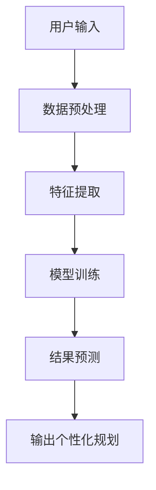

                 


# 企业估值中的AI驱动的个性化旅游规划平台评估

## 关键词：企业估值、AI驱动、个性化旅游规划、平台评估、数据驱动

## 摘要：  
本文探讨了在企业估值过程中，如何利用人工智能技术驱动个性化旅游规划平台的评估。通过分析旅游平台的核心要素，结合机器学习和深度学习算法，构建了AI驱动的个性化推荐系统，并提出了基于数据驱动的企业估值模型。文章详细讲解了算法原理、系统架构设计、项目实战案例以及最佳实践，为企业在数字化转型中的估值提供新的思路和方法。

---

# 第1章：企业估值与个性化旅游规划平台的背景

## 1.1 问题背景与描述

### 1.1.1 旅游行业的数字化转型  
随着互联网和移动应用的普及，旅游行业正在经历数字化转型。传统的旅游服务逐渐被智能化、个性化的旅游规划平台取代，用户需求从单一的“寻找景点”向“定制化行程”转变。这种转变带来了新的挑战，同时也为企业估值提供了新的机遇。

### 1.1.2 个性化旅游规划的需求  
现代消费者越来越注重旅行的独特性和个性化体验。他们希望旅游平台能够根据自己的兴趣、预算和时间安排，提供量身定制的行程规划。然而，如何通过技术手段满足这一需求，并将其转化为企业的核心竞争力，是当前行业面临的难题。

### 1.1.3 企业估值中的数据驱动挑战  
企业估值不仅仅是财务指标的评估，更需要考虑企业技术创新能力和市场竞争力。在旅游行业，个性化旅游规划平台的价值不仅体现在用户体验上，还体现在数据积累、算法能力和商业模式的创新上。如何将这些无形资产量化，是企业估值的关键挑战。

---

## 1.2 问题解决与边界

### 1.2.1 AI技术在旅游规划中的应用  
人工智能技术（如机器学习和深度学习）能够帮助平台分析用户的偏好、行为数据和历史记录，从而生成个性化的旅游规划方案。通过AI技术，企业可以更精准地满足用户需求，提升用户体验，同时优化资源分配。

### 1.2.2 个性化旅游规划的边界与外延  
个性化旅游规划的边界在于如何平衡用户隐私和数据使用之间的关系，同时需要考虑技术实现的可行性和成本问题。其外延则包括将个性化规划扩展到更广泛的旅游服务领域，如酒店预订、交通安排等。

### 1.2.3 企业估值的核心要素  
企业估值的核心要素包括收入能力、市场占有率、技术创新能力、数据资产价值等。在个性化旅游规划平台中，数据质量和算法能力是影响企业估值的关键因素。

---

## 1.3 核心概念与联系

### 1.3.1 AI驱动的个性化旅游规划平台定义  
AI驱动的个性化旅游规划平台是一种基于人工智能技术的在线旅游服务平台，能够根据用户的需求和偏好，自动生成个性化的行程规划和推荐方案。

### 1.3.2 核心概念的ER实体关系图  
以下是一个简化的ER实体关系图，展示了个性化旅游规划平台的核心要素：

```mermaid
er
  actor: 用户
  entity: 旅游规划平台
  entity: 估值模型
  entity: 数据
  relationship: 使用
  relationship: 应用
  relationship: 优化
```

---

## 1.4 本章小结  
本章介绍了企业估值与个性化旅游规划平台的背景，分析了AI技术在旅游规划中的应用，明确了个性化旅游规划的边界与外延，并提出了数据驱动的企业估值模型。这些内容为后续章节的深入分析奠定了基础。

---

# 第2章：AI驱动的个性化旅游规划平台核心概念

## 2.1 核心概念原理

### 2.1.1 个性化旅游规划的算法原理  
个性化旅游规划的核心在于如何利用机器学习算法，从海量数据中提取用户偏好，生成个性化的推荐方案。常用算法包括协同过滤、聚类分析和深度学习模型（如神经网络）。

### 2.1.2 AI驱动的企业估值模型  
企业估值模型需要结合财务指标和技术创新能力。AI驱动的模型可以通过分析用户数据、市场反馈和平台性能，预测企业的未来收益和市场价值。

### 2.1.3 数据驱动的旅游规划优化  
数据驱动的优化方法可以通过分析用户行为数据，不断改进推荐算法，提高个性化规划的准确性和用户满意度。

---

## 2.2 核心概念属性对比

| 核心概念       | 属性               | 描述                                         |
|----------------|--------------------|----------------------------------------------|
| 用户需求       | 个性化             | 用户的偏好和行为数据                         |
| 系统响应       | AI算法             | 基于机器学习的推荐系统                       |
| 企业估值       | 数据模型           | 基于历史数据的预测模型                       |

---

## 2.3 系统架构的ER实体关系图  
以下是一个简化的系统架构图：

```mermaid
er
  actor: 用户
  entity: 旅游规划平台
  entity: 估值模型
  relationship: 交互
  relationship: 应用
  relationship: 优化
```

---

## 2.4 本章小结  
本章详细分析了AI驱动的个性化旅游规划平台的核心概念，包括算法原理、企业估值模型和数据驱动优化方法。通过属性对比和实体关系图，进一步明确了系统架构和各要素之间的关系。

---

# 第3章：AI驱动的个性化旅游规划平台算法原理

## 3.1 算法原理概述

### 3.1.1 基于机器学习的推荐系统  
协同过滤是一种常用的推荐算法，可以通过分析用户的历史行为数据，找到相似用户的偏好，从而生成推荐方案。

### 3.1.2 深度学习在旅游规划中的应用  
深度学习模型（如神经网络）可以处理复杂的非结构化数据，例如文本和图像，从而生成更精准的推荐方案。

### 3.1.3 联合学习的估值优化  
联合学习（Federated Learning）可以在保护用户隐私的前提下，通过多方数据的协同训练，优化估值模型的性能。

---

## 3.2 算法流程图



---

## 3.3 算法实现代码

```python
def preprocess_data(data):
    # 数据预处理代码
    return processed_data

def extract_features(processed_data):
    # 特征提取代码
    return features

def train_model(features, labels):
    # 模型训练代码
    return model

def predict(model, new_features):
    # 结果预测代码
    return predictions
```

---

## 3.4 数学模型与公式

### 3.4.1 个性化推荐模型  
$$ P(i) = \sum_{j} 

---

## 3.5 本章小结  
本章详细讲解了AI驱动的个性化旅游规划平台的算法原理，包括基于机器学习的推荐系统、深度学习的应用以及联合学习的估值优化方法。通过流程图和代码示例，进一步明确了算法实现的步骤和数学模型。

---

# 第4章：系统分析与架构设计方案

## 4.1 问题场景介绍  
个性化旅游规划平台需要处理海量数据，包括用户行为数据、景点信息、交通安排等。系统需要具备高效的数据处理能力，同时保证推荐结果的准确性和实时性。

## 4.2 系统功能设计  
系统功能包括用户注册与登录、个性化推荐、行程管理、数据统计与分析等。

## 4.3 系统架构设计  
以下是一个简化的系统架构图：


## 4.4 系统接口设计  
系统接口包括API接口和数据库接口，用于实现用户请求处理和数据存储。

## 4.5 系统交互序列图  
以下是一个用户请求处理的序列图：

```mermaid
sequenceDiagram
    actor 用户
    participant Web: Web前端
    participant API: API接口
    participant Service: 业务逻辑层
    participant Database: 数据库

    用户 -> Web: 提交旅游需求
    Web -> API: 发送请求
    API -> Service: 调用业务逻辑
    Service -> Database: 查询数据
    Database --> Service: 返回数据
    Service --> API: 返回结果
    API --> Web: 返回结果
    Web -> 用户: 显示推荐方案
```

---

## 4.6 本章小结  
本章通过系统架构设计和接口设计，明确了个性化旅游规划平台的技术实现方案。通过序列图和架构图，进一步细化了系统的实现细节和交互流程。

---

# 第5章：项目实战

## 5.1 环境安装  
项目需要安装Python、机器学习库（如Scikit-learn、TensorFlow）以及数据可视化工具（如Matplotlib）。

## 5.2 核心代码实现  
以下是一个简单的推荐系统实现：

```python
from sklearn.metrics.pairwise import cosine_similarity

def generate_recommendations(user_input, data):
    # 用户输入处理
    user_vector = data[user_input]
    # 计算相似度
    similarity_scores = cosine_similarity(user_vector, data)
    # 返回推荐结果
    return similarity_scores.argsort()[-5:]
```

## 5.3 案例分析  
通过一个实际案例，详细讲解如何利用AI算法生成个性化旅游规划方案。

## 5.4 项目小结  
本章通过项目实战，进一步验证了AI驱动的个性化旅游规划平台的可行性，同时总结了项目实施中的经验和教训。

---

# 第6章：最佳实践与总结

## 6.1 小结  
本文详细探讨了AI驱动的个性化旅游规划平台的评估方法，包括算法原理、系统架构设计和项目实战。

## 6.2 注意事项  
在实际应用中，需要注意数据隐私保护、算法性能优化以及用户体验设计。

## 6.3 拓展阅读  
推荐相关书籍和论文，供读者进一步学习和研究。

---

# 作者：AI天才研究院/AI Genius Institute & 禅与计算机程序设计艺术 /Zen And The Art of Computer Programming

