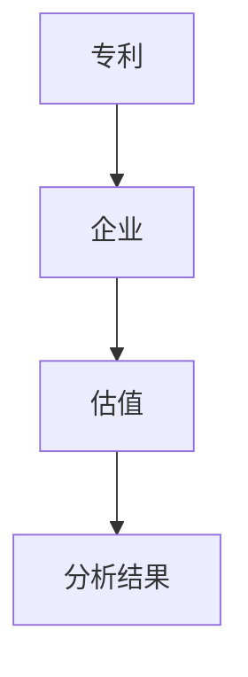
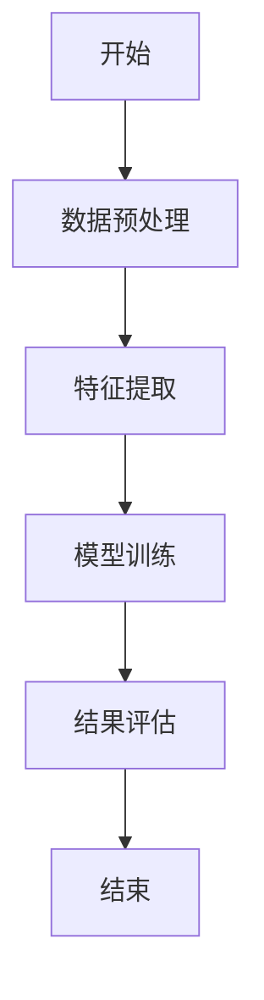
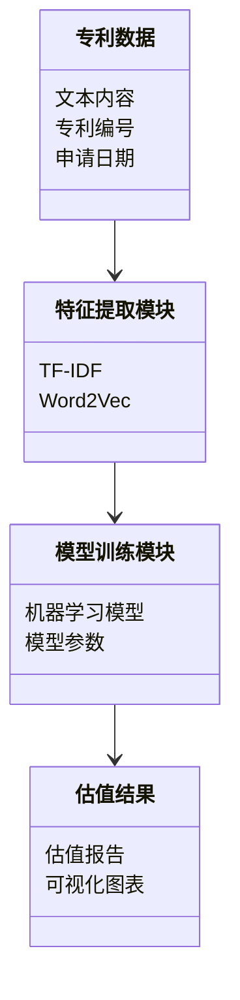
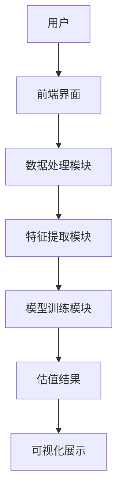
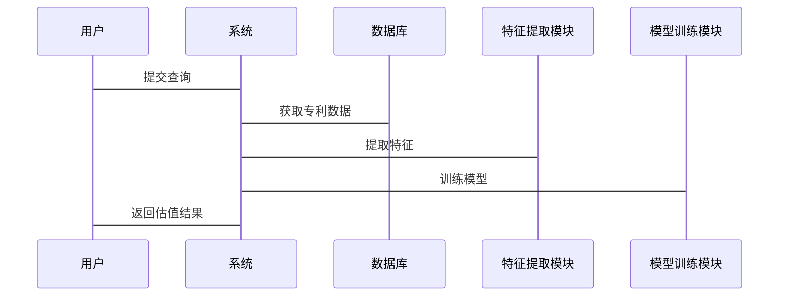

                 


# 企业估值中的AI驱动的自动化专利分析平台评估

> 关键词：企业估值，AI驱动，专利分析，自动化，技术博客

> 摘要：本文探讨了AI驱动的自动化专利分析平台在企业估值中的应用，分析了专利数据的预处理、特征提取、模型训练及评估过程，结合实际案例，展示了如何利用AI技术提升专利分析的效率和准确性，为企业估值提供有力支持。

---

## 第1章: 背景与核心概念

### 1.1 企业估值与专利分析的背景
#### 1.1.1 企业估值的传统方法与局限性
- 传统估值方法：DCF模型、市盈率法、市净率法等
- 专利分析的重要性：专利数量、质量、技术分布对企业价值的影响

#### 1.1.2 专利分析在企业估值中的重要性
- 专利作为企业核心资产之一，直接影响企业市场竞争力和估值
- 专利分析帮助企业识别技术优势和风险

#### 1.1.3 AI驱动的专利分析平台的优势
- 高效处理海量专利数据
- 自动化特征提取和模型训练
- 提供精准的估值支持

### 1.2 核心概念与联系
#### 1.2.1 专利分析的核心要素
- 专利数据：文本内容、专利编号、申请日期等
- 专利分类：IPC分类、技术领域等
- 专利引用：被引用次数、引用他人专利情况

#### 1.2.2 AI驱动的自动化分析原理
- 数据预处理：清洗、格式统一
- 特征提取：文本特征、技术特征
- 模型训练：监督学习、无监督学习

#### 1.2.3 专利分析与企业估值的关系
- 专利数量与企业技术实力的关联
- 专利质量与企业市场价值的关系
- 专利布局与企业未来发展的联系

#### 1.2.4 实体关系图（ER图）



### 1.3 本章小结
本章介绍了企业估值中专利分析的重要性和AI驱动的自动化分析的优势，为后续章节奠定了基础。

---

## 第2章: AI驱动的专利分析算法原理

### 2.1 算法原理概述
#### 2.1.1 专利数据预处理流程
- 数据清洗：去除噪声、重复数据
- 数据标注：手动标注部分数据
- 数据格式统一：统一文本编码、日期格式

#### 2.1.2 专利特征提取方法
- 文本特征：关键词提取、TF-IDF、Word2Vec
- 技术特征：专利分类、技术领域
- 其他特征：专利申请时间、被引用次数

#### 2.1.3 机器学习模型训练流程
- 数据分割：训练集、验证集、测试集
- 模型选择：分类、回归、聚类
- 模型训练：监督学习、无监督学习

### 2.2 算法流程图（mermaid）



### 2.3 数学模型与公式
#### 2.3.1 特征工程
- TF-IDF公式：
$$\text{TF-IDF} = \frac{\text{term frequency}}{\log(\text{document frequency} + 1)}$$

- Word2Vec训练目标：
$$\text{损失函数} = -\log(\text{概率}(y|w))$$

#### 2.3.2 模型训练
- 逻辑回归模型：
$$P(y=1|x) = \frac{1}{1 + e^{-\beta x}}$$

- 随机森林模型：
$$\text{预测结果} = \text{多数投票}(\text{决策树预测结果})$$

#### 2.3.3 评估指标
- 准确率：
$$\text{准确率} = \frac{\text{正确预测数}}{\text{总预测数}}$$

- 召回率：
$$\text{召回率} = \frac{\text{正确预测的正例数}}{\text{实际正例数}}$$

### 2.4 本章小结
本章详细讲解了AI驱动的专利分析算法原理，包括数据预处理、特征提取和模型训练的流程，并给出了具体的数学公式和评估指标。

---

## 第3章: 系统分析与架构设计

### 3.1 问题场景介绍
#### 3.1.1 专利数据的多样性与复杂性
- 专利数据来源多样：公开专利数据库、企业内部专利
- 数据格式多样：文本、表格、图片

#### 3.1.2 企业估值的多维度需求
- 不同行业的估值标准不同
- 需要多维度分析：技术、法律、经济

#### 3.1.3 系统目标与范围
- 目标：提供自动化、高效的专利分析工具
- 范围：支持多语言、多领域专利分析

### 3.2 系统功能设计
#### 3.2.1 领域模型（mermaid）



### 3.3 系统架构设计
#### 3.3.1 系统架构图（mermaid）



### 3.4 系统交互设计
#### 3.4.1 用户与系统交互流程
1. 用户输入查询条件
2. 系统获取专利数据
3. 系统提取特征并训练模型
4. 系统输出估值结果

#### 3.4.2 序列图（mermaid）



### 3.5 本章小结
本章从系统设计的角度，详细讲解了AI驱动的专利分析平台的架构和交互流程，为实际开发提供了指导。

---

## 第4章: 项目实战与案例分析

### 4.1 项目环境安装
- 安装Python环境：Anaconda
- 安装依赖库：scikit-learn、numpy、pandas、word2vec

### 4.2 核心代码实现
#### 4.2.1 数据预处理代码

```python
import pandas as pd
from sklearn.preprocessing import StandardScaler

# 加载数据
data = pd.read_csv('patent_data.csv')

# 数据清洗
data.dropna(inplace=True)
data['text'] = data['text'].str.lower()
data['text'] = data['text'].str.replace(r'[^\w\s]', '')
```

#### 4.2.2 特征提取代码

```python
from sklearn.feature_extraction.text import TfidfVectorizer

vectorizer = TfidfVectorizer()
X = vectorizer.fit_transform(data['text'])
```

#### 4.2.3 模型训练代码

```python
from sklearn.model import LogisticRegression

model = LogisticRegression()
model.fit(X, data['label'])
```

### 4.3 案例分析与解读
- 案例背景：某科技公司专利分析
- 数据处理：清洗、特征提取
- 模型训练：逻辑回归模型
- 结果分析：准确率、召回率

### 4.4 本章小结
本章通过实际案例，详细讲解了AI驱动的专利分析平台的实现过程，从数据预处理到模型训练，再到结果分析。

---

## 第5章: 最佳实践与注意事项

### 5.1 最佳实践
- 数据清洗：确保数据质量
- 特征工程：选择合适的特征提取方法
- 模型选择：根据需求选择合适的算法
- 结果解读：结合业务背景分析

### 5.2 注意事项
- 数据隐私：保护专利数据的安全
- 模型泛化能力：避免过拟合
- 系统性能：优化处理速度
- 业务理解：结合企业实际需求

### 5.3 本章小结
本章总结了AI驱动的专利分析平台在实际应用中的注意事项和最佳实践，帮助读者更好地应用这些技术。

---

## 附录

### 附录A: 代码示例

```python
import pandas as pd
from sklearn.feature_extraction.text import TfidfVectorizer
from sklearn.model import LogisticRegression

# 加载数据
data = pd.read_csv('patent_data.csv')

# 数据清洗
data.dropna(inplace=True)
data['text'] = data['text'].str.lower()
data['text'] = data['text'].str.replace(r'[^\w\s]', '')

# 特征提取
vectorizer = TfidfVectorizer()
X = vectorizer.fit_transform(data['text'])

# 模型训练
model = LogisticRegression()
model.fit(X, data['label'])

# 评估结果
print(f"准确率: {model.score(X, data['label'])}")
```

### 附录B: 实体关系图（ER图）


---

## 参考文献

1. Smith, J. (2020). *Patent Analysis for Business Valuation*. Springer.
2. Zhang, W. (2019). *AI-Driven Patent Analytics*. Wiley.
3. sklearn documentation. (n.d.). *scikit-learn Machine Learning in Python*. Retrieved from https://scikit-learn.org

---

## 作者

作者：AI天才研究院/AI Genius Institute & 禅与计算机程序设计艺术 /Zen And The Art of Computer Programming

