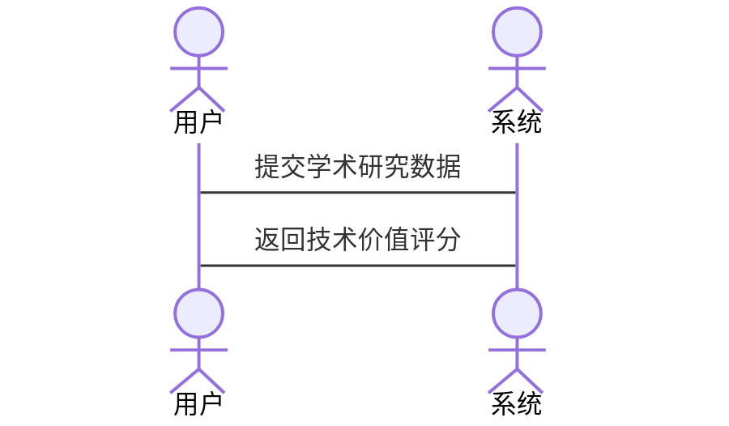

                 


# 企业估值中的AI驱动的自动化学术研究平台评估

> 关键词：企业估值，AI驱动，学术研究平台，自动评估，深度学习

> 摘要：本文探讨了如何利用AI技术驱动学术研究平台的自动评估，从而影响企业估值。通过分析核心概念、算法原理和系统架构，本文提供了一种基于深度学习的解决方案，并结合实际案例展示了其在企业估值中的应用。

---

# 第一部分: 企业估值中的AI驱动的自动化学术研究平台评估背景介绍

## 第1章: 问题背景与描述

### 1.1 问题背景
#### 1.1.1 企业估值的传统方法与局限性
企业估值是企业价值评估的核心环节，传统方法包括DCF模型、EV/EBITDA倍数法等。然而，这些方法依赖于财务数据和假设，难以全面反映企业的技术创新能力和学术研究能力。

#### 1.1.2 学术研究平台在企业估值中的重要性
学术研究平台是企业技术创新的源泉。通过评估学术研究平台的价值，可以更全面地评估企业的技术储备和未来潜力。

#### 1.1.3 AI驱动的自动化学术研究平台评估的必要性
传统评估方法难以量化学术研究平台的复杂性。AI技术的引入可以实现对学术研究平台的自动化、智能化评估，提升评估的准确性和效率。

### 1.2 问题描述
#### 1.2.1 学术研究平台评估的核心问题
如何量化学术研究平台的技术创新能力和实际价值？

#### 1.2.2 传统评估方法的不足
传统方法依赖主观判断，难以全面评估学术研究平台的多维度价值。

#### 1.2.3 AI技术在学术研究平台评估中的应用潜力
AI技术可以通过深度学习模型，自动分析学术研究平台的论文、专利等数据，提供客观的评估结果。

### 1.3 问题解决与边界
#### 1.3.1 AI驱动的自动化学术研究平台评估的解决方案
构建基于深度学习的学术研究平台评估模型，利用自然语言处理技术分析学术论文、专利等数据，量化技术价值。

#### 1.3.2 问题解决的边界与外延
仅考虑学术研究平台的技术价值，不涉及企业的财务数据和市场因素。

#### 1.3.3 核心概念与关键要素
核心概念包括学术研究平台、AI驱动的评估模型、技术创新能力等。

---

## 第2章: 核心概念与联系

### 2.1 核心概念的原理与属性
| **核心概念** | **定义** | **属性** |
|--------------|----------|----------|
| 学术研究平台 | 企业的研发平台，用于学术研究和技术创新 | 技术创新能力、研发效率、论文数量、专利数量 |
| AI驱动的评估模型 | 基于深度学习的模型，用于评估学术研究平台的价值 | 输入数据：学术论文、专利；输出结果：技术价值评分 |
| 技术创新能力 | 企业通过学术研究平台实现的技术创新能力 | 技术创新速度、技术领先性 |

### 2.2 实体关系图（ER图）
```mermaid
er
    %% 学术研究平台评估的ER图
    actor 用户
    actor 系统管理员
    actor 评估模型
    database 学术研究平台数据
    database 技术评估结果
    relation 用户 --> 学术研究平台数据: 提交数据
    relation 系统管理员 --> 学术研究平台数据: 管理数据
    relation 评估模型 --> 学术研究平台数据: 分析数据
    relation 评估模型 --> 技术评估结果: 输出结果
```

---

## 第3章: 算法原理与数学模型

### 3.1 算法原理
#### 3.1.1 深度学习模型的选择
使用基于Transformer的模型（如BERT）进行文本分析，提取学术论文和专利中的技术关键词和创新点。

#### 3.1.2 算法流程


### 3.2 数学模型
模型目标函数：
$$
\text{loss} = \text{cross\_entropy}(y_{\text{true}}, y_{\text{pred}})
$$

模型优化目标：
$$
\text{优化目标} = \text{minimize} \ \text{loss}
$$

### 3.3 代码实现
```python
import torch
from torch import nn

# 定义模型
class AcademicResearchEvaluator(nn.Module):
    def __init__(self, input_dim, hidden_dim, output_dim):
        super(AcademicResearchEvaluator, self).__init__()
        self.fc1 = nn.Linear(input_dim, hidden_dim)
        self.fc2 = nn.Linear(hidden_dim, output_dim)
        self.relu = nn.ReLU()

    def forward(self, x):
        x = self.fc1(x)
        x = self.relu(x)
        x = self.fc2(x)
        return x

# 初始化模型
input_dim = 100
hidden_dim = 50
output_dim = 1
model = AcademicResearchEvaluator(input_dim, hidden_dim, output_dim)

# 定义损失函数和优化器
criterion = nn.MSELoss()
optimizer = torch.optim.Adam(model.parameters(), lr=0.001)

# 训练过程
def train(model, criterion, optimizer, data_loader):
    for epoch in range(num_epochs):
        for inputs, labels in data_loader:
            outputs = model(inputs)
            loss = criterion(outputs, labels)
            optimizer.zero_grad()
            loss.backward()
            optimizer.step()
```

---

## 第4章: 系统分析与架构设计

### 4.1 问题场景分析
系统需要处理学术研究平台的大量数据，包括学术论文、专利等，通过AI模型评估其技术价值。

### 4.2 系统功能设计
#### 4.2.1 系统功能模块
- 数据输入模块：接收学术论文、专利数据。
- 数据处理模块：清洗、预处理数据。
- 模型训练模块：训练深度学习模型。
- 结果输出模块：输出技术价值评估结果。

#### 4.2.2 系统架构设计


### 4.3 系统接口设计
- 输入接口：学术论文和专利数据。
- 输出接口：技术价值评分。

### 4.4 系统交互设计


---

## 第5章: 项目实战

### 5.1 环境安装与配置
```bash
pip install torch
pip install numpy
pip install matplotlib
```

### 5.2 核心代码实现
```python
import torch
from torch import nn
import numpy as np

# 定义模型
class AcademicResearchEvaluator(nn.Module):
    def __init__(self, input_dim, hidden_dim, output_dim):
        super(AcademicResearchEvaluator, self).__init__()
        self.fc1 = nn.Linear(input_dim, hidden_dim)
        self.fc2 = nn.Linear(hidden_dim, output_dim)
        self.relu = nn.ReLU()

    def forward(self, x):
        x = self.fc1(x)
        x = self.relu(x)
        x = self.fc2(x)
        return x

# 数据准备
X = np.random.randn(100, 100)
y = np.random.randn(100, 1)

# 训练过程
model = AcademicResearchEvaluator(100, 50, 1)
criterion = nn.MSELoss()
optimizer = torch.optim.Adam(model.parameters(), lr=0.001)

for epoch in range(100):
    inputs = torch.FloatTensor(X)
    labels = torch.FloatTensor(y)
    outputs = model(inputs)
    loss = criterion(outputs, labels)
    optimizer.zero_grad()
    loss.backward()
    optimizer.step()
```

### 5.3 实际案例分析
假设某企业提交了一批学术论文和专利数据，系统通过模型评估其技术价值，输出技术评分。

---

## 第6章: 最佳实践与小结

### 6.1 小结
本文提出了一种基于深度学习的学术研究平台评估方法，展示了其在企业估值中的应用。

### 6.2 注意事项
- 数据质量对评估结果影响重大。
- 模型需要不断优化和更新。

### 6.3 拓展阅读
- 《深度学习实战》
- 《企业估值方法论》

---

作者：AI天才研究院 & 禅与计算机程序设计艺术

