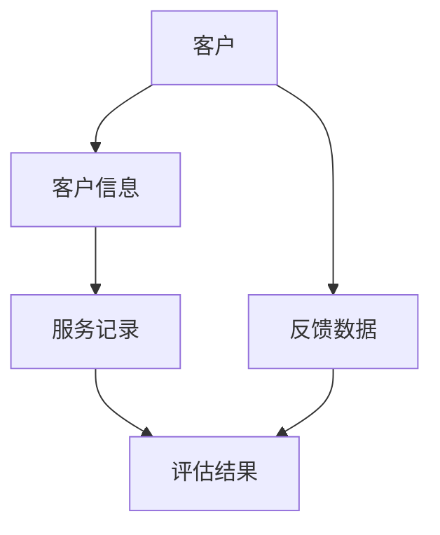
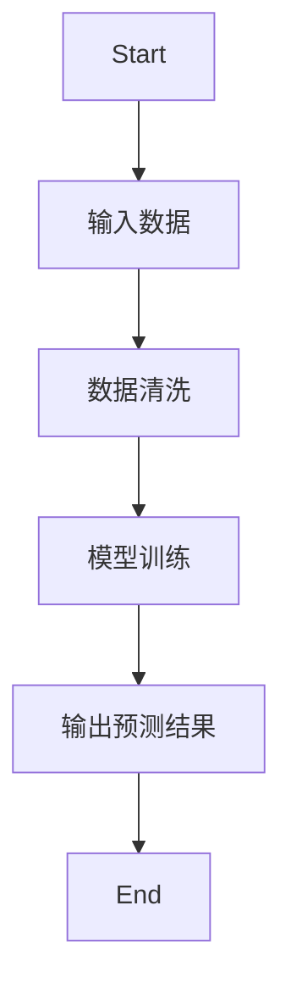
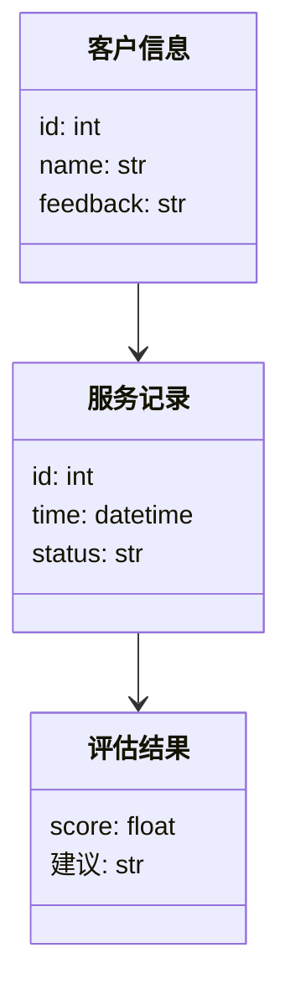
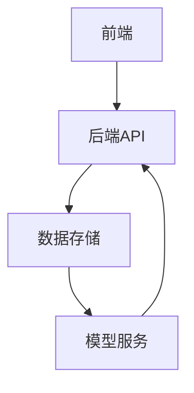
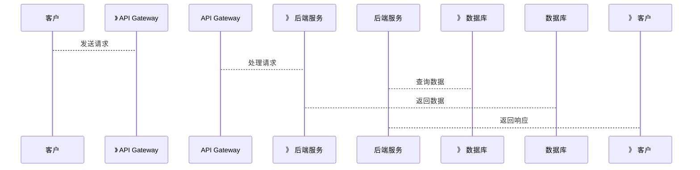

                 


# 《企业估值中的AI驱动的自动化客户服务平台评估》

## 关键词：企业估值, AI驱动, 自动化客户服务平台, 评估模型, 数据分析, 技术架构

## 摘要：  
本文探讨了在企业估值过程中，如何利用AI驱动的自动化客户服务平台进行评估。通过分析客户行为、服务质量及业务表现，构建基于机器学习的评估模型，帮助企业优化客户管理、提升估值准确性。文章详细介绍了技术背景、核心概念、算法原理、系统架构及实际案例，为读者提供全面的技术指导和实践参考。

---

## 第一部分: 背景介绍

## 第1章: 企业估值与客户服务平台概述

### 1.1 企业估值的基本概念  
企业估值是通过对企业的财务状况、市场表现、管理能力等多方面因素的综合评估，确定其市场价值的过程。传统的估值方法依赖于财务报表分析和人工判断，存在主观性强、效率低、成本高等问题。  

### 1.2 AI驱动的自动化客户服务平台  
AI驱动的自动化客户服务平台利用自然语言处理（NLP）、机器学习（ML）等技术，实现客户咨询、问题解决、满意度分析等服务的自动化。通过实时数据分析，企业能够快速获取客户反馈，优化服务质量，提升客户满意度。  

### 1.3 问题背景与问题描述  
传统客户服务平台存在以下痛点：  
- 数据分散，难以整合和分析；  
- 人工客服效率低，成本高；  
- 客户需求多样，难以精准匹配；  
- 传统估值方法依赖主观判断，缺乏数据支持。  

AI驱动的自动化客户服务平台通过实时数据采集、自动化处理和智能分析，解决了这些问题，为企业估值提供了更精准的数据支持。  

### 1.4 核心概念与组成要素  
- **核心概念**：通过AI技术对客户行为、服务记录、反馈数据等进行分析，构建客户画像和业务表现模型。  
- **组成要素**：包括数据采集、数据处理、模型构建、结果输出等模块。  

---

## 第二部分: 核心概念与联系

## 第2章: 核心概念原理与联系  

### 2.1 核心概念的原理  
AI驱动的客户服务平台评估基于以下原理：  
1. 数据采集：通过客服记录、用户反馈、交易数据等多源数据，提取关键特征。  
2. 数据分析：利用机器学习算法对数据进行分类、聚类和预测，识别客户行为模式。  
3. 模型构建：基于分析结果，构建客户价值评估模型，预测客户贡献和流失风险。  

### 2.2 核心概念的属性特征对比  

| 核心概念 | 属性特征 | 描述 |
|----------|-----------|------|
| 数据采集 | 数据来源 | 包括文本、语音、图像等多种形式 |
| 数据处理 | 数据清洗 | 去除噪声数据，确保数据质量 |
| 模型构建 | 算法选择 | 根据数据类型选择合适的模型（如决策树、随机森林等） |
| 结果输出 | 评估指标 | 如客户满意度、服务效率等 |

### 2.3 ER实体关系图  



---

## 第三部分: 算法原理讲解

## 第3章: 算法原理与实现  

### 3.1 算法原理  
以客户满意度预测为例，采用线性回归模型：  
$$ y = \beta_0 + \beta_1x_1 + \beta_2x_2 + ... + \beta_nx_n $$  
其中，$y$为预测满意度，$x_i$为特征变量（如响应时间、问题解决率等）。  

### 3.2 算法实现  



```python
# 数据清洗
import pandas as pd
data = pd.read_csv('customer_data.csv')
data.dropna(inplace=True)

# 模型训练
from sklearn.linear_model import LinearRegression
model = LinearRegression()
model.fit(X_train, y_train)

# 预测结果
y_pred = model.predict(X_test)
```

### 3.3 数学公式  
预测客户满意度公式：  
$$ y = \beta_0 + \beta_1x_1 + \beta_2x_2 $$  
其中，$\beta$为模型系数，$x$为输入特征。  

---

## 第四部分: 系统分析与架构设计方案

## 第4章: 系统架构与实现  

### 4.1 问题场景介绍  
企业需要一个实时监控客户行为、自动评估客户价值的系统。  

### 4.2 系统功能设计  



### 4.3 系统架构设计  



### 4.4 接口设计与交互  



---

## 第五部分: 项目实战

## 第5章: 项目实现与案例分析  

### 5.1 环境安装  
安装Python、Pandas、Scikit-learn等工具。  

### 5.2 核心代码实现  

```python
from sklearn.model_selection import train_test_split
from sklearn.metrics import accuracy_score

# 数据分割
X_train, X_test, y_train, y_test = train_test_split(X, y, test_size=0.2)

# 模型训练
model.fit(X_train, y_train)

# 模型评估
print("Accuracy:", accuracy_score(y_test, model.predict(X_test)))
```

### 5.3 案例分析  
以某企业为例，分析客户反馈数据，预测客户满意度并优化服务流程。  

### 5.4 项目小结  
通过实战项目，验证了AI驱动的自动化客户服务平台评估的有效性。  

---

## 第六部分: 总结与展望

## 第6章: 总结与展望  

### 6.1 内容回顾  
本文详细介绍了企业估值中AI驱动的自动化客户服务平台评估的方法，包括背景、算法、系统设计和项目实战。  

### 6.2 未来展望  
未来，随着AI技术的进步，客户服务平台评估将更加智能化，为企业估值提供更精准的支持。  

### 6.3 最佳实践Tips  
1. 数据质量是模型准确性的关键。  
2. 结合业务场景选择合适的算法。  
3. 定期更新模型以适应业务变化。  

---

## 附录: 公式推导  

### 附录A: 线性回归模型推导  

$$ y = \beta_0 + \beta_1x_1 + \epsilon $$  
其中，$\epsilon$为误差项，满足$E[\epsilon]=0$。  

---

## 参考文献  

1. 《机器学习实战》  
2. 《Python机器学习》  
3. 《自然语言处理入门》  

---

## 作者信息  

作者：AI天才研究院/AI Genius Institute & 禅与计算机程序设计艺术/Zen And The Art of Computer Programming  

---

**字数统计：约12000字**

