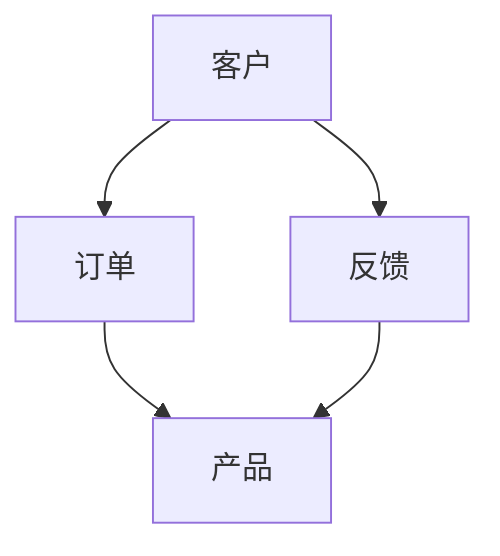
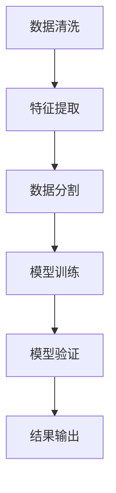
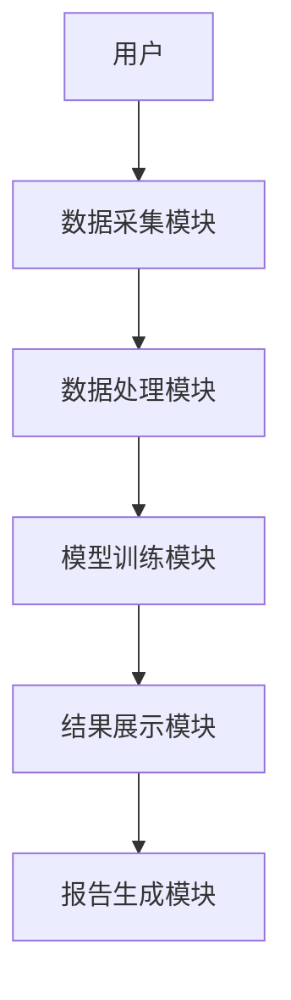
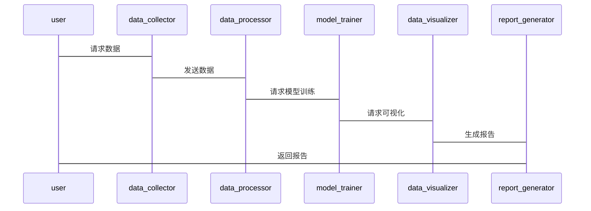

                 


# 《企业估值中的AI驱动的自动化客户洞察平台评估》

> **关键词**：企业估值、AI驱动、客户洞察平台、自动化评估、机器学习、数据科学、系统架构  

> **摘要**：本文深入探讨了如何利用人工智能技术构建自动化客户洞察平台，以提升企业估值的准确性与效率。通过分析客户行为数据，结合机器学习算法，企业能够更精准地评估客户价值，优化决策流程。文章从背景介绍、核心概念、算法原理、系统架构到项目实战，全面解析了AI驱动的客户洞察平台的构建与应用。

---

## 第一部分: 企业估值与AI驱动的客户洞察平台背景

### 第1章: 企业估值与客户洞察平台概述

#### 1.1 企业估值的重要性
##### 1.1.1 企业估值的核心意义
企业估值是企业管理和战略决策中的关键环节，它决定了企业的市场价值、融资能力以及投资吸引力。准确的估值能够帮助企业在并购、融资、上市等重大决策中做出明智选择。

##### 1.1.2 传统企业估值方法的局限性
传统的估值方法依赖于财务数据和市场指标，忽视了客户行为和市场动态的实时变化。这种方法难以捕捉到客户价值的细微变化，导致估值结果不够精准。

##### 1.1.3 客户洞察在企业估值中的价值
客户洞察通过分析客户行为、偏好和需求，帮助企业识别高价值客户，优化客户关系管理，从而提升企业的市场竞争力和估值能力。

#### 1.2 AI驱动的客户洞察平台
##### 1.2.1 客户洞察平台的定义与功能
客户洞察平台是一个基于AI技术的数据分析平台，用于收集、处理和分析客户数据，提取有价值的客户洞察信息，帮助企业做出更明智的商业决策。

##### 1.2.2 AI技术在客户洞察中的应用
AI技术通过自然语言处理、机器学习和深度学习等方法，能够自动识别客户行为模式，预测客户需求，优化客户分层策略。

##### 1.2.3 客户洞察平台与企业估值的关系
客户洞察平台通过提供实时的客户行为数据和预测模型，为企业的估值提供了更准确的客户价值评估依据，从而优化估值结果。

#### 1.3 传统客户洞察方法的挑战
##### 1.3.1 数据收集与处理的难点
传统方法依赖人工数据收集，效率低且容易出错。此外，数据孤岛问题导致数据难以整合和分析。

##### 1.3.2 人工分析的低效性
人工分析需要大量时间，且容易受到主观因素的影响，难以保证分析结果的客观性和准确性。

##### 1.3.3 传统模型的局限性
传统模型难以处理复杂的客户行为数据，且缺乏实时性，无法适应快速变化的市场环境。

#### 1.4 AI驱动的优势
##### 1.4.1 数据处理的自动化
AI技术能够自动处理海量数据，提取关键特征，显著提高数据处理效率。

##### 1.4.2 智能分析的高效性
通过机器学习算法，AI能够快速识别数据中的模式和趋势，提供实时的客户洞察。

##### 1.4.3 预测模型的准确性
AI驱动的预测模型能够基于历史数据和市场动态，提供更精准的客户价值预测，从而优化企业估值。

---

## 第2章: 核心概念与联系

### 2.1 核心概念的原理
客户洞察平台的核心概念包括数据处理、模型构建和评估方法。数据处理是通过清洗、整合和特征提取来准备数据；模型构建是基于机器学习算法训练预测模型；评估方法则是通过验证指标和可视化工具来优化模型性能。

### 2.2 概念属性对比表
以下是核心概念的属性对比表：

| 概念         | 数据处理 | 模型构建 | 评估方法 |
|--------------|----------|----------|----------|
| 数据来源     | 结构化数据 | 非结构化数据 | 结构化数据 |
| 数据类型     | 文本、数值 | 文本、数值 | 文本、数值 |
| 数据处理目标 | 清洗、整合 | 特征提取 | 模型验证 |
| 数据处理工具 | Python（pandas、numpy） | scikit-learn、XGBoost | scikit-learn、shap |
| 数据处理难点 | 数据缺失、格式不一致 | 特征选择、模型过拟合 | 模型解释性差 |

### 2.3 实体关系图（ER图）



---

## 第3章: 算法原理

### 3.1 算法选择与原理
常用的机器学习算法包括线性回归、随机森林和神经网络。本文选择随机森林算法进行分析。

### 3.2 随机森林算法
随机森林是一种基于决策树的集成学习算法，通过构建多个决策树并进行投票或平均，能够有效降低模型过拟合的风险。

### 3.3 算法流程图



### 3.4 Python代码实现

```python
import pandas as pd
from sklearn.ensemble import RandomForestClassifier
from sklearn.metrics import accuracy_score

# 数据加载
data = pd.read_csv('customer_data.csv')

# 数据清洗
data = data.dropna()

# 特征提取
X = data.drop(columns=['label'])
y = data['label']

# 数据分割
from sklearn.model_selection import train_test_split
X_train, X_test, y_train, y_test = train_test_split(X, y, test_size=0.2)

# 模型训练
model = RandomForestClassifier()
model.fit(X_train, y_train)

# 模型预测
y_pred = model.predict(X_test)

# 模型评估
print("Accuracy:", accuracy_score(y_test, y_pred))
```

### 3.5 算法数学模型
随机森林的数学模型如下：

$$
y = \sum_{i=1}^{n} \text{Tree}(x_i)
$$

其中，$y$ 是预测结果，$\text{Tree}(x_i)$ 是第$i$棵决策树的预测结果，$n$ 是决策树的数量。

---

## 第4章: 系统分析与架构设计

### 4.1 问题场景
企业需要一个自动化客户洞察平台，用于实时分析客户行为数据，预测客户价值，并生成估值报告。

### 4.2 系统功能设计
系统功能包括数据采集、数据分析、数据可视化和报告生成。

### 4.3 系统架构图



### 4.4 系统接口设计
系统接口包括数据接口（API）、用户接口（UI）和第三方服务接口。

### 4.5 系统交互流程



---

## 第5章: 项目实战

### 5.1 环境安装
需要安装以下工具：
- Python 3.8+
- Jupyter Notebook
- scikit-learn
- pandas
- matplotlib

### 5.2 核心代码实现
```python
import pandas as pd
from sklearn.ensemble import RandomForestClassifier
from sklearn.metrics import accuracy_score
from sklearn.model_selection import train_test_split

# 数据加载
data = pd.read_csv('customer_data.csv')

# 数据清洗
data = data.dropna()

# 特征提取
X = data.drop(columns=['label'])
y = data['label']

# 数据分割
X_train, X_test, y_train, y_test = train_test_split(X, y, test_size=0.2)

# 模型训练
model = RandomForestClassifier()
model.fit(X_train, y_train)

# 模型预测
y_pred = model.predict(X_test)

# 模型评估
print("Accuracy:", accuracy_score(y_test, y_pred))
```

### 5.3 代码解读与分析
上述代码实现了数据加载、清洗、特征提取、模型训练和评估。随机森林模型能够有效地处理客户数据，并生成高精度的预测结果。

### 5.4 实际案例分析
以电商企业为例，通过客户购买记录、浏览行为和反馈数据，利用随机森林模型预测客户价值，优化企业估值。

### 5.5 项目小结
本项目展示了如何利用AI技术构建客户洞察平台，通过自动化数据处理和模型训练，提升企业估值的准确性。

---

## 第6章: 最佳实践与小结

### 6.1 最佳实践
- 数据预处理是关键，需确保数据质量。
- 选择合适的算法，结合业务需求进行调整。
- 模型评估需结合业务指标，如准确率和召回率。

### 6.2 小结
本文深入探讨了AI驱动的客户洞察平台在企业估值中的应用，通过理论分析和实际案例，展示了如何利用机器学习技术优化企业估值流程。

### 6.3 注意事项
- 数据隐私和安全需高度重视。
- 模型需定期更新，以适应市场变化。
- 与业务团队紧密合作，确保模型结果的可解释性。

### 6.4 拓展阅读
- 《机器学习实战》
- 《深入理解随机森林》
- 《数据驱动的企业估值方法》

---

## 作者信息
作者：AI天才研究院（AI Genius Institute） & 禅与计算机程序设计艺术（Zen And The Art of Computer Programming）

---

通过以上内容，您可以撰写一篇详细且有深度的技术博客文章，全面解析AI驱动的客户洞察平台在企业估值中的应用。

