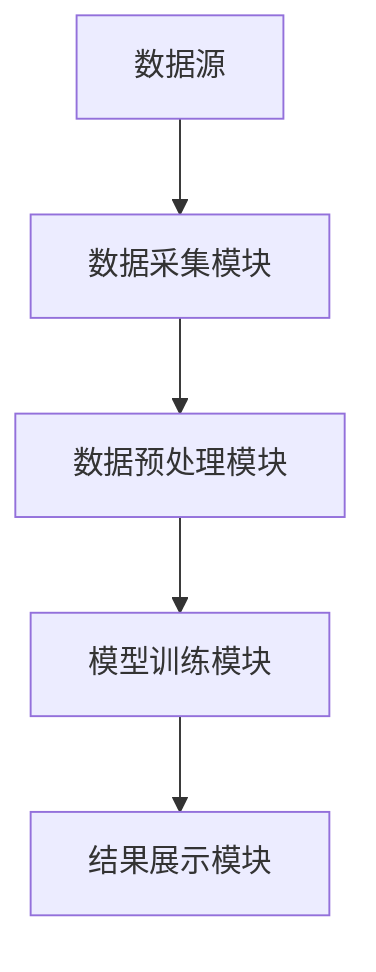

                 


# 企业估值中的AI驱动的自动化客户细分平台评估

> **关键词**：企业估值、客户细分、人工智能、自动化评估、数据驱动决策  
> **摘要**：本文探讨了AI驱动的自动化客户细分平台在企业估值中的应用，通过分析客户细分的核心要素、算法原理、系统架构设计以及实际案例，为企业提供了一种高效、精准的客户评估方法。

---

## 第一部分: 企业估值与客户细分平台的背景与概念

### 第1章: 企业估值与客户细分的背景

#### 1.1 企业估值的核心问题

企业估值是企业在市场中的价值评估，是企业战略决策的重要依据。客户细分作为企业估值的关键环节，直接影响企业的市场定位和价值评估。传统的客户细分方法依赖人工经验，存在效率低、主观性强、可扩展性差的问题。

- **客户细分的基本概念**：客户细分是指根据客户特征、行为、需求等维度，将客户划分为不同的群体。  
- **企业估值与客户细分的关系**：客户细分能够帮助企业更精准地定位目标客户，优化资源配置，提升企业价值。

#### 1.2 AI驱动的客户细分平台的兴起

随着数据量的爆发式增长和AI技术的成熟，基于AI的客户细分平台逐渐成为企业估值的核心工具。AI驱动的客户细分具有高效性、精准性和可扩展性的特点。

- **数据驱动决策的时代背景**：企业需要通过数据挖掘和分析，从海量数据中提取有价值的信息，以支持决策。  
- **AI技术在客户细分中的优势**：AI能够快速处理大量数据，发现潜在模式，实现客户群体的自动划分和价值评估。  
- **自动化客户细分平台的市场价值**：通过自动化客户细分，企业能够快速响应市场变化，提升客户满意度和忠诚度。

### 第2章: 客户细分平台的核心概念与框架

#### 2.1 客户细分的核心要素

客户细分需要综合考虑多个维度，包括客户的基本特征、行为模式和价值评估指标。

- **客户特征的维度分析**：人口统计特征（年龄、性别、收入）、地理特征（区域分布）、心理特征（消费习惯）。  
- **客户行为模式的识别**：购买频率、购买金额、浏览行为、反馈行为。  
- **客户价值评估的指标体系**：客户生命周期价值（CLV）、客户满意度（CSAT）、客户净推荐值（NPS）。

#### 2.2 AI驱动的客户细分平台框架

AI驱动的客户细分平台通常由数据采集与处理模块、模型训练与优化模块、结果展示与应用模块组成。

- **数据采集与处理模块**：负责从多源数据中采集客户信息，并进行数据清洗和预处理。  
- **模型训练与优化模块**：基于机器学习算法，对客户数据进行建模和训练，生成客户细分结果。  
- **结果展示与应用模块**：以可视化的方式展示客户细分结果，并提供相应的应用工具（如精准营销策略）。

#### 2.3 平台的边界与外延

- **平台的功能边界**：客户细分平台主要关注客户数据的分析和处理，不涉及企业的财务数据或其他敏感信息。  
- **平台的适用场景**：适用于零售、金融、教育等多个行业，帮助企业在客户管理中实现精细化运营。  
- **平台与其他系统的接口关系**：平台需要与企业CRM系统、营销系统等进行数据对接，确保数据的实时性和准确性。

---

## 第二部分: AI驱动的客户细分平台算法原理

### 第3章: 基于聚类分析的客户细分算法

#### 3.1 聚类分析的基本原理

聚类分析是一种无监督学习方法，用于将数据点自动划分到不同的类别中。K-means算法是常用的聚类算法之一。

- **K-means算法的数学模型**：  
  $$ \text{目标函数} = \sum_{i=1}^{k} \sum_{j=1}^{n_i} (x_{ij} - \mu_i)^2 $$  
  其中，\( k \) 表示聚类数，\( n_i \) 表示第 \( i \) 个聚类的样本数，\( x_{ij} \) 表示第 \( i \) 个聚类的第 \( j \) 个样本，\( \mu_i \) 表示第 \( i \) 个聚类的中心点。

- **K-means算法的实现步骤**：  
  1. 随机初始化 \( k \) 个聚类中心。  
  2. 计算每个样本到聚类中心的距离，将样本分配到最近的聚类中心。  
  3. 重新计算各聚类中心的坐标。  
  4. 重复步骤2和3，直到聚类中心不再变化或达到预设的迭代次数。

#### 3.2 基于神经网络的客户细分

神经网络是一种强大的工具，能够处理复杂的非线性关系。卷积神经网络（CNN）和循环神经网络（RNN）在客户细分中具有广泛的应用。

- **CNN在客户细分中的应用**：CNN能够提取图像或文本数据中的特征，适用于图像识别和文本分类任务。  
- **RNN在客户细分中的应用**：RNN适合处理时间序列数据，例如客户的购买行为序列分析。

#### 3.3 混合模型与优化策略

为了提高客户细分的准确性，可以结合聚类和分类模型构建混合模型。

- **混合模型的实现步骤**：  
  1. 使用聚类算法对客户进行初步分群。  
  2. 在每个聚类内部，使用分类算法进一步细分客户群体。  
  3. 通过超参数调优优化模型性能。

---

## 第三部分: 系统架构与设计

### 第4章: 客户细分平台的系统架构设计

#### 4.1 系统功能模块划分

- **数据采集模块**：负责从数据库、API等渠道获取客户数据。  
- **数据预处理模块**：对数据进行清洗、标准化和特征提取。  
- **模型训练模块**：基于训练数据，训练客户细分模型。  
- **结果展示模块**：将模型输出结果以可视化的方式展示。

#### 4.2 系统架构的Mermaid图



---

## 第四部分: 项目实战与案例分析

### 第5章: 项目实战

#### 5.1 项目环境安装

- 需要安装的工具：Python、Scikit-learn、TensorFlow、Matplotlib。  
- 安装命令：  
  ```bash
  pip install scikit-learn tensorflow matplotlib
  ```

#### 5.2 核心代码实现

```python
import numpy as np
from sklearn.cluster import KMeans
from sklearn.preprocessing import StandardScaler
import matplotlib.pyplot as plt

# 示例数据集
X = np.array([[2, 3], [5, 8], [1, 2], [7, 10], [3, 5]])

# 数据标准化
scaler = StandardScaler()
X_scaled = scaler.fit_transform(X)

# K-means聚类
kmeans = KMeans(n_clusters=2, random_state=0)
kmeans.fit(X_scaled)

# 可视化结果
plt.scatter(X[:, 0], X[:, 1], c=kmeans.labels_, cmap='viridis')
plt.scatter(kmeans.cluster_centers_[:, 0], kmeans.cluster_centers_[:, 1], color='red', marker='x')
plt.title('Customer Segmentation Using K-means')
plt.show()
```

#### 5.3 案例分析

以某零售企业的客户数据为例，使用K-means算法进行客户细分，结果如下：

- **聚类结果**：客户群体分为高价值客户和低价值客户两组。  
- **应用价值**：企业可以根据客户群体的特征，制定差异化的营销策略，例如针对高价值客户推出专属优惠活动。

---

## 第五部分: 总结与展望

### 第6章: 总结

本文详细探讨了AI驱动的自动化客户细分平台在企业估值中的应用。通过分析客户细分的核心要素、算法原理和系统架构设计，为企业提供了一种高效、精准的客户评估方法。未来，随着AI技术的不断发展，客户细分平台将更加智能化和个性化，为企业创造更大的价值。

### 第7章: 展望

- **技术发展**：深度学习和强化学习技术将进一步提升客户细分的精度。  
- **应用场景**：客户细分平台将扩展到更多领域，例如医疗、交通等行业的客户管理。  
- **挑战与机遇**：数据隐私和模型解释性是未来需要重点解决的问题。

---

## 作者

**作者：AI天才研究院/AI Genius Institute & 禅与计算机程序设计艺术 /Zen And The Art of Computer Programming**

---

以上是文章的完整目录和部分详细内容，您可以根据需要进一步扩展每个部分的内容，添加更多实际案例和代码示例，以增强文章的深度和可读性。

