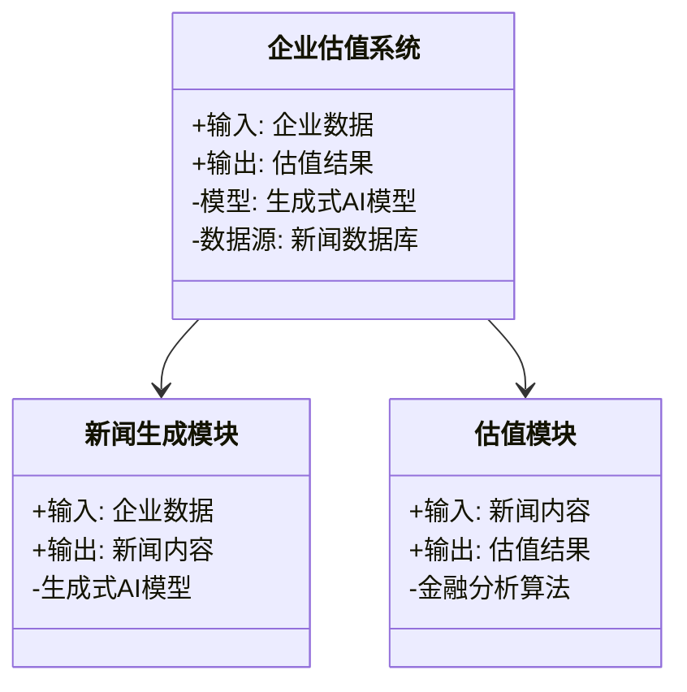
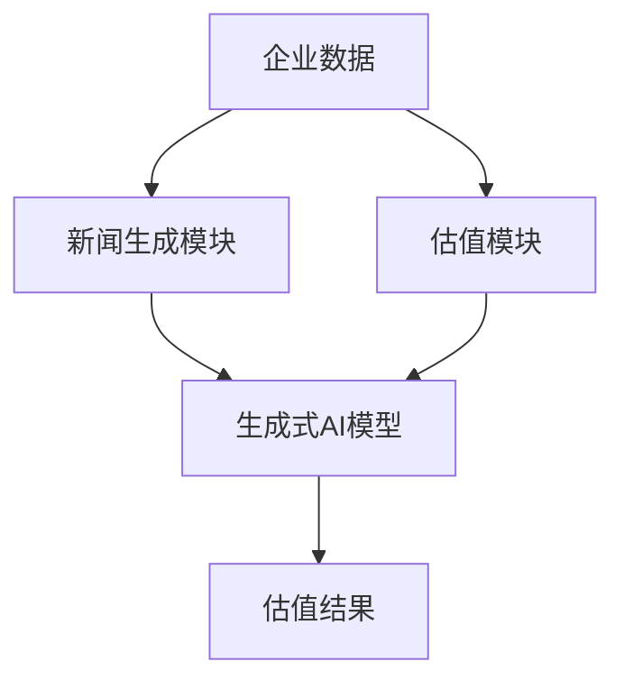
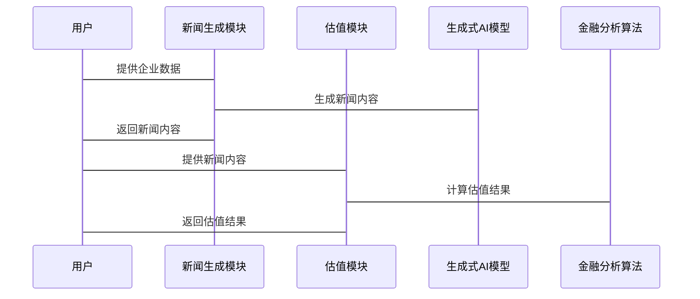

                 


# 企业估值中的AI驱动的自动化新闻写作平台评估

> 关键词：企业估值，AI驱动，自动化新闻写作，自然语言处理，金融分析，文本生成

> 摘要：本文探讨了如何利用AI技术驱动的自动化新闻写作平台来评估企业估值。通过分析AI在金融新闻生成中的应用，结合自然语言处理和生成式模型，提出了一种创新的企业估值方法，展示了如何通过自动化新闻生成优化企业估值过程。

---

# 第一部分: 背景介绍

## 第1章: 问题背景与描述

### 1.1 问题背景

#### 1.1.1 传统企业估值方法的局限性
传统的企业估值方法依赖于财务报表、行业分析和市场研究，这些方法通常耗时且难以捕捉实时动态。企业估值的准确性受限于数据的及时性和全面性。

#### 1.1.2 新闻写作与企业估值的关联性
新闻作为信息传播的重要媒介，包含了影响企业价值的关键信息。通过自动化新闻写作，可以实时生成与企业相关的新闻，从而为估值提供更丰富的数据来源。

#### 1.1.3 AI技术在金融分析中的潜力
AI技术，特别是生成式模型，能够处理大量非结构化数据，生成高质量的新闻内容，并辅助金融分析，为投资者提供实时的企业估值参考。

### 1.2 问题描述

#### 1.2.1 企业估值的核心要素
企业估值的核心要素包括财务指标、市场表现、行业地位、管理团队等，这些要素通常通过结构化数据进行分析。

#### 1.2.2 自动化新闻写作的定义与特点
自动化新闻写作是指利用AI技术自动生成新闻内容，具有高效性、实时性和数据驱动性的特点。

#### 1.2.3 AI驱动的新闻写作如何影响企业估值
AI驱动的新闻写作可以实时生成与企业相关的新闻，提取关键信息，帮助投资者更全面地评估企业价值。

## 第2章: 问题解决与边界

### 2.1 问题解决

#### 2.1.1 AI驱动的自动化新闻写作如何优化企业估值
AI驱动的新闻写作可以实时生成与企业相关的新闻，提供实时的市场动态，帮助投资者更准确地进行企业估值。

#### 2.1.2 数据驱动的新闻生成模型
通过自然语言处理技术，生成式模型可以自动生成新闻内容，结合企业财务数据和市场信息，优化企业估值模型。

#### 2.1.3 自动化新闻写作的量化评估方法
通过分析新闻内容的情感倾向和关键词，可以量化新闻对企业发展的影响，为企业的估值提供更全面的依据。

### 2.2 边界与外延

#### 2.2.1 企业估值的边界条件
企业估值的边界条件包括数据的完整性、模型的准确性以及市场的稳定性，这些因素会影响AI驱动的新闻写作在企业估值中的应用效果。

#### 2.2.2 自动化新闻写作的适用范围
自动化新闻写作适用于需要实时生成大量新闻内容的场景，如金融新闻、市场动态等，但其应用受到数据质量和模型性能的限制。

#### 2.2.3 AI驱动的新闻写作与传统新闻的区别
AI驱动的新闻写作具有高效性和自动化的特点，但缺乏人类记者的专业判断和深度分析，可能影响新闻内容的准确性和深度。

## 第3章: 核心概念与联系

### 3.1 核心概念原理

#### 3.1.1 自动化新闻写作的NLP技术
自然语言处理技术是实现自动化新闻写作的核心，包括文本生成、关键词提取和情感分析等技术。

#### 3.1.2 生成式AI的文本生成原理
生成式AI模型，如GPT，通过概率分布生成文本内容，能够模拟人类写作的风格和结构。

#### 3.1.3 企业估值的关键指标
企业估值的关键指标包括市盈率、市净率、EBITDA等，这些指标可以通过新闻内容中的财务数据进行计算和分析。

### 3.2 概念属性特征对比表

| 概念             | 属性       | 特征对比       |
|------------------|------------|---------------|
| 自动化新闻写作    | 数据驱动性 | 高            |
| 生成式AI         | 可定制性   | 高            |
| 企业估值         | 客观性     | 中高          |

### 3.3 ER实体关系图

```mermaid
erd
  entity 企业估值 (id,
    name,
    market_value,
    financial_data,
    news_content)
  entity 新闻写作 (id,
    content,
    source,
    publication_time)
  entity AI模型 (id,
    model_name,
    training_data,
    parameters)
  relation 企业估值 -> 新闻写作 (通过新闻内容影响企业价值)
  relation 新闻写作 -> AI模型 (AI模型生成新闻内容)
```

---

# 第二部分: 算法原理

## 第4章: 自动化新闻写作的生成式AI模型

### 4.1 生成式AI模型的结构


### 4.2 模型训练与优化

#### 4.2.1 模型训练流程
1. 数据预处理：清洗和标注企业相关数据。
2. 模型选择：选择合适的生成式模型，如GPT-3。
3. 训练过程：使用企业新闻数据进行微调，优化模型生成能力。

#### 4.2.2 模型优化策略
1. 参数调整：优化模型的超参数，如学习率和批次大小。
2. 数据增强：通过数据扩展增加训练数据的多样性。
3. 模型评估：使用验证集评估模型的生成效果和准确性。

### 4.3 数学模型与公式

#### 4.3.1 生成式模型的概率分布
生成式模型基于概率分布生成文本内容，其核心公式为：
$$ P(y|x) = \frac{P(x,y)}{P(x)} $$

其中，$x$ 是输入数据，$y$ 是输出文本。

#### 4.3.2 损失函数
生成式模型通常使用交叉熵损失函数：
$$ \mathcal{L} = -\sum_{i=1}^{n} \log P(y_i|x) $$

### 4.4 代码实现

```python
import torch
import torch.nn as nn
import torch.optim as optim

class GPTModel(nn.Module):
    def __init__(self, vocab_size):
        super(GPTModel, self).__init__()
        self.embedding = nn.Embedding(vocab_size, 512)
        self.lstm = nn.LSTM(512, 512, 2)
        self.linear = nn.Linear(512, vocab_size)
        
    def forward(self, input, hidden):
        embed = self.embedding(input)
        output, hidden = self.lstm(embed, hidden)
        output = self.linear(output.view(-1, 512))
        return output, hidden

# 初始化模型和优化器
vocab_size = 10000
model = GPTModel(vocab_size)
optimizer = optim.Adam(model.parameters(), lr=0.001)

# 训练循环
for epoch in range(num_epochs):
    for batch in dataloader:
        input, target = batch
        optimizer.zero_grad()
        output, hidden = model(input, None)
        loss = nn.CrossEntropyLoss()(output, target)
        loss.backward()
        optimizer.step()
```

---

# 第三部分: 系统分析与架构设计

## 第5章: 企业估值系统设计

### 5.1 系统功能设计



### 5.2 系统架构设计



### 5.3 系统接口设计

1. 新闻生成接口：接收企业数据，返回生成的新闻内容。
2. 估值接口：接收新闻内容，返回企业估值结果。

### 5.4 系统交互流程



---

# 第四部分: 项目实战

## 第6章: 项目环境与核心代码实现

### 6.1 环境安装

```bash
pip install torch transformers
```

### 6.2 核心代码实现

```python
from transformers import GPT2LMHeadModel, GPT2Tokenizer

# 初始化模型和分词器
model_name = 'gpt2'
tokenizer = GPT2Tokenizer.from_pretrained(model_name)
model = GPT2LMHeadModel.from_pretrained(model_name)

# 生成新闻内容
input_str = "公司发布季度财报，净利润增长10%。"
inputs = tokenizer.encode(input_str, return_tensors='np')
outputs = model.generate(inputs, max_length=50, do_sample=True)

# 解码输出
news = tokenizer.decode(outputs[0])
print(news)
```

### 6.3 案例分析与结果解读

通过上述代码，我们可以生成与企业相关的新闻内容，如“公司发布季度财报，净利润增长10%。”生成的新闻可以进一步分析，提取关键指标，如净利润增长率，用于企业估值。

---

# 第五部分: 最佳实践与总结

## 第7章: 最佳实践

### 7.1 小结
本文探讨了AI驱动的自动化新闻写作在企业估值中的应用，展示了如何通过生成式模型优化企业估值过程。

### 7.2 注意事项
在实际应用中，需要注意数据的准确性和模型的稳定性，避免生成虚假新闻影响企业估值。

### 7.3 拓展阅读
进一步研究AI在金融分析中的其他应用，如股票预测、风险评估等。

---

# 作者：AI天才研究院/AI Genius Institute & 禅与计算机程序设计艺术 /Zen And The Art of Computer Programming

---

**这篇文章详细探讨了AI驱动的自动化新闻写作在企业估值中的应用，从背景介绍到系统设计，再到项目实战，为读者提供了全面的视角。通过生成式模型和自然语言处理技术，AI能够自动生成高质量的新闻内容，辅助投资者更准确地进行企业估值。希望这篇文章能够为相关领域的研究和实践提供有价值的参考。**

