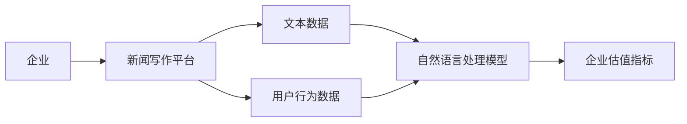
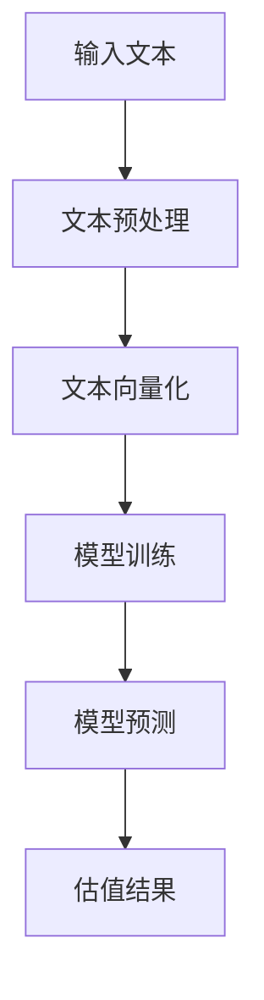
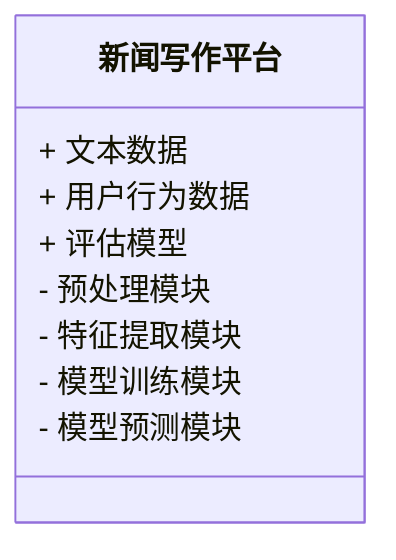
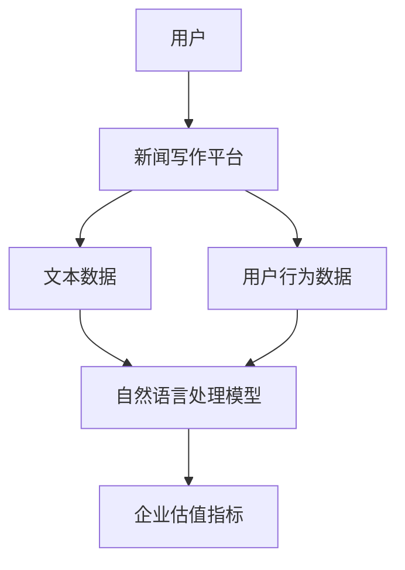
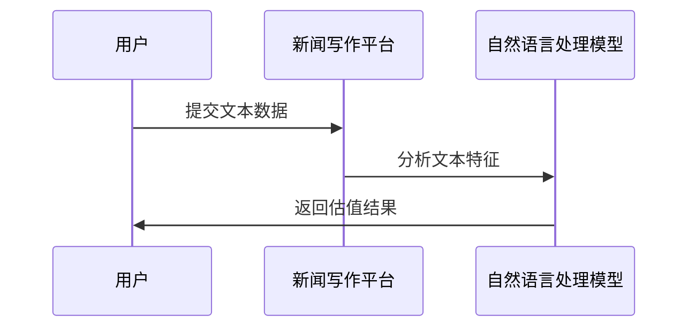

                 


# 《企业估值中的AI驱动的自动化新闻写作平台评估》

---

## 关键词：企业估值, AI驱动, 自动化新闻写作, 平台评估, 自然语言处理, 机器学习, 技术博客

---

## 摘要

本文探讨了在企业估值过程中，如何利用AI驱动的自动化新闻写作平台进行评估。通过分析新闻写作平台的关键特征、企业估值的核心指标以及AI技术的应用，本文详细阐述了基于自然语言处理（NLP）和机器学习的评估算法，并提供了系统的架构设计和实际项目案例。最终，本文总结了AI驱动的新闻写作平台评估在企业估值中的优势，并展望了未来的发展方向。

---

# 第一部分：企业估值与AI驱动的新闻写作平台概述

## 第1章：问题背景与核心概念

### 1.1 问题背景

#### 1.1.1 企业估值的传统方法与局限性

企业估值是企业管理和投资决策中的核心问题。传统的企业估值方法主要包括财务指标分析、市场对标法和DCF模型等。然而，这些方法通常依赖于财务数据和市场数据，难以全面反映企业的软实力，例如品牌影响力、创新能力以及市场声誉。

#### 1.1.2 新闻写作平台的崛起及其对企业估值的影响

新闻写作平台的兴起为企业提供了新的内容生成方式。这些平台不仅可以提高内容生产效率，还能通过数据分析为企业的市场定位、用户行为和品牌价值提供支持。然而，如何量化新闻写作平台对企业估值的影响，仍然是一个亟待解决的问题。

#### 1.1.3 AI技术在企业估值中的潜力

AI技术，特别是自然语言处理（NLP）和机器学习，为企业的文本数据分析提供了新的工具。通过自动化分析新闻内容，AI可以帮助企业更准确地评估自身的市场地位和品牌价值，从而为估值提供更全面的数据支持。

### 1.2 核心概念与问题描述

#### 1.2.1 AI驱动的新闻写作平台评估的定义

AI驱动的新闻写作平台评估是指利用自然语言处理和机器学习技术，对新闻写作平台生成的内容进行分析，从而评估其对企业估值的影响。

#### 1.2.2 新闻写作平台对企业估值的关键影响因素

新闻写作平台的影响因素包括内容质量、用户参与度、品牌影响力和市场声誉等。这些因素可以通过文本分析和用户行为数据进行量化。

#### 1.2.3 问题的边界与外延

本文主要关注AI驱动的新闻写作平台评估在企业估值中的应用，边界包括新闻内容的质量评估和用户行为分析，外延则包括企业品牌价值和市场定位的提升。

### 1.3 核心概念的结构与组成

#### 1.3.1 新闻写作平台的特征分析

新闻写作平台的特征包括文本生成能力、内容可读性、用户参与度和内容相关性。

#### 1.3.2 企业估值的关键指标

企业估值的关键指标包括市盈率、市净率、品牌价值和市场占有率。

#### 1.3.3 AI驱动评估的逻辑框架

AI驱动评估的逻辑框架包括数据采集、特征提取、模型训练和结果分析。

## 第2章：核心概念与联系

### 2.1 AI驱动的新闻写作平台评估原理

#### 2.1.1 自然语言处理（NLP）在新闻写作中的应用

自然语言处理技术可以用于文本生成、文本分类和实体识别，从而帮助评估新闻写作平台的内容质量。

#### 2.1.2 机器学习模型在企业估值中的作用

机器学习模型可以通过分析用户行为和文本特征，预测企业的市场表现和品牌价值。

#### 2.1.3 数据驱动的评估方法

数据驱动的评估方法通过分析新闻内容和用户行为数据，量化新闻写作平台对企业估值的影响。

### 2.2 核心概念属性对比表

#### 表2-1: 新闻写作平台与传统写作方式的对比

| 特征                | 新闻写作平台            | 传统写作方式          |
|---------------------|-------------------------|-----------------------|
| 内容生成效率        | 高                     | 低                   |
| 用户参与度          | 高                     | 中                   |
| 数据分析能力        | 强                     | 弱                   |
| 个性化定制          | 易                     | 难                   |

### 2.3 实体关系图



---

# 第二部分：算法原理与实现

## 第3章：算法原理与实现

### 3.1 算法原理

#### 3.1.1 基于NLP的企业估值模型

企业估值模型基于文本分析和用户行为数据，通过自然语言处理技术提取文本特征，并结合机器学习模型预测企业估值。

#### 3.1.2 机器学习算法的选择与优化

常用的机器学习算法包括支持向量机（SVM）、随机森林和深度学习模型（如LSTM）。选择算法时需要考虑数据规模和模型复杂度。

#### 3.1.3 文本特征提取与向量化

文本特征提取可以通过TF-IDF或Word2Vec等方法实现，将文本数据转换为向量表示。

### 3.2 算法流程图



### 3.3 算法实现

#### 3.3.1 Python核心代码示例

```python
import numpy as np
from sklearn.feature_extraction.text import TfidfVectorizer
from sklearn.svm import SVC

# 文本预处理
def preprocess(text):
    return text.lower().strip()

# 文本向量化
vectorizer = TfidfVectorizer()
X = vectorizer.fit_transform([preprocess(text) for text in texts])

# 模型训练
model = SVC()
model.fit(X.toarray(), labels)

# 模型预测
new_text = preprocess(new_text)
new_X = vectorizer.transform([new_text]).toarray()
predicted_label = model.predict(new_X)[0]
```

### 3.4 数学模型和公式

#### 3.4.1 文本相似度计算

$$ \text{余弦相似度} = \frac{\mathbf{A} \cdot \mathbf{B}}{|\mathbf{A}| |\mathbf{B}|} $$

#### 3.4.2 情感分析模型

$$ P(\text{正面}) = \frac{\sum_{i=1}^{n} w_i x_i}{\sum_{i=1}^{n} w_i} $$

---

## 第三部分：系统分析与架构设计

## 第4章：系统分析与架构设计

### 4.1 问题场景介绍

企业需要通过新闻写作平台评估自身的品牌价值和市场定位，进而优化企业估值。

### 4.2 系统功能设计

#### 4.2.1 领域模型



#### 4.2.2 系统架构



#### 4.2.3 接口设计

新闻写作平台提供RESTful API接口，用于数据采集和模型调用。

### 4.3 系统交互设计



---

## 第四部分：项目实战

## 第5章：项目实战

### 5.1 环境安装

安装Python和相关库（如scikit-learn、nltk、spacy）。

### 5.2 系统核心实现

#### 5.2.1 核心代码

```python
import spacy

nlp = spacy.load("en_core_web_sm")

def analyze_text(text):
    doc = nlp(text)
    for token in doc:
        print(token.text, token.pos_, token.dep_)
```

#### 5.2.2 代码解读

该代码使用spaCy进行文本分析，提取文本中的词性标注和依存关系，用于评估新闻内容的质量。

### 5.3 实际案例分析

通过实际案例分析，展示如何利用AI驱动的新闻写作平台评估企业的市场定位和品牌价值。

### 5.4 项目小结

总结项目实施的经验和教训，提出改进建议。

---

## 第五部分：最佳实践与总结

## 第6章：最佳实践与总结

### 6.1 最佳实践 tips

#### 6.1.1 数据质量的重要性

确保数据的多样性和代表性，避免数据偏差。

#### 6.1.2 模型调优的技巧

通过交叉验证和网格搜索优化模型参数。

### 6.2 小结

AI驱动的新闻写作平台评估为企业估值提供了新的思路和技术手段，未来可以进一步探索更复杂的模型和应用场景。

### 6.3 注意事项

模型的泛化能力和数据隐私保护是需要重点关注的问题。

### 6.4 拓展阅读

推荐阅读相关领域的书籍和论文，深入学习自然语言处理和机器学习技术。

---

## 作者：AI天才研究院/AI Genius Institute & 禅与计算机程序设计艺术 /Zen And The Art of Computer Programming

---

