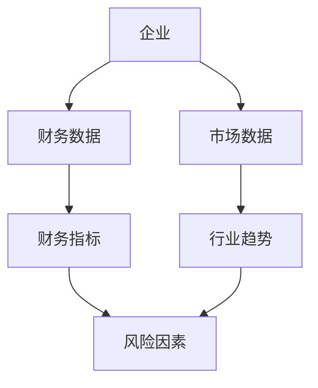
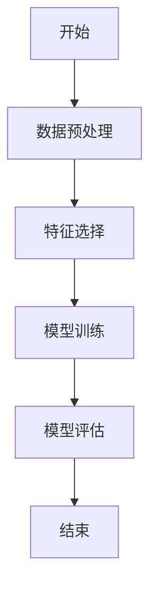
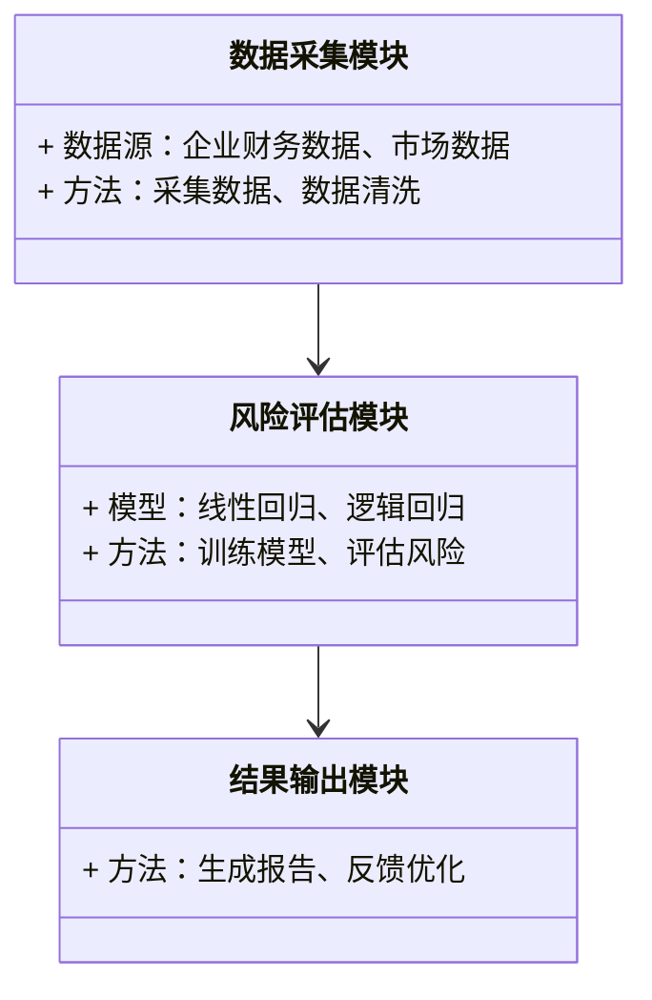
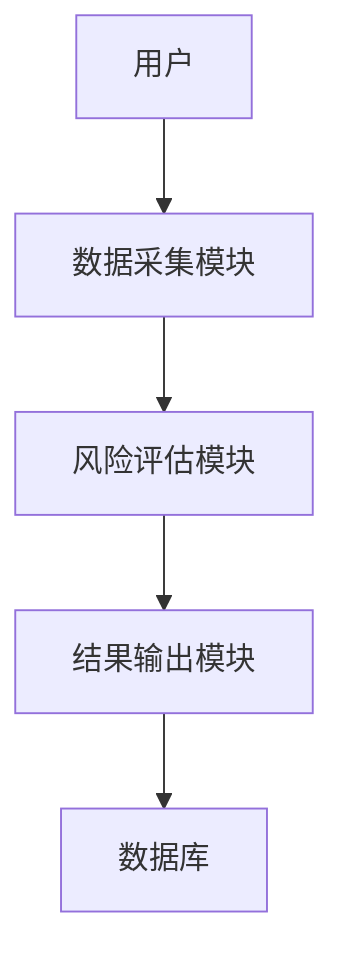
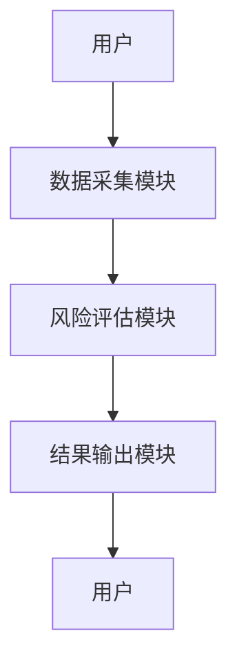

                 


# 企业估值中的AI驱动的自动化风险评估平台评估

> 关键词：企业估值、人工智能、风险评估、自动化平台、机器学习、系统架构

> 摘要：本文详细探讨了AI技术在企业估值中的应用，特别是自动化风险评估平台的构建与评估方法。通过分析传统估值方法的局限性，提出了一种基于机器学习的自动化风险评估模型，并结合实际案例展示了平台的实现过程。本文内容涵盖背景介绍、核心概念、算法原理、系统架构设计、项目实战及最佳实践，为读者提供了全面的技术指导。

---

## 第1章：企业估值与风险评估概述

### 1.1 企业估值的基本概念
- **企业估值的定义**：企业估值是通过对企业的财务状况、市场地位、盈利能力等多方面进行综合评估，确定其市场价值的过程。
- **传统估值方法的局限性**：传统方法依赖人工分析，存在主观性强、效率低、风险高的问题。
- **引入AI驱动平台的必要性**：通过AI技术实现自动化、高效化的企业估值，降低人为错误，提升评估准确性。

### 1.2 自动化风险评估平台的定义与特点
- **自动化风险评估平台**：一种基于AI技术的企业估值工具，能够自动采集数据、构建模型并输出评估结果。
- **特点**：
  - **高效性**：自动化处理数据，减少人工干预。
  - **准确性**：基于机器学习算法，提高评估结果的可靠性。
  - **实时性**：能够实时更新数据，提供动态评估结果。

### 1.3 AI技术在企业估值中的应用背景
- **人工智能在金融领域的应用现状**：AI技术广泛应用于金融分析、风险评估、投资决策等领域。
- **自动化风险评估的市场需求**：企业对快速、精准的估值需求日益增长。
- **技术进步推动AI应用的发展**：大数据和计算能力的提升为AI在企业估值中的应用提供了技术支持。

---

## 第2章：核心概念与联系

### 2.1 核心概念的原理与分析
- **AI驱动的自动化风险评估原理**：
  - **数据采集与处理**：从企业财务报表、市场数据、行业趋势等多来源获取数据，并进行清洗和预处理。
  - **风险评估模型构建**：基于机器学习算法，构建风险评估模型，并通过训练数据进行模型优化。
  - **结果输出与反馈机制**：输出评估结果，并根据反馈不断优化模型。

- **核心概念的属性对比**：
  | 属性 | 传统方法 | AI驱动方法 |
  |------|----------|------------|
  | 效率 | 低       | 高         |
  | 准确性 | 一般     | 高         |
  | 适用性 | 有限     | 广泛       |

### 2.2 实体关系图（ER图）


---

## 第3章：算法原理与数学模型

### 3.1 风险评估模型的算法原理
- **机器学习算法的选择与应用**：
  - **线性回归**：用于预测企业的财务指标。
  - **逻辑回归**：用于分类企业风险等级。
  - **随机森林与梯度提升树**：用于处理复杂的非线性关系。

### 3.2 数学模型与公式推导
- **线性回归模型公式**：
  $$ y = \beta_0 + \beta_1x + \epsilon $$
- **逻辑回归模型公式**：
  $$ P(y=1|x) = \frac{e^{\beta_0 + \beta_1x}}{1 + e^{\beta_0 + \beta_1x}} $$

- **算法流程图**：


---

## 第4章：系统架构设计

### 4.1 系统功能设计
- **领域模型（类图）**：


### 4.2 系统架构设计
- **系统架构图**：


### 4.3 系统交互设计
- **交互序列图**：


---

## 第5章：项目实战

### 5.1 环境安装
- **所需工具**：Python、TensorFlow、Pandas、Scikit-learn
- **安装命令**：
  ```bash
  pip install numpy pandas scikit-learn tensorflow
  ```

### 5.2 系统核心实现源代码
- **数据预处理代码**：
  ```python
  import pandas as pd
  data = pd.read_csv('enterprise_data.csv')
  data = data.dropna()
  ```

- **模型训练代码**：
  ```python
  from sklearn.linear_model import LinearRegression
  model = LinearRegression()
  model.fit(X_train, y_train)
  ```

### 5.3 实际案例分析
- **案例背景**：某制造业企业的估值
- **数据来源**：企业财务报表、行业趋势、市场数据
- **评估结果**：通过模型预测，企业的风险等级为中等偏高。

### 5.4 代码应用解读与分析
- **代码功能解读**：数据预处理、特征选择、模型训练、结果输出。
- **代码优化建议**：增加数据清洗步骤，优化特征选择方法。

---

## 第6章：总结与展望

### 6.1 最佳实践 tips
- **数据质量**：确保数据的准确性和完整性。
- **模型优化**：定期更新模型，避免过拟合。
- **系统维护**：及时修复系统漏洞，提升运行效率。

### 6.2 小结
- 本文详细介绍了AI驱动的自动化风险评估平台的构建与应用，从理论到实践，为读者提供了全面的技术指导。
- 通过实际案例分析，展示了平台在企业估值中的巨大潜力。

### 6.3 注意事项
- 在实际应用中，需注意数据隐私保护和模型的可解释性问题。
- 定期对模型进行验证和优化，确保评估结果的准确性。

### 6.4 拓展阅读
- 《机器学习实战》
- 《企业风险管理与控制》
- 《人工智能在金融领域的应用》

---

作者：AI天才研究院 & 禅与计算机程序设计艺术

