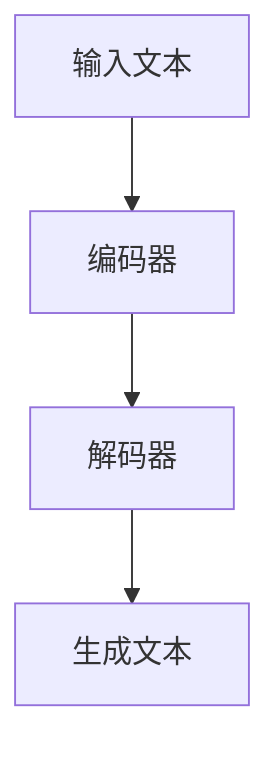
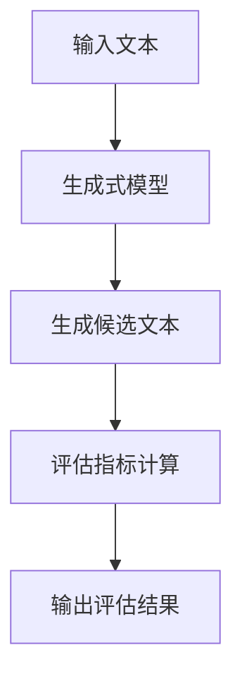
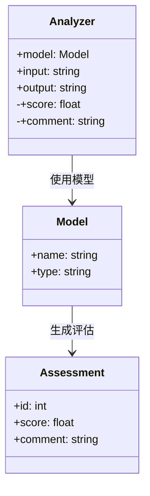
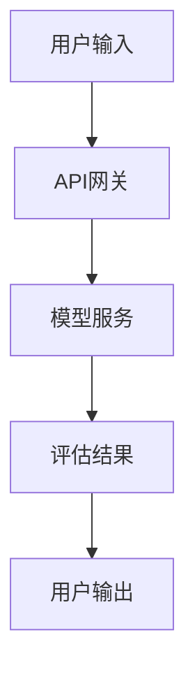
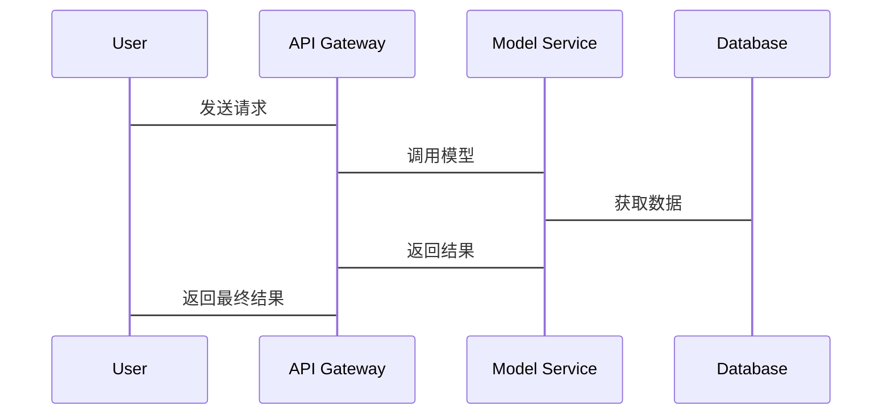

                 


# 《企业估值中的AI驱动的自然语言生成平台评估》

> 关键词：企业估值、自然语言生成、文本质量评估、生成式AI、评估指标

> 摘要：本文探讨了如何利用AI驱动的自然语言生成技术提升企业估值的效率与准确性。通过对生成式AI模型的分析、文本质量评估方法的应用，以及系统架构设计的优化，本文提出了结合企业估值需求的自然语言生成平台评估方案，为现代企业估值实践提供了新的思路和解决方案。

---

## 第一部分: 企业估值与AI驱动的自然语言生成平台概述

### 第1章: 企业估值与AI驱动的自然语言生成平台背景

#### 1.1 企业估值的基本概念
企业估值是通过对企业的财务状况、市场表现、管理团队、行业地位等多方面因素的综合分析，评估其市场价值的过程。传统企业估值方法包括DCF模型、市盈率法、市净率法等，但这些方法在实际应用中存在数据获取难度大、评估结果主观性较强、难以量化非财务因素等问题。

#### 1.2 自然语言生成平台的背景
自然语言生成（Natural Language Generation, NLP）是人工智能领域的重要分支，旨在通过算法生成符合人类语言习惯的文本。近年来，生成式AI技术（如GPT系列模型）的快速发展，使得自然语言生成技术在企业估值、金融分析、客户服务等领域展现出巨大的应用潜力。

#### 1.3 企业估值与自然语言生成平台的结合
AI驱动的自然语言生成技术能够将企业的财务数据、市场信息、行业动态等转化为结构化文本，辅助分析师进行更高效的估值工作。例如，通过生成高质量的行业报告、财务分析摘要，AI生成式平台可以显著提升企业估值的效率和准确性。

---

## 第二部分: 自然语言生成平台评估的核心概念与联系

### 第2章: 自然语言生成平台评估的核心概念

#### 2.1 自然语言生成平台的评估维度
- **文本生成质量评估**：包括生成文本的准确性、逻辑性、可读性等指标。
- **生成效率评估**：评估模型的计算速度和资源消耗。
- **可解释性评估**：模型生成结果的可解释性和透明度。

#### 2.2 自然语言生成模型的属性特征对比
以下是一个对比表格，展示了不同自然语言生成模型的特点：

| 模型名称   | 生成方式       | 优势                     | 局限性                   |
|------------|----------------|--------------------------|--------------------------|
| GPT-3     | 基于Transformer | 高生成质量，支持多种任务 | 计算资源需求大           |
| BERT       | 基于Transformer | 上下文理解能力强         | 生成能力较弱             |
| PAI-TF     | 基于Transformer | 支持大规模并行训练       | 需要特定硬件支持           |

#### 2.3 ER实体关系图架构
以下是自然语言生成平台评估的ER实体关系图：

```mermaid
erDiagram
    analyzer[分析器] {
        +id : int
        +name : string
        +description : string
    }
    model[模型] {
        +id : int
        +name : string
        +type : string
    }
    assessment[评估] {
        +id : int
        +score : float
        +comment : string
    }
    analyzer --> model : 使用模型
    model --> assessment : 生成评估
```

---

### 第3章: 自然语言生成平台评估的算法原理

#### 3.1 生成式AI模型的原理
生成式AI模型的核心是通过Transformer架构实现序列生成。以下是基于Transformer的生成模型流程图：



以下是生成式AI模型的Python代码示例：

```python
import torch
import torch.nn as nn

class Transformer(nn.Module):
    def __init__(self, d_model, n_head, d_hid, dropout):
        super().__init__()
        self.encoder = nn.Embedding(d_model, d_model)
        self.decoder = nn.LSTM(d_model, d_hid, batch_first=True)
        self.generator = nn.Linear(d_hid, d_model)
        self.dropout = nn.Dropout(dropout)

    def forward(self, input_seq):
        embedded = self.encoder(input_seq)
        embedded = self.dropout(embedded)
        output, _ = self.decoder(embedded)
        output = self.generator(output)
        return output

# 示例输入
input_seq = torch.randint(0, 10, (1, 5))
model = Transformer(d_model=512, n_head=8, d_hid=512, dropout=0.1)
output = model(input_seq)
print(output)
```

#### 3.2 自然语言生成评估算法
以下是常用的自然语言生成评估指标：

- **BLEU指标**：
  $$ \text{BLEU} = \sum_{n=1}^{k} \frac{1}{n!} \cdot \text{count}_n $$

- **ROUGE指标**：
  $$ \text{ROUGE} = \frac{\text{matching}(t, c)}{\text{length}(c)} $$

#### 3.3 算法流程图
以下是自然语言生成评估算法的流程图：



---

## 第三部分: 自然语言生成平台评估的系统分析与架构设计

### 第4章: 自然语言生成平台评估的系统分析

#### 4.1 问题场景介绍
在企业估值中，自然语言生成平台主要用于生成行业分析报告、财务数据摘要等文本内容。以下是系统功能设计的类图：



#### 4.2 系统架构设计
以下是系统架构设计的流程图：



#### 4.3 系统接口设计
以下是系统接口设计的序列图：



---

## 第五部分: 项目实战

### 第5章: 项目实战与案例分析

#### 5.1 环境安装
以下是项目环境安装示例：

```bash
pip install transformers
pip install torch
pip install mermaid
```

#### 5.2 核心实现代码
以下是生成式AI模型的核心实现代码：

```python
from transformers import AutoTokenizer, AutoModelForCausalLM

model_name = "gpt2"
tokenizer = AutoTokenizer.from_pretrained(model_name)
model = AutoModelForCausalLM.from_pretrained(model_name)

input_text = "公司是一家专注于人工智能领域的科技公司，"
inputs = tokenizer.encode(input_text, return_tensors="pt")

outputs = model.generate(inputs, max_length=50)
print(tokenizer.decode(outputs[0]))
```

---

## 第六部分: 总结与展望

### 6.1 最佳实践
- 在企业估值中，建议结合多种评估指标和模型进行综合分析。
- 确保生成式AI模型的训练数据质量和多样性。

### 6.2 小结
本文详细探讨了AI驱动的自然语言生成技术在企业估值中的应用，通过理论分析和实践案例，提出了结合企业估值需求的自然语言生成平台评估方案。

### 6.3 注意事项
- 在实际应用中，需注意生成式AI模型的计算资源消耗和数据隐私问题。
- 确保生成文本的准确性和可解释性。

### 6.4 拓展阅读
建议读者进一步阅读以下内容：
- [《深度学习中的自然语言生成技术》](https://example.com)
- [《企业估值的创新方法与实践》](https://example.com)

---

## 作者信息

作者：AI天才研究院/AI Genius Institute & 禅与计算机程序设计艺术 /Zen And The Art of Computer Programming

---

以上是文章的完整目录和内容框架，您可以根据实际需求对具体内容进行扩展和细化。

