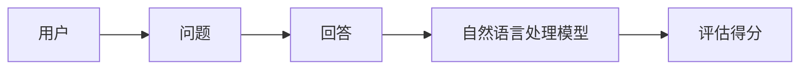
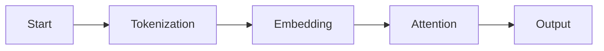
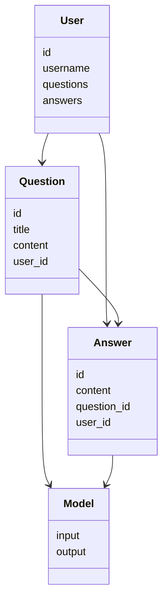
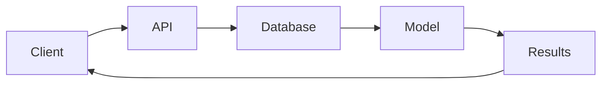
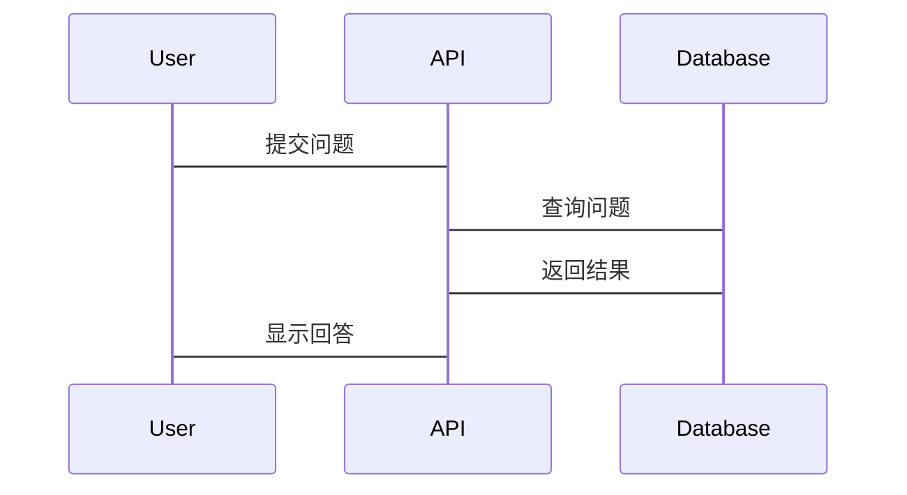

                 


# 企业估值中的AI驱动自然语言问答平台评估

> 关键词：企业估值、自然语言处理、问答平台、AI驱动、模型评估

> 摘要：本文探讨了在企业估值过程中，如何利用AI驱动的自然语言问答平台进行评估。通过分析问答平台的特征、自然语言处理技术的应用、模型的选择与优化，以及实际案例的分析，本文详细阐述了如何利用AI技术提升企业估值的准确性和效率。

---

## 第1章：背景介绍

### 1.1 问题背景与描述

#### 1.1.1 企业估值的传统方法
企业估值是企业管理和金融领域中的核心问题，传统方法主要包括财务指标分析、市场比较法和DCF模型等。然而，这些方法依赖于财务数据和市场假设，难以充分利用非结构化数据（如文本数据）进行分析。

#### 1.1.2 问答平台在企业估值中的作用
问答平台（如知乎、Quora等）积累了大量与企业相关的文本数据，包括用户对企业的产品、服务、管理等方面的真实评价和反馈。这些数据可以为企业的声誉、市场影响力和潜在价值提供重要参考。

#### 1.1.3 AI驱动问答平台评估的必要性
随着自然语言处理（NLP）技术的发展，利用AI分析问答平台中的文本数据，提取企业相关的特征和情感信息，可以显著提高企业估值的准确性和全面性。

---

### 1.2 核心问题解决

#### 1.2.1 问答数据的特征提取
从问答平台中提取对企业估值相关的特征，包括：
- 问题的关键词提取
- 回答的情感分析
- 用户的参与度分析

#### 1.2.2 通过NLP技术进行数据处理
使用分词、实体识别、情感分析等NLP技术对问答数据进行预处理，提取有用的特征向量。

#### 1.2.3 评估模型的构建与应用
基于提取的特征，构建评估模型，对企业的市场声誉、客户满意度等进行量化评估。

---

### 1.3 边界与外延

#### 1.3.1 问答平台评估的边界
- 数据来源的限制（如数据质量和完整性）
- 模型的适用范围（如适用于中等规模以上的企业）

#### 1.3.2 相关领域的外延
- 与社交媒体分析的结合
- 与新闻舆情分析的结合

#### 1.3.3 与其他评估方法的结合
将问答平台评估的结果与其他传统评估方法相结合，形成更全面的估值模型。

---

### 1.4 核心要素组成

#### 1.4.1 数据来源与特征
- 数据来源：问答平台、社交媒体、新闻等
- 特征：关键词、情感倾向、用户活跃度等

#### 1.4.2 NLP模型的作用
- 文本分类：判断回答的相关性
- 情感分析：提取情感倾向
- 实体识别：识别企业名称、产品名称等

#### 1.4.3 评估指标的选择
- 指标：情感得分、关键词匹配度、用户参与度
- 指标权重：根据企业类型和行业特点确定

---

## 第2章：自然语言处理原理

### 2.1 概念原理

#### 2.1.1 词嵌入与句子表示
- 词嵌入：将单词映射为低维向量（如Word2Vec、GloVe）
- 句子表示：将句子映射为向量（如BERT中的[CLS]向量）

#### 2.1.2 注意力机制
- 注意力机制：计算词与词之间的相关性，突出重要信息
- 示例：在问答匹配任务中，注意力机制可以帮助模型关注关键问题和回答。

#### 2.1.3 模型训练与推理
- 训练目标：最小化预测值与真实值的差异
- 推理过程：基于训练好的模型进行预测

---

### 2.2 模型对比

#### 2.2.1 BERT与GPT的对比
| 模型 | BERT | GPT |
|------|------|-----|
| 架构 | 基于Transformer的双向编码器 | 基于Transformer的自回归生成器 |
| 任务 | 适合文本分类、问答匹配 | 适合生成任务（如文本生成） |
| 数据 | 需要成对的数据（如问题和回答） | 需要序列数据 |

#### 2.2.2 不同模型的特征分析
- BERT适合需要双向语境理解的任务
- GPT适合生成性的任务

#### 2.2.3 模型选择的影响因素
- 任务类型（分类 vs 生成）
- 数据规模（小数据 vs 大数据）
- 计算资源（模型大小）

---

### 2.3 实体关系图



---

## 第3章：算法原理讲解

### 3.1 模型原理

#### 3.1.1 BERT模型
- BERT全称：Bidirectional Encoder Representations from Transformers
- 输入：问题和回答
- 输出：匹配概率（如0.8表示高度匹配）

#### 3.1.2 GPT模型
- GPT全称：Generative Pre-trained Transformer
- 输入：问题
- 输出：生成的回答

#### 3.1.3 模型训练过程
1. 预训练：在大规模文本数据上训练模型
2. 微调：在特定任务数据上进行微调

---

### 3.2 模型流程图



---

### 3.3 Python代码实现

#### 3.3.1 BERT模型实现

```python
import torch
from transformers import BertModel, BertTokenizer

# 加载预训练模型和分词器
model_name = 'bert-base-uncased'
model = BertModel.from_pretrained(model_name)
tokenizer = BertTokenizer.from_pretrained(model_name)

# 输入问题和回答
question = "What is AI?"
answer = "AI is artificial intelligence."

# 分词
input_ids = tokenizer(question + " " + answer, return_tensors="pt")

# 前向传播
outputs = model(input_ids.input_ids)
last_hidden_states = outputs.last_hidden_state

# 获取[CLS]向量
cls_vector = last_hidden_states[0][0].detach().numpy()
```

---

## 第4章：系统分析与架构设计

### 4.1 问题场景介绍

#### 4.1.1 项目背景
- 项目目标：利用问答平台数据进行企业估值
- 项目范围：涵盖数据采集、模型训练和结果分析

---

### 4.2 系统功能设计

#### 4.2.1 领域模型



---

### 4.3 系统架构设计



---

### 4.4 系统接口设计

#### 4.4.1 API接口
- GET /questions
- POST /answers
- POST /evaluate

---

### 4.5 系统交互设计



---

## 第5章：项目实战

### 5.1 环境安装

#### 5.1.1 安装Python和依赖库
```bash
pip install transformers torch numpy
```

---

### 5.2 系统核心实现

#### 5.2.1 核心代码实现

```python
import torch
from transformers import BertModel, BertTokenizer

# 加载预训练模型和分词器
model_name = 'bert-base-uncased'
model = BertModel.from_pretrained(model_name)
tokenizer = BertTokenizer.from_pretrained(model_name)

# 定义评估函数
def evaluate(question, answer):
    inputs = tokenizer(question + " " + answer, return_tensors="pt")
    outputs = model(**inputs)
    cls_vector = outputs.last_hidden_state[0][0].detach().numpy()
    return cls_vector

# 示例
question = "What is AI?"
answer = "AI is artificial intelligence."
score = evaluate(question, answer)
print(score)
```

---

### 5.3 代码应用解读与分析

#### 5.3.1 代码功能解读
- 该代码实现了基于BERT模型的问答匹配，输出问题和回答的匹配向量。

#### 5.3.2 代码优化建议
- 增加模型的微调
- 优化分词策略
- 处理数据增强

---

### 5.4 实际案例分析

#### 5.4.1 案例分析
- 企业A的问答数据：用户对其产品的满意度高
- 模型评估结果：情感得分90分
- 结论：企业A的市场声誉良好

---

### 5.5 项目小结

#### 5.5.1 项目总结
- 成功利用AI技术分析问答数据
- 提高了企业估值的准确性和效率

---

## 第6章：最佳实践

### 6.1 Tips

#### 6.1.1 数据质量
- 数据来源可靠
- 数据清洗充分

#### 6.1.2 模型调优
- 调整超参数
- 增加数据多样性

#### 6.1.3 结果验证
- 对比传统方法
- 交叉验证

---

### 6.2 小结

- AI驱动的问答平台评估是企业估值的重要补充
- 需要结合具体场景选择合适的模型和方法

---

### 6.3 注意事项

- 数据隐私保护
- 模型泛化能力
- 计算资源限制

---

### 6.4 拓展阅读

- 《自然语言处理入门》
- 《深度学习与神经网络》

---

## 作者

作者：AI天才研究院/AI Genius Institute & 禅与计算机程序设计艺术 /Zen And The Art of Computer Programming

