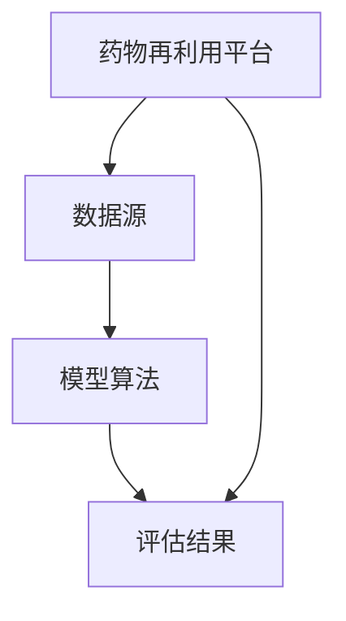
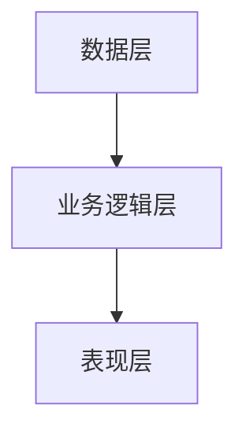

                 


# 企业估值中的AI驱动的药物再利用平台评估

> 关键词：企业估值，人工智能，药物再利用，平台评估，深度学习，算法模型，药物研发

> 摘要：本文探讨了AI技术在药物再利用平台评估中的应用，分析了其对提升企业估值的重要作用。通过系统介绍AI驱动的药物再利用平台的核心算法、系统架构及实际应用案例，展示了如何利用人工智能优化药物再利用过程，提升企业估值的准确性和效率。

---

## 第1章 引言

### 1.1 问题背景
随着医疗行业的发展，传统的新药研发周期长、成本高，而药物再利用作为一种新兴的研发模式，能够显著缩短研发时间并降低成本。然而，如何科学评估药物再利用平台的价值，从而优化企业估值，成为一个亟待解决的问题。

### 1.2 问题描述
企业估值是衡量企业价值的重要指标，传统估值方法依赖于财务数据和市场表现，难以全面考虑药物再利用平台的技术潜力。通过引入AI技术，可以更精准地评估平台价值，从而优化企业估值。

### 1.3 解决方案
本文提出了一种基于AI的药物再利用平台评估框架，结合机器学习算法和数学模型，从数据处理、模型训练到结果分析，全面评估平台价值。

### 1.4 边界与外延
本文聚焦于AI驱动的药物再利用平台评估，不涉及具体药物研发的化学合成过程。同时，本文主要关注平台评估对企业估值的影响，而非单个药物的市场价值。

### 1.5 核心概念与框架
- 核心概念：药物再利用平台、企业估值、AI驱动评估。
- 框架：数据采集→模型训练→结果分析→价值评估。

---

## 第2章 核心概念与联系

### 2.1 药物再利用平台的核心概念
药物再利用平台通过整合多源数据，利用AI技术筛选现有药物的潜在新用途，从而提高研发效率。

### 2.2 AI驱动的药物再利用
AI技术在药物再利用中的应用包括数据挖掘、特征提取、模型训练等，能够快速发现药物的新适应症。

### 2.3 平台评估与企业估值
通过评估药物再利用平台的技术潜力和市场前景，能够更准确地预测企业的未来收益，从而优化企业估值。

### 2.4 核心概念对比
| 概念       | 描述                                                                 |
|------------|----------------------------------------------------------------------|
| 数据源     | 包括临床数据、生物数据、文献数据等                                 |
| 模型算法   | 包括监督学习、非监督学习、深度学习等                               |
| 评估指标   | 包括准确率、召回率、F1分数等                                       |

### 2.5 实体关系图（Mermaid）



---

## 第3章 算法原理与实现

### 3.1 算法原理
AI驱动的药物再利用平台评估主要基于监督学习和深度学习模型。以下是核心算法的数学模型：

#### 3.1.1 监督学习模型
目标函数：$$ f(x) = w \cdot x + b $$
损失函数：$$ L = \sum (y - f(x))^2 $$

#### 3.1.2 深度学习模型
网络结构：输入层 → 隐藏层 → 输出层
损失函数：交叉熵损失
$$ L = -\sum y \cdot \log p + (1 - y) \cdot \log (1 - p) $$

### 3.2 算法实现
#### 3.2.1 数据预处理
- 数据清洗：去除缺失值和异常值
- 特征提取：利用Word2Vec提取药物特征

#### 3.2.2 模型训练
代码示例：
```python
import numpy as np
from sklearn.linear_model import LogisticRegression

# 数据准备
X = np.array([[1, 2], [3, 4]])
y = np.array([0, 1])

# 模型训练
model = LogisticRegression()
model.fit(X, y)

# 模型预测
print(model.predict([[5, 6]]))
```

#### 3.2.3 模型评估
评估指标：准确率、召回率、F1分数
评估流程：
1. 数据集划分：训练集、验证集、测试集
2. 模型训练：利用训练集训练模型
3. 模型验证：在验证集上调整超参数
4. 模型测试：在测试集上评估性能

---

## 第4章 系统分析与架构设计

### 4.1 系统功能设计
药物再利用平台评估系统主要包括以下功能模块：
- 数据采集与处理
- 模型训练与优化
- 结果展示与分析

### 4.2 系统架构设计
系统架构采用分层设计：
- 数据层：数据存储与管理
- 业务逻辑层：模型训练与评估
- 表现层：结果展示与用户交互

#### 4.2.1 系统架构图（Mermaid）


### 4.3 系统接口设计
接口设计包括：
- 数据接口：数据输入与输出
- 模型接口：模型调用与参数配置
- 结果接口：结果展示与导出

### 4.4 系统交互流程（Mermaid）
```mermaid
sequenceDiagram
    participant 用户
    participant 数据层
    participant 业务逻辑层
    participant 表现层

    用户 -> 数据层: 请求数据
    数据层 -> 业务逻辑层: 提供数据
    业务逻辑层 -> 表现层: 返回结果
    用户 <- 表现层: 显示结果
```

---

## 第5章 项目实战

### 5.1 环境安装
- Python 3.8+
- TensorFlow 2.0+
- Scikit-learn 1.0+

### 5.2 核心代码实现
```python
import numpy as np
from sklearn.metrics import accuracy_score
from sklearn.model_selection import train_test_split
from tensorflow.keras import layers, models

# 数据准备
X = np.random.randn(100, 2)
y = np.random.randint(2, size=100)

# 数据集划分
X_train, X_test, y_train, y_test = train_test_split(X, y, test_size=0.2)

# 深度学习模型构建
model = models.Sequential()
model.add(layers.Dense(4, activation='relu', input_shape=(2,)))
model.add(layers.Dense(1, activation='sigmoid'))
model.compile(optimizer='adam', loss='binary_crossentropy', metrics=['accuracy'])

# 模型训练
model.fit(X_train, y_train, epochs=10, batch_size=8)

# 模型评估
y_pred = model.predict(X_test)
print("准确率：", accuracy_score(y_test, np.round(y_pred[:, 0])))
```

### 5.3 案例分析
以一个虚拟药物再利用平台为例，通过上述代码实现模型训练与评估，展示如何利用AI技术提升平台价值评估的准确性。

---

## 第6章 总结与展望

### 6.1 研究总结
本文详细探讨了AI技术在药物再利用平台评估中的应用，通过系统介绍算法原理、系统架构和项目实战，展示了如何利用AI技术优化企业估值。

### 6.2 未来展望
未来的研究可以进一步优化算法模型，探索多模态数据的整合，以及拓展应用场景，如个性化医疗和精准治疗。

---

## 作者
作者：AI天才研究院 & 禅与计算机程序设计艺术

