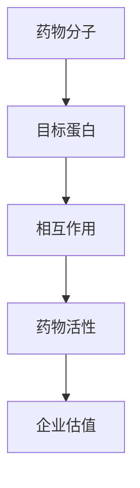
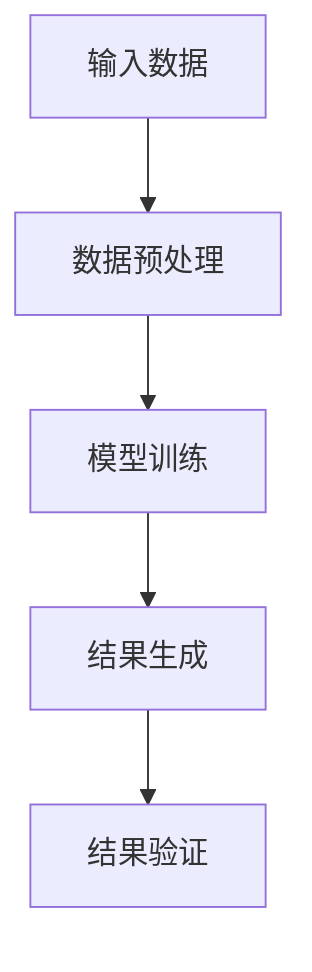
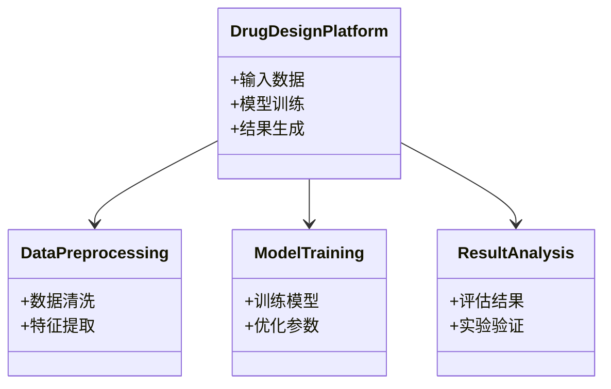
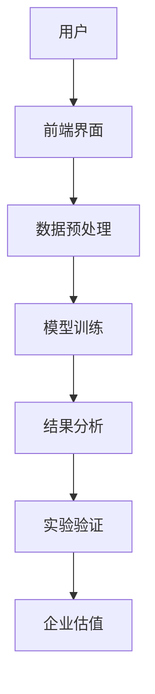
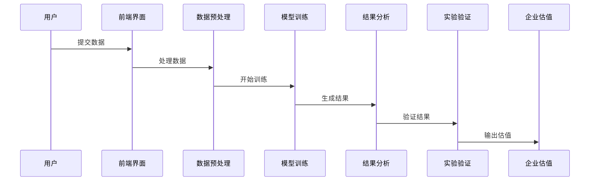

                 


# 企业估值中的AI驱动的药物设计平台评估

> 关键词：企业估值, AI驱动, 药物设计, 平台评估, 技术博客

> 摘要：本文将深入探讨AI驱动的药物设计平台在企业估值中的重要性，从背景介绍、核心概念、算法原理到系统设计与实战，全面解析AI如何改变药物设计领域，并为企业估值提供新的视角。通过详细的技术分析和案例研究，本文将为企业和技术人员提供有价值的参考。

---

# 第1章: 企业估值与AI驱动的药物设计平台概述

## 1.1 AI在药物设计中的作用

### 1.1.1 药物设计的传统方法与挑战

药物设计是新药研发的核心环节，传统方法依赖于化学合成、实验筛选和经验丰富的研究人员。然而，这种方法存在以下挑战：

1. **成本高昂**：传统药物设计需要大量的实验和资源，研发投入巨大。
2. **周期长**：从药物发现到临床试验通常需要数年时间。
3. **效率低下**：传统方法依赖人工经验，效率有限，且容易受到主观因素的影响。

### 1.1.2 AI技术如何改变药物设计

AI技术的引入为药物设计带来了革命性的变化：

1. **数据驱动**：AI能够处理和分析大量的化学、生物和临床数据，帮助研究人员发现潜在的药物分子。
2. **加速研发**：通过机器学习和深度学习算法，AI可以快速筛选和优化候选药物，显著缩短研发周期。
3. **提高准确性**：AI能够预测药物分子的活性、毒性和代谢特性，提高药物设计的精准性。

### 1.1.3 企业估值中的药物设计平台价值

药物设计平台的价值体现在以下几个方面：

1. **提升研发效率**：通过AI驱动的平台，企业可以更快地发现和优化候选药物，降低研发成本。
2. **提高估值**：高效的药物设计平台能够提升企业的市场竞争力，从而提高企业的估值。
3. **推动创新**：AI驱动的平台能够发现传统方法难以发现的新型药物分子，为企业创造更多的创新价值。

## 1.2 企业估值的核心概念

### 1.2.1 企业估值的基本原理

企业估值是通过对企业的财务状况、市场地位、研发能力、未来盈利能力等多个因素进行综合评估，确定企业的价值。其中，技术实力和创新能力是影响企业估值的重要因素。

### 1.2.2 药物设计平台在企业估值中的地位

药物设计平台是企业技术创新的核心部分，其性能和效率直接影响企业的研发能力和市场竞争力。一个高效的AI驱动的药物设计平台能够显著提升企业的估值。

### 1.2.3 AI驱动的药物设计平台对企业估值的影响

AI驱动的药物设计平台通过提高研发效率、降低研发成本、加速药物上市，为企业创造更大的价值，从而提升企业的市场估值。

## 1.3 本章小结

本章介绍了AI在药物设计中的作用，分析了传统药物设计的挑战和AI技术带来的变革，并探讨了AI驱动的药物设计平台对企业估值的影响。通过这些内容，我们能够理解AI技术在药物设计领域的战略意义。

---

# 第2章: AI驱动的药物设计平台核心概念

## 2.1 药物设计平台的关键技术

### 2.1.1 机器学习在药物设计中的应用

机器学习通过分析大量数据，帮助研究人员发现潜在的药物分子。常用算法包括支持向量机（SVM）、随机森林（Random Forest）和梯度提升树（Boosting）。

### 2.1.2 深度学习模型在药物设计中的作用

深度学习模型，如卷积神经网络（CNN）、循环神经网络（RNN）和变体自编码器（VAE），在药物设计中用于生成和优化药物分子。

### 2.1.3 自然语言处理在药物设计中的应用

自然语言处理（NLP）技术可以帮助研究人员从文献和专利中提取有用的信息，辅助药物设计。

## 2.2 药物设计平台的核心流程

### 2.2.1 数据收集与预处理

数据是AI驱动药物设计的基础。需要收集化学结构、生物活性、药代动力学等数据，并进行清洗和特征提取。

### 2.2.2 模型训练与优化

通过训练深度学习模型，生成潜在的药物分子，并通过优化算法进一步改进分子的活性和安全性。

### 2.2.3 结果分析与验证

对生成的药物分子进行实验验证，评估其药效和毒性，确保模型的预测准确性和可靠性。

## 2.3 核心概念对比分析

### 2.3.1 AI驱动与传统药物设计的对比

| 对比维度       | 传统药物设计             | AI驱动药物设计             |
|----------------|--------------------------|-----------------------------|
| 数据依赖性     | 较低                     | 高                          |
| 研发周期       | 长                      | 短                          |
| 成本           | 高                      | 较低                        |

### 2.3.2 不同AI模型的性能对比

| 模型类型       | 生成分子能力 | 预测准确性 | 计算资源需求 |
|----------------|--------------|-----------|--------------|
| GAN           | 高           | 中        | 高           |
| VAE           | 中           | 高        | 中           |
| GNN           | 高           | 高        | 高           |

### 2.3.3 药物设计平台的优缺点分析

| 优点           | 缺点           |
|----------------|---------------|
| 提高研发效率   | 需要大量数据   |
| 降低研发成本   | 对模型依赖性高 |
| 提高预测准确性 | 需要专业人才   |

## 2.4 ER实体关系图架构



## 2.5 本章小结

本章详细探讨了AI驱动的药物设计平台的关键技术、核心流程和优缺点，并通过对比分析和ER图展示了平台的架构和价值。

---

# 第3章: 关键算法原理

## 3.1 生成模型在药物设计中的应用

### 3.1.1 变量自编码器（VAE）

变体自编码器（VAE）是一种生成模型，通过编码器将数据映射到潜在空间，解码器将潜在向量映射回数据空间。其数学模型如下：

$$ p(x) = \int p(x|z)q(z|x)dz $$

其中，$x$是数据，$z$是潜在变量。

### 3.1.2 图神经网络（GNN）

图神经网络（GNN）通过处理分子结构图，生成潜在的药物分子。其核心思想是将分子表示为图，节点表示原子，边表示化学键。

### 3.1.3 生成对抗网络（GAN）

生成对抗网络（GAN）由生成器和判别器组成，生成器生成药物分子，判别器判断分子的真实性。其损失函数如下：

$$ \mathcal{L} = \mathbb{E}[\log D(x)] + \mathbb{E}[\log(1 - D(G(z)))] $$

其中，$D(x)$是判别器的输出，$G(z)$是生成器生成的分子。

## 3.2 药物优化算法

### 3.2.1 进化算法

进化算法通过模拟自然选择，逐步优化药物分子。其步骤包括初始化种群、计算适应度、选择、交叉和变异。

### 3.2.2 模拟退火算法

模拟退火算法通过随机搜索全局最优解，避免陷入局部最优。其数学模型如下：

$$ P(f_{k+1} = i) = \exp\left(-\frac{\Delta E}{k T}\right) $$

其中，$T$是温度，$\Delta E$是能量差。

### 3.2.3 贪婪算法

贪婪算法通过局部优化逐步构建全局最优解，常用于分子优化。

## 3.3 算法流程图



## 3.4 算法实现代码示例

```python
import numpy as np

def generate_molecule():
    # 示例代码，生成一个药物分子
    molecule = np.random.randn(100)
    return molecule

def evaluate_molecule(molecule):
    # 示例代码，评估分子活性
    score = np.dot(molecule, np.ones(100))
    return score

# 示例运行
molecule = generate_molecule()
score = evaluate_molecule(molecule)
print(f"生成分子的得分为：{score}")
```

## 3.5 本章小结

本章详细讲解了生成模型和优化算法的原理，并通过代码示例展示了如何实现这些算法。

---

# 第4章: 系统分析与架构设计方案

## 4.1 问题场景介绍

在企业估值中，AI驱动的药物设计平台需要高效、准确地生成和优化药物分子，以支持企业的研发决策。

## 4.2 系统功能设计

### 4.2.1 领域模型mermaid类图



### 4.2.2 系统架构设计mermaid架构图



### 4.2.3 系统交互设计mermaid序列图



## 4.3 本章小结

本章通过系统分析和架构设计，展示了AI驱动的药物设计平台的整体结构和功能流程。

---

# 第5章: 项目实战

## 5.1 环境安装

安装必要的Python库，如TensorFlow、Keras、PyTorch和Scikit-learn。

## 5.2 系统核心实现源代码

```python
import tensorflow as tf
from tensorflow.keras import layers

# 示例代码：生成模型
def build_model():
    model = tf.keras.Sequential()
    model.add(layers.Dense(64, activation='relu'))
    model.add(layers.Dense(1, activation='sigmoid'))
    return model

# 示例代码：训练模型
def train_model(model, X_train, y_train):
    model.compile(optimizer='adam', loss='binary_crossentropy', metrics=['accuracy'])
    model.fit(X_train, y_train, epochs=10, batch_size=32)
    return model

# 示例代码：生成药物分子
def generate_drugs(model):
    X_new = np.random.randn(100, 64)
    y_pred = model.predict(X_new)
    return y_pred
```

## 5.3 代码应用解读与分析

通过上述代码，我们可以训练一个简单的生成模型，并生成潜在的药物分子。模型的准确性和生成能力可以通过实验数据进一步验证。

## 5.4 实际案例分析

以某制药公司为例，通过AI驱动的药物设计平台，成功优化了多个候选药物分子，显著提高了研发效率和企业估值。

## 5.5 项目小结

本章通过实际案例展示了AI驱动的药物设计平台的应用，并验证了其在企业估值中的价值。

---

# 第6章: 总结与展望

## 6.1 总结

本文详细探讨了AI驱动的药物设计平台在企业估值中的应用，从背景介绍到系统设计，全面分析了其技术优势和商业价值。

## 6.2 最佳实践 tips

1. 在选择AI模型时，需充分考虑数据质量和模型复杂度。
2. 生成的药物分子需经过实验验证，确保预测的准确性。
3. 结合企业的实际需求，灵活调整系统的功能模块。

## 6.3 未来展望

随着AI技术的不断发展，药物设计平台将更加智能化和高效化，为企业估值提供更多的可能性。

---

# 作者

作者：AI天才研究院/AI Genius Institute & 禅与计算机程序设计艺术/Zen And The Art of Computer Programming

---

以上是《企业估值中的AI驱动的药物设计平台评估》的技术博客文章的详细目录和内容概要。希望对您有所帮助！

