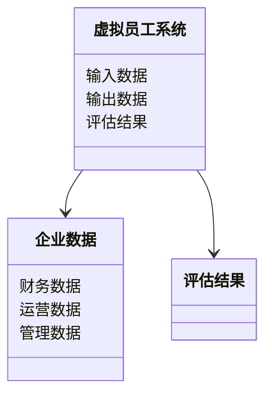
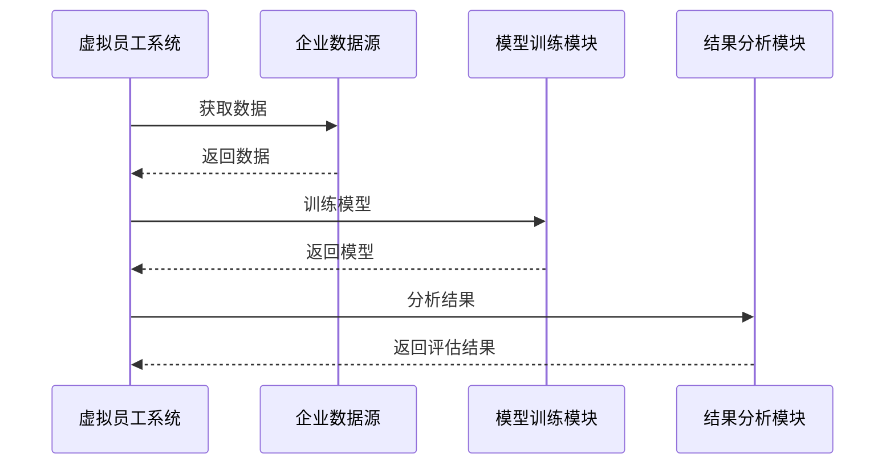

                 


# 企业估值中的AI驱动的虚拟员工系统评估

## 关键词：企业估值、人工智能、虚拟员工、系统评估、机器学习

## 摘要：本文深入探讨了在企业估值过程中，如何利用人工智能驱动的虚拟员工系统进行评估。通过分析AI技术在虚拟员工系统中的应用，构建了基于机器学习的评估模型，提出了系统化的解决方案，并通过实际案例验证了方法的有效性。文章从背景介绍、核心概念、算法原理、系统架构、项目实战到最佳实践，全面阐述了AI驱动的虚拟员工系统评估的理论与实践。

---

# 第一部分: 企业估值中的AI驱动的虚拟员工系统评估基础

# 第1章: 背景介绍

## 1.1 问题背景

### 1.1.1 企业估值的传统方法与挑战
传统的企业估值方法主要包括财务指标分析、市场比较法和DCF模型等。然而，这些方法依赖于大量人工数据收集、整理和分析，耗时且容易出错，难以快速响应市场变化。

### 1.1.2 虚拟员工系统在企业中的应用现状
虚拟员工系统通过自动化处理企业日常运营中的任务，如数据分析、客户沟通和流程管理，显著提高了企业的运营效率。然而，如何量化这些系统对企业价值的影响，成为企业估值中的新挑战。

### 1.1.3 AI技术在企业估值中的潜力与优势
AI技术可以通过大数据分析和机器学习模型，快速评估虚拟员工系统的性能和贡献，提供更精准的企业估值方法。

## 1.2 问题描述

### 1.2.1 虚拟员工系统评估的核心问题
如何量化虚拟员工系统对企业的贡献，如何建立科学的评估指标体系。

### 1.2.2 传统评估方法的局限性
传统方法依赖人工分析，耗时且不够精准，难以捕捉虚拟员工系统带来的动态价值变化。

### 1.2.3 AI驱动评估的必要性与可行性
AI技术能够快速处理大量数据，建立动态模型，实时评估虚拟员工系统的贡献。

## 1.3 问题解决

### 1.3.1 AI驱动的虚拟员工系统评估框架
构建基于AI的评估框架，包括数据采集、特征提取、模型训练和结果分析四个步骤。

### 1.3.2 关键技术与实现路径
采用机器学习算法，如线性回归和神经网络，构建评估模型。

### 1.3.3 评估结果对企业决策的影响
评估结果能够帮助企业优化资源配置，提升运营效率，提高企业估值。

## 1.4 系统的边界与外延

### 1.4.1 系统的输入与输出边界
输入包括虚拟员工系统运行数据、企业运营数据，输出包括评估结果和优化建议。

### 1.4.2 系统与企业其他模块的交互
系统与其他模块如财务系统、HR系统等进行数据交互，实现全面的企业评估。

### 1.4.3 系统的可扩展性与适应性
系统设计具有可扩展性，能够适应不同行业和不同规模的企业需求。

## 1.5 核心概念与联系

### 1.5.1 核心概念原理
虚拟员工系统通过自动化任务提升企业效率，AI技术能够量化其贡献。

### 1.5.2 概念属性特征对比表格
```markdown
| 概念 | 数据驱动 | AI算法 | 评估结果 |
|------|----------|--------|----------|
| 虚拟员工系统 | 是 | 是 | 影响企业估值 |
| 企业估值 | 是 | 否 | 传统方法依赖人工分析 |
```

### 1.5.3 ER实体关系图
```mermaid
erd
  虚拟员工系统
  ----> [包含] 
  企业数据
  ----> [影响]
  企业估值
```

## 1.6 本章小结

---

# 第2章: AI驱动的虚拟员工系统评估的核心概念

## 2.1 虚拟员工系统评估的基本原理

### 2.1.1 系统数据的采集与处理
数据采集包括虚拟员工系统的运行数据和企业运营数据，处理步骤包括数据清洗、特征提取和数据预处理。

### 2.1.2 数据特征的提取与分析
特征提取包括关键绩效指标（KPI）和任务完成效率等，分析步骤包括统计分析和可视化分析。

### 2.1.3 评估模型的构建与训练
构建机器学习模型，如线性回归和随机森林，使用训练数据进行模型训练。

## 2.2 AI算法在评估中的应用

### 2.2.1 机器学习算法的选择与优化
选择适合的算法，如支持向量机（SVM）和梯度提升树（GBDT），并对模型进行调参优化。

### 2.2.2 深度学习模型的构建与训练
构建神经网络模型，如多层感知机（MLP）和长短期记忆网络（LSTM），进行深度学习训练。

### 2.2.3 算法的可解释性与透明度
通过特征重要性分析和模型解释技术，提高算法的可解释性。

## 2.3 评估模型的数学模型与公式

### 2.3.1 线性回归模型
$$ y = \beta_0 + \beta_1x_1 + \beta_2x_2 + \epsilon $$

### 2.3.2 神经网络模型
神经网络模型由输入层、隐藏层和输出层组成，通过反向传播算法进行训练。

## 2.4 本章小结

---

# 第3章: 系统分析与架构设计

## 3.1 问题场景介绍

### 3.1.1 企业估值的复杂性
企业估值需要考虑多个因素，如财务状况、市场环境和管理能力。

### 3.1.2 虚拟员工系统的动态性
虚拟员工系统的性能会随着时间变化，需要动态评估。

## 3.2 项目介绍

### 3.2.1 项目目标
建立基于AI的虚拟员工系统评估模型，提供准确的企业估值。

### 3.2.2 项目范围
涵盖数据采集、模型训练和结果分析。

## 3.3 系统功能设计

### 3.3.1 领域模型图


### 3.3.2 系统架构设计
系统架构包括数据采集模块、模型训练模块和结果分析模块。

### 3.3.3 系统接口设计
系统通过API接口与企业数据源进行数据交互。

### 3.3.4 系统交互设计


## 3.4 本章小结

---

# 第4章: 项目实战

## 4.1 环境安装

### 4.1.1 安装Python和相关库
安装Python和机器学习库，如scikit-learn、TensorFlow和Pandas。

### 4.1.2 数据采集与预处理
使用API接口获取企业数据，进行数据清洗和特征工程。

## 4.2 系统核心实现源代码

### 4.2.1 数据处理代码
```python
import pandas as pd
from sklearn.model_selection import train_test_split
from sklearn.metrics import accuracy_score

# 数据加载
data = pd.read_csv('employee_data.csv')
# 数据预处理
data.dropna(inplace=True)
# 划分训练集和测试集
X_train, X_test, y_train, y_test = train_test_split(data.drop('valuation', axis=1), data['valuation'], test_size=0.2)
```

### 4.2.2 模型训练代码
```python
from sklearn.ensemble import RandomForestClassifier
from sklearn.metrics import classification_report

# 模型训练
model = RandomForestClassifier()
model.fit(X_train, y_train)
# 模型预测
y_pred = model.predict(X_test)
print(classification_report(y_test, y_pred))
```

## 4.3 案例分析

### 4.3.1 案例背景
某科技公司引入虚拟员工系统后，希望评估其对公司的贡献。

### 4.3.2 数据分析
通过数据处理和模型训练，评估虚拟员工系统的绩效指标。

### 4.3.3 结果解读
模型评估结果表明，虚拟员工系统显著提升了企业的运营效率和估值。

## 4.4 本章小结

---

# 第5章: 最佳实践与注意事项

## 5.1 小结

### 5.1.1 核心内容总结
本文详细介绍了AI驱动的虚拟员工系统评估的理论与实践，构建了基于机器学习的评估模型。

## 5.2 注意事项

### 5.2.1 数据质量的重要性
数据质量直接影响评估结果，需确保数据的准确性和完整性。

### 5.2.2 模型选择与调优
选择适合的算法，并进行参数调优，提高模型性能。

### 5.2.3 系统的可扩展性
系统设计需考虑可扩展性，适应不同规模和类型的企业需求。

## 5.3 拓展阅读

### 5.3.1 相关文献
推荐阅读关于机器学习和企业估值的经典文献。

### 5.3.2 实际应用案例
研究实际企业中AI驱动的虚拟员工系统评估案例。

---

# 作者：AI天才研究院/AI Genius Institute & 禅与计算机程序设计艺术 /Zen And The Art of Computer Programming

