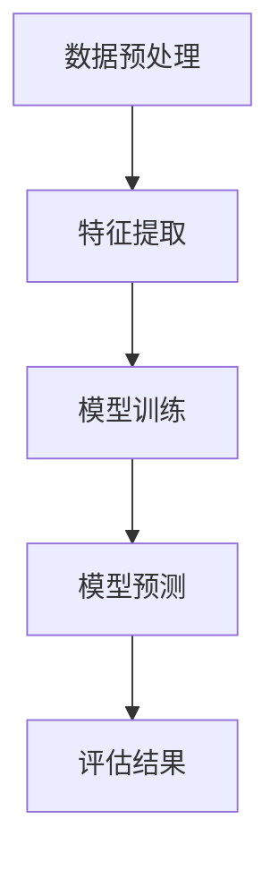
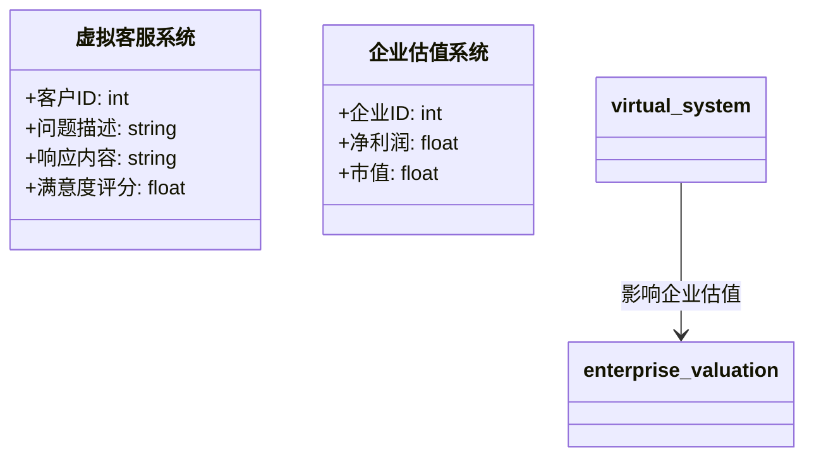

                 


# 企业估值中的AI驱动的虚拟客服系统评估

> 关键词：企业估值，AI驱动，虚拟客服系统，算法原理，系统架构，项目实战

> 摘要：本文将详细探讨如何利用AI技术对虚拟客服系统进行企业估值。通过分析虚拟客服系统的功能、数据特征和AI算法，本文将提供一套基于AI的系统评估方法，涵盖从理论到实践的完整流程。

---

# 第一部分: 企业估值中的AI驱动的虚拟客服系统评估背景介绍

## 第1章: 虚拟客服系统概述

### 1.1 什么是虚拟客服系统
#### 1.1.1 虚拟客服系统的定义
虚拟客服系统（Virtual Customer Service System）是一种基于人工智能和自然语言处理技术的自动化客户服务解决方案，能够通过文本、语音或图形界面与用户进行交互，解决常见问题、提供信息支持或路由请求到人工客服。

#### 1.1.2 虚拟客服系统的演变历程
1. **传统客服系统**：依赖人工坐席执行，效率低下，成本高昂。
2. **自动交互系统**：基于规则的自动响应，适用于简单问题。
3. **智能客服系统**：结合自然语言处理（NLP）和机器学习（ML），能够理解上下文和情感，提供更智能的服务。

#### 1.1.3 虚拟客服系统的应用场景
- **客户支持**：常见问题解答、产品信息查询。
- **销售支持**：提供产品推荐、订单跟踪。
- **售后服务**：处理退换货、投诉反馈。

---

### 1.2 企业估值的基本概念
#### 1.2.1 企业估值的定义
企业估值是通过对企业财务数据、市场表现和业务模式的分析，估算企业价值的过程。常用的方法包括DCF模型（ discounted cash flow ）、市盈率（P/E ratio）、市净率（P/B ratio）等。

#### 1.2.2 企业估值的主要方法
1. **DCF模型**：基于未来现金流的折现。
2. **相对估值法**：与行业可比公司的估值进行对比。
3. **资产基础法**：基于资产负债表评估企业价值。

#### 1.2.3 企业估值与虚拟客服系统的关联
虚拟客服系统作为企业客户服务的重要组成部分，其效率和质量直接影响客户满意度和企业形象，进而影响企业估值。高效的虚拟客服系统可以降低成本、提高客户忠诚度，从而提升企业估值。

---

## 第2章: AI驱动的虚拟客服系统评估的重要性

### 2.1 传统客服系统评估的局限性
#### 2.1.1 传统客服系统的评估指标
- 响应时间
- 解决问题效率
- 客户满意度

#### 2.1.2 传统客服系统评估的难点
- 数据收集成本高
- 评估指标单一
- 缺乏实时反馈

#### 2.1.3 传统客服系统评估的不足
- 无法捕捉客户情感和意图
- 无法实时优化服务流程
- 缺乏数据驱动的决策支持

### 2.2 AI驱动的虚拟客服系统评估的优势
#### 2.2.1 数据驱动的精准评估
- 利用大数据分析客户行为和反馈，提供更精准的评估结果。
- 通过机器学习模型预测客户满意度和忠诚度。

#### 2.2.2 智能算法的高效性
- 自然语言处理技术能够理解客户的复杂需求。
- 机器学习算法能够实时优化服务流程。

#### 2.2.3 实时反馈的及时性
- AI系统可以实时监控客户互动，快速调整服务策略。
- 提供实时报告，帮助企业及时发现问题并进行优化。

---

# 第二部分: AI驱动的虚拟客服系统评估的核心概念与联系

## 第3章: 核心概念与原理

### 3.1 AI驱动的虚拟客服系统评估的核心要素
#### 3.1.1 数据输入
- 客户互动数据（文本、语音、表情）
- 历史客服数据
- 企业财务数据

#### 3.1.2 模型构建
- NLP模型（如BERT、GPT）
- 机器学习模型（如随机森林、神经网络）

#### 3.1.3 评估输出
- 客户满意度评分
- 服务效率指标
- 企业估值建议

### 3.2 核心概念的ER实体关系图
```mermaid
er
    entity 客户 {
        key 客户ID
        attribute 姓名
        attribute 联系方式
    }
    entity 客服记录 {
        key 记录ID
        attribute 时间戳
        attribute 问题描述
        attribute 响应内容
    }
    entity 企业估值 {
        key 企业ID
        attribute 净利润
        attribute 市值
    }
    客户 --> 客服记录: 提交问题
    客服记录 --> 企业估值: 影响估值
```

---

## 第4章: AI驱动的虚拟客服系统评估的核心概念与联系

### 4.1 核心概念的原理
- **NLP技术**：用于理解客户的问题和情感。
- **机器学习**：用于预测客户满意度和优化服务流程。

### 4.2 核心概念的属性对比
| 属性       | 传统客服系统 | AI驱动的虚拟客服系统 |
|------------|--------------|-----------------------|
| 响应时间   | 较长         | 实时                   |
| 解决问题效率 | 低           | 高                     |
| 客户满意度 | 一般         | 高                     |

### 4.3 核心概念的联系
- NLP技术帮助系统理解客户意图，机器学习算法优化服务流程，从而提升客户满意度和企业估值。

---

## 第5章: 算法原理

### 5.1 算法原理概述
- **输入**：客户互动数据（文本、语音）。
- **处理**：NLP模型提取关键信息，机器学习模型预测客户满意度。
- **输出**：评估结果和优化建议。

### 5.2 算法实现流程


### 5.3 核心算法的数学模型
#### 5.3.1 损失函数
$$ L = -\frac{1}{m} \sum_{i=1}^{m} y_i \log(p_i) + (1 - y_i) \log(1 - p_i) $$
其中，\( L \) 是损失函数，\( y_i \) 是真实标签，\( p_i \) 是预测概率。

#### 5.3.2 优化器
$$ \theta = \theta - \eta \frac{\partial L}{\partial \theta} $$
其中，\( \theta \) 是模型参数，\( \eta \) 是学习率。

---

## 第6章: 系统分析与架构设计

### 6.1 系统应用场景
- **客户支持**：常见问题解答。
- **销售支持**：产品推荐、订单跟踪。
- **售后服务**：投诉处理。

### 6.2 系统功能设计


---

## 第7章: 项目实战

### 7.1 环境安装
- **Python**：3.8+
- **库依赖**：numpy, pandas, scikit-learn, transformers

### 7.2 核心代码实现

#### 7.2.1 数据预处理
```python
import pandas as pd

# 读取数据
data = pd.read_csv('customer_service.csv')

# 清洗数据
data = data.dropna()
data['label'] = data['label'].astype(int)
```

#### 7.2.2 模型训练
```python
from sklearn.model

