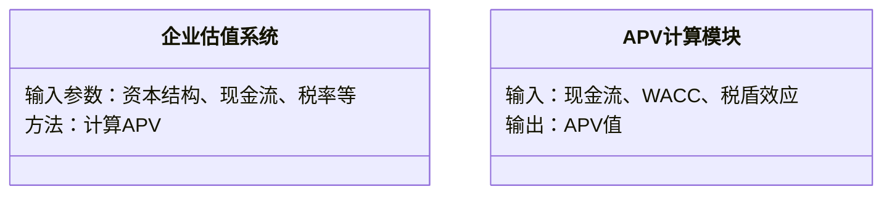
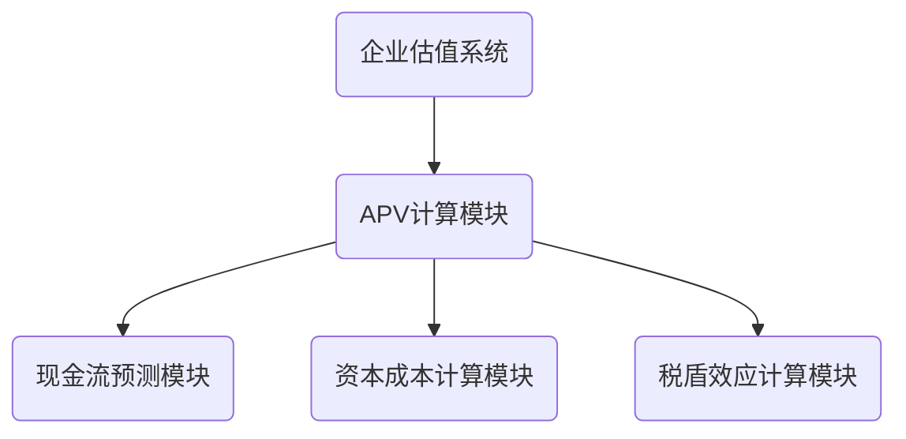

                 


# 《企业估值中的APV法》

> 关键词：企业估值，APV法，税盾效应，加权平均资本成本，资本结构

> 摘要：本文详细探讨了APV法在企业估值中的应用，从核心概念、数学模型、算法实现到系统设计和项目实战，全面解析了APV法的原理和应用。通过实例分析，展示了如何利用APV法进行企业价值评估，为企业估值提供了新的视角和方法。

---

## 第1章：APV法的核心概念与背景介绍

### 1.1 企业估值的基本问题

#### 1.1.1 企业估值的定义与意义

企业估值是通过对企业的资产、负债、盈利能力、市场地位等多方面因素的综合评估，确定其市场价值的过程。准确的企业估值对于投资者、企业管理者和资本市场参与者具有重要意义，它影响着企业的融资决策、并购活动以及股价评估。

#### 1.1.2 传统企业估值方法的局限性

传统的估值方法如DCF（Discounted Cash Flow）和WACC（Weighted Average Cost of Capital）虽然广泛应用，但也存在一些局限性。例如，DCF法依赖于对未来现金流的准确预测，而WACC法在处理杠杆和税盾效应时相对复杂。

#### 1.1.3 APV法的提出与应用背景

APV法作为一种调整现值法，起源于20世纪70年代，由 economists 如 Franco Modigliani 和 Merton Miller 提出。它通过考虑税盾效应，提供了另一种企业估值的方法，特别适用于杠杆企业。

### 1.2 APV法的定义与特点

#### 1.2.1 APV法的定义

APV法是指将企业自由现金流按无杠杆的加权平均资本成本进行折现，再加上税盾效应的价值，得到的企业整体价值。公式如下：

$$APV = PV(FCF) + PV(税盾效应)$$

其中，PV代表现值，FCF代表自由现金流。

#### 1.2.2 APV法的核心要素

1. 企业自由现金流（FCF）：企业在一定期间内产生的现金流，扣除所有支出后的净现金流。
2. 加权平均资本成本（WACC）：企业资本的平均成本，用于折现现金流。
3. 税盾效应：由于债务的利息可以在税前列支，带来的税后节省。

#### 1.2.3 APV法与传统估值方法的区别

- DCF法直接折现现金流，不考虑资本结构。
- WACC法将资本结构考虑在内，但计算复杂。
- APV法分开计算企业价值和税盾效应，简化了杠杆对企业价值的影响。

### 1.3 APV法的理论基础

#### 1.3.1 税盾效应的经济学原理

税盾效应是指由于债务利息可以在税前列支，企业可以减少税负，从而增加企业价值。税盾价值的计算公式为：

$$PV(税盾) = D \times t_c \times \frac{1}{(1 + r_d)^n}$$

其中，D为债务总额，t_c为税率，r_d为债务成本，n为时间。

#### 1.3.2 资本结构与企业价值的关系

资本结构影响税盾效应，从而影响企业价值。在APV法中，资本结构只影响税盾部分，而企业自由现金流的现值部分与资本结构无关。

#### 1.3.3 APV法的数学模型与公式

APV法的基本公式：

$$APV = PV(FCF) + PV(税盾)$$

其中，PV(FCF)使用无杠杆的WACC进行折现：

$$PV(FCF) = \sum_{t=1}^{n} \frac{FCF_t}{(1 + WACC)^t}$$

税盾部分的现值计算：

$$PV(税盾) = \sum_{t=1}^{n} \frac{利息_t \times t_c}{(1 + r_d)^t}$$

---

## 第2章：APV法的核心概念与联系

### 2.1 APV法的核心原理

#### 2.1.1 调整现值法的基本原理

APV法通过将企业分为两部分：企业价值和税盾效应，分别计算现值，然后相加得到总体价值。

#### 2.1.2 税盾效应的数学表达

税盾效应的具体公式：

$$PV(税盾) = t_c \times \sum_{t=1}^{n} \frac{D_t \times r_d}{(1 + r_d)^t}$$

其中，D_t为第t期的债务，r_d为债务成本，t_c为税率。

#### 2.1.3 APV法与WACC法的区别

- WACC法将税盾效应包含在WACC中，影响折现率。
- APV法将税盾效应单独计算，作为额外价值加到企业价值中。

### 2.2 APV法的核心要素分析

#### 2.2.1 企业自由现金流的预测

企业自由现金流的计算公式：

$$FCF = EBIT(1 - t) + Depreciation - Capital Expenditure$$

其中，EBIT为息税前利润，t为税率，Depreciation为折旧，Capital Expenditure为资本支出。

#### 2.2.2 加权平均资本成本的计算

WACC的计算公式：

$$WACC = \frac{D}{D + E} \times r_d \times (1 - t) + \frac{E}{D + E} \times r_e$$

其中，D为债务，E为权益，r_d为债务成本，t为税率，r_e为权益成本。

#### 2.2.3 税盾效应的具体体现

税盾效应的影响主要体现在债务融资带来的税后利息节省，从而增加企业价值。

### 2.3 APV法与企业价值的关系

#### 2.3.1 企业价值的构成要素

企业价值由两部分组成：企业自由现金流的现值和税盾效应的现值。

#### 2.3.2 APV法在企业价值评估中的应用

APV法适用于杠杆企业，能够分离企业价值和税盾效应，便于分析资本结构的影响。

#### 2.3.3 APV法的优缺点分析

- 优点：计算简单，分离了税盾效应。
- 缺点：假设税盾效应是唯一的杠杆影响，忽略了其他因素。

---

## 第3章：APV法的数学模型与公式

### 3.1 APV法的基本公式

#### 3.1.1 企业自由现金流的现值公式

$$PV(FCF) = \sum_{t=1}^{n} \frac{FCF_t}{(1 + WACC)^t}$$

#### 3.1.2 加权平均资本成本的计算公式

$$WACC = \frac{D}{D + E} \times r_d \times (1 - t) + \frac{E}{D + E} \times r_e$$

#### 3.1.3 税盾效应的计算公式

$$PV(税盾) = t_c \times \sum_{t=1}^{n} \frac{D_t \times r_d}{(1 + r_d)^t}$$

### 3.2 APV法的扩展公式

#### 3.2.1 不同资本结构下的APV计算

$$APV = PV(FCF) + t_c \times D \times \frac{r_d}{(1 + r_d)^n}$$

#### 3.2.2 不同税率下的APV调整

$$APV = PV(FCF) + t_c \times D \times \frac{r_d}{(1 + r_d)^n}$$

#### 3.2.3 不同行业中的APV应用

不同行业的税率和资本结构不同，APV计算需要根据具体情况调整。

### 3.3 APV法的数学推导

#### 3.3.1 从WACC到APV的推导过程

WACC法中，税盾效应已经包含在WACC中，而APV法将其分离出来单独计算。

---

## 第4章：APV法的算法原理与实现

### 4.1 APV法的算法步骤

#### 4.1.1 确定企业自由现金流

计算企业自由现金流，考虑EBIT、税率、折旧和资本支出。

#### 4.1.2 计算加权平均资本成本

根据资本结构、债务成本和权益成本计算WACC。

#### 4.1.3 计算税盾效应

根据债务总额、税率和债务成本计算税盾现值。

#### 4.1.4 计算APV

将企业自由现金流的现值和税盾效应的现值相加，得到APV。

---

## 第5章：系统分析与架构设计方案

### 5.1 问题场景介绍

企业估值系统需要考虑多种因素，APV法可以作为其中一种估值方法。

### 5.2 系统功能设计

#### 5.2.1 领域模型类图



#### 5.2.2 系统架构设计



### 5.3 系统接口设计

接口定义：
- 输入：资本结构、现金流、税率
- 输出：APV值

### 5.4 系统交互设计

```mermaid
sequenceDiagram
    participant 用户
    participant 企业估值系统
    participant APV计算模块
    用户 -> 企业估值系统：输入参数
    企业估值系统 -> APV计算模块：计算APV
    APV计算模块 -> 企业估值系统：返回APV值
    企业估值系统 -> 用户：显示结果
```

---

## 第6章：项目实战

### 6.1 环境安装

需要安装Python和相关库，如numpy和pandas。

### 6.2 核心代码实现

```python
import numpy as np

def calculate_wacc(D, E, r_d, t, r_e):
    wacc = (D / (D + E)) * r_d * (1 - t) + (E / (D + E)) * r_e
    return wacc

def calculate_apv(FCF, wacc, tax_shield):
    apv = np.npvp(FCF, wacc) + np.npvp(tax_shield, wacc)
    return apv
```

### 6.3 案例分析

假设某企业债务D=1000，权益E=500，r_d=5%，t=20%，r_e=10%。计算WACC和APV。

---

## 第7章：总结与展望

### 7.1 最佳实践

- 确保现金流预测的准确性
- 合理估计资本成本和税率
- 考虑行业特点和具体情境

### 7.2 小结

APV法通过分离税盾效应，提供了另一种企业估值的方法，适用于杠杆企业。

### 7.3 注意事项

- 税率变化会影响税盾效应
- 假设资本结构不变

### 7.4 拓展阅读

建议阅读Modigliani和Miller的相关论文，深入理解APV法的理论基础。

---

作者：AI天才研究院 & 禅与计算机程序设计艺术

