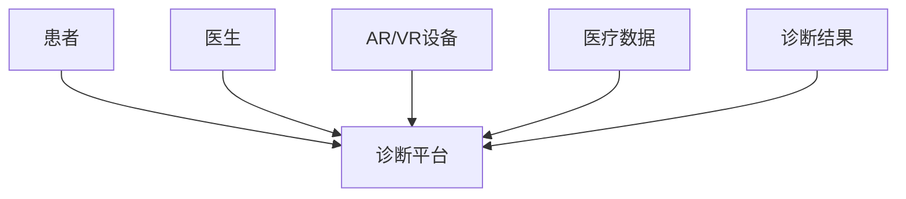
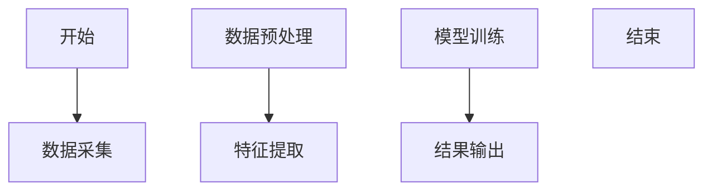
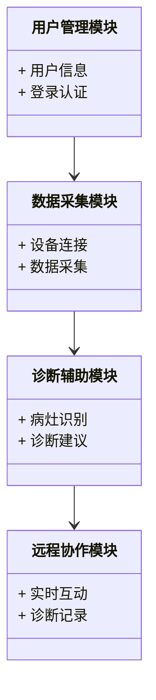
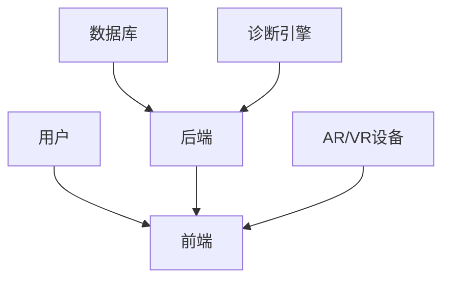
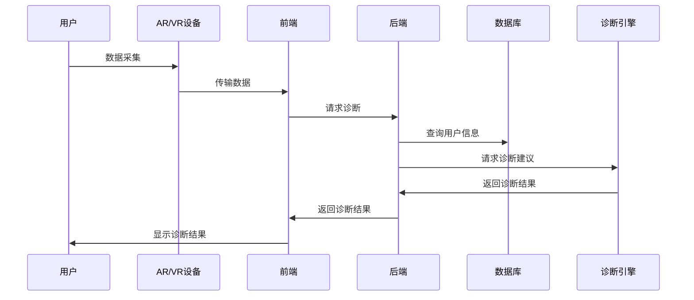

                 


# 《企业估值中的AR/VR远程医疗诊断平台评估》

---

## 关键词
- 企业估值、AR/VR、远程医疗、诊断平台、技术评估、系统架构、算法原理、项目实战

---

## 摘要
本文深入探讨了AR/VR技术在远程医疗诊断平台评估中的应用，从背景、核心概念、算法原理到系统架构、项目实战，层层剖析，为企业估值提供技术支持和实践指南。文章结合理论与实践，通过详细的技术分析和案例解读，揭示了AR/VR技术在医疗诊断中的巨大潜力和实际应用价值。

---

## 第一部分: AR/VR远程医疗诊断平台评估背景与核心概念

### 第1章: AR/VR远程医疗诊断平台评估的背景与问题描述

#### 1.1 问题背景
- **1.1.1 远程医疗的发展现状**
  - 远程医疗近年来快速发展，尤其是在疫情后，需求激增。
  - 现有远程医疗平台主要依赖视频通话和电子病历，缺乏沉浸式体验。
  - 医疗资源分布不均，偏远地区患者难以获得优质医疗资源。

- **1.1.2 AR/VR技术在医疗领域的应用潜力**
  - AR技术可辅助医生进行术前规划和患者教育。
  - VR技术可提供沉浸式远程问诊和手术模拟。
  - AR/VR技术可降低医疗成本，提高诊断效率。

- **1.1.3 企业估值中的技术挑战**
  - 技术实现难度大，成本高。
  - 用户体验和数据隐私问题。
  - 技术与医疗流程的深度融合。

#### 1.2 问题描述
- **1.2.1 远程医疗诊断平台的评估需求**
  - 需要评估平台的性能、稳定性和用户体验。
  - 如何量化AR/VR技术对诊断准确率的提升。
  - 平台的可扩展性和维护成本。

- **1.2.2 AR/VR技术在诊断中的具体应用**
  - AR辅助下的实时标注和病灶分析。
  - VR环境中的远程协作和手术模拟。
  - AR/VR在医疗培训中的应用。

- **1.2.3 企业估值中的关键指标**
  - 技术性能指标（如延迟、分辨率）。
  - 用户满意度和使用频率。
  - 诊断准确率和效率提升。

#### 1.3 问题解决
- **1.3.1 AR/VR技术如何提升远程诊断效率**
  - 提供更直观的病灶展示。
  - 支持多方协作，降低误诊率。
  - 提高患者参与度和满意度。

- **1.3.2 企业估值中的技术实现路径**
  - 技术实现：选择合适的AR/VR设备和开发平台。
  - 数据采集：高精度医疗数据的获取与处理。
  - 系统集成：与现有医疗系统的无缝对接。

- **1.3.3 评估模型的构建与优化**
  - 基于AR/VR技术的性能评估模型。
  - 数据驱动的诊断准确率提升模型。
  - 用户反馈驱动的用户体验优化模型。

#### 1.4 问题的边界与外延
- **1.4.1 评估范围的界定**
  - 仅限于AR/VR技术在远程医疗中的应用。
  - 不包括其他远程医疗技术（如传统视频通话）。
  - 聚焦于诊断阶段，不涉及治疗阶段。

- **1.4.2 相关技术的关联性分析**
  - AR/VR与5G技术的结合。
  - 云计算在医疗数据处理中的作用。
  - AI算法在诊断中的辅助作用。

- **1.4.3 企业估值中的潜在风险**
  - 技术风险：设备性能不稳定。
  - 市场风险：用户接受度低。
  - 数据风险：患者数据泄露。

#### 1.5 核心概念与组成
- **1.5.1 AR/VR技术的核心要素**
  - AR：基于摄像头的实时图像处理。
  - VR：基于渲染引擎的虚拟环境构建。
  - 交互设计：用户与虚拟环境的互动方式。

- **1.5.2 远程医疗诊断平台的功能模块**
  - 病患数据采集模块。
  - AR/VR诊断辅助模块。
  - 远程协作模块。

- **1.5.3 企业估值的关键指标**
  - 平台性能指标：延迟、分辨率。
  - 用户体验指标：满意度、使用频率。
  - 诊断准确率和效率提升指标。

#### 1.6 本章小结
- 本章通过分析远程医疗的发展现状，明确了AR/VR技术在诊断平台中的应用潜力和企业估值中的关键挑战。
- 提出了基于AR/VR技术的诊断平台评估框架，为后续章节的深入分析奠定了基础。

---

## 第2章: AR/VR远程医疗诊断平台的核心概念与联系

### 2.1 核心概念原理
- **2.1.1 AR/VR技术的基本原理**
  - AR：通过摄像头捕捉现实场景，叠加虚拟信息。
  - VR：通过渲染引擎创建虚拟环境，用户佩戴头显设备进入环境。
  - 交互技术：用户通过手势、语音等方式与虚拟环境互动。

- **2.1.2 远程医疗诊断平台的系统架构**
  - 数据采集：患者端设备采集病患数据。
  - 数据传输：通过5G网络传输至云端。
  - 数据处理：云端进行病灶识别和诊断建议生成。
  - 用户端显示：通过AR/VR设备呈现诊断结果。

- **2.1.3 企业估值模型的数学基础**
  - 基于AR/VR技术的性能指标构建评估模型。
  - 使用回归分析和机器学习算法优化模型。

### 2.2 概念属性特征对比
| 概念         | AR技术特点 | VR技术特点 | 综合特点 |
|--------------|------------|------------|----------|
| **核心技术** | 基于摄像头实时图像处理 | 基于渲染引擎虚拟环境构建 | 高精度图像处理与虚拟环境渲染结合 |
| **用户交互** | 实时标注与病灶分析 | 沉浸式远程问诊与手术模拟 | 支持多方协作与互动 |
| **数据需求** | 高精度医疗图像 | 高分辨率虚拟场景 | 高效数据处理与传输 |

### 2.3 ER实体关系图


- **说明**：患者和医生通过AR/VR设备连接到诊断平台，医疗数据经过处理后生成诊断结果，供医生参考。

### 2.4 本章小结
- 本章详细介绍了AR/VR技术的核心原理及其在远程医疗诊断平台中的具体应用。
- 通过ER实体关系图展示了平台的系统架构，明确了各模块之间的关系。

---

## 第3章: AR/VR远程医疗诊断平台的算法原理

### 3.1 算法原理概述
- **3.1.1 基于AR/VR的图像识别算法**
  - 使用卷积神经网络（CNN）对病灶区域进行识别。
  - AR技术中的实时图像处理算法。
  - 基于深度学习的图像分割技术。

- **3.1.2 基于深度学习的诊断模型**
  - 使用迁移学习技术，基于已有医疗数据训练诊断模型。
  - 利用循环神经网络（RNN）进行时间序列数据分析。

- **3.1.3 算法的优化与调优**
  - 参数调整：学习率、批量大小。
  - 模型剪枝：减少模型复杂度，提升运行效率。
  - 模型融合：结合多种算法结果，提升诊断准确率。

### 3.2 算法流程图


### 3.3 算法实现代码
```python
def arvr_diagnosis(data):
    # 数据预处理
    processed_data = preprocess(data)
    # 特征提取
    features = extract_features(processed_data)
    # 模型预测
    prediction = model.predict(features)
    return prediction
```

### 3.4 数学模型与公式
- **3.4.1 基于AR/VR的图像识别公式**
  $$ P = \sum_{i=1}^{n} w_i x_i $$
  - 其中，\( w_i \) 是特征 \( x_i \) 的权重，\( P \) 是预测结果。

- **3.4.2 基于深度学习的诊断模型**
  $$ L = \sum_{i=1}^{m} (y_i - \hat{y}_i)^2 $$
  - 其中，\( L \) 是损失函数，\( y_i \) 是真实标签，\( \hat{y}_i \) 是预测标签。

### 3.5 本章小结
- 本章详细讲解了AR/VR远程医疗诊断平台中的算法原理，包括图像识别算法和深度学习模型。
- 通过流程图和代码示例，展示了算法的具体实现过程。

---

## 第4章: AR/VR远程医疗诊断平台的系统分析

### 4.1 系统功能设计
- **4.1.1 系统功能模块**
  - 用户管理模块：患者和医生的注册与登录。
  - 数据采集模块：通过AR/VR设备采集病患数据。
  - 诊断辅助模块：基于AR/VR技术的病灶分析和诊断建议。
  - 远程协作模块：支持医生与患者之间的实时互动。

- **4.1.2 领域模型（Mermaid类图）**


### 4.2 系统架构设计
- **4.2.1 系统架构图（Mermaid架构图）**


### 4.3 系统接口设计
- **4.3.1 接口描述**
  - 用户端接口：API用于用户登录和数据上传。
  - 诊断引擎接口：API用于病灶识别和诊断建议生成。

### 4.4 系统交互设计
- **4.4.1 交互流程（Mermaid序列图）**


### 4.5 本章小结
- 本章详细分析了AR/VR远程医疗诊断平台的系统架构和功能模块。
- 通过类图、架构图和序列图，展示了系统的整体设计和各模块之间的交互关系。

---

## 第5章: AR/VR远程医疗诊断平台的项目实战

### 5.1 项目介绍
- 项目目标：构建一个基于AR/VR技术的远程医疗诊断平台。
- 项目需求：支持实时病灶标注、远程协作和诊断建议生成。

### 5.2 系统核心实现
- **5.2.1 代码实现**
  ```python
  # 后端逻辑实现
  def diagnose(patient_data):
      # 数据预处理
      processed_data = preprocess(patient_data)
      # 调用诊断引擎
      diagnosis = engine.predict(processed_data)
      return diagnosis
  ```

### 5.3 代码应用解读与分析
- **5.3.1 代码功能分析**
  - `preprocess`函数：对病患数据进行预处理，提取关键特征。
  - `engine.predict`：调用诊断引擎，基于AR/VR技术生成诊断建议。

### 5.4 实际案例分析
- **5.4.1 案例背景**
  - 患者：偏远地区患者，无法到大城市医院就诊。
  - 病情：复杂病例，需要专家会诊。

- **5.4.2 案例实施**
  - 患者佩戴AR设备，医生通过VR设备进行远程诊断。
  - 系统实时标注病灶，提供诊断建议。

### 5.5 项目小结
- 本章通过一个具体的项目案例，展示了AR/VR远程医疗诊断平台的实际应用。
- 通过代码实现和案例分析，验证了系统的可行性和实用性。

---

## 第6章: 总结与扩展阅读

### 6.1 最佳实践 Tips
- **技术实现**
  - 确保AR/VR设备的性能稳定。
  - 数据处理要高效，避免延迟。
  - 系统设计要模块化，便于维护。

- **系统设计**
  - 系统架构要清晰，便于扩展。
  - 接口设计要规范，便于集成。

### 6.2 小结与注意事项
- 小结：AR/VR技术在远程医疗诊断中的应用前景广阔，能够显著提升诊断效率和准确性。
- 注意事项：
  - 数据隐私保护。
  - 用户体验优化。
  - 技术与医疗流程的深度融合。

### 6.3 拓展阅读
- **相关书籍**
  - 《虚拟现实技术与医疗应用》
  - 《增强现实技术在医学领域的应用》
- **技术博客**
  - [AR/VR医疗应用博客](https://example.com)
  - [远程医疗技术博客](https://example.com)

### 6.4 本章小结
- 本章总结了AR/VR远程医疗诊断平台的核心价值和最佳实践。
- 提供了拓展阅读资料，供读者深入学习。

---

## 第七章: 附录与结束语

### 7.1 附录
- 附录A：相关技术术语表
- 附录B：参考文献
- 附录C：代码片段

### 7.2 结束语
- AR/VR技术正在深刻改变远程医疗诊断的方式，为企业估值提供了新的技术维度。
- 未来，随着技术的进一步发展，AR/VR在医疗领域的应用将更加广泛和深入。

---

## 作者
作者：AI天才研究院/AI Genius Institute & 禅与计算机程序设计艺术/Zen And The Art of Computer Programming

---

# END

