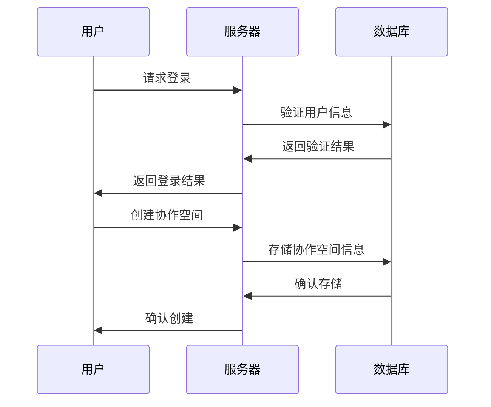

                 


# 《企业估值中的AR/VR远程协作平台评估》

> 关键词：企业估值, AR/VR, 远程协作, 平台评估, 技术分析

> 摘要：本文详细探讨了在企业估值过程中，如何评估AR/VR远程协作平台的价值。通过分析技术架构、用户行为、协作流程等多个维度，结合实际案例和系统设计，提供了全面的评估方法和策略。

## 第一部分: AR/VR远程协作平台概述

### 第1章: AR/VR远程协作平台的背景与概念

#### 1.1 什么是AR/VR远程协作平台

- **1.1.1 AR/VR技术的基本概念**
  - 增强现实（AR）：通过计算机技术将虚拟信息叠加在真实环境中，如在现实环境中叠加虚拟物体或信息。
  - 虚拟现实（VR）：创建完全虚拟的环境，用户通过佩戴设备完全沉浸其中。
  - AR/VR的共同点：利用计算机生成的视觉元素，增强用户与环境的互动。

- **1.1.2 远程协作平台的定义**
  - 远程协作：指不同地点的人员通过网络进行实时互动，完成共同任务。
  - AR/VR远程协作：结合AR/VR技术，使用户在虚拟环境中进行协作，突破物理限制。

- **1.1.3 AR/VR与远程协作的结合**
  - 提供沉浸式体验，增强团队协作效率。
  - 适用于设计、教育、医疗等多个领域，提升协作效果。

#### 1.2 企业估值中的协作需求

- **1.2.1 企业协作的重要性**
  - 协作效率直接影响企业生产力。
  - 有效协作能降低沟通成本，提高决策速度。

- **1.2.2 远程协作的挑战与机遇**
  - 挑战：技术实现复杂，网络延迟，设备兼容性问题。
  - 机遇：突破地理限制，提升协作灵活性。

- **1.2.3 AR/VR在企业协作中的潜力**
  - 提供更直观的协作体验。
  - 促进创新思维，提升问题解决效率。

### 第2章: AR/VR远程协作的核心要素

#### 2.1 技术架构

- **2.1.1 硬件设备**
  - 头显设备：如 Oculus Rift、HTC Vive，提供沉浸式体验。
  - 手势识别设备：如 Leap Motion，支持自然交互。
  - 网络设备：高速稳定的网络是实现低延迟的关键。

- **2.1.2 软件平台**
  - 平台功能：包括三维空间建模、实时互动、数据同步。
  - 开发工具：如 Unity、Unreal Engine，用于构建虚拟环境。
  - 后端系统：管理用户数据、协作内容，提供API接口。

- **2.1.3 网络基础设施**
  - 网络延迟：直接影响协作体验，需低于20ms。
  - 带宽需求：高清画质和实时数据传输需要高带宽。
  - 服务器架构：分布式服务器部署，提升稳定性。

#### 2.2 用户角色与权限

- **2.2.1 用户类型**
  - 普通用户：参与协作，拥有基本权限。
  - 管理员：负责平台管理，权限控制。
  - 开发者：负责平台维护和功能扩展。

- **2.2.2 权限管理**
  - 访问权限：根据角色分配不同访问权限。
  - 操作权限：如编辑、删除权限，确保数据安全。
  - 权限策略：动态调整权限，适应协作需求。

- **2.2.3 用户行为分析**
  - 行为数据收集：记录用户操作，分析协作效率。
  - 用户画像：基于行为数据，划分用户类型。
  - 个性化推荐：根据用户行为，推荐协作工具和资源。

#### 2.3 协作流程与功能模块

- **2.3.1 三维空间建模**
  - 建模工具：如 Blender，用于创建虚拟场景。
  - 场景编辑：支持用户自定义协作空间。
  - 实时更新：协作过程中动态更新场景。

- **2.3.2 实时互动功能**
  - �身历其境：用户在虚拟环境中面对面交流。
  - 协作工具：如白板、注释工具，支持多人协作。
  - 互动反馈：实时显示用户操作结果，增强互动体验。

- **2.3.3 数据同步机制**
  - 数据存储：协作数据实时保存，防止数据丢失。
  - 同步算法：采用分布式系统，确保数据一致性。
  - 同步延迟：优化算法，减少同步延迟，提升协作流畅度。

### 第3章: AR/VR远程协作平台的核心概念与联系

#### 3.1 核心概念原理

- **3.1.1 技术架构原理**
  - 系统分为前端和后端，前端处理用户输入和显示，后端处理数据存储和同步。
  - 使用 WebSocket 实现实时通信，确保低延迟。

- **3.1.2 用户角色与权限管理**
  - 基于角色的访问控制（RBAC）模型，确保权限管理的灵活性和安全性。
  - 权限策略动态调整，适应不同的协作场景。

- **3.1.3 协作流程与功能模块**
  - 协作流程包括：用户登录、创建/加入协作空间、进行协作、保存/导出成果。
  - 功能模块如三维建模工具、实时互动工具，支持协作过程的各个阶段。

#### 3.2 核心概念对比与分析

- **3.2.1 AR/VR与远程协作的对比**
  | 特性       | AR         | VR         |
  |------------|------------|------------|
  | 场景       | 现实环境增强 | 完全虚拟环境 |
  | 交互方式   | 叠加虚拟元素 | 完全沉浸式体验 |
  | 应用场景   | 教育、导航 | 游戏、模拟训练 |

- **3.2.2 用户角色与权限对比**
  | 用户角色   | 普通用户 | 管理员 | 开发者 |
  |------------|----------|--------|--------|
  | 权限       | 读写协作数据 | 管理用户、权限 | 维护平台、开发功能 |
  | 行为分析   | 操作频率、错误率 | 登录频率、权限调整 | API调用频率、功能使用情况 |

#### 3.3 实体关系图（ER图）架构

```mermaid
erd
  entity 用户 {
    User ID
    用户名
    密码
    角色
  }

  entity 协作空间 {
    空间ID
    空间名称
    创建时间
    所属用户
  }

  entity 协作数据 {
    数据ID
    数据类型
    数据内容
    协作空间ID
  }

  user -o[创建]-> 协作空间
  user <--> 协作数据
  协作空间 <-o[拥有]-> 协作数据
```

## 第四部分: AR/VR远程协作平台的评估指标与方法

### 第4章: 评估指标体系

#### 4.1 技术指标

- **4.1.1 系统响应时间**
  - 定义：从用户操作到系统反馈的时间，包括渲染延迟、网络延迟等。
  - 评估标准：系统响应时间需低于20ms，确保实时性。

- **4.1.2 网络延迟**
  - 定义：数据从发送端到接收端的时间延迟。
  - 评估标准：端到端延迟低于50ms，确保协作流畅。

- **4.1.3 设备兼容性**
  - 定义：平台支持的硬件设备种类和兼容性。
  - 评估标准：支持主流头显设备，兼容常见操作系统和网络环境。

#### 4.2 用户体验指标

- **4.2.1 操作便捷性**
  - 定义：用户完成特定任务的难易程度。
  - 评估标准：通过用户测试，确保用户完成主要任务的步骤少于5步。

- **4.2.2 交互反馈速度**
  - 定义：用户操作后收到系统反馈的时间。
  - 评估标准：反馈时间低于500ms，提供即时反馈。

- **4.2.3 用户满意度**
  - 定义：用户对平台的整体满意程度。
  - 评估标准：通过问卷调查，确保满意度高于85%。

#### 4.3 功能实现指标

- **4.3.1 功能完整性**
  - 定义：平台是否具备所有必需功能。
  - 评估标准：功能覆盖协作需求的90%以上。

- **4.3.2 功能创新性**
  - 定义：平台提供的创新功能是否带来额外价值。
  - 评估标准：创新功能对协作效率提升超过10%。

- **4.3.3 功能稳定性**
  - 定义：功能在正常使用中的稳定性，包括崩溃率、错误率等。
  - 评估标准：崩溃率低于1%，错误率低于5%。

### 第5章: 评估方法与流程

#### 5.1 评估框架

- **5.1.1 确定评估目标**
  - 明确评估的目的，如技术性能评估、用户体验优化等。

- **5.1.2 设计评估方案**
  - 制定详细的评估计划，包括评估指标、测试用例、评估工具等。

- **5.1.3 实施评估过程**
  - 执行评估计划，收集数据，记录结果。

#### 5.2 数据收集与分析

- **5.2.1 数据来源**
  - 用户反馈：通过问卷、访谈收集用户意见。
  - 系统日志：记录系统运行数据，如响应时间、错误日志等。
  - 第三方工具：使用性能监控工具，如New Relic、Datadog。

- **5.2.2 数据处理方法**
  - 清洗数据：去除无效数据，处理异常值。
  - 数据转换：将数据转换为适合分析的形式，如时间序列数据。
  - 数据聚合：对数据进行汇总，生成统计指标。

- **5.2.3 数据分析工具**
  - 使用Excel、Python（Pandas库）进行数据清洗和处理。
  - 使用Matplotlib、Seaborn进行数据可视化。
  - 使用机器学习模型（如随机森林）进行数据预测和分析。

#### 5.3 评估结果分析

- **5.3.1 技术性能分析**
  - 系统响应时间分析：绘制响应时间分布图，找出瓶颈。
  - 网络延迟分析：分析延迟来源，优化网络结构。

- **5.3.2 用户体验分析**
  - 操作便捷性分析：统计用户完成任务的平均步骤数。
  - 交互反馈速度分析：计算平均反馈时间，优化系统响应。

- **5.3.3 功能实现分析**
  - 功能完整性分析：检查所有功能是否正常运行。
  - 功能创新性分析：评估创新功能的实际效果。
  - 功能稳定性分析：统计崩溃率和错误率，找出问题根源。

## 第五部分: 系统分析与架构设计方案

### 第6章: 系统分析

#### 6.1 问题场景介绍

- 用户需求：企业需要一个高效的AR/VR远程协作平台，支持多人实时协作，具备三维空间建模、实时互动等功能。

- 问题分析：现有协作工具功能单一，协作效率低下，无法满足企业的多样化需求。

#### 6.2 项目介绍

- 项目目标：开发一个支持多人实时协作的AR/VR平台，提升企业协作效率。

- 项目范围：包括平台设计、功能开发、测试和部署。

- 项目需求：
  - 支持多人实时协作。
  - 提供三维空间建模工具。
  - 实现数据同步机制，确保协作数据一致性。

### 第6章: 系统功能设计

#### 6.3 领域模型（Mermaid 类图）

```mermaid
classDiagram
    class 用户 {
        User ID
        用户名
        密码
        角色
    }

    class 协作空间 {
        空间ID
        空间名称
        创建时间
    }

    class 协作数据 {
        数据ID
        数据类型
        数据内容
    }

    用户 --> 登录： 登录
    用户 --> 注册： 注册
    用户 --> 创建协作空间： 创建协作空间
    用户 --> 加入协作空间： 加入协作空间
    用户 --> 上传数据： 上传数据
    用户 --> 下载数据： 下载数据
    用户 --> 退出协作空间： 退出协作空间
```

#### 6.4 系统架构设计（Mermaid架构图）

```mermaid
archi
    client -> server: 用户请求
    server -> database: 数据查询/存储
    server ->协作引擎: 协作处理
    server -> websocket: 实时通信
    client <- web socket: 实时消息
   协作引擎 -> renderer: 渲染三维场景
```

#### 6.5 系统接口设计

- 用户接口：提供登录、注册、创建/加入协作空间的功能。
- 数据接口：提供数据上传、下载、同步的API。
- 实时通信接口：使用WebSocket协议，实现低延迟的实时通信。

#### 6.6 系统交互设计（Mermaid序列图）



## 第六部分: 项目实战

### 第7章: 项目实战

#### 7.1 环境安装

- 操作系统：推荐使用Linux或Windows 10，确保兼容性。
- 开发工具：安装Python、Git、Unity或Unreal Engine。
- 依赖库：安装必要的Python库，如Django、WebSocket库、三维建模库。

#### 7.2 核心代码实现

- 登录模块：实现用户认证功能。
  ```python
  from django.contrib.auth import authenticate, login

  def user_login(request):
      username = request.POST['username']
      password = request.POST['password']
      user = authenticate(request, username=username, password=password)
      if user is not None:
          login(request, user)
          return redirect('collaboration_space')
      else:
          return render(request, 'login.html', {'error': 'Invalid credentials'})
  ```

- 协作空间创建：实现协作空间的生成和管理。
  ```python
  def create_space(request):
      if request.method == 'POST':
          name = request.POST['name']
          user = request.user
          # 创建协作空间
          space = CollaborationSpace.objects.create(name=name, owner=user)
          return redirect('space_detail', space_id=space.id)
      return render(request, 'create_space.html')
  ```

- 数据同步机制：实现协作数据的实时同步。
  ```python
  import json
  from django Channels import consumers

  class CollaborationConsumer(Consumer):
      def receive(self, text_data, **kwargs):
          data = json.loads(text_data)
          # 处理协作数据
          # ...

      def send(self, text_data, **kwargs):
          self.send(text_data=json.dumps({
              'type': 'update',
              'data': text_data
          }))
  ```

#### 7.3 代码解读与分析

- 登录模块：使用Django框架实现用户认证，确保安全性和易用性。
- 协作空间创建：通过ORM操作数据库，生成协作空间实例。
- 数据同步机制：使用Django Channels处理实时通信，确保协作数据的实时更新。

#### 7.4 实际案例分析

- 案例背景：某教育机构需要一个虚拟教室，支持教师和学生实时协作。
- 平台选择：选择使用Unity开发协作空间，结合Photon进行网络同步。
- 实施步骤：
  1. 安装必要的开发工具和库。
  2. 设计协作空间的三维模型。
  3. 实现用户认证和登录功能。
  4. 开发协作空间创建和管理功能。
  5. 集成WebSocket，实现实时通信。
  6. 测试协作功能，收集用户反馈。
  7. 根据反馈优化平台性能和用户体验。

#### 7.5 项目小结

- 项目目标达成：成功开发了一个支持多人实时协作的AR/VR平台，满足教育机构的需求。
- 经验总结：协作空间的设计需要考虑用户交互的直观性和系统的稳定性，实时通信是协作的核心，需要优化网络延迟和数据同步机制。
- 改进建议：进一步优化算法，减少系统响应时间；增加更多创新功能，提升协作效率。

## 第七部分: 最佳实践与总结

### 第8章: 最佳实践

#### 8.1 关键点总结

- 系统响应时间：优化系统性能，降低延迟。
- 用户体验：关注用户反馈，持续改进界面和交互设计。
- 数据同步机制：采用高效算法，确保数据一致性。

#### 8.2 实施建议

- 数据收集：全面收集用户行为数据，进行数据分析和挖掘，指导平台优化。
- 模型调优：根据实际数据，调整算法参数，提升预测准确性。
- 未来趋势：关注新技术的发展，如AI驱动的协作工具，增强平台的智能化水平。

#### 8.3 注意事项

- 数据隐私：确保用户数据的安全性，遵守相关隐私法规。
- 模型泛化能力：避免过度拟合，确保模型在不同场景下的适用性。
- 可扩展性：设计模块化架构，方便功能扩展和维护。

### 第9章: 小结

#### 9.1 项目总结

- 通过本项目，我们深入了解了AR/VR远程协作平台的评估方法和系统设计。
- 掌握了从需求分析到系统实现的完整流程，积累了宝贵的实践经验。
- 提高了技术分析和问题解决的能力，为未来的技术研究和项目实施打下坚实基础。

#### 9.2 未来展望

- 随着技术的发展，AR/VR远程协作平台将更加智能化和个性化。
- 结合人工智能技术，实现智能协作建议和自动化任务分配，进一步提升协作效率。
- 在企业估值中，AR/VR远程协作平台的价值将更加凸显，成为企业提升竞争力的重要工具。

## 作者：AI天才研究院 & 禅与计算机程序设计艺术

---

通过以上详细的目录大纲，我们可以看到，评估AR/VR远程协作平台涉及多个方面的内容，从技术架构到系统设计，从用户行为分析到数据同步机制，都需要细致的分析和设计。只有全面考虑各个因素，才能确保平台的高效和稳定运行，为企业带来实际的价值。

