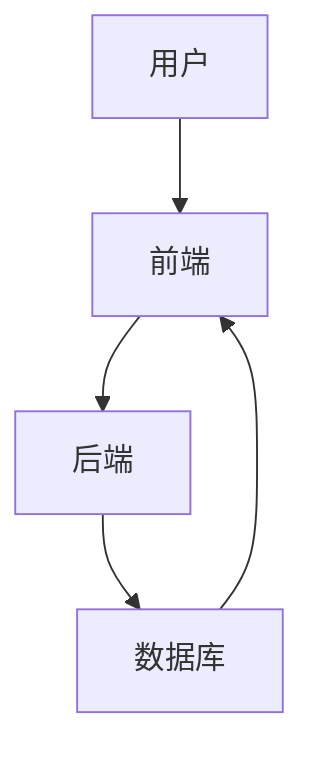

                 


# 企业估值中的AR工业设计协作平台评估

**关键词**：企业估值、AR、工业设计、协作平台、评估方法、技术博客

**摘要**：  
随着增强现实（AR）技术的快速发展，AR工业设计协作平台在企业中的应用越来越广泛。本文将详细探讨如何通过AR技术评估工业设计协作平台对企业估值的影响。从背景介绍、核心概念、算法原理到系统架构设计，再到项目实战，我们将一步步分析AR工业设计协作平台评估的关键点，为企业提供有价值的参考和实践指导。

---

# 第一部分：企业估值中的AR工业设计协作平台背景介绍

## 第1章：问题背景与描述

### 1.1 问题背景
#### 1.1.1 工业设计协作的现状与挑战
- 当前工业设计协作中存在的主要问题，如信息孤岛、协作效率低下、资源浪费等。
- 传统协作工具的局限性，如二维设计工具的不足、数据孤岛问题等。

#### 1.1.2 AR技术在工业设计中的应用潜力
- AR技术如何解决工业设计协作中的痛点，如实时协作、三维模型可视化等。
- AR技术在提升设计效率、降低沟通成本方面的优势。

#### 1.1.3 企业估值与协作平台评估的重要性
- 协作平台对企业整体估值的影响，包括效率提升、成本降低、创新加速等。
- 如何通过评估协作平台的技术性能和实际效果，为企业估值提供数据支持。

### 1.2 问题描述
#### 1.2.1 AR工业设计协作平台的核心问题
- AR技术在协作中的具体应用，如三维模型的实时同步、多用户协作等。
- 平台的性能指标，如延迟、精度、稳定性等。

#### 1.2.2 企业估值中的关键评估指标
- 企业估值的核心指标，如收入、利润、效率提升等。
- 协作平台对企业估值的具体影响路径。

#### 1.2.3 协作平台对企业发展的影响
- 协作平台如何推动企业创新，提升竞争力。
- 协作平台对企业运营效率和成本控制的潜在影响。

### 1.3 问题解决方法
#### 1.3.1 引入AR技术优化协作流程
- AR技术如何优化工业设计协作流程，提升效率。
- 通过AR技术实现设计数据的实时同步和可视化。

#### 1.3.2 建立协作平台评估体系
- 设计一套全面的评估指标，涵盖性能、用户体验、功能等多个方面。
- 如何通过评估体系选择适合企业需求的协作平台。

#### 1.3.3 通过评估提升企业估值
- 评估结果如何转化为企业估值的提升。
- 通过优化协作流程和提升效率，间接提升企业价值。

### 1.4 概念结构与核心要素
#### 1.4.1 AR工业设计协作平台的构成要素
- 平台的核心功能，如三维模型渲染、多用户协作、实时同步等。
- 平台的技术架构，如前端、后端、数据层等。

#### 1.4.2 企业估值的核心影响因素
- 企业估值的关键因素，如收入、利润、成长性等。
- 协作平台对企业估值的直接影响和间接影响。

#### 1.4.3 平台与企业之间的关系
- 协作平台如何成为企业竞争力的一部分。
- 平台如何通过优化协作流程，间接影响企业估值。

### 1.5 本章小结
- 总结本章的主要内容，强调AR工业设计协作平台在企业估值中的重要性。
- 为后续章节奠定基础，引导读者进入更深入的技术分析。

---

# 第二部分：AR工业设计协作平台的核心概念与联系

## 第2章：AR协作机制与原理

### 2.1 AR在工业设计中的协作机制
#### 2.1.1 AR技术的基本原理
- AR技术的核心原理，如图像识别、实时渲染、空间定位等。
- AR技术在工业设计中的具体应用，如三维模型的可视化、实时协作等。

#### 2.1.2 AR在协作中的具体应用
- AR技术如何实现多用户的实时协作，如共享视图、实时注释等。
- AR技术如何提升设计团队的协作效率和创新能力。

#### 2.1.3 AR协作的优势与局限性
- AR协作的优势，如实时性、可视化、沉浸式体验等。
- AR协作的局限性，如技术实现难度、设备依赖性、数据同步问题等。

### 2.2 协作平台的核心概念
#### 2.2.1 平台的功能模块
- 平台的核心功能模块，如三维模型渲染、多用户协作、实时同步、数据存储等。
- 每个功能模块的具体实现方式和作用。

#### 2.2.2 平台的用户角色
- 平台的主要用户角色，如设计师、项目经理、客户等。
- 每个角色在协作中的具体职责和权限。

#### 2.2.3 平台的数据流与信息交互
- 平台中的数据流，如用户输入、模型渲染、数据存储等。
- 用户与平台之间的信息交互流程。

### 2.3 核心概念的ER实体关系图

```mermaid
erDiagram
    actor 用户角色 {
        <属性> 用户ID
        <属性> 用户类型
        <属性> 用户权限
    }
    actor 设备 {
        <属性> 设备ID
        <属性> 设备类型
        <属性> 设备状态
    }
    actor 项目 {
        <属性> 项目ID
        <属性> 项目名称
        <属性> 项目进度
    }
    用户角色 --> 设备 : 使用
    用户角色 --> 项目 : 参与
```

---

## 第3章：AR协作平台的算法原理

### 3.1 协作平台的评估指标
#### 3.1.1 延迟评估
- 延迟的定义和计算方法，如响应时间、渲染时间等。
- 延迟对企业协作效率的具体影响。

#### 3.1.2 精度评估
- 精度的定义和计算方法，如模型渲染的准确度、数据同步的误差等。
- 精度对设计质量的具体影响。

#### 3.1.3 稳定性评估
- 稳定性的定义和计算方法，如平台的可用性、抗干扰能力等。
- 稳定性对协作流程的具体影响。

### 3.2 协作平台的算法实现
#### 3.2.1 基于AR的协作算法
- 算法的核心思想，如实时同步、多用户协作等。
- 算法的实现步骤，如数据采集、模型渲染、用户交互等。

#### 3.2.2 算法的数学模型
- 算法的数学模型，如延迟计算公式：
  $$\text{延迟} = \frac{\text{总时间}}{\text{任务数}}$$
- 精度计算公式：
  $$\text{精度} = \frac{\text{正确结果数}}{\text{总结果数}} \times 100\%$$

#### 3.2.3 算法的实现步骤
- 数据采集与预处理，如图像采集、特征提取等。
- 模型渲染与用户交互，如三维模型的实时渲染、用户的实时反馈等。
- 数据同步与结果输出，如数据的实时同步、结果的保存与展示等。

### 3.3 算法的优化与改进
#### 3.3.1 算法优化策略
- 如何优化算法的延迟和精度，如优化数据传输、减少计算复杂度等。
- 如何提高算法的稳定性和鲁棒性，如增加错误检测和恢复机制等。

#### 3.3.2 算法的实现代码
- 简单的Python代码示例，展示算法的核心实现：
  ```python
  def calculate_delay(tasks, total_time):
      return total_time / tasks

  def calculate_precision(correct, total):
      return (correct / total) * 100
  ```

---

## 第4章：AR协作平台的系统架构设计

### 4.1 系统功能设计
#### 4.1.1 领域模型
- 领域模型的构成，如用户角色、设备、项目等。
- 领域模型之间的关系，如用户参与项目、设备支持协作等。

#### 4.1.2 功能模块设计
- 平台的核心功能模块，如三维模型渲染、多用户协作、实时同步等。
- 每个功能模块的具体实现方式和作用。

### 4.2 系统架构设计
#### 4.2.1 系统架构图
- 系统的总体架构，如前端、后端、数据层等。
- 每个部分的具体职责和交互方式。



#### 4.2.2 系统接口设计
- 系统的主要接口，如用户认证接口、数据同步接口等。
- 接口的输入输出格式和调用方式。

#### 4.2.3 系统交互设计
- 用户与系统之间的交互流程，如登录、协作、保存等。
- 通过mermaid序列图展示交互过程。

---

## 第5章：项目实战与案例分析

### 5.1 项目背景介绍
#### 5.1.1 项目目标
- 项目的核心目标，如评估某款AR协作平台的性能和效果。

#### 5.1.2 项目范围
- 项目涉及的领域和范围，如特定行业、特定功能等。

### 5.2 环境安装与配置
#### 5.2.1 环境要求
- 系统运行的最低配置要求，如硬件、软件等。
- 开发工具的安装与配置，如Python、框架等。

#### 5.2.2 环境配置
- 详细的环境配置步骤，如安装依赖库、配置开发环境等。

### 5.3 核心代码实现
#### 5.3.1 代码实现
- 核心功能的代码实现，如三维模型渲染、用户交互等。
- 代码的具体实现细节和注释说明。

#### 5.3.2 代码解读
- 代码的功能解读，如每个模块的作用、代码的逻辑流程等。
- 代码的优化建议和注意事项。

### 5.4 项目总结与分析
#### 5.4.1 项目成果
- 项目的主要成果，如性能指标的提升、协作效率的优化等。

#### 5.4.2 成果分析
- 成果对企业估值的具体影响，如效率提升带来的成本降低、创新加速带来的收入增长等。

---

## 第6章：最佳实践与注意事项

### 6.1 最佳实践
#### 6.1.1 系统设计中的注意事项
- 设计系统时需要注意的问题，如性能优化、安全性保障等。
- 如何选择合适的AR协作平台，如功能需求、成本效益等。

#### 6.1.2 项目实施中的注意事项
- 项目实施过程中需要注意的问题，如团队协作、资源配置等。
- 如何确保项目的顺利推进，如制定详细的计划、风险控制等。

### 6.2 小结
- 总结全书的核心内容，强调AR工业设计协作平台评估的重要性和具体方法。
- 为读者提供实践中的指导和建议。

---

**作者：AI天才研究院/AI Genius Institute & 禅与计算机程序设计艺术 /Zen And The Art of Computer Programming**

---

### 总结：
本文从背景介绍、核心概念、算法原理、系统架构设计到项目实战，详细探讨了企业估值中的AR工业设计协作平台评估的关键点。通过理论分析和实践案例，为读者提供了全面的技术指导和实践建议。

