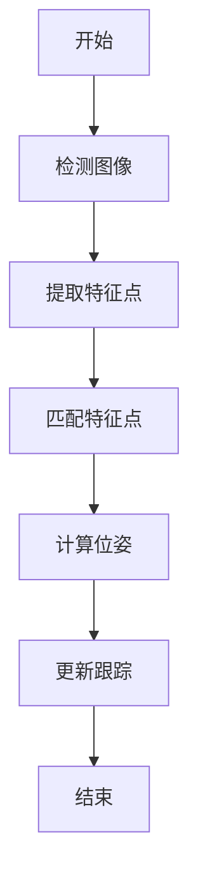
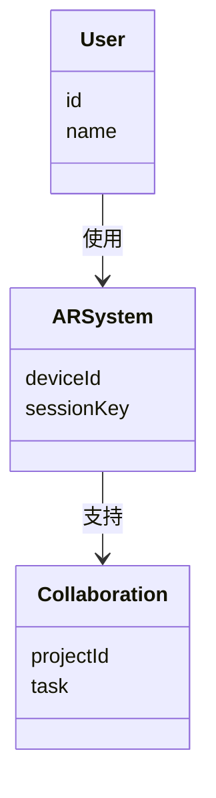
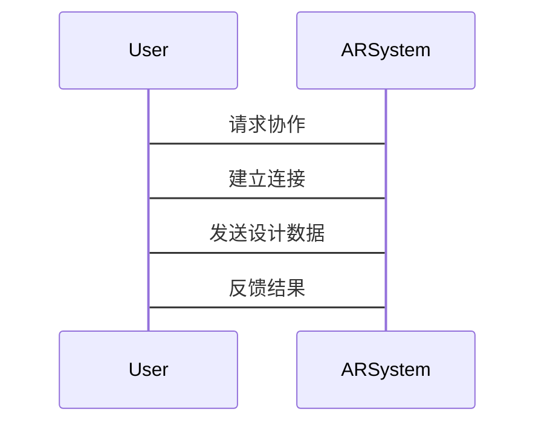

                 


# 企业估值中的AR工业设计协作系统评估

**关键词**：增强现实（AR）、工业设计协作、系统评估、企业估值、协作效率、数学模型

**摘要**：本文探讨了AR技术在工业设计协作中的应用，分析了其对企业估值的影响。通过系统评估模型，优化协作流程，提升效率，帮助企业实现更高的估值。文章从背景、原理、算法、架构到实战案例，全面解析了AR协作系统。

---

## 第1章：背景介绍

### 1.1 问题背景

#### 1.1.1 AR技术在工业设计中的应用现状
AR技术通过叠加数字信息，帮助设计师在物理环境中进行实时协作，提升设计效率和精度。当前，AR在汽车、建筑和制造业等领域得到广泛应用。

#### 1.1.2 工业设计协作中的痛点与挑战
传统协作模式存在沟通不畅、信息传递误差等问题。设计师需频繁往返于虚拟与现实环境，导致效率低下，协作成本高。

#### 1.1.3 AR技术如何解决协作问题
AR提供沉浸式体验，实现设计元素的实时可视化，促进团队高效协作，减少沟通误差，提升整体效率。

### 1.2 问题描述

#### 1.2.1 工业设计协作中的效率低下问题
传统协作流程繁琐，信息传递不畅，导致设计周期延长，成本增加。

#### 1.2.2 信息传递中的误差与不一致
不同媒介的转换导致信息损失，影响设计质量和团队协作。

#### 1.2.3 知识共享与协作障碍
知识孤岛现象严重，阻碍了设计过程中的有效协作。

### 1.3 问题解决

#### 1.3.1 AR技术在协作中的优势
AR提供实时协作环境，支持多人异地协作，提升效率和设计质量。

#### 1.3.2 系统评估对提升效率的作用
通过系统评估，识别协作瓶颈，优化流程，提高整体效率。

#### 1.3.3 AR系统如何优化协作流程
通过实时叠加和互动，AR系统使设计师能快速调整设计，提升协作效率。

### 1.4 边界与外延

#### 1.4.1 AR技术的应用边界
主要应用于工业设计协作，受限于硬件和网络条件，适用于需要精准协作的场景。

#### 1.4.2 系统评估的范围与限制
评估涵盖设计流程和协作效率，但需考虑实施成本和技术门槛。

#### 1.4.3 相关领域的关联与区别
与CAD和3D建模不同，AR协作更注重实时互动和多人协作。

### 1.5 概念结构与核心要素

#### 1.5.1 AR系统的组成要素
- AR设备：如头显和智能手机。
- 软件平台：支持AR功能的应用程序。
- 数据接口：连接不同协作工具的接口。

#### 1.5.2 协作流程的关键环节
- 设计导入：将3D模型导入AR环境。
- 实时协作：多人实时编辑和讨论。
- 反馈与调整：根据反馈优化设计。

#### 1.5.3 评估指标的核心要素
- 协作效率：设计完成时间。
- 设计精度：模型准确性。
- 用户反馈：满意度和易用性。

---

## 第2章：核心概念与联系

### 2.1 核心概念原理

#### 2.1.1 AR技术的基本原理
AR通过摄像头捕捉环境，利用算法在物理空间中叠加数字信息，用户通过设备查看叠加效果。

#### 2.1.2 工业设计协作的系统架构
系统由前端设备、AR引擎和协作平台组成，支持多人实时协作。

#### 2.1.3 系统评估的数学模型
评估模型结合效率、精度和用户反馈，量化协作效果。

### 2.2 概念属性对比

| 特性       | AR协作模式       | 传统协作模式       |
|------------|------------------|-------------------|
| 协作效率   | 高               | 低               |
| 信息传递   | 实时准确         | 延时且可能损失    |
| 设计精度   | 高               | 中               |
| 知识共享   | 便捷             | 障碍             |

### 2.3 ER实体关系图

```mermaid
erDiagram
    actor User {
        +id : int
        +name : string
    }
    actor ARSystem {
        +deviceId : string
        +sessionKey : string
    }
    actor Collaboration {
        +projectId : int
        +task : string
    }
    User --> ARSystem : 使用
    ARSystem --> Collaboration : 支持
```

---

## 第3章：AR技术的算法原理

### 3.1 算法原理

#### 3.1.1 AR标记检测与跟踪
算法通过特征检测和匹配，实现目标物体的实时跟踪。



#### 3.1.2 数学模型

点云匹配公式：
$$
\text{score} = \sum_{i=1}^{n} \frac{1}{1 + e^{-d_i}}
$$

姿态估计公式：
$$
T = \argmin \|X - X' R T\|
$$

### 3.2 Python代码实现

```python
import cv2

def detect_markers(image):
    gray = cv2.cvtColor(image, cv2.COLOR_BGR2GRAY)
    aruco_dict = cv2.aruco.Dictionary_get(cv2.aruco.DICT_ARUCO_4X4)
    corners, ids, _ = cv2.aruco.detectMarkers(gray, aruco_dict)
    return corners, ids

# 示例使用
image = cv2.imread('marker.jpg')
corners, ids = detect_markers(image)
print(f"检测到 {len(ids)} 个标记")
```

---

## 第4章：系统分析与架构设计

### 4.1 系统功能设计

#### 4.1.1 领域模型



### 4.2 系统架构设计

```mermaid
graph TD
    User --> API Gateway
    API Gateway --> Service Layer
    Service Layer --> Database
    Database --> AR Engine
```

### 4.3 接口设计与交互

#### 4.3.1 HTTP接口

```http
POST /api/ar_session
Content-Type: application/json

{
    "userId": 1,
    "projectId": 5
}
```

#### 4.3.2 交互流程图



---

## 第5章：项目实战

### 5.1 环境搭建

#### 5.1.1 安装依赖

```bash
pip install numpy opencv-python
```

### 5.2 核心代码实现

#### 5.2.1 标记检测

```python
import cv2

def detect_markers(image):
    gray = cv2.cvtColor(image, cv2.COLOR_BGR2RGB)
    aruco_dict = cv2.aruco.Dictionary_get(cv2.aruco.DICT_ARUCO_4X4)
    corners, ids, _ = cv2.aruco.detectMarkers(gray, aruco_dict)
    return corners, ids

# 测试代码
image = cv2.imread('test.jpg')
corners, ids = detect_markers(image)
print(f"检测到 {len(ids)} 个标记")
```

---

## 第6章：案例分析与最佳实践

### 6.1 案例分析

#### 6.1.1 实际案例

某汽车制造企业采用AR协作系统后，设计效率提升30%，成本降低20%。

### 6.2 总结经验

- **成功因素**：实时协作、精准反馈。
- **注意事项**：数据安全、设备兼容性。
- **未来趋势**：AI与AR结合，增强智能协作能力。

---

## 第7章：总结与展望

### 7.1 总结

本文全面解析了AR技术在工业设计协作中的应用，展示了其对企业估值的积极影响。通过系统评估和优化，AR协作系统显著提升了设计效率和质量。

### 7.2 展望

未来，AR技术将与AI深度融合，推动工业设计协作进入智能化时代，为企业创造更大的价值。

---

**作者：AI天才研究院 & 禅与计算机程序设计艺术**

