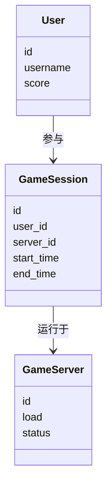
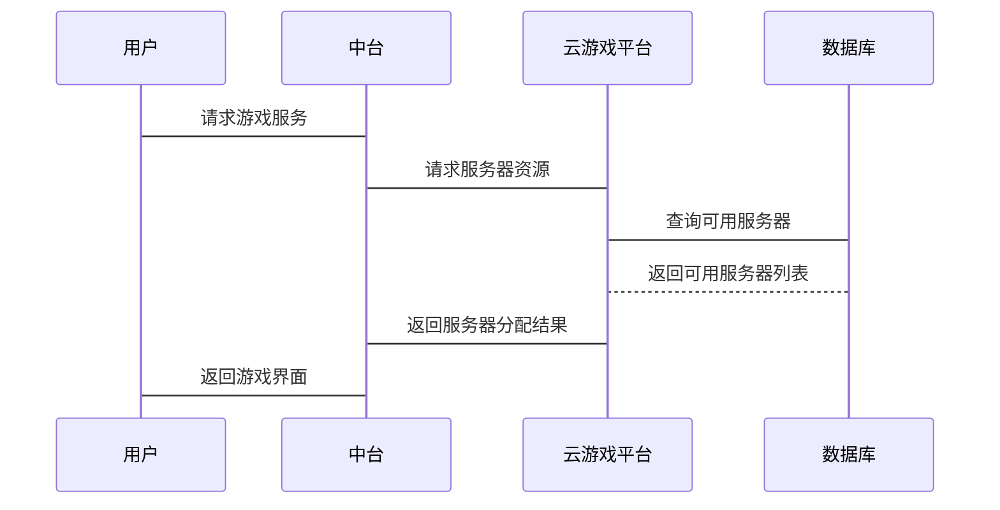

                 


# 企业估值中的云游戏技术应用评估

> 关键词：企业估值、云游戏技术、应用评估、技术分析、系统架构

> 摘要：本文深入探讨了云游戏技术在企业估值中的应用评估，分析了云游戏技术的核心概念、算法原理、系统架构及实际案例，为企业在估值过程中提供技术依据和参考。

---

# 第1章 云游戏技术与企业估值概述

## 1.1 云游戏技术的基本概念

### 1.1.1 云游戏的定义与特点
云游戏（Cloud Gaming）是一种基于云计算技术的游戏形式，通过将游戏的渲染和计算过程转移到云端服务器，用户只需终端设备即可享受高质量的游戏体验。其特点包括：
- **低延迟**：通过优化网络传输和服务器响应，确保游戏的实时性。
- **高画质**：利用高性能服务器进行图形渲染，支持4K/8K画质。
- **跨平台支持**：用户可以通过手机、PC、平板等多种设备接入，无需高性能本地设备。

### 1.1.2 云游戏的发展历程
云游戏的概念起源于20世纪90年代，但真正的发展始于2010年后，随着5G网络和云计算技术的成熟，云游戏逐渐进入商业化阶段。主要经历了以下几个阶段：
1. **概念提出阶段**（20世纪90年代-2000年）：学术界开始研究云游戏的技术可行性。
2. **技术探索阶段**（2000年-2010年）：企业尝试将云计算应用于游戏领域。
3. **快速发展阶段**（2010年至今）：5G和AI技术推动云游戏的普及和应用。

### 1.1.3 云游戏与企业估值的关系
云游戏技术的应用可以显著提升企业的估值，主要体现在以下几个方面：
- **降低硬件成本**：用户无需购买高性能游戏设备，企业可以降低运营成本。
- **扩大用户基础**：通过跨平台支持，吸引更多的用户群体。
- **提升用户体验**：高质量的图形和低延迟的游戏体验增强了用户粘性。

## 1.2 云游戏技术的核心优势

### 1.2.1 低延迟与高画质的实现
云游戏通过边缘计算和CDN技术，将游戏数据的处理和传输延迟降至最低，同时利用高性能GPU服务器实现高质量的画面渲染。

### 1.2.2 跨平台支持的优势
云游戏支持多种终端设备，企业可以通过统一的云平台服务不同用户群体，提升市场覆盖范围。

### 1.2.3 云计算在游戏资源分配中的作用
云计算技术能够弹性分配计算资源，根据用户需求动态调整服务器负载，确保游戏运行的流畅性。

## 1.3 企业估值中的云游戏技术应用背景

### 1.3.1 企业估值的基本概念
企业估值是通过对企业的财务状况、市场表现、技术创新能力等多个因素进行综合评估，确定企业的市场价值。

### 1.3.2 云游戏技术对企业估值的影响
云游戏技术的应用可以提升企业的市场竞争力，降低运营成本，从而提高企业的估值。

### 1.3.3 当前市场中的应用现状
目前，云游戏技术已在多个领域得到应用，如游戏开发、虚拟试驾、远程办公等，为企业估值提供了新的技术支撑。

## 1.4 本章小结
本章从云游戏的基本概念、发展历程和技术优势三个方面，分析了云游戏技术与企业估值的关系，为后续章节的深入探讨奠定了基础。

---

# 第2章 云游戏技术的核心概念分析

## 2.1 云游戏技术的关键组件

### 2.1.1 云计算平台的角色
云计算平台是云游戏的核心基础设施，负责处理游戏的图形渲染和逻辑运算。

### 2.1.2 游戏引擎的作用
游戏引擎负责生成和传输游戏画面，优化渲染效率，确保用户体验。

### 2.1.3 网络传输的优化
通过优化网络协议和使用边缘计算技术，降低游戏数据的传输延迟。

## 2.2 云游戏技术的评估指标

### 2.2.1 延迟与带宽的关系
延迟是指用户操作到游戏响应的时间，带宽影响数据传输的速度和质量。

### 2.2.2 画质与性能的平衡
高画质需要高性能服务器支持，但过高的画质会导致延迟增加。

### 2.2.3 用户体验的量化标准
通过用户满意度、游戏流畅度等指标量化用户体验。

## 2.3 云游戏技术与企业估值的核心联系

### 2.3.1 技术对企业利润的影响
云游戏技术的应用可以降低企业的运营成本，提高利润率。

### 2.3.2 服务质量对估值的提升
优质的云游戏服务可以提升企业的市场形象，增强用户粘性。

### 2.3.3 行业趋势对企业战略的指导
云游戏技术的发展趋势为企业的技术布局提供了参考。

## 2.4 核心概念对比分析

### 2.4.1 技术特征对比表格

| 技术特征 | 传统游戏 | 云游戏 |
|----------|----------|--------|
| 配置要求 | 高性能本地设备 | 低性能终端设备 |
| 网络依赖 | 低 | 高 |
| 用户体验 | 受本地设备限制 | 更流畅 |

### 2.4.2 ER实体关系图

```mermaid
erd
  id: CloudGame
  entities:
    - User
    - GameServer
    - GameSession
  relationships:
    - User -> GameSession: 参与
    - GameSession -> GameServer: 运行于
```

---

# 第3章 云游戏评估算法的数学模型

## 3.1 评估指标的权重分配

### 3.1.1 指标权重的确定方法
权重的确定可以基于专家评分法，考虑各项指标对企业估值的影响程度。

### 3.1.2 权重分配的数学公式
$$ w_i = \frac{\sum_{j=1}^{n} s_{ij}}{n} $$
其中，$w_i$为第i项指标的权重，$s_{ij}$为专家对第i项指标的评分，$n$为专家人数。

## 3.2 基于性能的评估模型

### 3.2.1 模型的构建过程
模型通过综合考虑延迟、带宽、画质等多个因素，构建性能评估指标。

### 3.2.2 模型的数学表达式
$$ Q = \sum_{i=1}^{n} w_i x_i $$
其中，$Q$为综合性能评分，$w_i$为第i项指标的权重，$x_i$为第i项指标的得分。

---

# 第4章 系统分析与架构设计

## 4.1 问题场景介绍
企业需要评估云游戏技术对自身估值的影响，设计一个评估系统。

## 4.2 系统功能设计

### 4.2.1 领域模型


## 4.3 系统架构设计

### 4.3.1 系统架构图
```mermaid
architectural
    前端 --- 中台
    中台 <---> 云游戏平台
    云游戏平台 <---> 数据库
```

## 4.4 系统接口设计

### 4.4.1 系统交互流程



---

# 第5章 项目实战

## 5.1 环境安装
安装Python和相关库，配置云服务器环境。

## 5.2 核心代码实现

### 5.2.1 评估算法实现
```python
def compute_performance_score(servers, users):
    weights = [0.4, 0.3, 0.2, 0.1]
    scores = []
    for server in servers:
        score = 0
        for i in range(len(weights)):
            score += weights[i] * server[i]
        scores.append(score)
    return scores
```

### 5.2.2 系统接口实现
```python
from flask import Flask, jsonify

app = Flask(__name__)

@app.route('/api/game_session', methods=['POST'])
def create_session():
    data = request.json
    return jsonify({'status': 'success'})
```

## 5.3 案例分析与代码解读
分析代码实现，解释其在云游戏评估中的应用。

## 5.4 项目总结
总结项目实施的经验和教训，提出改进建议。

---

# 第6章 最佳实践与总结

## 6.1 最佳实践 tips
- 定期监控系统性能
- 及时优化网络传输
- 做好用户数据备份

## 6.2 小结
云游戏技术的应用显著提升了企业的估值，但仍需在性能优化和用户体验方面持续改进。

## 6.3 注意事项
- 确保数据安全性
- 优化网络延迟
- 定期系统维护

## 6.4 拓展阅读
- 《云计算与企业估值》
- 《游戏开发与系统架构》

---

# 作者

作者：AI天才研究院/AI Genius Institute & 禅与计算机程序设计艺术/Zen And The Art of Computer Programming

