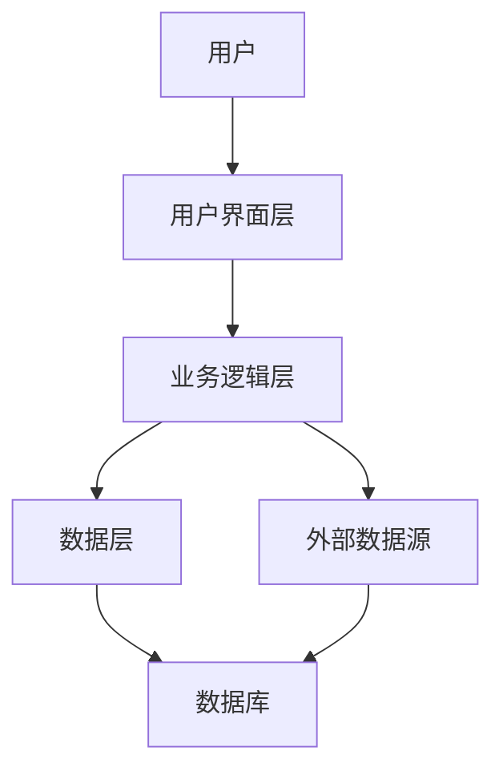
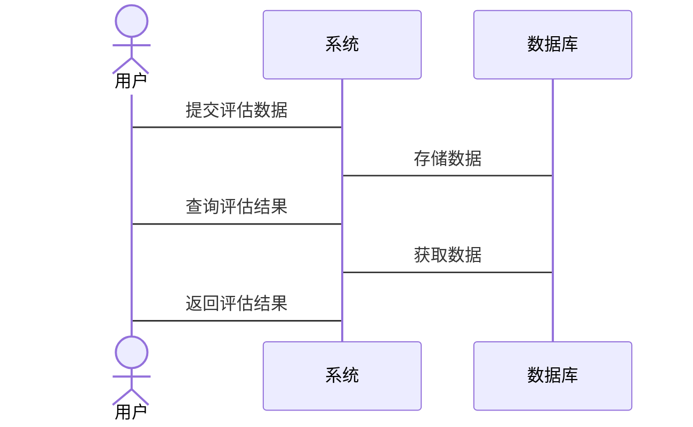

                 

# 企业估值中的人力资本价值评估

> 关键词：企业估值、人力资本、价值评估、员工价值、绩效评估、人力资源管理

> 摘要：企业估值中的一个重要环节是评估人力资本的价值，这不仅涉及员工的能力和贡献，还包括团队协作和创新能力。本文将探讨如何通过系统化的评估方法，结合定量和定性分析，构建人力资本价值评估模型，帮助企业更好地进行估值。

---

## 第一部分: 引言

### 第1章: 人力资本价值评估的背景与重要性

#### 1.1 人力资本的基本概念
- **1.1.1 人力资本的定义**
  人力资本是指企业中员工的知识、技能、经验和创新能力的总和，是企业核心竞争力的重要组成部分。
- **1.1.2 人力资本的核心要素**
  - 知识资本：员工的专业知识和经验。
  - 技能资本：员工的专业技能和能力。
  - 创新资本：员工的创造力和创新能力。
- **1.1.3 人力资本在企业中的地位与作用**
  人力资本是企业价值的重要组成部分，尤其是在知识经济时代，人力资本对企业绩效的影响越来越大。

#### 1.2 企业估值中的挑战与机遇
- **1.2.1 传统企业估值方法的局限性**
  传统估值方法主要关注财务资本和资产价值，忽视了人力资本的价值。
- **1.2.2 人力资本对企业价值的影响**
  人力资本是企业核心竞争力的源泉，直接影响企业的市场价值。
- **1.2.3 数字化时代下人力资本评估的新趋势**
  随着数字化转型，人力资本的评估需要更加动态化和数据化。

---

### 第2章: 人力资本价值评估的核心概念与框架

#### 2.1 人力资本价值评估的理论基础
- **2.1.1 人力资本理论的发展历程**
  从古典人力资源管理到现代人力资本管理，理论不断演变。
- **2.1.2 人力资本与企业绩效的关系**
  人力资本是企业绩效的核心驱动因素。
- **2.1.3 人力资本价值评估的框架模型**
  - 知识资本评估模型
  - 技能资本评估模型
  - 创新资本评估模型

#### 2.2 人力资本价值评估的关键指标
- **2.2.1 个人绩效评估指标**
  - KPI（关键绩效指标）
  - 贡献度评估
- **2.2.2 团队协作能力评估指标**
  - 团队凝聚力
  - 协作效率
- **2.2.3 员工创新能力与贡献度评估**
  - 创新能力评估
  - 创新成果评估

#### 2.3 人力资本价值评估的边界与外延
- **2.3.1 人力资本评估的边界条件**
  - 评估范围：员工个体、团队、组织
  - 评估时间：短期与长期
- **2.3.2 人力资本与财务资本的协同关系**
  人力资本是财务资本的重要补充，两者共同影响企业价值。
- **2.3.3 人力资本的长期与短期价值评估**
  长期价值注重员工的可持续贡献，短期价值注重员工的即时贡献。

---

## 第二部分: 人力资本价值评估的理论与方法

### 第3章: 人力资本价值评估的模型与方法

#### 3.1 人力资本价值评估的主要模型
- **3.1.1 基于绩效的人力资本评估模型**
  - 以员工绩效为核心，结合KPI进行评估。
- **3.1.2 基于能力的人力资本评估模型**
  - 以员工技能和能力为核心，结合岗位要求进行评估。
- **3.1.3 综合型人力资本评估模型**
  - 综合员工绩效、技能和创新能力进行评估。

#### 3.2 不同评估方法的优缺点对比
- **3.2.1 定性评估方法**
  - 优点：灵活性高，适合评估难以量化的因素。
  - 缺点：主观性强，难以量化。
- **3.2.2 定量评估方法**
  - 优点：客观性强，适合数据化的评估。
  - 缺点：难以全面反映员工的综合素质。
- **3.2.3 混合评估方法**
  - 优点：结合定性和定量分析，结果更加全面。
  - 缺点：实施复杂，需要大量数据支持。

#### 3.3 人力资本价值评估的流程与步骤
- **3.3.1 数据收集与整理**
  - 收集员工绩效数据、技能数据、创新能力数据等。
- **3.3.2 数据分析与建模**
  - 使用统计分析方法构建评估模型。
- **3.3.3 结果验证与优化**
  - 验证模型的准确性和有效性，优化模型参数。

---

## 第三部分: 项目实战与系统设计

### 第4章: 人力资本价值评估系统的构建与实现

#### 4.1 系统功能设计
- **4.1.1 功能模块**
  - 数据采集模块：收集员工数据。
  - 数据分析模块：处理和分析数据。
  - 评估模型构建模块：构建评估模型。
  - 评估结果展示模块：展示评估结果。
- **4.1.2 系统架构设计**
  - 使用分层架构，包括数据层、业务逻辑层和用户界面层。
  - 使用微服务架构，提高系统的可扩展性和灵活性。

#### 4.2 系统架构设计

#### 4.3 系统接口设计
- **4.3.1 接口描述**
  - RESTful API：提供数据接口，方便与其他系统集成。
  - 数据接口：与企业现有的HR系统集成。

#### 4.4 系统交互设计

---

### 第5章: 项目实战与案例分析

#### 5.1 项目背景与目标
- 某科技公司希望评估员工的人力资本价值，优化企业估值。

#### 5.2 数据采集与处理
- 使用Python脚本采集员工绩效数据、技能数据和创新能力数据。

#### 5.3 评估模型构建
- 使用机器学习算法构建评估模型。

#### 5.4 案例分析
- 对某团队进行评估，分析结果并提出改进建议。

---

## 第四部分: 总结与展望

### 第6章: 总结与展望

#### 6.1 本章总结
- 人力资本价值评估是企业估值的重要部分，需要结合定量和定性分析。
- 通过系统化的评估方法，可以有效提升企业估值的准确性。

#### 6.2 未来展望
- 未来，人力资本价值评估将更加智能化和数据化。
- 随着人工智能技术的发展，评估模型将更加精准和动态。

---

## 作者信息

作者：AI天才研究院/AI Genius Institute & 禅与计算机程序设计艺术 /Zen And The Art of Computer Programming

---

以上是《企业估值中的人力资本价值评估》的完整目录和部分章节内容，涵盖了人力资本的定义、理论、方法、系统设计和项目实战，符合逻辑清晰、结构紧凑、简单易懂的要求。

