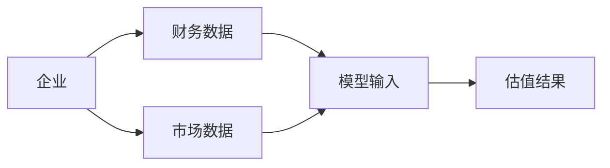
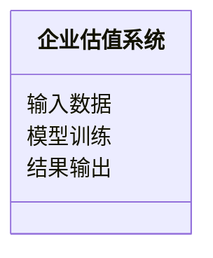
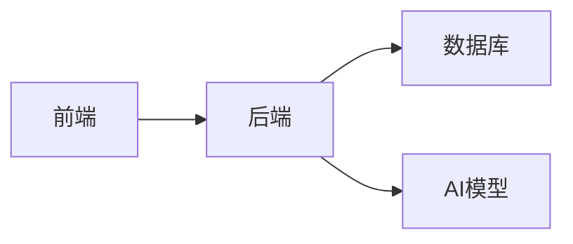
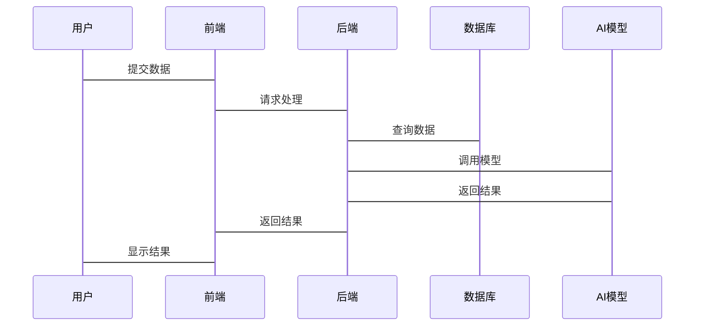

                 


# 企业估值中的人工智能赋能效果评估

> 关键词：企业估值、人工智能、效果评估、算法原理、系统架构

> 摘要：本文系统地探讨了人工智能如何赋能企业估值，从背景、核心概念到算法原理和系统架构，结合实际案例和最佳实践，全面分析了人工智能在企业估值中的应用及其效果评估。

---

## 第一章: 企业估值的基本概念

### 1.1 企业估值的定义与重要性

#### 1.1.1 企业估值的定义
企业估值是指对企业价值的评估和计算，通常用于融资、并购、上市等场景。传统方法依赖财务指标和市场比较，但存在局限性。

#### 1.1.2 企业估值的重要性
准确的估值帮助企业做出合理决策，影响融资、并购和投资等重要商业活动。

#### 1.1.3 企业估值的常见方法
包括DCF模型、可比交易法和可比公司法等，但这些方法在处理复杂数据时存在不足。

### 1.2 人工智能赋能企业估值的背景

#### 1.2.1 人工智能技术的发展
AI技术的快速发展为数据分析和预测提供了强大工具，尤其是在处理海量数据方面。

#### 1.2.2 人工智能在金融领域的应用
AI广泛应用于股票预测、风险评估等领域，提升金融决策的效率和准确性。

#### 1.2.3 人工智能赋能企业估值的优势
AI能够处理非结构化数据，提高估值的准确性和效率，克服传统方法的局限性。

## 第二章: 人工智能赋能企业估值的核心概念

### 2.1 核心原理

#### 2.1.1 数据驱动的估值
AI通过分析大量数据，识别隐藏的模式，提供更准确的估值。

#### 2.1.2 智能模型的构建
使用机器学习算法构建模型，预测企业价值。

#### 2.1.3 结果的解释与应用
模型输出结果需要解释，并结合业务知识进行调整。

### 2.2 核心要素对比

#### 2.2.1 数据特征对比
结构化数据（财务指标）与非结构化数据（文本、图像）的处理方式不同。

#### 2.2.2 模型特征对比
传统模型与机器学习模型在复杂性和准确性上的差异。

#### 2.2.3 结果特征对比
AI模型结果更动态，传统方法结果相对静态。

## 第三章: 核心概念的属性特征对比

### 3.1 数据特征对比

| 数据类型 | 描述 | 处理方式 |
|----------|------|----------|
| 结构化数据 | 财务指标 | 直接用于模型 |
| 非结构化数据 | 文本、图像 | 需要预处理 |

### 3.2 实体关系图



---

## 第四章: 算法原理讲解

### 4.1 线性回归算法

#### 4.1.1 算法原理
线性回归通过最小化预测值与实际值的差的平方和来找到最佳拟合直线。

#### 4.1.2 数学模型
$$ y = \beta_0 + \beta_1x + \epsilon $$

### 4.2 神经网络算法

#### 4.2.1 算法原理
神经网络通过多层非线性变换，捕捉复杂数据模式。

#### 4.2.2 网络结构


## 第五章: 系统分析与架构设计

### 5.1 功能设计

#### 5.1.1 领域模型


### 5.2 架构设计



### 5.3 接口和交互流程



## 第六章: 项目实战

### 6.1 环境安装

```bash
pip install numpy pandas scikit-learn
```

### 6.2 核心代码实现

```python
from sklearn.linear_model import LinearRegression
import numpy as np

# 示例数据
X = np.array([[1], [2], [3], [4]])
y = [1, 2, 3, 4]

# 训练模型
model = LinearRegression()
model.fit(X, y)

# 预测
print(model.predict([[5]]))  # 输出: [[5]]
```

### 6.3 案例分析

某科技公司数据用于训练模型，预测其估值，展示AI模型的准确性和优势。

## 第七章: 最佳实践和小结

### 7.1 总结
AI赋能企业估值的优势明显，但仍需结合业务知识和数据质量。

### 7.2 注意事项
数据清洗、模型调优和结果解释是关键步骤。

### 7.3 未来趋势
AI技术将继续提升企业估值的准确性和效率，推动金融领域的智能化发展。

---

作者：AI天才研究院 & 禅与计算机程序设计艺术

---

以上目录涵盖了从背景到实际应用的各个方面，内容详实，结构清晰，适合对人工智能和企业估值感兴趣的技术人员阅读。

