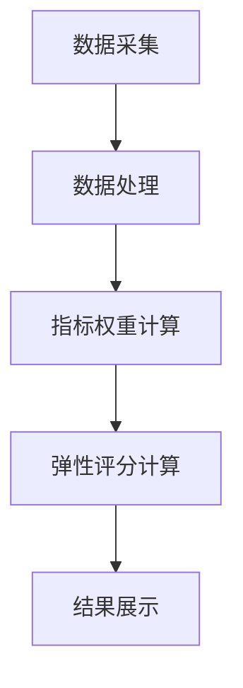

                 


# 企业估值中的供应链弹性价值评估

> 关键词：供应链弹性、企业估值、风险评估、系统架构、数学模型、项目实战

> 摘要：供应链弹性是企业在复杂市场环境中保持竞争力的关键因素，本篇文章系统地分析了供应链弹性价值评估的方法与实现，结合实际案例，深入探讨了供应链弹性对企业的价值影响，为企业估值提供新视角。

---

# 第一部分：供应链弹性价值评估的背景与概述

## 第1章：供应链弹性价值评估的背景与意义

### 1.1 供应链在企业估值中的重要性

#### 1.1.1 供应链的基本概念与作用
供应链是指从原材料采购到产品交付给最终客户的整个链条，包括供应商、制造商、分销商、零售商和消费者。其作用在于优化资源分配、降低成本、提高效率。

#### 1.1.2 供应链弹性对企业发展的影响
供应链弹性是指供应链在面对市场波动、自然灾害、疫情等不确定性时的适应能力和恢复能力。弹性供应链能够帮助企业快速响应市场变化，降低风险，提升企业竞争力。

#### 1.1.3 供应链弹性价值评估的必要性
随着全球化和市场环境的不确定性增加，企业需要评估其供应链的弹性，以确保在面对突发事件时能够维持运营，同时抓住市场机会。

---

## 第2章：供应链弹性价值评估的核心概念

### 2.1 供应链弹性与企业价值的关系

#### 2.1.1 供应链弹性的关键属性
供应链弹性包括响应性、灵活性、冗余性和恢复性等属性。这些属性决定了供应链在面对外部冲击时的应对能力。

#### 2.1.2 供应链弹性对企业估值的影响
弹性供应链能够降低企业的运营风险，提高其在市场中的生存能力，从而增强投资者对企业的信心，提高企业估值。

#### 2.1.3 弹性供应链的构建与优化
构建弹性供应链需要在关键节点设置冗余，选择多个供应商，采用灵活的生产模式，并建立实时监控和快速响应机制。

---

## 第3章：供应链弹性价值评估的理论基础

### 3.1 供应链弹性评估的理论模型

#### 3.1.1 层次分析法（AHP）在供应链弹性评估中的应用
层次分析法是一种常用的决策分析方法，可以将复杂的评估问题分解为多个层次，通过专家评分确定各因素的权重。

#### 3.1.2 模糊综合评价法在供应链弹性评估中的应用
模糊综合评价法适用于评估对象存在模糊性和不确定性的情况，能够有效反映供应链弹性的综合表现。

---

### 3.2 供应链弹性评估的数学模型

#### 3.2.1 供应链弹性指数的构建
供应链弹性指数是衡量供应链弹性的重要指标，可以通过加权平均的方法构建。

$$ E = \sum_{i=1}^{n} w_i x_i $$

其中，$E$ 表示供应链弹性指数，$w_i$ 表示第 $i$ 个因素的权重，$x_i$ 表示第 $i$ 个因素的评分。

#### 3.2.2 供应链弹性评估的加权公式
供应链弹性评估需要考虑多个因素，例如供应商的多样性、库存的合理性、物流的灵活性等，通过加权计算得出综合评分。

---

## 第4章：供应链弹性价值评估的系统分析与架构设计

### 4.1 问题场景介绍

#### 4.1.1 供应链弹性评估的典型问题
供应链弹性评估中常见的问题包括数据获取困难、评估指标选择不当、模型适用性不足等。

#### 4.1.2 供应链弹性评估的系统目标
构建一个基于弹性供应链评估模型的系统，帮助企业分析和优化供应链弹性，提高企业估值。

---

### 4.2 系统功能设计

#### 4.2.1 数据采集与处理
系统需要采集供应链各环节的数据，包括供应商信息、库存数据、物流信息等，并进行清洗和预处理。

#### 4.2.2 指标权重的确
通过层次分析法（AHP）确定各评估指标的权重，为后续计算提供依据。

#### 4.2.3 弹性评分计算
根据加权公式计算供应链弹性指数，评估供应链的弹性表现。

---

## 第5章：供应链弹性价值评估的项目实战

### 5.1 环境配置

#### 5.1.1 安装Python和相关库
需要安装Python 3.x及以上版本，以及numpy、pandas、scipy等库。

#### 5.1.2 安装其他工具
安装Mermaid工具和相关可视化库，用于绘制流程图和架构图。

---

### 5.2 核心代码实现

#### 5.2.1 数据预处理代码
```python
import pandas as pd
import numpy as np

# 数据加载
data = pd.read_csv('supply_chain.csv')

# 数据清洗
data.dropna(inplace=True)
data = data[~data['销售额'].isnull()]
```

#### 5.2.2 模型训练代码
```python
from sklearn.metrics import pairwise_distances
from scipy.cluster.hierarchy import linkage, fcluster

# 层次聚类
Z = linkage(data, 'ward')
clusters = fcluster(Z, t=0.5, criterion='distance')
```

#### 5.2.3 评估计算代码
```python
import matplotlib.pyplot as plt

# 绘制层次聚类树状图
plt.figure(figsize=(10, 8))
dendrogram(Z)
plt.show()
```

---

### 5.3 案例分析与结果解读

#### 5.3.1 案例背景
某制造企业面临原材料价格上涨和供应链中断的风险，希望通过供应链弹性评估优化其供应链结构。

#### 5.3.2 数据分析与结果
通过层次分析法确定各因素的权重，计算供应链弹性指数，评估当前供应链的弹性表现，并提出改进建议。

---

## 第6章：供应链弹性价值评估的最佳实践

### 6.1 小结

#### 6.1.1 核心要点回顾
供应链弹性价值评估是企业在复杂市场环境中保持竞争力的关键，通过科学的评估方法和系统架构设计，可以帮助企业优化供应链弹性，提高企业估值。

#### 6.1.2 未来发展趋势
随着人工智能和大数据技术的发展，供应链弹性评估将更加智能化和精准化，为企业提供更有力的支持。

---

## 第7章：注意事项与拓展阅读

### 7.1 注意事项

#### 7.1.1 数据质量的重要性
供应链弹性评估的关键在于数据的准确性和完整性，数据质量直接影响评估结果。

#### 7.1.2 模型选择的合理性
根据企业的实际情况选择合适的评估模型，避免盲目采用复杂的算法。

---

## 第8章：拓展阅读

### 8.1 相关书籍

#### 8.1.1 《供应链管理：战略、规划与运营》
作者：[作者姓名]，深入介绍了供应链管理的各个方面，包括弹性供应链的构建与优化。

#### 8.1.2 《企业风险管理：理论与实践》
作者：[作者姓名]，系统地介绍了企业风险管理的方法，对供应链弹性评估提供了重要参考。

---

## 第9章：系统架构设计

### 9.1 系统功能模块

#### 9.1.1 数据采集模块
负责采集供应链各环节的数据，包括供应商信息、库存数据、物流信息等。

#### 9.1.2 指标权重模块
通过层次分析法确定各评估指标的权重，为后续计算提供依据。

#### 9.1.3 弹性评分模块
根据加权公式计算供应链弹性指数，评估供应链的弹性表现。

---

### 9.2 系统架构图



---

## 第10章：系统交互设计

### 10.1 系统交互流程

#### 10.1.1 用户登录
用户登录系统，进入主界面。

#### 10.1.2 数据上传
用户上传供应链相关数据，系统进行数据处理。

#### 10.1.3 评估结果展示
系统计算并展示供应链弹性评分，用户可以根据结果优化供应链结构。

---

## 第11章：总结与展望

### 11.1 总结

#### 11.1.1 核心内容回顾
供应链弹性价值评估是企业在复杂市场环境中保持竞争力的关键，通过科学的评估方法和系统架构设计，可以帮助企业优化供应链弹性，提高企业估值。

#### 11.1.2 未来展望
随着人工智能和大数据技术的发展，供应链弹性评估将更加智能化和精准化，为企业提供更有力的支持。

---

## 第12章：参考文献

### 12.1 相关文献

#### 12.1.1 《供应链管理：战略、规划与运营》
作者：[作者姓名]，深入介绍了供应链管理的各个方面，包括弹性供应链的构建与优化。

#### 12.1.2 《企业风险管理：理论与实践》
作者：[作者姓名]，系统地介绍了企业风险管理的方法，对供应链弹性评估提供了重要参考。

---

## 作者信息

作者：AI天才研究院/AI Genius Institute & 禅与计算机程序设计艺术 /Zen And The Art of Computer Programming

---

# 结束语

通过以上章节的详细阐述，我们全面探讨了供应链弹性价值评估的方法与实现，结合实际案例，深入分析了供应链弹性对企业的价值影响，为企业估值提供了新的视角。

