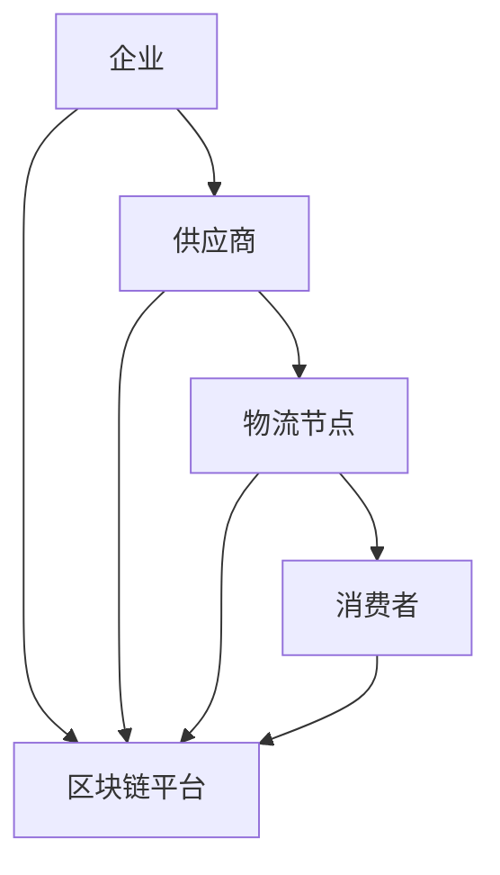
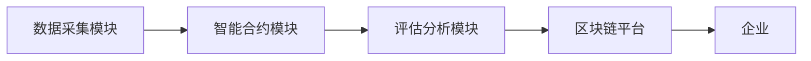

                 


# 企业估值中的区块链供应链金融评估

## 关键词：区块链，供应链金融，企业估值，智能合约，去中心化，数据透明性

## 摘要：本文探讨区块链技术在供应链金融评估中的应用，分析其如何通过提高数据透明度和自动化执行能力，帮助企业进行更精准的企业估值。文章从理论到实践，详细讲解了区块链的核心概念、算法原理、系统架构以及实际案例，为企业和开发者提供深入的技术见解。

---

## 第一部分：区块链与供应链金融概述

### 第1章：区块链与供应链金融概述

#### 1.1 区块链技术的基本概念

##### 1.1.1 区块链的定义与特点

区块链是一种分布式账本技术，通过去中心化的节点网络记录和验证数据，确保数据不可篡改且可追溯。其特点包括去中心化、不可篡改、透明性和去信任化。

##### 1.1.2 区块链的核心技术原理

区块链的核心技术包括共识机制（如比特币的POW和以太坊的POS）、区块结构（数据块按时间顺序链接）、智能合约（自动化执行预设条件）和分布式网络（数据存储在多个节点上）。

##### 1.1.3 区块链在供应链金融中的应用潜力

区块链能够提高供应链金融的透明度和效率，减少欺诈风险，优化资金流动，从而提升企业估值。

#### 1.2 供应链金融的基本概念

##### 1.2.1 供应链金融的定义与特点

供应链金融是指通过整合供应链上的信息和资金流，为供应链中的企业提供融资支持。其特点包括整体性、动态性和系统性。

##### 1.2.2 供应链金融的主要模式

供应链金融的主要模式包括应收账款融资、存货质押融资和预付款融资。

##### 1.2.3 供应链金融在企业估值中的重要性

供应链金融能够优化企业资金流，降低运营成本，提高企业信用评级，从而提升企业估值。

#### 1.3 区块链供应链金融的结合与创新

##### 1.3.1 区块链如何赋能供应链金融

区块链通过提供透明的交易记录和自动化执行智能合约，优化供应链金融的效率和安全性。

##### 1.3.2 区块链供应链金融的创新模式

区块链供应链金融的创新模式包括智能合约驱动的自动融资、区块链支持的信用评估和数据共享机制。

##### 1.3.3 区块链供应链金融对企业估值的影响

区块链供应链金融通过提高透明度和效率，降低融资成本，增强企业信用，从而提升企业估值。

#### 1.4 本章小结

---

## 第二部分：区块链供应链金融评估的核心概念与联系

### 第2章：区块链供应链金融评估的核心要素

#### 2.1 核心概念原理

##### 2.1.1 区块链的去中心化特性

去中心化确保了数据的安全性和抗篡改性，避免了单点故障和数据篡改的风险。

##### 2.1.2 智能合约的自动化执行能力

智能合约能够在区块链上自动执行预设条件，减少人为干预和错误，提高效率。

##### 2.1.3 供应链数据的透明性与不可篡改性

区块链确保供应链数据的透明和不可篡改，增强了信任和数据可靠性。

#### 2.2 核心概念属性对比表

| 概念         | 属性               | 特点描述                                                                 |
|--------------|--------------------|--------------------------------------------------------------------------|
| 区块链       | 去中心化           | 避免单点故障，提高数据安全性                                             |
| 智能合约     | 自动化与可编程性   | 提高交易效率，降低人为干预                                               |
| 供应链数据   | 透明性与不可篡改性 | 保证数据真实性和完整性                                                 |

#### 2.3 ER实体关系图



#### 2.4 本章小结

---

## 第三部分：区块链供应链金融评估的算法原理与数学模型

### 第3章：区块链共识机制与供应链金融评估

#### 3.1 共识机制的原理与分类

##### 3.1.1 共识机制的定义与作用

共识机制是区块链网络中各节点达成一致的方法，确保数据一致性和可靠性。

##### 3.1.2 共识机制的分类

常见的共识机制包括POW（工作量证明）、POS（权益证明）、DPOS（代理权益证明）和PBFT（实用拜占庭容错）。

#### 3.2 共识机制的流程与实现

##### 3.2.1 POW共识机制的工作流程

1. 矿工通过解决数学难题生成区块。
2. 区块生成后，矿工获得奖励。
3. 其他节点验证区块的有效性，并将其添加到本地区块链。

##### 3.2.2 智能合约的工作流程

1. 合约触发：当满足预设条件时，智能合约自动执行。
2. 合约执行：根据逻辑处理数据，生成新的区块链状态。
3. 合约结束：将结果记录到区块链上。

#### 3.3 共识机制的数学模型与公式

##### 3.3.1 POW共识机制的计算复杂度

$$
\text{计算复杂度} = O(n)
$$

其中，n是区块的难度值，通常与时间相关。

##### 3.3.2 智能合约的执行时间

$$
\text{执行时间} = t
$$

t是智能合约的执行时间，取决于代码复杂性和网络状态。

#### 3.4 本章小结

---

### 第4章：智能合约在供应链金融中的应用

#### 4.1 智能合约的基本原理

智能合约是在区块链上自动执行的程序，根据预设条件触发事件，实现自动化操作。

#### 4.2 智能合约的实现步骤

1. 编写智能合约代码。
2. 编译合约并部署到区块链。
3. 测试合约功能。
4. 部署到生产环境。

#### 4.3 智能合约的数学模型与公式

##### 4.3.1 合约执行成功的概率

$$
P = \frac{n}{N}
$$

其中，n是成功执行的次数，N是总执行次数。

##### 4.3.2 合约的错误检测率

$$
E = \frac{E}{T}
$$

其中，E是错误次数，T是总执行次数。

#### 4.4 本章小结

---

## 第四部分：系统分析与架构设计方案

### 第4章：系统分析与架构设计

#### 4.1 项目背景与目标

本项目旨在通过区块链技术优化供应链金融评估过程，提高透明度和效率，降低成本。

#### 4.2 系统功能设计

##### 4.2.1 功能模块

1. 数据采集模块：收集供应链数据。
2. 智能合约模块：执行预设的合约逻辑。
3. 评估分析模块：生成企业估值报告。

##### 4.2.2 功能流程

1. 数据采集模块接收供应链数据。
2. 智能合约模块根据数据执行合约。
3. 评估分析模块生成评估报告。

#### 4.3 系统架构设计

##### 4.3.1 系统架构图



##### 4.3.2 接口设计

1. 数据采集接口：接收供应链数据。
2. 智能合约接口：调用智能合约功能。
3. 评估分析接口：输出评估报告。

#### 4.4 本章小结

---

## 第五部分：项目实战

### 第5章：项目实战

#### 5.1 环境安装与配置

1. 安装以太坊钱包（如MetaMask）。
2. 部署Solidity智能合约环境。
3. 配置区块链节点。

#### 5.2 核心代码实现

##### 5.2.1 智能合约实现

```solidity
// SPDX-License-Identifier: MIT
pragma solidity ^0.8.0;

contract SupplyChainFinance {
    struct Supplier {
        address supplierAddress;
        uint256 balance;
    }

    mapping(address => Supplier) suppliers;

    function registerSupplier(address _supplier) public {
        suppliers[_supplier] = Supplier(_supplier, 0);
    }

    function updateBalance(address _supplier, uint256 _amount) public {
        suppliers[_supplier].balance += _amount;
    }
}
```

##### 5.2.2 合约部署与测试

1. 编写合约代码。
2. 编译并部署到以太坊网络。
3. 调用合约功能进行测试。

#### 5.3 案例分析与解读

##### 5.3.1 案例背景

某制造企业与多家供应商合作，希望通过区块链技术优化供应链金融。

##### 5.3.2 案例实现

1. 部署智能合约，注册供应商。
2. 调用合约更新供应商余额。
3. 生成企业估值报告。

##### 5.3.3 案例分析

通过区块链技术，企业能够实时监控供应商的财务状况，优化库存管理和资金流动，提升整体估值。

#### 5.4 本章小结

---

## 第六部分：最佳实践、小结与展望

### 第6章：最佳实践与注意事项

#### 6.1 最佳实践

1. 确保数据的准确性和完整性。
2. 定期更新和维护智能合约。
3. 选择合适的区块链平台和共识机制。

#### 6.2 注意事项

1. 数据隐私保护。
2. 网络安全防护。
3. 合规性与监管要求。

### 第7章：小结与展望

#### 7.1 小结

通过区块链技术优化供应链金融评估，提高了数据透明度和效率，降低了成本，提升了企业估值。

#### 7.2 展望

未来，随着技术的发展，区块链在供应链金融中的应用将更加广泛和深入，为企业估值提供更强大的支持。

---

## 结论

区块链技术在供应链金融评估中的应用，不仅提升了企业的透明度和效率，还优化了资金流动和风险管理，从而显著提升了企业估值。企业和开发者应积极探索和应用区块链技术，以应对日益复杂的市场环境。

---

## 作者：AI天才研究院 / AI Genius Institute  
禅与计算机程序设计艺术 / Zen And The Art of Computer Programming

