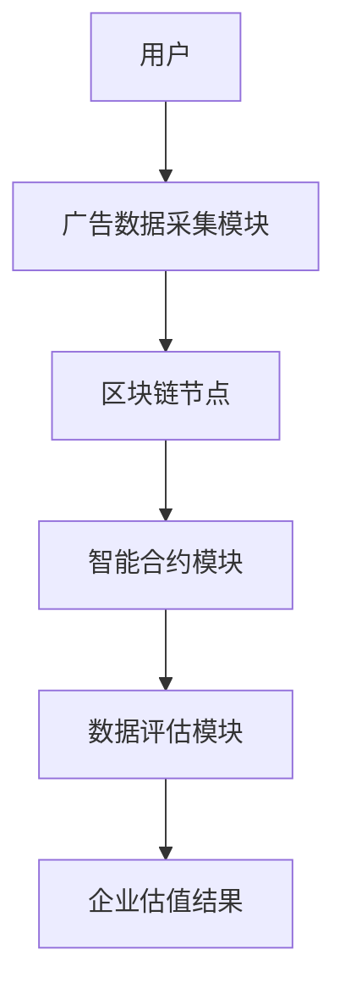
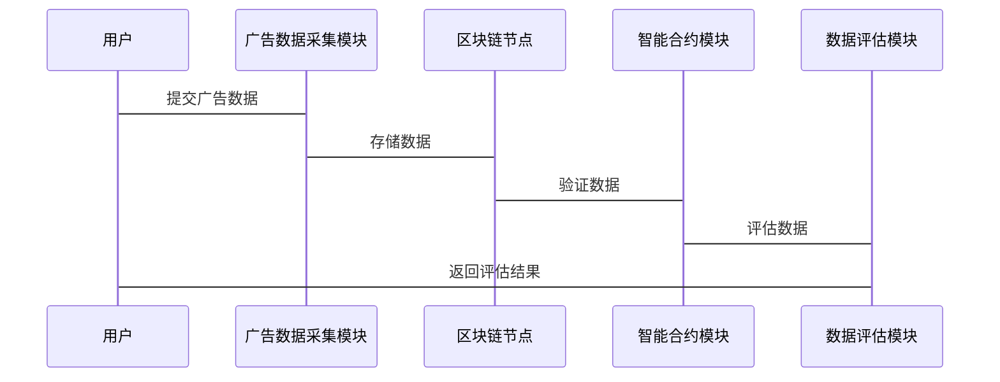

                 


# 《企业估值中的区块链数字广告追踪平台评估》

## 关键词：区块链，数字广告，追踪平台，企业估值，数据透明度，广告欺诈，广告数据

## 摘要：本文探讨了区块链技术在数字广告追踪平台评估中的应用，分析了其如何提升广告数据的透明度和可信度，为企业估值提供更准确的数据支持。文章详细介绍了区块链的基本原理、数字广告追踪的核心概念、相关算法与数学模型、系统架构设计、项目实战案例及最佳实践，旨在为企业评估提供可信赖的解决方案。

---

## 第一章：背景与概述

### 1.1 问题背景与目标

#### 1.1.1 数字广告行业的现状与挑战
数字广告行业面临数据不透明、广告欺诈、点击造假等问题，导致企业难以准确评估广告效果和投资回报。广告数据的不透明性使得企业估值缺乏可靠依据。

#### 1.1.2 区块链技术的引入
区块链通过去中心化、不可篡改和可追溯的特点，为数字广告数据的透明化提供了技术支持。区块链技术可以确保广告数据的真实性，防止数据篡改和欺诈行为。

#### 1.1.3 平台目标与边界
平台的目标是通过区块链技术实现数字广告数据的透明化和可追溯性，帮助企业准确评估广告效果，提升广告数据的可信度。平台的边界包括广告数据的采集、存储、分析和评估，不涉及广告投放的具体操作。

---

## 第二章：核心概念与原理

### 2.1 区块链的基本原理

#### 2.1.1 分布式账本与去中心化
区块链通过分布式账本技术，确保数据的分散存储和不可篡改性，避免单点故障和数据丢失。

#### 2.1.2 共识机制
共识机制（如PoW、PoS）确保区块链网络中的数据一致性和可靠性，保证数据的真实性和可追溯性。

#### 2.1.3 智能合约
智能合约是一种自动执行的代码，用于在区块链上实现自动化操作，确保广告数据的记录和验证过程自动化。

### 2.2 数字广告追踪的实现原理

#### 2.2.1 广告数据的记录与存储
广告数据（如点击、展示、地理位置）通过区块链技术实时记录和存储，确保数据的真实性和完整性。

#### 2.2.2 广告点击与展示的追踪流程
通过区块链技术，广告点击和展示数据被实时记录，并通过智能合约进行验证和确认，确保数据的准确性和可追溯性。

#### 2.2.3 数据的可追溯性与不可篡改性
区块链的特性确保广告数据的不可篡改性和可追溯性，用户可以随时追溯广告数据的来源和真实性。

### 2.3 平台评估的核心要素

#### 2.3.1 广告数据的完整性与准确性
通过区块链技术，确保广告数据的完整性与准确性，避免数据丢失和篡改。

#### 2.3.2 平台的透明度与可验证性
平台的透明度与可验证性是确保广告数据可信度的关键，区块链技术提供了数据的透明性和可验证性。

#### 2.3.3 评估模型的科学性与可操作性
评估模型需要科学合理，能够准确反映广告效果，并且具备可操作性，能够为企业估值提供可靠依据。

---

## 第三章：区块链数字广告追踪的算法与数学模型

### 3.1 区块链中的哈希函数

#### 3.1.1 哈希函数的作用与分类
哈希函数用于将任意长度的数据映射为固定长度的哈希值，确保数据的唯一性和完整性。常见的哈希函数包括MD5、SHA-256等。

#### 3.1.2 哈希函数的数学模型
哈希函数通过复杂的数学运算将输入数据转化为哈希值，确保数据的唯一性和不可逆性。例如，SHA-256哈希函数的数学模型如下：

$$ H(x) = \sum_{i=0}^{n-1} x_i \cdot 2^{8i} \mod 2^{256} $$

其中，$x_i$ 是输入数据的各个字节，$H(x)$ 是输出的哈希值。

#### 3.1.3 哈希函数在广告数据中的应用
哈希函数用于确保广告数据的完整性和一致性，防止数据篡改和伪造。

### 3.2 共识机制的实现

#### 3.2.1 工作量证明（PoW）与权益证明（PoS）
PoW通过计算复杂的问题来验证数据的有效性，而PoS通过持有一定数量的代币来验证数据的有效性。两种机制各有优缺点，适用于不同的场景。

#### 3.2.2 共识机制的数学模型
共识机制通过复杂的数学模型确保数据的一致性和可靠性，例如比特币的PoW机制：

$$ \text{难度} = 2^{32} / \text{前缀} $$

---

## 第四章：系统架构设计

### 4.1 广告追踪平台的系统结构

#### 4.1.1 平台的组成部分
平台包括用户界面、广告数据采集模块、区块链节点、智能合约模块和数据评估模块。

#### 4.1.2 系统功能设计
系统功能包括广告数据的采集、存储、验证、分析和评估，确保数据的准确性和可信度。

#### 4.1.3 系统架构图
以下是系统架构的Mermaid图：



### 4.2 系统接口设计

#### 4.2.1 广告数据接口
广告数据接口用于采集和存储广告数据，例如：

```json
{
  "ad_id": "12345",
  "timestamp": "2023-10-01 12:00:00",
  "ip_address": "192.168.1.1",
  "user_agent": "Mozilla/5.0"
}
```

#### 4.2.2 智能合约接口
智能合约接口用于验证和确认广告数据，例如：

```solidity
function verifyData(bytes32 hash) public returns (bool) {
    return hash == keccak256(abi.encodePacked(ad_id, timestamp, ip_address, user_agent));
}
```

### 4.3 系统交互流程

#### 4.3.1 广告数据的验证流程
广告数据的验证流程包括数据采集、哈希计算、区块链存储和智能合约验证。

#### 4.3.2 数据评估流程
数据评估流程包括数据完整性检查、数据准确性验证和广告效果评估。

#### 4.3.3 交互序列图
以下是数据验证和评估的Mermaid序列图：



---

## 第五章：项目实战

### 5.1 环境搭建

#### 5.1.1 安装区块链框架
安装以太坊框架（如Solidity、Web3.js）或比特币节点。

#### 5.1.2 安装开发工具
安装IDE（如Remix、VS Code）和区块链模拟环境（如Ganache）。

### 5.2 核心代码实现

#### 5.2.1 智能合约实现
以下是广告数据验证的智能合约代码：

```solidity
pragma solidity ^0.8.0;

contract AdTracker {
    event AdDataVerified(address indexed caller, uint256 ad_id, uint256 timestamp);

    function verifyAdData(uint256 ad_id, uint256 timestamp, bytes32 hash) public {
        require(hash == keccak256(abi.encodePacked(ad_id, timestamp)), "数据哈希不匹配");
        emit AdDataVerified(msg.sender, ad_id, timestamp);
    }
}
```

#### 5.2.2 数据评估实现
以下是数据评估的Python代码：

```python
def calculate_advertisement_value(ad_data):
    # ad_data 包含广告点击数、展示数、转化率等数据
    click_rate = ad_data['click_rate']
    conversion_rate = ad_data['conversion_rate']
    value = click_rate * conversion_rate * 100
    return value
```

### 5.3 测试与部署

#### 5.3.1 测试环境搭建
在本地模拟环境中部署智能合约，测试广告数据的验证和评估流程。

#### 5.3.2 实际案例分析
通过实际案例分析广告数据的验证和评估过程，确保代码的正确性和可靠性。

### 5.4 项目小结

#### 5.4.1 核心代码实现
广告数据验证和评估的智能合约和Python代码实现。

#### 5.4.2 测试结果分析
测试结果表明，区块链技术能够有效提升广告数据的透明度和可信度，为企业估值提供可靠数据支持。

---

## 第六章：最佳实践与总结

### 6.1 最佳实践

#### 6.1.1 数据隐私保护
在广告数据处理中，需注意用户隐私保护，避免数据泄露和滥用。

#### 6.1.2 系统性能优化
通过优化智能合约和数据存储结构，提升系统的性能和处理能力。

#### 6.1.3 定期数据备份
定期备份广告数据，防止数据丢失和不可用。

### 6.2 总结

#### 6.2.1 平台优势
区块链数字广告追踪平台通过数据透明化和不可篡改性，为企业估值提供可靠依据，提升广告数据的可信度和准确性。

#### 6.2.2 注意事项
在实际应用中，需注意数据隐私、系统性能和法律合规等问题。

#### 6.2.3 未来展望
未来，区块链技术将进一步成熟，广告数据的处理和分析将更加智能化和高效化。

---

## 作者：AI天才研究院/AI Genius Institute & 禅与计算机程序设计艺术 /Zen And The Art of Computer Programming

