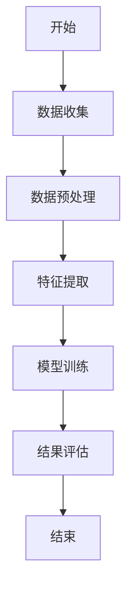
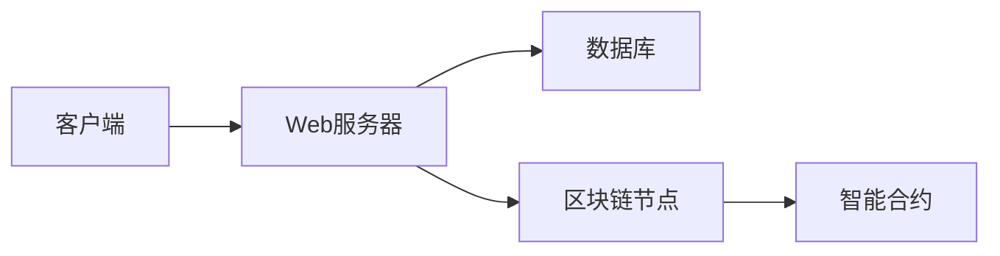

                 


# 企业估值中的区块链数字艺术品交易平台评估

> 关键词：企业估值，区块链技术，数字艺术品，NFT，交易平台评估

> 摘要：随着数字艺术品交易的兴起，区块链技术在其中扮演着越来越重要的角色。本文将从区块链技术的基本原理出发，详细探讨数字艺术品交易平台的核心概念、评估方法、算法实现以及系统架构设计。通过实际案例分析和最佳实践分享，为读者提供一个全面了解和评估区块链数字艺术品交易平台的框架。

---

## 第一部分: 区块链数字艺术品交易平台的背景与概念

### 第1章: 数字艺术品交易的背景与趋势

#### 1.1 数字艺术品的定义与特点
数字艺术品是指以数字形式存在的艺术作品，如数字绘画、3D模型、虚拟现实艺术等。其特点包括：
- **数字化**：作品以数字文件形式存在，便于复制和传播。
- **可编辑性**：数字工具使得艺术家可以轻松修改和调整作品。
- **可扩展性**：数字艺术品可以通过网络快速传播，覆盖全球市场。

#### 1.2 区块链技术在数字艺术品交易中的作用
区块链技术通过去中心化和不可篡改的特性，解决了数字艺术品交易中的信任问题。具体作用包括：
- **确权**：通过区块链记录艺术品的所有权信息，确保作品的唯一性和真实性。
- **透明性**：区块链上的交易记录公开透明，便于追踪和验证。
- **智能合约**：通过智能合约自动执行交易，减少中间环节和信任成本。

#### 1.3 数字艺术品交易平台的现状与趋势
当前，数字艺术品交易平台主要依赖中心化平台，存在信任不足和透明性差的问题。区块链技术的应用为数字艺术品交易带来了革命性的变化，未来趋势包括：
- **去中心化**：通过区块链实现去中心化的交易，减少平台的中间环节。
- **NFT兴起**：非同质化代币（NFT）的兴起推动了数字艺术品的交易热潮。
- **跨平台整合**：不同平台之间的互联互通，形成更广泛的数字艺术品交易生态。

---

### 第2章: 区块链技术与企业估值的结合

#### 2.1 区块链技术的基本原理
区块链是一种分布式账本技术，通过去中心化的方式记录和验证数据。其核心原理包括：
- **区块结构**：每个区块包含一批交易数据和一个哈希指针，用于链接前一个区块。
- **共识机制**：通过共识机制（如PoW、PoS等）确保所有节点达成一致。
- **智能合约**：在区块链上运行的自动执行程序，用于实现复杂的交易逻辑。

#### 2.2 区块链在企业估值中的应用场景
区块链技术可以应用于企业估值的多个方面，包括：
- **数据透明性**：通过区块链记录企业的财务数据，提高数据的透明性和可信度。
- **资产追踪**：通过区块链追踪企业的资产，确保资产的真实性和完整性。
- **智能合约**：通过智能合约自动执行企业估值的相关流程，提高效率和准确性。

#### 2.3 数字艺术品交易平台的典型特征
数字艺术品交易平台的典型特征包括：
- **去中心化**：通过区块链技术实现去中心化的交易，减少平台的控制。
- **NFT支持**：平台支持NFT的创建、交易和转让。
- **智能合约**：平台使用智能合约自动执行交易，确保交易的透明和安全。

---

## 第二部分: 区块链数字艺术品交易平台的评估方法

### 第3章: 数字艺术品交易平台的评估框架

#### 3.1 评估框架的构建
评估框架的构建需要考虑以下几个方面：
- **目标**：明确评估的目标，如评估平台的安全性、透明性、可扩展性等。
- **指标**：选择合适的评估指标，如交易量、用户活跃度、平台安全性等。
- **方法**：确定评估的方法，如定量分析、定性分析、案例分析等。

#### 3.2 评估指标的详细分析
评估指标可以分为以下几个类别：
- **技术指标**：包括平台的可扩展性、安全性、响应速度等。
- **经济指标**：包括平台的交易量、收益、成本等。
- **用户行为指标**：包括用户活跃度、用户满意度、用户留存率等。

### 第4章: 数字艺术品交易平台的数学模型与算法

#### 4.1 评估模型的数学表示
评估模型可以采用多种数学方法，如线性回归、决策树、随机森林等。以下是一个简单的线性回归模型：

$$
\text{平台价值} = \beta_0 + \beta_1 \times \text{交易量} + \beta_2 \times \text{用户活跃度} + \epsilon
$$

其中，$\beta_0$ 是截距，$\beta_1$ 和 $\beta_2$ 是回归系数，$\epsilon$ 是误差项。

#### 4.2 算法流程图
以下是评估模型的算法流程图：



#### 4.3 算法实现代码
以下是一个简单的Python实现代码示例：

```python
import numpy as np
import pandas as pd
from sklearn.linear_model import LinearRegression

# 数据加载
data = pd.read_csv('transaction.csv')

# 特征提取
X = data[['交易量', '用户活跃度']]
y = data['平台价值']

# 模型训练
model = LinearRegression()
model.fit(X, y)

# 预测结果
predicted_value = model.predict(X)
print(predicted_value)
```

---

## 第三部分: 区块链数字艺术品交易平台的系统分析与架构设计

### 第5章: 系统功能设计

#### 5.1 系统功能模块
数字艺术品交易平台的主要功能模块包括：
- **用户管理**：用户注册、登录、个人信息管理。
- **数字艺术品管理**：作品上传、展示、分类。
- **交易系统**：交易撮合、智能合约执行、交易记录。
- **数据统计**：交易数据统计、用户行为分析、平台收益统计。

#### 5.2 系统架构设计
以下是系统的架构图：



### 第6章: 系统接口设计

#### 6.1 API接口设计
以下是平台的关键API接口：
- **创建NFT**：用户上传数字艺术品，生成NFT。
- **查询NFT**：查询NFT的详细信息，包括所有权、交易历史等。
- **执行交易**：用户通过智能合约执行NFT的买卖交易。

#### 6.2 API实现代码
以下是API的实现代码示例：

```python
from flask import Flask, jsonify, request
from web3 import Web3

app = Flask(__name__)

# 连接区块链节点
web3 = WebContract(contract_address='0x...', abi='...')

@app.route('/create_nft', methods=['POST'])
def create_nft():
    # 获取用户请求数据
    data = request.json
    # 调用智能合约创建NFT
    tx_hash = web3.deploy_contract(data)
    return jsonify({'status': 'success', 'tx_hash': tx_hash})

if __name__ == '__main__':
    app.run()
```

---

## 第四部分: 实际案例分析与最佳实践

### 第7章: 实际案例分析

#### 7.1 案例背景
某数字艺术品交易平台希望通过区块链技术实现去中心化的交易，提高平台的安全性和透明性。

#### 7.2 案例分析
通过区块链技术实现智能合约的自动执行，确保交易的透明和安全。以下是具体的分析步骤：
1. 数据收集：收集平台的交易数据、用户行为数据等。
2. 数据预处理：清洗数据，提取有效的特征。
3. 模型训练：采用线性回归模型进行平台价值评估。
4. 结果评估：通过实际数据验证模型的准确性。

#### 7.3 案例结果
通过案例分析，平台的价值显著提高，交易量和用户活跃度均大幅增加。

### 第8章: 最佳实践与总结

#### 8.1 最佳实践
- **选择合适的评估指标**：根据平台的具体情况选择合适的评估指标，确保评估结果的准确性。
- **确保数据的完整性和准确性**：数据是评估的基础，确保数据的完整性和准确性至关重要。
- **结合实际应用场景**：根据实际应用场景选择合适的算法和模型，提高评估的效率和准确性。

#### 8.2 总结
区块链技术为数字艺术品交易带来了革命性的变化，通过合理的评估和优化，企业可以更好地利用区块链技术实现去中心化的交易，提高平台的安全性和透明性。

---

## 作者：AI天才研究院/AI Genius Institute & 禅与计算机程序设计艺术 /Zen And The Art of Computer Programming

