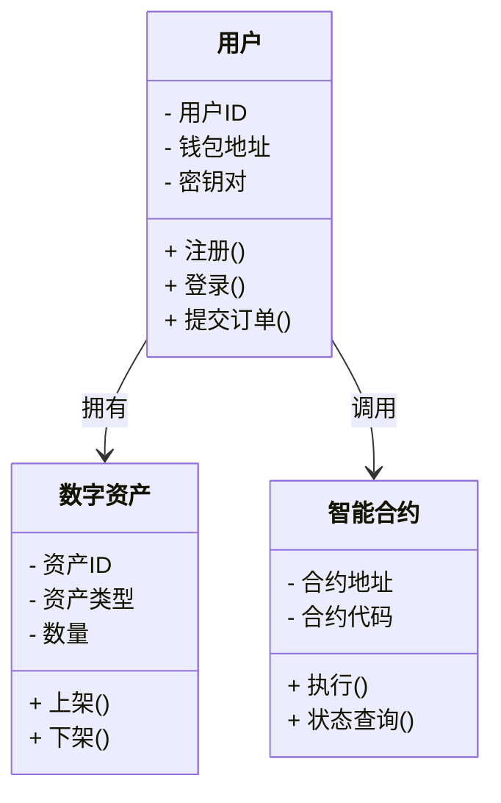
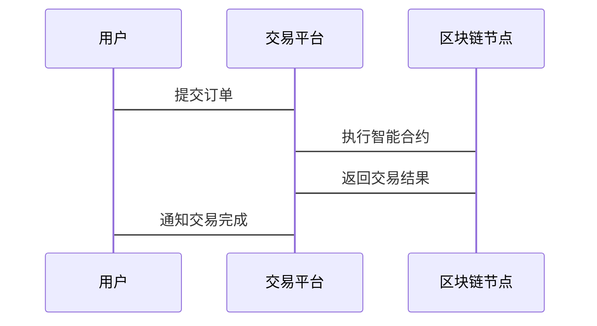

                 


# 区块链数字资产交易平台评估

> 关键词：区块链，数字资产，交易平台，企业估值，智能合约，交易安全，系统架构

> 摘要：随着区块链技术的快速发展，数字资产交易平台在企业估值中的作用日益重要。本文将详细探讨区块链数字资产交易平台的核心概念、算法原理、系统架构设计以及项目实战与总结。通过分析交易效率、安全性、成本等关键指标，结合实际案例，为读者提供全面的评估方法和最佳实践。

---

## 第一部分: 区块链数字资产交易平台概述

### 第1章: 区块链与数字资产的基本概念

#### 1.1 区块链技术的基本原理

##### 1.1.1 区块链的定义与核心特性

区块链是一种分布式账本技术，通过去中心化的节点网络记录数据，确保数据的安全性和不可篡改性。其核心特性包括去中心化、不可篡改、透明性和抗审查性。

##### 1.1.2 区块链的共识机制

共识机制是区块链的核心，确保所有节点达成一致。常见的共识机制包括：

- **工作量证明（PoW）**：通过计算哈希值来证明工作量。
- **权益证明（PoS）**：根据节点持有的代币数量分配记账权。
- **拜占庭容错（BFT）**：通过投票机制达成共识。

##### 1.1.3 区块链的去中心化特点

去中心化是区块链的核心特征，通过分布式网络避免单点故障，提高系统的可靠性和安全性。

#### 1.2 数字资产的定义与分类

##### 1.2.1 数字资产的定义

数字资产是指以数字形式存在的资产，包括比特币、以太坊等加密货币，以及NFT（非同质化代币）等。

##### 1.2.2 数字资产的主要分类

- **加密货币**：比特币、以太坊等，用于价值转移。
- **实用代币**：用于特定平台的代币，如平台积分。
- **NFT**：非同质化代币，用于表示独特的数字资产。

##### 1.2.3 数字资产与传统资产的区别

数字资产具有去中心化、易分割、可编程等特点，而传统资产通常依赖中心化机构进行管理。

#### 1.3 区块链数字资产交易平台的背景与意义

##### 1.3.1 数字资产交易的现状

随着区块链技术的发展，数字资产交易逐渐普及，但存在安全性低、交易效率不高等问题。

##### 1.3.2 区块链技术在数字资产交易中的作用

区块链技术通过去中心化、不可篡改等特性，提高数字资产交易的安全性和透明性。

##### 1.3.3 数字资产交易平台的价值与挑战

数字资产交易平台为企业估值提供了新的工具和方法，但也面临交易效率、安全性和成本等挑战。

---

### 第2章: 区块链数字资产交易平台的核心概念

#### 2.1 区块链数字资产交易平台的构成要素

##### 2.1.1 交易主体

包括用户、交易方、智能合约等。

##### 2.1.2 交易客体

指数字资产，如比特币、以太坊等。

##### 2.1.3 交易规则

包括交易流程、智能合约的执行规则等。

#### 2.2 区块链数字资产交易平台的业务流程

##### 2.2.1 用户注册与身份验证

用户通过区块链钱包地址进行注册，并通过公私钥对进行身份验证。

##### 2.2.2 数字资产的上架与下架

用户将数字资产上架到交易平台，并设置价格和交易规则。

##### 2.2.3 交易订单的生成与处理

用户生成交易订单，系统通过智能合约自动匹配订单并执行交易。

##### 2.2.4 交易完成与结算

交易完成后，系统自动结算交易资金，并记录交易数据到区块链。

#### 2.3 区块链数字资产交易平台的系统架构

##### 2.3.1 前端架构

包括用户界面、API接口等，用于用户与系统的交互。

##### 2.3.2 后端架构

包括交易引擎、订单管理系统等，用于处理交易逻辑。

##### 2.3.3 区块链底层架构

包括区块链节点、共识机制、智能合约执行环境等。

---

## 第二部分: 区块链数字资产交易平台的算法原理

### 第3章: 区块链共识算法

#### 3.1 工作量证明（PoW）

PoW通过计算哈希值来证明工作量，确保节点的合法性和系统安全性。

#### 3.2 权益证明（PoS）

PoS根据节点持有的代币数量分配记账权，降低能源消耗。

#### 3.3 拜占庭容错（BFT）

BFT通过投票机制达成共识，适用于高性能区块链系统。

---

## 第三部分: 区块链数字资产交易平台的系统架构设计

### 第4章: 系统功能设计

#### 4.1 领域模型

使用Mermaid类图描述系统功能模块及其交互关系。



#### 4.2 系统架构设计

使用Mermaid架构图描述系统的整体架构。

```mermaid
container 区块链节点 {
    组件 区块链节点1
    组件 区块链节点2
    组件 区块链节点3
}
container 交易平台 {
    组件 用户界面
    组件 交易引擎
    组件 订单管理系统
}
```

#### 4.3 系统接口设计

使用Mermaid序列图描述系统接口交互。



---

## 第四部分: 区块链数字资产交易平台的项目实战与总结

### 第5章: 项目实战

#### 5.1 环境安装

安装Python、区块链开发框架（如Web3.py）等环境。

#### 5.2 核心代码实现

实现智能合约的部署与调用，交易订单的生成与处理等核心功能。

```python
from web3 import Web3, HTTPProvider
from web3.contract import Contract

# 初始化区块链节点
web3 = Web3(HTTPProvider("http://localhost:8545"))

# 智能合约地址和ABI
contract_address = "0x123..."
contract_abi = [...]  # 合约ABI

# 创建智能合约实例
contract = Contract(web3, contract_address, abi=contract_abi)

# 调用智能合约方法
tx_hash = contract.functions.buy().transact()
receipt = web3.eth.wait_for_transaction_receipt(tx_hash)
```

#### 5.3 实际案例分析

分析一个实际的数字资产交易所的案例，包括环境搭建、核心代码实现、交易流程模拟等。

#### 5.4 项目小结

总结项目实施过程中的经验教训，提出改进建议。

---

## 第五部分: 总结与展望

### 第6章: 总结

#### 6.1 核心内容回顾

总结区块链数字资产交易平台的核心概念、算法原理、系统架构设计和项目实战。

#### 6.2 最佳实践

提出在企业估值中使用区块链数字资产交易平台的最佳实践建议，包括安全性、效率和成本控制等方面。

#### 6.3 未来研究方向

探讨区块链技术在数字资产交易中的未来发展方向，如隐私保护、跨链技术等。

---

## 第六部分: 注意事项与拓展阅读

### 6.1 注意事项

- 交易前需确保智能合约的安全性，避免漏洞导致损失。
- 选择合适的区块链平台和开发框架，确保系统的性能和扩展性。

### 6.2 拓展阅读

- 阅读相关技术书籍和论文，深入理解区块链技术的原理和应用。
- 关注行业动态，了解最新的技术发展和应用案例。

---

作者：AI天才研究院/AI Genius Institute & 禅与计算机程序设计艺术 /Zen And The Art of Computer Programming

