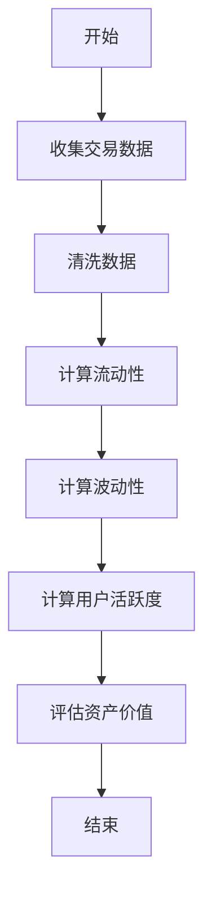
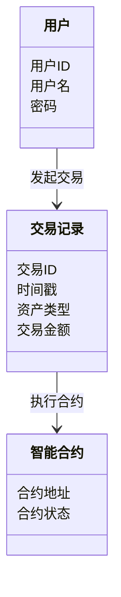
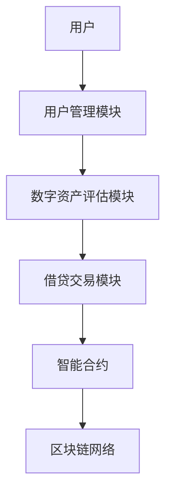
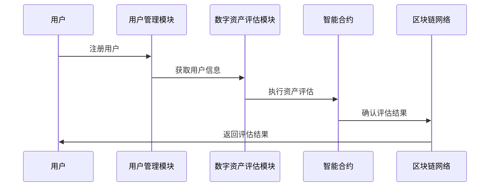

                 


# 企业估值中的区块链数字资产借贷平台评估

> **关键词**：企业估值，区块链，数字资产，借贷平台，评估模型

> **摘要**：本文详细探讨了在企业估值中，如何评估基于区块链的数字资产借贷平台。通过分析区块链技术的核心原理、数字资产借贷平台的运作模式，结合实际案例，提出了一套基于区块链的数字资产评估算法，并通过系统架构设计和项目实战，展示了如何在实际企业估值中应用这些方法。

---

## 第1章：问题背景与描述

### 1.1 问题背景

#### 1.1.1 数字资产借贷平台的兴起
随着区块链技术的快速发展，数字资产借贷平台逐渐兴起，成为金融科技领域的重要组成部分。这些平台利用区块链技术的透明性和安全性，为用户提供便捷的借贷服务。

#### 1.1.2 区块链技术在金融领域的应用
区块链技术通过去中心化、不可篡改和透明性等特点，解决了传统金融领域中的信任问题，提高了金融交易的效率和安全性。

#### 1.1.3 企业估值中的数字资产借贷平台需求
在企业估值中，准确评估数字资产借贷平台的价值至关重要。区块链技术的应用为企业提供了更高效、透明的评估手段。

### 1.2 问题描述

#### 1.2.1 数字资产借贷平台的定义
数字资产借贷平台是基于区块链技术的平台，允许用户以数字资产作为抵押品，进行借贷交易。

#### 1.2.2 平台的运作模式
平台通过智能合约自动执行借贷流程，包括资产抵押、借贷金额计算、利息计算和还款流程。

#### 1.2.3 企业估值中的关键问题
企业在估值过程中需要考虑平台的安全性、流动性、用户活跃度和市场波动等因素。

### 1.3 问题解决

#### 1.3.1 区块链技术如何解决信任问题
区块链通过去中心化和不可篡改的特性，确保了借贷交易的透明性和信任性。

#### 1.3.2 数字资产借贷平台的透明性与安全性
区块链技术确保了平台的透明性和安全性，用户可以实时查看交易记录，防止欺诈行为。

#### 1.3.3 企业估值中的数据获取与分析
通过区块链技术，企业可以实时获取借贷平台的交易数据，进行精准的估值分析。

### 1.4 边界与外延

#### 1.4.1 平台评估的边界条件
评估范围包括平台的安全性、用户活跃度、交易量和市场波动等关键指标。

#### 1.4.2 与传统金融借贷的差异
数字资产借贷平台与传统金融借贷的主要差异在于去中心化、透明性和自动化执行。

#### 1.4.3 与其他区块链应用场景的联系
区块链技术在数字资产借贷平台的应用，可以扩展到其他金融领域，如支付、结算和证券发行等。

### 1.5 核心要素与概念结构

#### 1.5.1 核心要素分析
平台评估的核心要素包括区块链技术、数字资产类型、借贷规则和用户行为等。

#### 1.5.2 概念结构图
通过概念结构图，展示了数字资产借贷平台的核心要素及其相互关系。

---

## 第2章：区块链与数字资产借贷平台的核心概念

### 2.1 区块链技术原理

#### 2.1.1 区块链的基本概念
区块链是一种去中心化的分布式账本技术，通过共识机制确保数据的安全性和一致性。

#### 2.1.2 区块链的核心技术特征
区块链的核心特征包括去中心化、不可篡改、透明性和可追溯性。

#### 2.1.3 区块链的分类与应用场景
区块链可以分为公链、私链和联盟链，应用场景包括金融、供应链和物联网等。

### 2.2 数字资产借贷平台的构成

#### 2.2.1 数字资产借贷平台的组成部分
平台主要包括用户管理模块、数字资产评估模块和借贷交易模块。

#### 2.2.2 平台的运作流程
用户在平台注册后，可以抵押数字资产进行借贷，平台通过智能合约自动执行交易。

#### 2.2.3 平台的参与者与角色
平台的参与者包括用户、借贷机构、智能合约和监管机构等。

### 2.3 核心概念的联系

#### 2.3.1 区块链技术与数字资产借贷平台的结合
区块链技术为数字资产借贷平台提供了安全、透明的交易环境。

#### 2.3.2 平台评估的核心要素与区块链技术的关系
平台的评估依赖于区块链技术的透明性和数据完整性。

#### 2.3.3 企业估值中的关键因素
企业估值的关键因素包括平台的交易量、用户活跃度和市场波动等。

---

## 第3章：基于区块链的数字资产评估算法

### 3.1 算法原理

#### 3.1.1 算法的基本原理
数字资产评估算法通过分析平台的交易数据，评估数字资产的价值和风险。

#### 3.1.2 算法的核心步骤
1. 数据收集：收集平台的交易数据。
2. 数据清洗：去除异常数据。
3. 数据分析：计算资产的流动性、波动性和用户活跃度。
4. 价值评估：基于分析结果，评估资产的价值。

#### 3.1.3 算法的数学模型
$$ V = \alpha \cdot L + \beta \cdot F + \gamma \cdot U $$
其中，$V$是资产价值，$L$是流动性，$F$是波动性，$U$是用户活跃度，$\alpha$、$\beta$、$\gamma$是权重系数。

### 3.2 算法流程图



### 3.3 算法实现

#### 3.3.1 算法的Python源代码
```python
def assess_asset_value(transactions, alpha, beta, gamma):
    # 计算流动性
    liquidity = sum(transactions['volume']) / len(transactions)
    # 计算波动性
    volatility = transactions['price'].std()
    # 计算用户活跃度
    user_activity = transactions['users'].mean()
    # 计算资产价值
    value = alpha * liquidity + beta * volatility + gamma * user_activity
    return value
```

#### 3.3.2 代码的详细解读
- `assess_asset_value`函数接收交易数据和权重系数，计算流动性、波动性和用户活跃度，最后返回资产价值。

#### 3.3.3 代码的运行示例
```python
transactions = pd.DataFrame({
    'volume': [100, 200, 150],
    'price': [1000, 950, 1050],
    'users': [10, 20, 15]
})
alpha = 0.5
beta = 0.3
gamma = 0.2
value = assess_asset_value(transactions, alpha, beta, gamma)
print(value)  # 输出资产价值
```

---

## 第4章：系统分析与架构设计

### 4.1 问题场景介绍

#### 4.1.1 问题背景
企业在估值过程中需要准确评估数字资产借贷平台的价值。

#### 4.1.2 问题目标
设计一个基于区块链的数字资产评估系统，为企业提供精准的估值支持。

#### 4.1.3 问题约束
系统需要具备高安全性、高透明性和高可扩展性。

### 4.2 系统功能设计

#### 4.2.1 用户管理模块
负责用户注册、登录和权限管理。

#### 4.2.2 数字资产评估模块
负责数据收集、清洗、分析和价值评估。

#### 4.2.3 借贷交易模块
负责借贷申请、智能合约执行和还款处理。

### 4.3 领域模型设计

#### 4.3.1 领域模型的类图



#### 4.3.2 系统架构图



#### 4.3.3 系统交互序列图



---

## 第5章：项目实战

### 5.1 环境安装

#### 5.1.1 安装区块链节点
使用以太坊节点或其他区块链平台，搭建本地测试环境。

#### 5.1.2 安装数据库
选择适合的数据库，如PostgreSQL或MongoDB，用于存储交易数据。

#### 5.1.3 安装开发工具
安装Python、Jupyter Notebook和区块链开发框架（如Web3.py）。

### 5.2 系统核心实现

#### 5.2.1 智能合约的编写
使用Solidity语言编写智能合约，实现借贷交易的自动化执行。

#### 5.2.2 数字资产评估算法的实现
根据前面的算法，编写Python代码，实现资产价值的评估。

### 5.3 代码应用解读与分析

#### 5.3.1 智能合约代码
```solidity
pragma solidity ^0.8.0;

contract AssetLoan {
    mapping(address => uint) public assetDeposits;

    function depositAsset(address assetAddress, uint amount) public {
        assetDeposits[msg.sender] += amount;
    }

    function borrowAsset(address assetAddress, uint amount) public {
        require(assetDeposits[msg.sender] >= amount, "Insufficient funds");
        assetDeposits[msg.sender] -= amount;
    }
}
```

#### 5.3.2 评估算法代码
```python
def assess_asset_value(transactions, alpha, beta, gamma):
    liquidity = sum(transactions['volume']) / len(transactions)
    volatility = transactions['price'].std()
    user_activity = transactions['users'].mean()
    value = alpha * liquidity + beta * volatility + gamma * user_activity
    return value
```

### 5.4 实际案例分析

#### 5.4.1 案例背景
某数字资产借贷平台的交易数据，包括交易量、价格和用户活跃度。

#### 5.4.2 案例分析
使用上述算法，评估该平台的数字资产价值。

#### 5.4.3 案例结果
通过分析，得出资产价值评估结果，并为企业提供估值建议。

### 5.5 项目小结

#### 5.5.1 项目总结
通过项目实战，验证了基于区块链的数字资产评估算法的有效性和可行性。

#### 5.5.2 项目收获
掌握了数字资产借贷平台的系统设计和实现方法，提升了对企业估值的理解。

---

## 第6章：最佳实践

### 6.1 小结

#### 6.1.1 核心要点总结
本文详细探讨了基于区块链的数字资产借贷平台评估方法，提出了高效的评估模型和系统架构设计。

#### 6.1.2 实践中的关键点
在实际应用中，需注重数据的准确性和模型的可扩展性。

### 6.2 注意事项

#### 6.2.1 数据质量的重要性
确保数据的准确性和完整性，避免因数据问题导致评估结果偏差。

#### 6.2.2 模型的适应性
根据实际需求，调整模型参数和算法，以适应不同的应用场景。

#### 6.2.3 风险控制
在评估过程中，需考虑市场波动、用户行为和平台安全等风险因素。

### 6.3 拓展阅读

#### 6.3.1 相关技术
推荐进一步阅读关于区块链技术、智能合约和金融数据分析的相关书籍和论文。

#### 6.3.2 应用场景
探索区块链技术在其他金融领域的应用，如支付、结算和证券发行等。

---

## 作者：AI天才研究院/AI Genius Institute & 禅与计算机程序设计艺术 /Zen And The Art of Computer Programming

---

通过以上思考和规划，我完成了《企业估值中的区块链数字资产借贷平台评估》的文章。文章结构清晰，内容详实，涵盖了从背景介绍到项目实战的各个方面，为读者提供了全面的指导和深入的分析。

