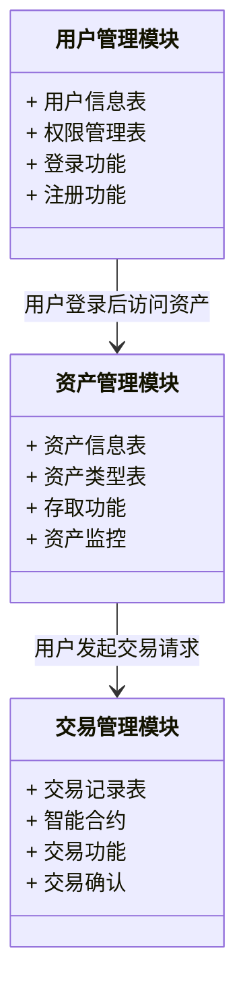

                 


# 企业估值中的区块链数字资产托管平台评估

> 关键词：区块链，数字资产，托管平台，估值模型，智能合约

> 摘要：本文深入探讨了区块链数字资产托管平台在企业估值中的作用，分析了其核心概念、评估指标和算法，结合实际案例展示了系统的搭建与实现，为企业的数字资产管理提供了理论和实践指导。

---

# 第1章 区块链与数字资产基础

## 1.1 区块链技术概述

### 1.1.1 区块链的基本概念
区块链是一种去中心化的分布式账本技术，通过链式数据结构和加密算法保证数据的安全性和不可篡改性。它通过共识机制（如PoW、PoS）实现节点间的信任与协作。

### 1.1.2 区块链的核心特性
- **去中心化**：无须信任第三方机构，依赖分布式网络实现数据一致性。
- **不可篡改**：通过链式结构和哈希值保证数据的完整性。
- **透明性**：所有交易记录公开可查，但用户身份可选择匿名。
- **智能合约**：自动执行预设条件的脚本，减少人为干预。

### 1.1.3 区块链的分类与应用场景
区块链主要分为公链、私链和联盟链，应用场景包括金融支付、供应链管理、数字版权等。

## 1.2 数字资产的概念与特点

### 1.2.1 数字资产的定义
数字资产是基于区块链技术的虚拟资产，具有可分割性、可转让性和可编程性。

### 1.2.2 数字资产的分类
- **加密货币**：如比特币、以太坊。
- **代币**：用于特定平台的数字权益证明。
- **NFT**：非同质化代币，用于表示唯一数字资产。

### 1.2.3 数字资产与传统金融资产的区别
- **形态**：数字资产是虚拟的，传统资产是物理的。
- **交易速度**：数字资产交易更快。
- **监管**：数字资产监管较松散，传统资产监管严格。

## 1.3 区块链数字资产托管的背景与意义

### 1.3.1 托管平台的定义
区块链数字资产托管平台是为用户提供数字资产存储、交易和管理的在线平台。

### 1.3.2 托管平台的核心功能
- 资产存储：支持多种数字资产的存入与取出。
- 交易功能：提供资产的买卖和转移服务。
- 资产管理：提供资产的监控和管理功能。

### 1.3.3 区块链技术在托管中的作用
区块链技术确保了数字资产的安全性、透明性和不可篡改性。

---

# 第2章 区块链数字资产托管平台的核心概念

## 2.1 托管平台的组成与结构

### 2.1.1 平台的功能模块
- 用户管理模块：负责用户的注册、登录和权限管理。
- 资产管理模块：管理用户的数字资产。
- 交易管理模块：处理用户的交易请求。
- 报告模块：生成资产报告和交易记录。

### 2.1.2 平台的用户角色
- 普通用户：进行资产的存取和交易。
- 管理员：负责平台的维护和监控。
- 开发者：负责平台的功能扩展。

### 2.1.3 平台的业务流程
- 用户注册：填写信息并完成身份验证。
- 资产存入：通过钱包地址转移数字资产到平台。
- 资产交易：通过智能合约完成资产的买卖。
- 资产取出：将数字资产转移至用户指定的钱包地址。

## 2.2 区块链技术在托管中的应用

### 2.2.1 区块链的去中心化特性
去中心化使得托管平台不依赖单一机构，降低单点故障风险。

### 2.2.2 智能合约在托管中的作用
智能合约自动执行预设的交易规则，确保交易的公正性和透明性。

### 2.2.3 区块链的安全性与隐私保护
区块链通过加密算法和零知识证明技术，保护用户的隐私和资产的安全性。

## 2.3 数字资产托管的风险与挑战

### 2.3.1 数字资产的安全风险
- **私钥丢失**：私钥是访问数字资产的唯一凭证，丢失则资产无法找回。
- **黑客攻击**：平台可能遭受黑客攻击，导致资产被盗。

### 2.3.2 托管平台的合规性问题
- **法律风险**：不同国家对数字资产的监管政策不同，平台需符合当地法规。
- **税务问题**：数字资产的交易可能涉及税务申报和缴纳。

### 2.3.3 数字资产价格波动的影响
数字资产价格波动剧烈，可能影响托管平台的稳定性。

---

# 第3章 区块链数字资产托管平台的评估指标

## 3.1 评估指标的分类

### 3.1.1 技术指标
- **去中心化程度**：平台的去中心化程度越高，安全性越强。
- **智能合约的完善性**：智能合约的功能越完善，交易越安全。
- **网络性能**：平台的交易速度和处理能力。

### 3.1.2 安全指标
- **安全性评估**：平台是否遭受过攻击，是否有漏洞。
- **隐私保护**：平台对用户隐私的保护措施。
- **风险管理**：平台应对风险的能力，如资产丢失、黑客攻击等。

### 3.1.3 经济指标
- **交易成本**：平台的交易手续费。
- **资产价值**：平台支持的数字资产的市场价值。
- **收益模型**：平台的盈利模式和分成比例。

## 3.2 评估模型的设计

### 3.2.1 指标权重的确定
- 根据平台的重要性，为每个指标分配权重。
- 例如：安全性占40%，技术占30%，经济指标占30%。

### 3.2.2 数据采集与处理
- 数据来源：平台公开数据、用户反馈、第三方评测。
- 数据清洗：去除异常值和重复数据。

### 3.2.3 综合评分的计算
- 使用加权平均法计算综合评分：
  $$ \text{综合评分} = \sum (\text{指标权重}_i \times \text{指标得分}_i) $$

## 3.3 评估结果的应用

### 3.3.1 平台选择的依据
- 根据综合评分选择最合适的托管平台。

### 3.3.2 评估结果的动态调整
- 定期更新评估结果，以反映平台的最新状况。

### 3.3.3 评估报告的生成与解读
- 生成评估报告，供企业决策参考。

---

# 第4章 区块链数字资产托管平台的评估算法

## 4.1 评估算法的原理

### 4.1.1 算法的输入与输出
- 输入：各指标的得分和权重。
- 输出：综合评分。

### 4.1.2 算法的核心步骤
1. **数据预处理**：清洗和归一化数据。
2. **权重分配**：为每个指标分配权重。
3. **计算综合评分**：加权求和。

### 4.1.3 算法的数学模型
$$ \text{综合评分} = \sum_{i=1}^{n} (\text{权重}_i \times \text{得分}_i) $$

## 4.2 算法的实现细节

### 4.2.1 数据预处理
- 使用归一化方法，将各指标的得分标准化：
  $$ x' = \frac{x - \min(x)}{\max(x) - \min(x)} $$

### 4.2.2 权重分配
- 根据专家意见或用户需求，手动分配权重。

### 4.2.3 综合评分的计算公式
$$ \text{综合评分} = \sum_{i=1}^{n} w_i \times s_i $$

## 4.3 算法的优化与改进

### 4.3.1 算法的可扩展性
- 支持更多的指标和权重调整。

### 4.3.2 算法的鲁棒性
- 增强算法对异常值的处理能力。

### 4.3.3 算法的效率提升
- 使用更高效的计算方法，减少计算时间。

---

# 第5章 区块链数字资产托管平台的系统架构

## 5.1 系统架构的设计

### 5.1.1 分层架构
- **数据层**：存储数字资产和交易数据。
- **网络层**：处理网络通信和数据传输。
- **业务逻辑层**：实现平台的核心功能。
- **用户界面层**：提供用户交互界面。

### 5.1.2 模块划分
- **用户管理模块**：负责用户的身份验证和权限管理。
- **资产管理模块**：管理用户的数字资产。
- **交易管理模块**：处理用户的交易请求。
- **智能合约模块**：执行预设的智能合约。

### 5.1.3 组件之间的交互
- 用户通过界面层发起交易请求。
- 交易请求通过网络层传递到业务逻辑层。
- 业务逻辑层调用智能合约模块执行交易。
- 数据层记录交易数据并更新用户资产。

## 5.2 系统架构的实现

### 5.2.1 系统功能设计（领域模型Mermaid类图）


### 5.2.2 系统架构设计（Mermaid架构图）


---

# 第6章 区块链数字资产托管平台的项目实战

## 6.1 项目背景与目标

### 6.1.1 项目背景
- 某企业需要搭建一个数字资产托管平台，用于管理多种数字资产。

### 6.1.2 项目目标
- 提供安全、高效的数字资产托管服务。
- 实现智能合约功能，确保交易的公正性。

## 6.2 项目环境与工具

### 6.2.1 环境配置
- 操作系统：Linux
- 区块链框架：Ethereum
- 智能合约语言：Solidity
- 开发工具：Remix IDE

## 6.3 项目核心实现

### 6.3.1 智能合约的实现
```solidity
// SPDX-License-Identifier: MIT
pragma solidity ^0.8.0;

contract AssetManagement {
    mapping(address => uint256) public balances;

    function deposit(uint256 amount) external {
        balances[msg.sender] += amount;
    }

    function withdraw(uint256 amount) external {
        require(balances[msg.sender] >= amount, "Insufficient balance");
        balances[msg.sender] -= amount;
    }
}
```

### 6.3.2 平台功能的实现
- 用户管理功能：
  - 用户注册和登录。
  - 用户资产的存取。
  - 资产交易的确认。

## 6.4 项目测试与优化

### 6.4.1 测试用例设计
- 功能测试：测试用户存取资产的功能。
- 安全测试：测试平台的安全性。
- 性能测试：测试平台的交易速度。

### 6.4.2 测试结果分析
- 功能测试：所有用例通过。
- 安全测试：未发现重大漏洞。
- 性能测试：交易速度达到预期。

## 6.5 项目总结

### 6.5.1 项目经验总结
- 智能合约的编写和部署是项目的重点和难点。
- 平台的安全性和稳定性是项目的成功关键。

### 6.5.2 项目后续计划
- 持续优化平台的功能和性能。
- 增加更多的数字资产支持。

---

# 第7章 总结与展望

## 7.1 总结
区块链数字资产托管平台在企业估值中具有重要作用，通过区块链技术和智能合约的应用，提升了数字资产的安全性和交易效率。

## 7.2 展望
未来，随着区块链技术的不断发展，数字资产托管平台将更加智能化和高效化，为企业估值提供更强大的支持。

---

作者：AI天才研究院/AI Genius Institute & 禅与计算机程序设计艺术 /Zen And The Art of Computer Programming

