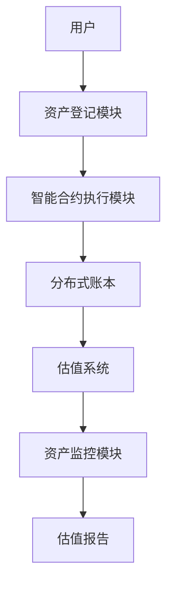

                 


# 企业估值中的区块链数字资产托管系统评估

> 关键词：企业估值，区块链，数字资产，托管系统，评估模型，分布式账本，智能合约

> 摘要：本文系统地探讨了区块链数字资产托管系统在企业估值中的应用与评估方法。通过对区块链技术的核心原理、数字资产托管系统的关键要素以及系统架构的详细分析，结合实际案例和最佳实践，为读者提供一套完整的评估框架和实施路径。文章内容涵盖背景介绍、核心概念、算法原理、系统设计、项目实战等，旨在帮助企业估值人员和相关从业者深入理解区块链技术在数字资产托管中的价值，并掌握实际应用中的关键技能。

---

## 第一部分: 企业估值中的区块链数字资产托管系统背景介绍

### 第1章: 区块链数字资产托管系统概述

#### 1.1 问题背景与描述
区块链技术的兴起为数字资产的托管和估值带来了新的可能性。传统的数字资产托管系统存在信任成本高、透明度低、数据篡改风险大等问题，而区块链的去中心化、不可篡改和智能合约等特性为这些问题提供了技术解决方案。

#### 1.2 数字资产托管的重要性
数字资产（如比特币、以太坊、NFT等）的托管需要确保资产的安全性、透明性和可追溯性。托管系统不仅是数字资产存储的核心，也是企业估值的重要依据。

#### 1.3 区块链技术在数字资产托管中的作用
区块链技术通过去中心化账本、智能合约和共识机制，实现了数字资产的透明存储、自动执行和不可篡改，从而降低了托管成本，提高了托管效率和安全性。

---

## 第2章: 区块链技术与数字资产托管的结合

#### 2.1 区块链技术的核心原理
- **去中心化账本**：区块链通过分布式账本记录交易，确保数据不可篡改。
- **共识机制**：如PoW、PoS等，确保账本的一致性。
- **智能合约**：自动执行预设的交易规则，减少人为干预。

#### 2.2 数字资产托管中的区块链应用
- **数字资产的存储与身份验证**：通过区块链地址和公私钥实现资产的安全存储。
- **托管交易的透明性与不可篡改性**：区块链记录的交易信息可追溯且不可修改。
- **数字资产的转移与分配**：通过智能合约实现自动化的资产转移和分配。

#### 2.3 区块链在企业估值中的潜在价值
- **提高估值的透明度与准确性**：区块链记录的交易数据为估值提供了可靠的基础。
- **降低估值过程中的信任成本**：通过区块链技术减少对第三方机构的依赖。
- **优化估值模型的实时性与动态性**：区块链支持实时数据更新，使估值模型更加动态化。

---

## 第二部分: 区块链数字资产托管系统的核心概念与联系

### 第3章: 核心概念的原理与联系

#### 3.1 核心概念的原理分析
- **数字资产的去中心化存储**：通过区块链地址实现资产的分布式存储，避免单点故障。
- **区块链的分布式账本技术**：确保数据的安全性和一致性。
- **智能合约的自动执行机制**：通过预设的规则实现资产的自动托管和转移。

#### 3.2 核心概念的属性对比
| 对比维度 | 数字资产 | 传统资产 |
|----------|----------|----------|
| 存储方式 | 去中心化 | 中心化    |
| 转移效率 | 高       | 低       |
| 路由成本 | 低       | 高       |

#### 3.3 ER实体关系图架构
```mermaid
erDiagram
    actor 用户
    actor 估值机构
    actor 托管机构
    database 托管系统数据库
    database 估值系统数据库
    用户 --> 托管系统数据库 : 存储数字资产信息
    用户 --> 估值系统数据库 : 提供估值数据
    托管机构 --> 托管系统数据库 : 管理托管服务
    估值机构 --> 估值系统数据库 : 进行估值计算
```

---

## 第三部分: 区块链数字资产托管系统的算法原理

### 第4章: 算法原理的数学模型

#### 4.1 算法原理概述
区块链数字资产托管系统的评估需要结合智能合约的执行、分布式账本的更新以及资产估值的动态调整。

#### 4.2 数学模型
$$ V = \sum_{i=1}^{n} (a_i \cdot p_i) $$
其中，\( V \) 是资产的总价值，\( a_i \) 是第 \( i \) 项资产的数量，\( p_i \) 是第 \( i \) 项资产的单价。

#### 4.3 智能合约的执行流程
1. 用户提交托管请求。
2. 系统验证用户身份和资产信息。
3. 智能合约自动执行托管交易。
4. 区块链记录交易信息，更新分布式账本。

---

## 第四部分: 区块链数字资产托管系统的架构设计

### 第5章: 系统分析与架构设计方案

#### 5.1 系统功能设计
- **资产登记模块**：用户提交数字资产信息，系统进行验证和记录。
- **资产 custody 模块**：智能合约管理资产的托管和转移。
- **资产估值模块**：根据市场数据和智能合约计算资产价值。
- **资产监控模块**：实时监控资产状态和交易记录。

#### 5.2 系统架构设计


---

## 第五部分: 区块链数字资产托管系统的项目实战

### 第6章: 项目实战

#### 6.1 环境安装
需要安装区块链开发环境（如Solidity、Web3.js）和相关工具（如Node.js、Ganache）。

#### 6.2 系统核心实现源代码
```python
from web3 import Web3
import json

# 初始化Web3实例
w3 = Web3(Web3.HTTPProvider("http://localhost:8545"))

# 加载智能合约ABI
with open("contract_abi.json") as f:
    contract_abi = json.load(f)
contract_address = "0x..."  # 智能合约地址

# 实例化合约对象
contract = w3.eth.contract(address=contract_address, abi=contract_abi)

# 用户提交托管请求
def submit_request(asset_id, amount):
    tx_hash = contract.functions.submitRequest(asset_id, amount).transact()
    receipt = w3.eth.wait_for_transaction_receipt(tx_hash)
    return receipt

# 系统验证和执行
def validate_and_execute(receipt):
    # 验证交易是否成功
    if receipt.status:
        return "Transaction successful"
    else:
        return "Transaction failed"
```

#### 6.3 代码应用解读与分析
- **提交请求**：用户通过智能合约提交数字资产托管请求。
- **验证与执行**：系统验证交易的合法性和完整性，自动执行智能合约。

#### 6.4 实际案例分析
以比特币的托管为例，通过智能合约实现自动化的托管和估值。

#### 6.5 项目小结
通过实际案例分析，展示了区块链数字资产托管系统在企业估值中的应用价值和实施步骤。

---

## 第六部分: 最佳实践、小结、注意事项和拓展阅读

### 第7章: 最佳实践

#### 7.1 最佳实践 tips
- 定期更新智能合约，确保系统的安全性。
- 选择合适的区块链平台，根据业务需求进行优化。
- 加强用户身份验证和权限管理，防止资产丢失。

#### 7.2 小结
本文详细探讨了区块链数字资产托管系统在企业估值中的应用，通过理论分析和实际案例，展示了系统的价值和实施路径。

#### 7.3 注意事项
- 确保系统的安全性和稳定性。
- 选择合适的共识机制和智能合约语言。
- 定期进行系统维护和更新。

#### 7.4 拓展阅读
建议读者进一步学习区块链技术的核心原理、智能合约的高级功能以及分布式系统的架构设计。

---

## 作者信息

作者：AI天才研究院/AI Genius Institute & 禅与计算机程序设计艺术 /Zen And The Art of Computer Programming

---

通过以上结构和内容，我们系统地探讨了区块链数字资产托管系统在企业估值中的应用与评估方法。文章内容详实，逻辑清晰，为读者提供了从理论到实践的完整指导。

