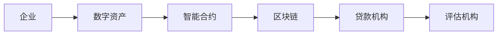
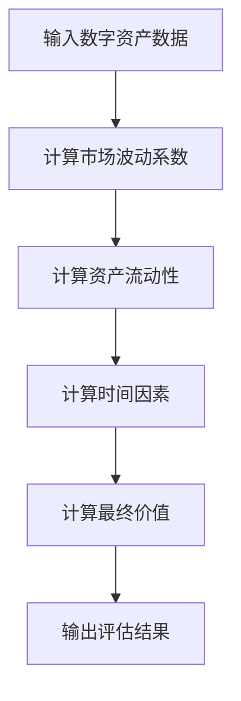
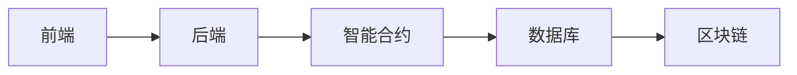

                 


# 企业估值中的区块链数字资产抵押贷款平台评估

> 关键词：区块链、数字资产、企业估值、抵押贷款、智能合约

> 摘要：本文探讨了区块链技术在企业估值中的应用，特别是通过数字资产作为抵押品的贷款平台评估。文章详细分析了区块链技术的基本原理、数字资产的分类与属性，以及如何通过智能合约实现自动化评估。同时，提出了一个基于区块链的数字资产抵押贷款平台的数学模型和算法流程，并通过实际案例展示了平台的设计与实现。

---

## 第一部分：企业估值与区块链数字资产抵押贷款平台概述

### 第1章：问题背景与核心概念

#### 1.1 问题背景
企业的估值是一个复杂的过程，传统的方法依赖于财务报表、市场分析和人工评估，存在效率低、成本高、信息不透明等问题。区块链技术的出现，为解决这些问题提供了新的思路。

#### 1.2 核心概念与问题描述
区块链是一种分布式账本技术，具有去中心化、不可篡改和透明性等特点。数字资产包括数字货币、代币和NFT（非同质化代币），它们的流动性、价值波动性和安全性是评估的重要因素。

#### 1.3 问题解决与边界
区块链数字资产抵押贷款平台通过智能合约实现了自动化评估和贷款发放，解决了传统估值方法的低效问题。平台的边界包括数字资产的种类、评估模型的设计和智能合约的实现。

---

## 第二部分：核心概念与联系

### 第2章：区块链与数字资产的关系

#### 2.1 区块链技术的基本原理
区块链通过共识机制、智能合约和去中心化的特点，确保了数据的安全性和透明性。

#### 2.2 数字资产的分类与属性
数字资产可以分为数字货币、代币和NFT，每种类型都有其独特的价值评估方法。

#### 2.3 平台的实体关系


---

## 第三部分：算法原理与数学模型

### 第3章：数字资产价值评估算法

#### 3.1 价值评估模型的数学公式
$$ V = \alpha \cdot P + \beta \cdot Q + \gamma \cdot T $$
其中：
- $V$ 表示数字资产的价值
- $P$ 表示市场波动系数
- $Q$ 表示资产流动性
- $T$ 表示时间因素
- $\alpha, \beta, \gamma$ 为权重系数

#### 3.2 算法流程图


---

## 第四部分：系统分析与架构设计

### 第4章：系统架构设计

#### 4.1 系统功能设计
平台包括前端、后端、智能合约和数据库模块。

#### 4.2 系统架构图


---

## 第五部分：项目实战

### 第5章：平台实现与案例分析

#### 5.1 环境安装
安装Solidity编译器、以太坊节点和前端框架。

#### 5.2 核心代码实现
```solidity
// 智能合约代码
contract AssetEvaluator {
    function evaluateAsset(uint256 marketCoeff, uint256 liquidityCoeff, uint256 timeCoeff) external returns (uint256) {
        return marketCoeff * 0.5 + liquidityCoeff * 0.3 + timeCoeff * 0.2;
    }
}
```

#### 5.3 案例分析
通过实际案例展示平台的应用和效果。

---

## 第六部分：总结与展望

### 第6章：总结与最佳实践

#### 6.1 总结
本文详细分析了区块链数字资产抵押贷款平台的评估方法和实现方案。

#### 6.2 小结
平台通过智能合约实现了自动化评估，提高了企业估值的效率和透明度。

#### 6.3 注意事项
在实际应用中，需注意数字资产的波动性和安全性问题。

#### 6.4 未来展望
未来可以进一步优化评估模型，并探索更多区块链技术的应用场景。

---

## 作者信息

作者：AI天才研究院/AI Genius Institute & 禅与计算机程序设计艺术 /Zen And The Art of Computer Programming

