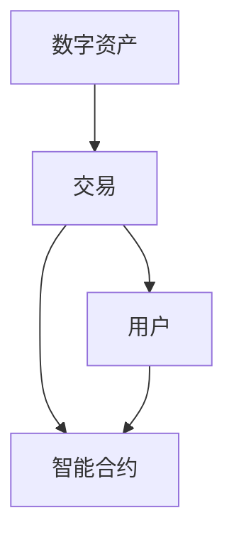
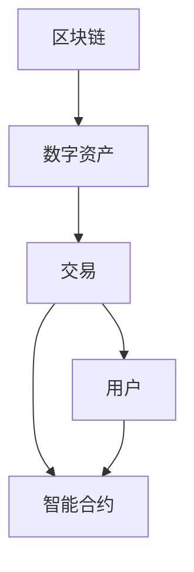
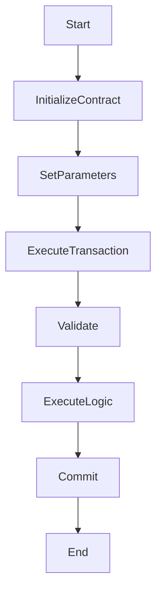
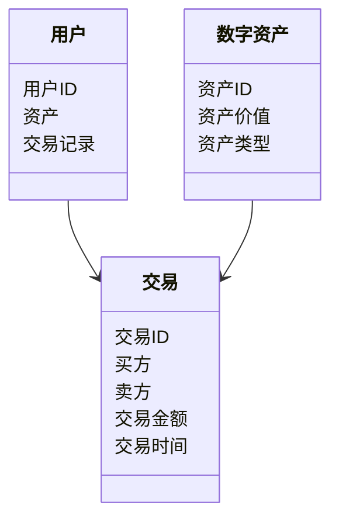
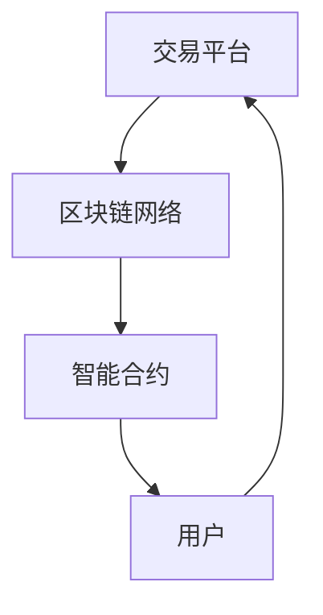

                 


# 企业估值中的区块链数字资产衍生品交易平台评估

> 关键词：企业估值、区块链、数字资产、衍生品交易、智能合约

> 摘要：本文深入探讨了区块链技术在数字资产衍生品交易平台评估中的应用，分析了其在企业估值中的优势和挑战。通过详细阐述核心概念、算法原理、系统架构设计及项目实战，本文为读者提供了全面的技术视角，展示了区块链如何提升金融衍生品交易的透明度和效率，为企业估值提供更可靠的依据。

---

# 第1章: 区块链数字资产衍生品交易平台的背景与挑战

## 1.1 问题背景

### 1.1.1 数字资产衍生品交易的兴起
近年来，区块链技术的快速发展催生了多种数字资产衍生品，如比特币期权、以太坊期货等。这些衍生品交易具有高杠杆、高流动性的特点，吸引了大量投资者。然而，其复杂性也带来了估值难题。

### 1.1.2 区块链技术在金融领域的应用
区块链的去中心化、不可篡改性和透明性为金融衍生品的交易和估值提供了新的可能性。传统金融体系中，衍生品的估值依赖于复杂的数学模型和大量的人工计算，而区块链技术可以简化这一过程。

### 1.1.3 传统估值方法的局限性
传统估值方法依赖于中心化机构的报价和复杂模型，存在信息不对称、计算复杂、成本高等问题。尤其是在高频交易和去中心化金融（DeFi）兴起的背景下，传统方法难以满足实时性和透明性的需求。

## 1.2 问题描述

### 1.2.1 数字资产衍生品交易的特点
数字资产衍生品交易具有去中心化、24/7交易、高杠杆和自动化执行的特点。这些特点使得传统的估值方法难以直接适用。

### 1.2.2 区块链技术在估值中的作用
区块链技术可以通过智能合约实现自动化的估值和结算，确保交易的透明性和公平性。同时，区块链上的交易数据可以被实时监控和分析，为估值提供实时数据支持。

### 1.2.3 当前估值方法的不足
当前的估值方法依赖于中心化机构的报价和复杂的数学模型，容易受到人为干预和市场操纵的影响。此外，传统方法难以应对高频交易和去中心化交易的复杂性。

## 1.3 问题解决

### 1.3.1 区块链技术如何提升估值效率
区块链技术可以通过智能合约实现自动化的估值和结算，减少人工干预，提高估值效率。同时，区块链的透明性可以减少信息不对称，提高估值的准确性。

### 1.3.2 智能合约在估值中的应用
智能合约可以自动执行交易并实时更新估值数据，确保估值的准确性和及时性。通过智能合约，可以实现去中心化的估值系统，减少对中心化机构的依赖。

### 1.3.3 数据透明性与安全性保障
区块链的透明性和不可篡改性可以确保交易数据的安全和可信，为估值提供可靠的数据支持。通过区块链技术，可以实现数据的实时同步和共享，减少数据误差。

## 1.4 概念边界与外延

### 1.4.1 数字资产的定义与分类
数字资产包括比特币、以太坊等加密货币，以及各类代币。数字资产衍生品包括期货、期权、掉期等。

### 1.4.2 衍生品交易的类型
衍生品交易包括期货交易、期权交易、掉期交易等。每种交易类型都有其独特的估值方法和风险特征。

### 1.4.3 区块链技术的适用范围
区块链技术适用于需要高透明性、高安全性和自动化的金融场景，如数字资产交易、智能合约执行等。

## 1.5 核心概念与联系

### 1.5.1 核心概念原理
区块链技术通过去中心化的账本和智能合约实现数字资产的交易和估值。智能合约可以自动执行交易并更新估值数据，确保交易的透明性和公平性。

### 1.5.2 概念属性特征对比表格
表1-1：数字资产与传统金融资产的对比

| 特性         | 数字资产          | 传统金融资产      |
|--------------|-------------------|-------------------|
| 所有权       | 去中心化           | 中心化            |
| 交易效率     | 高                | 低                |
| 透明性       | 高                | 低                |
| 可编程性     | 高                | 低                |

### 1.5.3 ER实体关系图


---

# 第2章: 区块链数字资产衍生品交易平台的核心概念与联系

## 2.1 核心概念原理

### 2.1.1 区块链技术的去中心化特性
区块链技术通过分布式账本实现去中心化的交易记录和估值。每个节点都可以参与交易的记录和验证，确保数据的准确性和安全性。

### 2.1.2 数字资产的唯一性与可分割性
数字资产具有唯一性和可分割性，可以通过区块链技术实现精确的估值和交易。每个数字资产都有唯一的标识和价值，可以通过智能合约进行自动化的交易和结算。

### 2.1.3 衍生品交易的杠杆效应与风险
衍生品交易具有高杠杆效应，可以通过少量的资金控制更大的头寸。然而，这也带来了较高的风险，需要通过区块链技术实现风险的实时监控和管理。

## 2.2 概念属性特征对比表格
表2-1：区块链与传统金融系统的对比

| 特性         | 区块链            | 传统金融系统      |
|--------------|-------------------|-------------------|
| 中心化       | 去中心化           | 中心化            |
| 透明性       | 高                | 低                |
| 可编程性     | 高                | 低                |
| 安全性       | 高                | 低                |

## 2.3 ER实体关系图


---

# 第3章: 区块链数字资产衍生品交易平台的算法原理

## 3.1 算法原理概述

### 3.1.1 智能合约的工作流程
智能合约是区块链上的自动执行程序，可以在区块链网络上自动执行交易和结算。智能合约的工作流程包括初始化、执行、验证和终止。

### 3.1.2 哈希函数在数据完整性中的应用
哈希函数用于确保数据的完整性和一致性。通过哈希函数，可以快速验证交易数据的完整性，确保数据未被篡改。

### 3.1.3 加密签名机制
加密签名机制用于验证交易的合法性和真实性。通过公钥和私钥的加密签名，可以确保交易的发起方身份真实，防止交易被篡改。

## 3.2 智能合约实现流程



## 3.3 数学模型与公式

### 3.3.1 哈希函数
$$H(x) = \text{hash}(x)$$

### 3.3.2 签名验证
$$\text{Verify}(x, \text{signature}) = \text{true} \text{ 如果 } \text{signature} \text{ 有效}$$`

## 3.4 举例说明

### 3.4.1 交易哈希计算
$$H(\text{交易数据}) = \text{交易哈希}$$

### 3.4.2 签名验证
$$\text{Verify}(\text{交易数据}, \text{签名}) = \text{true}$$`

---

# 第4章: 区块链数字资产衍生品交易平台的系统分析与架构设计

## 4.1 问题场景介绍
数字资产衍生品交易具有高频交易、自动化执行和去中心化的特点。传统估值方法难以满足实时性和透明性的需求，而区块链技术可以通过智能合约实现自动化的估值和结算。

## 4.2 系统功能设计

### 4.2.1 领域模型


### 4.2.2 系统架构设计


## 4.3 系统接口设计

### 4.3.1 API接口
交易平台提供RESTful API接口，供用户和智能合约调用。接口包括：
- 创建交易
- 查询交易
- 取消交易
- 获取估值

## 4.4 系统交互设计

```mermaid
sequenceDiagram
    participant 用户
    participant 智能合约
    participant 交易平台
    用户 -> 交易平台: 创建交易
    交易平台 -> 智能合约: 执行智能合约
    智能合约 -> 交易平台: 返回交易结果
    用户 <- 交易平台: 交易完成
```

---

# 第5章: 区块链数字资产衍生品交易平台的项目实战

## 5.1 环境安装

### 5.1.1 安装以太坊区块链
安装以太坊节点，配置智能合约编译环境（如Solidity）和部署工具（如Web3.py）。

## 5.2 系统核心实现源代码

### 5.2.1 智能合约实现
```solidity
// SPDX-License-Identifier: MIT
pragma solidity ^0.8.0;

contract Derivatives {
    event Trade(uint256 indexed tradeId, address indexed buyer, address indexed seller, uint256 amount);

    function createTrade(address buyer, address seller, uint256 amount) external {
        emit Trade(block.timestamp, buyer, seller, amount);
    }
}
```

### 5.2.2 交易平台实现
```python
from web3 import Web3, HTTPProvider
import json

# 初始化区块链连接
web3 = Web3(HTTPProvider("http://localhost:8545"))

# 加载智能合约ABI
with open("derivatives.json") as f:
    abi = json.load(f)

# 创建合约对象
contract = web3.eth.contract(address="0x...", abi=abi)

# 创建交易
def create_trade(buyer, seller, amount):
    tx_hash = contract.functions.createTrade(buyer, seller, amount).transact()
    receipt = web3.eth.waitForTransactionReceipt(tx_hash)
    return receipt

# 查询交易
def get_trade(trade_id):
    trade = contract.functions.getTrade(trade_id).call()
    return trade
```

## 5.3 案例分析

### 5.3.1 交易案例
假设用户A和用户B进行比特币期权交易，智能合约自动执行交易并更新估值数据。交易平台实时监控交易数据，确保估值的准确性和及时性。

### 5.3.2 估值分析
通过区块链上的交易数据，可以实时计算衍生品的价值，确保估值的透明性和准确性。

## 5.4 项目小结

---

# 第6章: 总结与最佳实践

## 6.1 最佳实践 tips

### 6.1.1 数据安全
确保交易数据的安全性和隐私性，防止数据泄露和篡改。

### 6.1.2 系统稳定性
确保交易平台的稳定性和高可用性，避免因系统故障导致交易失败或数据丢失。

### 6.1.3 法律合规
遵守相关法律法规，确保区块链数字资产衍生品交易的合法性和合规性。

## 6.2 小结

通过区块链技术，数字资产衍生品交易的估值变得更加透明和高效。智能合约的自动执行和区块链的去中心化特性，为金融衍生品的估值提供了新的可能性。

## 6.3 注意事项

### 6.3.1 风险管理
重视衍生品交易的风险管理，通过智能合约实现风险的实时监控和控制。

### 6.3.2 技术创新
持续技术创新，探索区块链技术在金融衍生品估值中的更多应用场景。

## 6.4 拓展阅读

### 6.4.1 区块链技术与金融衍生品
推荐阅读《Blockchain in Derivatives: Opportunities and Challenges》。

### 6.4.2 智能合约开发
推荐学习Solidity编程语言和智能合约开发的最佳实践。

---

# 作者：AI天才研究院/AI Genius Institute & 禅与计算机程序设计艺术 /Zen And The Art of Computer Programming

---

这篇文章从背景、核心概念、算法原理、系统设计到项目实战，全面深入地探讨了区块链技术在数字资产衍生品交易平台评估中的应用。通过理论分析和实际案例，展示了区块链技术如何提升金融衍生品交易的透明度和效率，为企业估值提供更可靠的支持。

